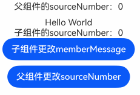

# @Link宏：父子双向同步

子组件中被\@Link装饰的变量与其父组件中对应的数据源建立双向数据绑定。

在阅读\@Link文档前，建议开发者首先了解[\@State](./cj-macro-state.md)的基本用法。

## 概述

\@Link装饰的变量与其父组件中的数据源共享相同的值。

## 宏使用规则说明

|\@Link|说明|
|:---|:---|
|非属性宏|无。|
|同步类型|双向同步。<br/>父组件中的状态变量可以与子组件\@Link修饰的变量建立双向同步，当其中一方改变时，另外一方能够感知到变化。|
|允许装饰的变量类型|支持基础数据类型，对于String，Int64，Float64和Bool类型的变量，可以缺省类型。其他类型的变量不可缺省类型，必须被指定。<br/>支持Enum、Option类型、struct类型，struct类型内部无法修改。<br/>支持class类型，如果要感知内部的变化，在定义的时候需要被[\@Observed](./cj-macro-observed-and-publish.md)修饰，对类内属性和嵌套属性使用[\@Publish](./cj-macro-observed-and-publish.md)装饰后，才能观察到其变化。<br/>支持数组类型，如果要感知内部的变化，需要使用[ObservedArray\<T>](../../../../API_Reference/source_zh_cn/arkui-cj/cj-state-rendering-componentstatemanagement.md#class-observedarray)和[ObservedArrayList\<T>](../../../../API_Reference/source_zh_cn/arkui-cj/cj-state-rendering-componentstatemanagement.md#class-observedarraylist)。数组项为自定义类型时，使用[\@Observed](./cj-macro-observed-and-publish.md)和[\@Publish](./cj-macro-observed-and-publish.md)装饰时能观察到数组项中属性赋值。其他数组类型和Collection类型，如Array、Varray、ArrayList、HashMap和HashSet，支持赋值新的数组，但是无法监听内部元素的变化。<br/>支持[Color](../../../../API_Reference/source_zh_cn/apis/BasicServicesKit/cj-apis-base.md#class-color)类型。<br/>支持类型的场景请参见[观察变化](#观察变化)。<br/>不支持Any。|
|被装饰变量的初始值|\@Link装饰的变量必须使用其父组件提供的变量进行初始化，不允许在子组件中初始化。|

## 变量的传递/访问规则说明

|传递/访问|说明|
|:---|:---|
|从父组件初始化和更新|禁止本地初始化，初始化发生在创建其所属自定义组件实例时，初值由直接父组件中的状态变量提供。允许父组件中[\@State](./cj-macro-state.md)、\@Link、[\@Prop](./cj-macro-prop.md)、[\@Provide](./cj-macro-provide-and-consume.md)、[\@Consume](./cj-macro-provide-and-consume.md)装饰变量初始化子组件\@Link。|
|用于初始化子组件|允许作为数据源初始化子组件。可用于初始化常规变量、\@State、\@Link、\@Prop、\@Provide。|
|是否支持组件外访问|私有，只能在所属组件内访问。|

## 观察变化和行为表现

### 观察变化

- 当装饰的数据类型为基础数据类型时，可以同步观察到数值的变化，示例请参考[简单类型和类对象类型的@Link](#简单类型和类对象类型的link)。

- 当装饰的数据类型为class时，需要被[@Observed](./cj-macro-observed-and-publish.md)修饰，内部需要感知变化的属性用[@Publish](./cj-macro-observed-and-publish.md)修饰，如果不使用[@Observed](./cj-macro-observed-and-publish.md)则无法感知成员变量等内部变化。示例请参见[简单类型和类对象类型的@Link](#简单类型和类对象类型的link)。

- 当装饰的对象是数组时，无法单独感知某个数组项的变化，但能感知整体的变化。如果要感知内部的变化，需要使用[ObservedArray\<T>](../../../../API_Reference/source_zh_cn/arkui-cj/cj-state-rendering-componentstatemanagement.md#class-observedarray)和[ObservedArrayList\<T>](../../../../API_Reference/source_zh_cn/arkui-cj/cj-state-rendering-componentstatemanagement.md#class-observedarraylist)。示例请参见[数组类型的@Link](#数组类型的link)。

- 装饰的变量是其他数组类型和Collection类型，如Array、Varray、ArrayList、HashMap和HashSet，支持赋值新的数组，但是无法监听内部元素的变化。

### 框架行为

\@Link装饰的变量和其所属的自定义组件共享生命周期。

为了了解\@Link变量初始化和更新机制，有必要先了解父组件和拥有\@Link变量的子组件的关系，初始渲染和双向更新的流程（以父组件为\@State为例）。

1. 初始渲染：执行父组件的build()函数后将创建子组件的新实例。初始化过程如下：
   a. 必须指定父组件中的\@State变量，用于初始化子组件的\@Link变量。子组件的\@Link变量值与其父组件的数据源变量保持同步（双向数据同步）。
   b. 父组件的\@State状态变量包装类通过构造函数传给子组件，子组件的\@Link包装类拿到父组件的\@State的状态变量后，将当前\@Link包装类this指针注册给父组件的\@State变量。

2. \@Link的数据源的更新：即父组件中状态变量更新，引起相关子组件的\@Link的更新。处理步骤：
   a. 通过初始渲染的步骤可知，子组件\@Link包装类把当前this指针注册给父组件。父组件\@State变量变更后，会遍历更新所有依赖它的系统组件（elementid）和状态变量（比如\@Link包装类）。
   b. 通知\@Link包装类更新后，子组件中所有依赖\@Link状态变量的系统组件（elementId）都会被通知更新。以此实现父组件对子组件的状态数据同步。

3. \@Link的更新：当子组件中\@Link更新后，处理步骤如下（以父组件为\@State为例）：
   a. \@Link更新后，调用父组件的\@State包装类的set方法，将更新后的数值同步回父组件。
   b. 子组件\@Link和父组件\@State分别遍历依赖的系统组件，进行对应的UI的更新。以此实现子组件\@Link同步回父组件\@State。

## 限制条件

1. \@Link宏修饰当前组件所拥有的状态，仅可在子组件中定义，不能在[\@Entry](../paradigm/cj-create-custom-components.md#自定义组件的基本结构)装饰的自定义组件中使用。

2. \@Link装饰的变量是可变的，只能用var来声明，且必须指明类型。

3. \@Link装饰的变量禁止本地初始化，必须从父组件初始化，否则编译期会报错。

    ```cangjie
    // 错误写法，编译报错
    @Link var count: Int64 = 10

    // 正确写法
    @Link var count: Int64
    ```

4. \@Link装饰的变量的类型要和数据源类型保持一致。具体参见[\@Link装饰状态变量类型错误](#link装饰状态变量类型错误)。

    【反例】

    ```cangjie
    class Info {
        var info: String = 'Hello'
    }

    class Cousin {
        var name: String = 'Hello'
    }

    @Component
    class Child {
        // 错误写法，@Link与@State数据源类型不一致
        @Link var test: Cousin
        func build() {
            Column() {
                Text(this.test.name)
            }
        }
    }

    @Entry
    @Component
    class EntryView {
        @State var info: Info = Info()
        func build() {
            Column {
                // 错误写法，@Link与@State数据源类型不一致
                Child(test: this.info)
            }
        }
    }
    ```

    【正例】

    ```cangjie
    class Info {
        var info: String = 'Hello'
    }

    @Component
    class Child {
        // 正确写法
        @Link var test: Info
        func build() {
            Column() {
                Text(this.test.info)
            }
        }
    }

    @Entry
    @Component
    class EntryView {
        @State
        var info: Info = Info()
        func build() {
            Column {
                // 正确写法
                Child(test: this.info)
            }
        }
    }
    ```

5. \@Link装饰的变量仅能被状态变量初始化，不能用常量初始化，即数据源必须是宏装饰的状态变量（如\@State），否则编辑器报错。

    【反例】

    ```cangjie
    class Info {
        var info: String = 'Hello'
    }

    @Component
    class Child {
        @Link var mes: String
        @Link var info: String
        func build() {
            Column() {
                Text(this.mes + this.info)
            }
        }
    }

    @Entry
    @Component
    class EntryView {
        @State var mes: String = "Hello"
        @State var info: Info = Info()
        func build() {
            Column {
                // 错误写法，常规变量不能初始化@Link
                Child(msg: 'World', info: this.info.info)
            }
        }
    }
    ```

    【正例】

    ```cangjie
    class Info {
        var info: String = 'Hello'
    }

    @Component
    class Child {
        @Link var mes: String
        @Link var info: Info
        func build() {
            Column() {
                Text(this.mes + this.info.info)
            }
        }
    }

    @Entry
    @Component
    class EntryView {
        @State var message: String = "Hello"
        @State var info: Info = Info()
        func build() {
            Column {
                // 正确写法
                Child(mes: this.message, info: this.info)
            }
        }
    }
    ```

6. \@Link不支持装饰Function类型的变量，编译时报错。

## 使用场景

### 简单类型和类对象类型的\@Link

以下示例中，点击父组件EntryView中的“Parent View: Set yellowButton”和“Parent View: Set GreenButton”，可以从父组件将变化同步给子组件。

1. 点击子组件GreenButton和YellowButton中的Button，子组件会发生相应变化，将变化同步给父组件。因为\@Link是双向同步，会将变化同步给\@State。

2. 当点击父组件EntryView中的Button时，\@State变化，也会同步给\@Link，子组件也会发生对应的刷新。

 <!-- run -->

```cangjie
package ohos_app_cangjie_entry
import kit.ArkUI.*
import ohos.arkui.state_macro_manage.*

@Observed
class GreenButtonState {
    @Publish var width: Int64 = 0
}

@Component
class GreenButton {
    @Link var greenButtonState: GreenButtonState

    func build() {
        Button("Green Button")
            .width(this.greenButtonState.width)
            .height(40)
            .backgroundColor(Color.Green)
            .margin(12)
            .onClick {
                evt => if (this.greenButtonState.width < 700) {
                    // 更新class的属性，变化可以被观察到同步回父组件
                    this.greenButtonState.width += 60
                } else {
                    // 更新class，变化可以被观察到同步回父组件
                    this.greenButtonState = GreenButtonState(width: 180)
                }
            }
    }
}

@Component
class YellowButton {
    @Link var yellowButtonState: Int64

    func build() {
        Button("Yellow Button")
            .width(this.yellowButtonState)
            .height(40)
            .backgroundColor(Color(0xFFFF00))
            .fontColor(Color.Black)
            .margin(12)
            .onClick {
                evt =>
                // 子组件的简单类型可以同步回父组件
                this.yellowButtonState += 40
            }
    }
}

@Entry
@Component
class EntryView {
    @State var greenButtonState: GreenButtonState = GreenButtonState(width: 180)
    @State var yellowButtonProp: Int64 = 180
    func build() {
        Column() {
            Flex(direction: FlexDirection.Column, alignItems: ItemAlign.Center) {
                // 简单类型从父组件@State向子组件@Link数据同步
                Button("Parent View: Set yellowButton")
                    .width(this.yellowButtonProp)
                    .height(40)
                    .margin(12)
                    .onClick {
                        evt => if (this.yellowButtonProp < 700) {
                            this.yellowButtonProp = this.yellowButtonProp + 100
                        } else {
                            this.yellowButtonProp = 100
                        }
                    }
                // class类型从父组件@State向子组件@Link数据同步
                Button("Parent View: Set GreenButton")
                    .width(this.greenButtonState.width)
                    .height(40)
                    .margin(12)
                    .onClick {
                        evt => if (this.greenButtonState.width < 700) {
                            this.greenButtonState.width = this.greenButtonState.width + 100
                        } else {
                            this.greenButtonState.width = 100
                        }
                    }
                // class类型初始化@Link
                GreenButton(greenButtonState: this.greenButtonState)
                // 简单类型初始化@Link
                YellowButton(yellowButtonState: this.yellowButtonProp)
            }
        }
    }
}
```


### 数组类型的\@Link

以下示例中，当用ObservedArrayList\<Int>修饰items时，可以感知到数组元素的添加，删除和替换。

 <!-- run -->

```cangjie
package ohos_app_cangjie_entry
import kit.ArkUI.*
import ohos.arkui.state_macro_manage.*

@Component
class Child{
    @Link var items: ObservedArrayList<Int>

    func build(){
        Column(){
            Button("Button 1: push")
                .margin(12)
                .size(width: 312, height: 40)
                .onClick{
                    evt => this.items.append(this.items.size + 1)
                }

            Button("Button 2: replace whole item")
                .margin(12)
                .size(width: 312, height:40)
                .onClick{
                    ect => this.items = ObservedArrayList<Int>([100,200,300])
                }
        }
    }
}

@Entry
@Component
class EntryView{
    @State var arr: ObservedArrayList<Int> = ObservedArrayList<Int>([1,2,3])
    func build(){
        Column(){
            Child(items: arr)
            ForEach(this.arr,{item: Int,index: Int
                    =>
                    Button("${item}")
                        .margin(12)
                        .size(width: 312,height: 40)
                        .backgroundColor(Color.White)
                        .fontColor(Color.Black)
                    })
        }
    }
}
```


### 使用双向同步机制更改本地其他变量

使用[\@Watch](./cj-macro-watch.md)可以在双向同步时，更改本地变量。

下面的示例中，在\@Link的\@Watch里面修改\@State装饰的变量sourceNumber，实现了父子组件间的变量同步。但是\@State装饰的变量memberMessage在本地的修改不会影响到父组件中的变量改变。

 <!-- run -->

```cangjie
package ohos_app_cangjie_entry
import kit.ArkUI.*
import ohos.arkui.state_macro_manage.*

@Component
class Child {
    @State var memberMessage: String = 'Hello World'
    @Link @Watch[onSourceChange] var sourceNumber: Int64
    func onSourceChange() {
        this.memberMessage = this.sourceNumber.toString()
    }
    func build() {
        Column() {
            Text(this.memberMessage)
            Text("子组件的sourceNumber：" + this.sourceNumber.toString())
            Button("子组件更改memberMessage")
              .onClick {
                  evt => this.memberMessage = "Hello memberMessage"
            }
        }
        .margin(10)
    }
}

@Entry
@Component
class EntryView {
    @State var sourceNumber: Int64 = 0;
    func build() {
        Column() {
            Text("父组件的sourceNumber：" + this.sourceNumber.toString())
            Child(sourceNumber: this.sourceNumber)
            Button("父组件更改sourceNumber")
              .onClick {
                  evt => this.sourceNumber++
            }
        }
    }
}
```



## 常见问题

### \@Link装饰状态变量类型错误

在子组件中使用\@Link装饰状态变量需要保证该变量与数据源类型完全相同，且该数据源需为被诸如\@State等装饰的状态变量。

【反例】

 <!-- run -->

```cangjie
package ohos_app_cangjie_entry
import kit.ArkUI.*
import ohos.arkui.state_macro_manage.*

@Observed
class Info {
    @Publish var age: Int64
}

@Component
class LinkChild {
    @Link var testNum: Int64
    func build() {
        Column() {
            Text("LinkChild testNum ${this.testNum}")
        }
    }
}

@Entry
@Component
class EntryView {
    @State var info: Info = Info(age: 1)
    func build() {
        Column {
            Text("Parent testNum ${this.info.age}").onClick({
                evt => this.info.age += 1
            })
            // @Link装饰的变量需要和数据源@State类型一致
            LinkChild(testNum: this.info.age)
        }
    }
}
```

`@Link var testNum: Int64`从父组件的`LinkChild(testNum: this.info.age)`初始化。\@Link的数据源必须是宏装饰的状态变量，简而言之，\@Link装饰的数据必须和数据源类型相同，比如\@Link: T和\@State : T。所以，这里应该改为`@Link var testNum: Info`，从父组件初始化的方式为`LinkChild(testNum: this.info)`。


【正例】

 <!-- run -->

```cangjie
package ohos_app_cangjie_entry
import kit.ArkUI.*
import ohos.arkui.state_macro_manage.*

@Observed
class Info {
    @Publish var age: Int64
}

@Component
class LinkChild {
    @Link var testNum: Info
    func build() {
        Column() {
            Text("LinkChild testNum ${this.testNum.age}")
                .onClick({
                evt => this.testNum.age += 1
            })
        }
    }
}

@Entry
@Component
class EntryView {
    @State var info: Info = Info(age: 1)
    func build() {
        Column {
            Text("Parent testNum ${this.info.age}").onClick({
                evt => this.info.age += 1
            })
            // @Link装饰的变量需要和数据源@State类型一致
            LinkChild(testNum: this.info)
        }
    }
}
```


