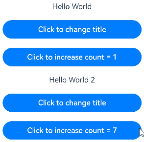
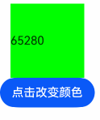

# @State宏：组件内状态

\@State装饰的变量，或称为状态变量，一旦变量拥有了状态属性，就可以触发其直接绑定UI组件的刷新。当状态改变时，UI会发生对应的渲染改变。

在状态变量相关宏中，\@State是最基础的，使变量拥有状态属性的宏，它也是大部分状态变量的数据源。

在阅读\@State文档前，建议开发者对状态管理框架有基本的了解。建议提前阅读：[状态管理概述](./cj-state-management-overview.md)。

## 概述

\@State装饰的变量，与声明式范式中的其他被装饰变量一样，是私有的，只能从组件内部访问，在声明时必须指定其类型和本地初始化。初始化也可选择使用命名参数机制从父组件完成初始化。

\@State装饰的变量具有以下特点：

- \@State装饰的变量与子组件中的\@Prop装饰变量之间建立单向数据同步,与\@Link装饰变量之间建立双向数据同步。

- \@State装饰的变量生命周期与其所属自定义组件的生命周期相同。

## 宏使用规则说明

|\@State|说明|
|:---|:---|
|非属性宏|无。|
|同步类型|不与父组件中任何类型的变量同步。|
|允许装饰的变量类型|支持基础数据类型，对于String，Int64，Float64和Bool类型的变量，可以缺省类型。其他类型的变量不可缺省类型，必须被指定。<br/>支持Enum、Option类型、struct类型，struct类型内部无法修改。<br/>支持class类型，如果要感知内部的变化，在定义的时候需要被[\@Observed](./cj-macro-observed-and-publish.md)修饰，对类内属性和嵌套属性使用[\@Publish](./cj-macro-observed-and-publish.md)装饰后，才能观察到其变化。<br/>支持数组类型，如果要感知内部的变化，需要使用[ObservedArray\<T\>](../../../../API_Reference/source_zh_cn/arkui-cj/cj-state-rendering-componentstatemanagement.md#class-observedarray)和[ObservedArrayList\<T\>](../../../../API_Reference/source_zh_cn/arkui-cj/cj-state-rendering-componentstatemanagement.md#class-observedarraylist)。数组项为自定义类型时，使用[\@Observed](./cj-macro-observed-and-publish.md)和[\@Publish](./cj-macro-observed-and-publish.md)装饰时能观察到数组项中属性赋值。其他数组类型和Collection类型，如Array、Varray、ArrayList、HashMap和HashSet，支持赋值新的数组，但是无法监听内部元素的变化。<br/>支持[Color](../../../../API_Reference//source_zh_cn/arkui-cj/cj-common-types.md#class-color)类型。<br/>支持类型的场景请参见[观察变化](#观察变化)。<br/>不支持Any。|
|被装饰变量的初始值|必须本地初始化。|

## 变量的传递/访问规则说明

|传递/访问|说明|
|:---|:---|
|从父组件初始化|可选，从父组件初始化或者本地初始化。如果从父组件初始化，从父组件传入的值，将会覆盖本地初始化；<br/>支持父组件中常规变量（常规变量对@State赋值，只是数值的初始化，常规变量的变化不会触发UI刷新，只有状态变量才能触发UI刷新）、\@State、[\@Link](./cj-macro-link.md)、[\@Prop](./cj-macro-prop.md)、[\@Provide](./cj-macro-provide-and-consume.md)、[\@Consume](./cj-macro-provide-and-consume.md)、[\@StorageLink](./cj-appstorage.md#storragelink)、[\@StorageProp](./cj-appstorage.md#storrageprop)装饰的变量，初始化子组件的\@State。|
|用于初始化子组件|\@State装饰的变量支持初始化子组件的常规变量、\@State、\@Link、\@Prop、\@Provide。|
|是否支持组件外访问|不支持，只能在组件内访问。|

## 观察变化和行为表现

并不是状态变量的所有更改都会引起UI的刷新，只有可以被框架观察到的修改才会引起UI刷新。本小节将介绍什么样的修改才能被感知，以及观察到变化后，框架是怎么引起UI刷新的，即框架的行为表现是什么。

### 观察变化

- 当装饰的数据类型为基础数据类型时，可以观察到数值的变化。


    ```cangjie
    // 简单类型
    @State var count: Int = 0
    // 可以观察到值的变化
    this.count = 1
    ```

- 当装饰的数据类型为struct时，内部无法修改。

    声明Person。


    ```cangjie
    struct Person {
        var id: Int64
        var name: String
        public init(id: Int64, name: String) {
            this.id = id
            this.name = name
        }
    }
    ```

    \@State装饰的类型是struct Person。


    ```cangjie
    // struct类型
    @State var person: Person = Person(1, "Kim")
    ```

    对\@State装饰变量的整体赋值可行。


    ```cangjie
    // struct类型赋值
    this.person = Person(2, "muller")
    ```

    对\@State装饰变量的赋值，编译器显示无法修改。


    ```cangjie
    // struct属性的赋值
    this.person.id = 3
    ```

- 当装饰的数据类型为class时，需要被[@Observed](./cj-macro-observed-and-publish.md)修饰，内部需要感知变化的属性用[@Publish](./cj-macro-observed-and-publish.md)修饰，如果不使用[@Observed](./cj-macro-observed-and-publish.md)则无法感知成员变量等内部变化。具体见[@Observed宏和@Publish宏](./cj-macro-observed-and-publish.md)。

    声明Person和Model类。


    ```cangjie
    @Observed
    class Person {
        @Publish var value: String
    }

    @Observed
    class Model {
        @Publish var value: String = ""
        @Publish var name: Person = Person(value: " ")
    }
    ```

    \@State装饰的类型是Model。


    ```cangjie
    @State var title: Model = Model(value: 'Hello', name: Person(value: "World"))
    ```

    对\@State装饰变量的赋值。


    ```cangjie
    // class属性的赋值
    this.title = Model(value: 'Hi', name: Person(value: 'ArkUI'))
    ```

    对\@State装饰变量的属性和嵌套属性的赋值都可以感知。


    ```cangjie
    // class属性的赋值
    this.title.value = 'Hi'
    // 嵌套的属性
    this.title.name.value = 'ArkUI'
    ```

- 当装饰的对象是数组时，无法单独感知某个数组项的变化，但能感知整体的变化。如果要感知内部的变化，需要使用[ObservedArray\<T\>](../../../../API_Reference/source_zh_cn/arkui-cj/cj-state-rendering-componentstatemanagement.md#class-observedarray)和[ObservedArrayList\<T\>](../../../../API_Reference/source_zh_cn/arkui-cj/cj-state-rendering-componentstatemanagement.md#class-observedarraylist)。

    \@State装饰的对象为ArrayList类型数组时。


    ```cangjie
    @State var arrlist: ArrayList<Int16> = ArrayList<Int16>([1, 2, 3])
    ```

    数组整体的变化可以感知。


    ```cangjie
    this.arrlist = ArrayList<Int16>([10,9,8])
    ```

    数组项的赋值不能感知。


    ```cangjie
    this.arrlist[0] = 10
    ```

    声明Model类。


    ```cangjie
    @Observed
    class Model {
        @Publish public var value: Int
    }
    ```

    \@State装饰的对象为ObservedArray\<Model\>类型数组时。


    ```cangjie
    // ObservedArray数组类型
    @State var title: ObservedArray<Model> = ObservedArray<Model>([Model(value: 11), Model(value: 1)])
    ```

    数组自身的赋值可以感知。


    ```cangjie
    // 数组赋值
    this.title = ObservedArray<Model>([Model(value: 2)])
    ```

    数组项的赋值可以感知。


    ```cangjie
    // 数组项赋值
    this.title[0] = Model(value: 2)
    ```

    数组项中属性的赋值可以感知。


    ```cangjie
    // 嵌套的属性赋值可以感知
    this.title[0].value = 6
    ```

    \@State装饰的对象为ObservedArrayList\<Model\>类型数组时，实现新增和删除数组项。

    删除数组项可以感知。


    ```cangjie
    // 数组项更改
    this.title.remove(0)
    ```

    新增数组项可以感知。


    ```cangjie
    // 数组项更改
    this.title.append(Model(value: 12))
    ```

- 当装饰的变量是其他数组类型和Collection类型，如Array、Varray、ArrayList、HashMap和HashSet，支持赋值新的数组，但是无法监听内部元素的变化。

    以HashSet为例。


    ```cangjie
    //@State装饰的对象为HashSet时
    @State var message: HashSet<Int64> = HashSet<Int64>()
    ```

    HashSet整体的变化可以感知。


    ```cangjie
    this.message = HashSet<Int64>(1,2,3)
    ```

    HashSet内部的变化不能感知。


    ```cangjie
    this.message.add(5);
    ```

### 框架行为

- 当状态变量被改变时，查询依赖该状态变量的组件；

- 执行依赖该状态变量的组件的更新方法，组件更新渲染；

- 和该状态变量不相关的组件或者UI描述不会发生重新渲染，从而实现页面渲染的按需更新。

## 限制条件

1. \@State装饰的变量必须初始化，否则编译期会报错。


    ```cangjie
    // 错误写法，编译报错
    @State var count: Int

    // 正确写法
    @State var count: Int = 0
    ```

2. \@State不支持装饰Function类型的变量，编译时报错。

## 使用场景

### 装饰简单类型的变量

以下示例为\@State装饰的简单类型，count被\@State装饰成为状态变量，count的改变引起Button组件的刷新：

- 当状态变量count改变时，查询到只有Button组件关联了它；

- 执行Button组件的更新方法，实现按需刷新。

 <!-- run -->

```cangjie
package ohos_app_cangjie_entry
import kit.ArkUI.*
import ohos.arkui.state_macro_manage.*
@Entry
@Component
class EntryView {
    @State var count: Int = 0
    func build() {
        Button("click times: ${count}").onClick({evt => this.count += 1})
    }
}
```


### 装饰class对象类型的变量

- 自定义组件MyComponent定义了被\@State装饰的状态变量count和title，其中title的类型为自定义类Model。如果count或title的值发生变化，则查询MyComponent中使用该状态变量的UI组件，并进行重新渲染。

- EntryView中有多个MyComponent组件实例，第一个MyComponent内部状态的更改不会影响第二个MyComponent。

 <!-- run -->

```cangjie
package ohos_app_cangjie_entry
import kit.ArkUI.*
import ohos.arkui.state_macro_manage.*

@Observed
class Model {
    @Publish public var value: String
}

@Entry
@Component
class EntryView {
    func build() {
        Column {
            // 此处指定的参数都将在初始渲染时覆盖本地定义的默认值，并不是所有的参数都需要从父组件初始化
            MyComponent(count: 1, increaseBy: 2)
            MyComponent(title: Model(value: 'Hello World 2'), count: 7)
        }
    }
}

@Component
class MyComponent {
    @State var title: Model = Model(value: 'Hello World')
    @State var count: Int64 = 0
    private var increaseBy: Int64 = 1
    func build() {
        Column {
            Text("${this.title.value}").margin(10)
            Button("Click to change title")
                .onClick({ // @State变量的更新将触发上面的Text组件内容更新
                    evt => this.title.value = 'Hello ArkUI'
                })
                .width(300)
                .margin(10)
            Button("Click to increase count = ${this.count}")
                .onClick({
                    // @State变量的更新将触发该Button组件的内容更新
                    evt => this.count += this.increaseBy
                })
                .width(300)
                .margin(10)
        }
    }
}
```



从该示例中，可以了解到\@State变量的初始化机制：

1. 没有外部传入的情况下，使用默认的值进行初始化：


    ```cangjie
    // title没有外部传入，使用本地的值Model(value: 'Hello World')进行初始化
    MyComponent(count: 1, increaseBy: 2)
    // increaseBy没有外部传入，使用本地的值1进行初始化
    MyComponent(title: Model(value: 'Hello World 2'), count: 7)
    ```

2. 有外部传入的情况下，使用外部传入的值进行初始化：


    ```cangjie
    // count和increaseBy均有外部传入，分别使用传入的1和2进行初始化
    MyComponent(count: 1, increaseBy: 2)
    // title和count均有外部传入，分别使用传入的Model(value: 'Hello World 2')和7进行初始化
    MyComponent(title: Model(value: 'Hello World 2'), count: 7)
    ```

## 常见问题

### 使用箭头函数改变状态变量未生效

箭头函数体内的this对象，就是定义该函数时所在的作用域指向的对象，而不是使用时所在的作用域指向的对象。所以要将当前this.vm传入，调用代理状态变量的属性赋值。

 <!-- run -->

```cangjie
package ohos_app_cangjie_entry
import kit.ArkUI.*
import ohos.arkui.state_macro_manage.*

@Observed
class PlayDetailViewModel {
    @Publish var coverUrl: UInt32
    var changeCoverUrl: (PlayDetailViewModel) -> Unit
}

@Entry
@Component
class EntryView {
    @State var vm: PlayDetailViewModel = PlayDetailViewModel(coverUrl: 0x00ff00,
        changeCoverUrl: {model: PlayDetailViewModel => model.coverUrl = 0x00F5FF})
    func build() {
        Column() {
            Text(this.vm.coverUrl.toString())
                .width(100)
                .height(100)
                .backgroundColor(this.vm.coverUrl)
            Button('点击改变颜色').onClick(
                {
                    evt =>
                    let self = this.vm
                    this.vm.changeCoverUrl(self)
                }
            )
        }
    }
}
```



### 状态变量只能影响其直接绑定的UI组件的刷新

【示例1】

 <!-- run -->

```cangjie
package ohos_app_cangjie_entry
import kit.ArkUI.*
import ohos.arkui.state_macro_manage.*

@Observed
class Info {
    @Publish var address: String = '杭州'
}

@Entry
@Component
class EntryView {
    @State var message: String = '上海'
    @State var info: Info = Info()
    public func aboutToAppear() {
        this.info.address = this.message
    }
    func build() {
        Column() {
            Text(this.message)
            Text(this.info.address)
            Button('change').onClick({
                evt => this.info.address = '北京'
            })
        }
    }
}
```


以上示例点击Button('change')，只会触发第二个Text组件的刷新，因为message是简单类型string，简单类型是值拷贝，所以点击按钮改变的是info中的address值，不会影响this.message的值。

【示例2】

 <!-- run -->

```cangjie
package ohos_app_cangjie_entry
import kit.ArkUI.*
import ohos.arkui.state_macro_manage.*

@Observed
class Info {
    @Publish var address: String = '杭州'
}

@Observed
class User {
    @Publish var infomation: Info
}

@Entry
@Component
class EntryView {
    @State var info: Info = Info(address: '上海')
    @State var user: User = User(infomation: Info(address: '天津'))
    public func aboutToAppear() {
        this.user.infomation = this.info
    }
    func build() {
        Column() {
            Text(this.info.address)
            Text(this.user.infomation.address)
            Button('change').onClick(
                {
                    evt =>
                    this.user.infomation = Info(address: '广州')
                    this.user.infomation.address = '北京'
                }
            )
        }
    }
}
```


上述示例中，点击Button('change')，只会触发第二个Text组件的刷新。这是因为点击按钮后，首先执行`this.user.infomation = Info(address: '广州')`，会创建一个新的Info对象。再执行`this.user.infomation.address = '北京'`，改变的是这个新创建的Info对象中的address值，而原始的Info对象中的address值不会受到影响。

### 不允许在build里改状态变量

不允许在build里改变状态变量，状态管理框架会在运行时报出Error级别日志。

下面的示例，渲染的流程是：

1. 创建Index自定义组件。

2. 执行Index的build方法：

    a. 创建Column组件。

    b. 创建Text组件。创建Text组件的过程中，触发this.count++。

    c. count的改变再次触发Text组件的刷新。

    d. Text最终渲染。


```cangjie
@Entry
@Component
class EntryView {
    @State var count :Int64 = 1
    func build() {
        Column() {
            // 应避免直接在Text组件内改变count的值
            Text("${this.count++}")
                .width(50)
                .height(50)
        }
    }
}
```

在上面的例子中，这个错误行为不会造成很严重的后果。

但这个行为是严重错误的，会随着工程的复杂度升级，隐患越来越大。见下一个例子。


```cangjie
@Entry
@Component
class EntryView {
    @State var message: Int = 20;
    func build() {
        Column() {
            Text("${this.message++}")
            Text("${this.message++}")
        }
        .width(50)
        .height(100)
    }
}
```

上面示例渲染过程：

1. 创建第一个Text组件，触发this.message改变。

2. this.message改变又触发第二个Text组件的刷新。

3. 第二个Text组件的刷新又触发this.message的改变，触发第一个Text组件刷新。

4. 循环重新渲染。

5. 系统长时间无响应，appfreeze。

所以，在build里面改变状态变量的这种行为是完全错误的。

### 用注册回调的方式更改状态变量需要执行解注册

开发者可以在onPageShow中注册箭头函数，并以此来改变组件中的状态变量。但需要注意的是在aboutToDisappear中将之前注册的函数置空，否则会因为箭头函数捕获了自定义组件的this实例，导致自定义组件无法被释放，从而造成内存泄漏。

 <!-- run -->

```cangjie
package ohos_app_cangjie_entry
import kit.ArkUI.*
import ohos.arkui.state_macro_manage.*

@Observed
class Model {
    @Publish var callback: () -> Unit
    func add(callback: () -> Unit) {
        this.callback = callback
    }
    func delete() {
        this.callback = Option<() -> Unit>.None.getOrThrow()
    }
    func call() {
        if (true) {
            this.callback()
        }
    }
}

let model = Model(callback: {=>})

@Entry
@Component
class EntryView {
    @State var count: Int64 = 10

    public override func onPageShow() {
        model.add({=> this.count++})
    }
    func build() {
        Column() {
            Text("count值: ${this.count}")
            Button('change').onClick({
                evt => model.call()
            })
        }
    }
    public func aboutToDisappear(){
        model.delete()
    }
}
```

此外，也可以使用[LocalStorage](./cj-localstorage.md#自定义组件改变状态变量)的方式在自定义组件外改变状态变量。
