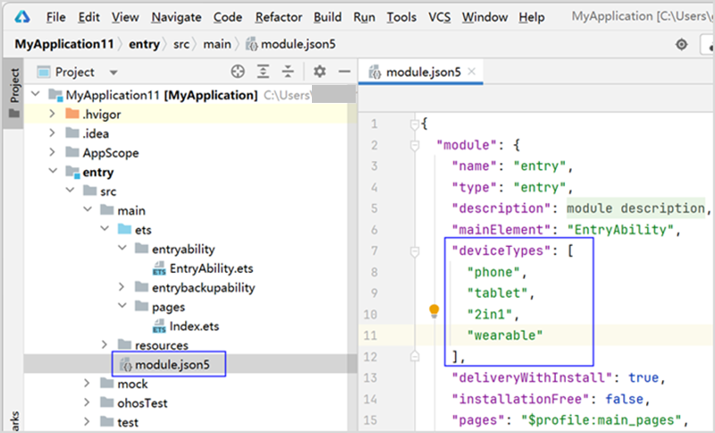

# 在ArkTS应用中使用仓颉模块

## 概述

仓颉程序运行在一个轻量级运行时上，同时在高性能、高并发场景有较好表现。仓颉支持与ArkTS跨语言互通，因此可以在ArkTS应用中使用仓颉模块，提升应用程序整体性能。

## 使用指导

仓颉推荐使用“声明式互操作宏”的方式实现在ArkTS应用中使用仓颉模块，此处给出该方式的操作指导。

### 在ArkTS工程中添加仓颉模块

支持SDK范围在API 12及以上，设备类型为phone、tablet、2in1的ArkTS（加 C++）HAP模块，或设备类型为default、phone、tablet、2in1的ArkTS（加 C++）HAR模块中创建仓颉模块。

若当前HAP模块支持的设备类型包括phone、tablet、2in1之外的其他设备类型，或者HAR模块支持的设备类型包括default、phone、tablet、2in1之外的其他设备类型，请将HAP或HAR模块下module.json5中的deviceTypes字段中不支持的设备类型删去，修改为支持的设备类型格式（如下图应删去wearable设备），再进行创建插入仓颉模块内容的操作。



1. 按照下图所示，选中 ArkTS（加 C++）的 HAP 或 HAR 模块中的任意文件，选择 **File -> new -> Cangjie(Interop)**，或右键单击后，选择 **New -> Cangjie(Interop)**。

   

2. 点击 **Cangjie(Interop)** 按钮后即可完成在 ArkTS（加 C++）的 HAP 或 HAR 模块中创建插入仓颉模块内容。

   

### 实现仓颉互操作模块

在ArkTS工程中成功插入仓颉互操作模块后，会自动生成实例代码，代码逻辑如下：

1. 导入互操作库ark_interop和互操作宏。

2. 用户实现一个名为addF64的仓颉函数，并使用 `@Interop[ArkTS]` 修饰。仓颉模块的简单示例如下：

   ```cangjie
   package ohos_app_cangjie_entry

   // 导入互操作库ark_interop和互操作宏
   internal import ohos.ark_interop.JSModule
   internal import ohos.ark_interop.JSContext
   internal import ohos.ark_interop.JSCallInfo
   internal import ohos.ark_interop.JSValue
   internal import cj_res_entry.app

   // 用户自定义的函数 addF64, 入参接收两个number，返回相加后的结果
   @Interop[ArkTS]
   public func addF64(a: Float64, b!: Float64): Float64 {
       a + b
   }
   ```

3. 在DevEco Studio中打开上述所说的仓颉文件，在文件编辑界面中右键选择**Generate... > Cangjie-ArkTS Interop API**，会在**cangjie->types->libohos_app_cangjie_entry**目录下生成Index.d.ts声明文件和oh_package.json5配置文件，以及会在**cangjie -> ark_interop_api**目录下生成ark_interop_api.d.ts声明文件和oh_package.json5配置文件，并在HAP或HAR模块下的oh-package.json5文件中自动添加依赖：

    > **说明：**
    >
    > ark_interop_api目录为兼容需要运行在OpenHarmony 5.0.x上的应用生成，如果没有兼容性需求，则可以忽略此目录。

   ```json
   "dependencies": {
     ...
     "libohos_app_cangjie_entry.so": "file:./src/main/cangjie/types/libohos_app_cangjie_entry",
     "libark_interop_api.so": "file:./src/main/cangjie/ark_interop_api",
     ...
   }
   ```

> **说明：禁止仓颉互操作模块被其他模块导入，否则在 ArkTS 导入互操作模块时，导入的内容可能缺失。**

### ArkTS加载仓颉模块

仓颉互操作模块实现后，在ArkTS代码中导入仓颉ohos_app_cangjie_entry模块，即可加载自定义的仓颉互操作模块，并调用相关的接口。

> **说明：**
>
> 此加载方式从API version 18开始支持。最低兼容版本：OpenHarmony 5.1.0(18)。

```typescript
// 加载自定义的仓颉互操作模块
import cjLib from "libohos_app_cangjie_entry.so"
```

### 调用仓颉接口

自定义的仓颉互操作模块加载成功后，即可在ArkTS工程中调用仓颉互操作模块提供的接口。

在ArkTS应用中调用仓颉互操作模块提供的addF64函数示例如下：

```typescript
// 调用仓颉接口
console.log("result " + cjLib.addF64(1, 2))
```
