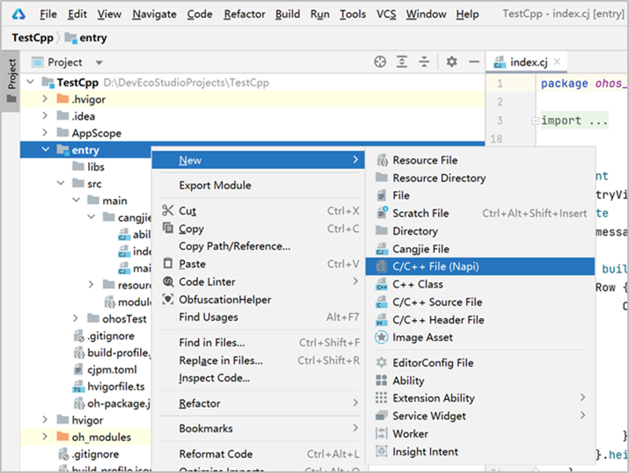

# 仓颉调用模块内cpp文件

> **说明：**
>
> 为确保运行效果，本文以**DevEco Studio 5.0.2 Release** 和 **DevEco Studio-Cangjie Plugin 5.0.9.100 Beta1** 版本为例，单击[此处](https://developer.huawei.com/consumer/cn/download/)获取最新版本的下载链接。

本文档介绍如何使用DevEco Studio仓颉插件，实现在仓颉代码中调用模块内cpp文件的功能。

## 开发示例

1. 创建一个纯仓颉 "[Cangjie] Empty Ability" 工程

   

2. 右键单击 **entry** 文件夹，选择 **New -> C/C++ File(Napi)**，如下图所示：

   

   会自动生成 **entry > src > main > cpp > napi_init.cpp** 文件。

3. 打开**napi_init.cpp**文件，编写cpp代码，示例如下：

   ```cpp
   #include <stdint.h>
   #include <stdio.h>

   extern "C" int32_t sum(int32_t a, int32_t b) { return a + b; }

   extern "C" int32_t sub(int32_t a, int32_t b) {
       printf("sub\n");
       return a - b;
   }
   ```

4. 打开 **entry > src > main > cangjie > index.cj** 文件，编写仓颉调用cpp代码，示例如下：

   ```cangjie
      package ohos_app_cangjie_entry
      internal import ohos.base.LengthProp
      internal import ohos.component.Column
      internal import ohos.component.Row
      internal import ohos.component.Text
      internal import ohos.component.CustomView
      internal import ohos.component.CJEntry
      internal import ohos.component.loadNativeView
      internal import ohos.component.FontWeight
      internal import ohos.state_manage.SubscriberManager
      internal import ohos.state_manage.ObservedProperty
      internal import ohos.state_manage.LocalStorage
      import ohos.state_macro_manage.Entry
      import ohos.state_macro_manage.Component
      import ohos.state_macro_manage.State
      import ohos.state_macro_manage.r
      foreign {
          func sum(a: Int32, b: Int32): Int32
          func sub(a: Int32, b: Int32): Int32
      }
      @Entry
      @Component
      class EntryView {
          @State
          var message: String = "1 + 2"
          func build() {
              Row {
                  Column {
                      Text(this.message)
                          .fontSize(50)
                          .fontWeight(FontWeight.Bold)
                          .onClick {
                              evt => unsafe {
                                  this.message = "result: ${sum(1, 2)}"
                              }
                          }
                  }.width(100.percent)
              }.height(100.percent)
          }
      }
      ```

5. 添加 cjpm.toml 中 cpp 依赖。打开 **entry > cjpm.toml** 文件，增加配置ffi.c依赖如下，配置完成后同步工程。

   ```toml
   [ffi]
     [ffi.c]
       [ffi.c.entry]
         path = "./libs/${ABI}"
   ```

## 使用真机或模拟器运行应用

### 使用本地真机

1. 将搭载OpenHarmony系统的真机与开发环境连接。
2. 真机连接成功后，单击**File > Project Structure > Project > Signing Configs**界面勾选**Support OpenHarmony**和**Automatically generate signature**，单击界面提示的**Sign In**，等待自动签名完成后，单击**OK**即可。如下图所示：

   

3. 在编辑窗口右上角的工具栏，单击按钮运行。效果如下图所示：

   

### 使用模拟器

仓颉语言编写的OpenHarmony应用/服务，支持在DevEco Studio提供的模拟器（Emulator）上运行。

1. 创建一个类型为Phone的模拟器设备，并在DevEco Studio右上角的设备列表中，选中该设备。

2. 仓颉工程默认编译架构为**arm64-v8a**，因此在使用**x86模拟器**时（当前开发环境为**Windows/x86_64**或**macOS/x86_64**时），仓颉工程及cpp文件需要编译出x86_64版本的二进制文件，请在仓颉模块的**build-profile.json5**配置文件中，为**cangjieOptions/abiFilters**以及**externalNativeOptions/abiFilters**的值增加**x86_64**，具体编译配置如下：

    ```json
    "buildOption": { // 配置项目在构建过程中使用的相关配置
      "cangjieOptions": { // 仓颉相关配置
        "path": "./cjpm.toml", // cjpm配置文件路径，提供仓颉构建配置
        "abiFilters": ["arm64-v8a", "x86_64"] // 自定义仓颉编译架构，默认编译架构为arm64-v8a
      }
      "externalNativeOptions": {
        "abiFilters":["arm64-v8a", "x86_64"], // 自定义cpp编译架构，默认编译架构为arm64-v8a
        "path": "./src/main/cpp/CMakeLists.txt",
        "arguments": "",
        "cppFlags": "",
      }
    }
    ```

3. 在编辑窗口右上角的工具栏，单击按钮运行。效果同使用真机效果。
