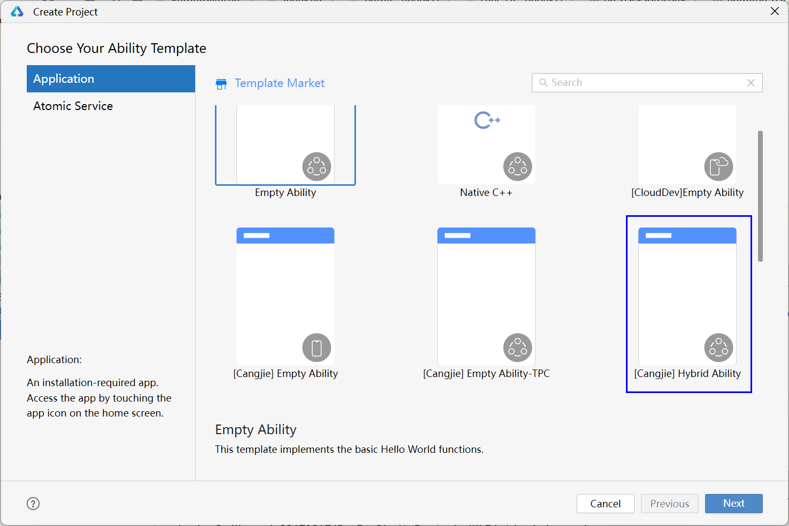
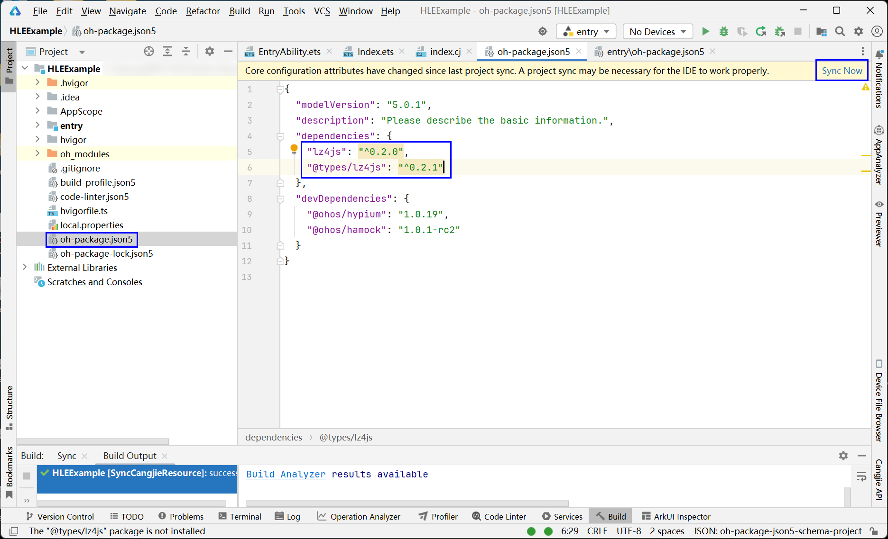
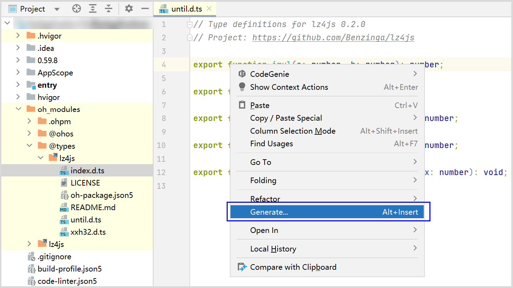
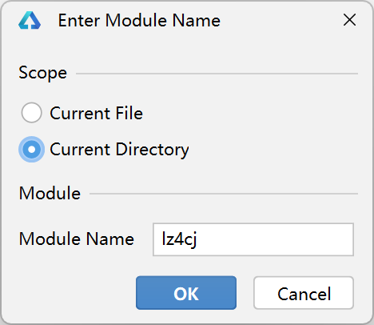
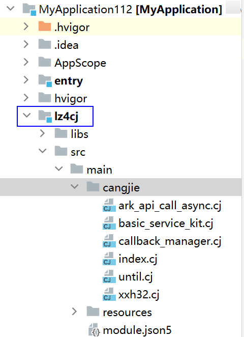
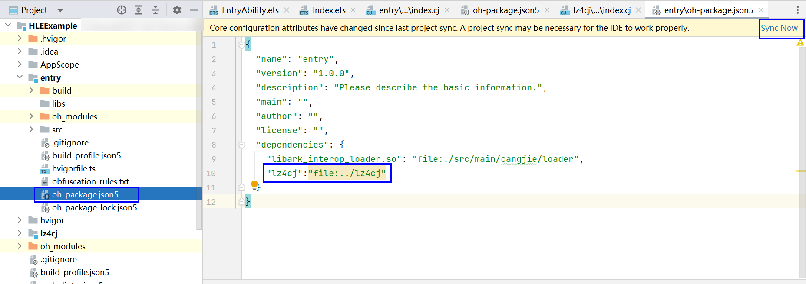

# 仓颉调用ArkTS三方模块

> **说明：**
>
> 为确保运行效果，本文以**DevEco Studio 5.0.2 Release** 和 **DevEco Studio-Cangjie Plugin 5.0.9.100 Beta1** 版本为例，单击[此处](https://developer.huawei.com/consumer/cn/download/)获取最新版本的下载链接。

本文档介绍如何使用DevEco Studio仓颉插件，实现在仓颉代码中调用ArkTS三方库的功能。

## 使用示例

下面以在仓颉代码中调用[lz4js](https://ohpm.openharmony.cn/#/cn/detail/lz4js)三方库为例展示详细的使用步骤。

1. 创建一个"[Cangjie] Hybrid Ability"工程

    

2. 配置lz4js三方库依赖

    在工程级oh-package.json5中添加lz4js三方库依赖，然后单击Sync Now下载ArkTS三方库。

    ```json
    "dependencies": {
        ...
        "lz4js": "^0.2.0",
        "@types/lz4js": "^0.2.1"
        ...
    },
    ```

    

3. 调用代码生成工具生成仓颉封装层

   a. 在oh_modules文件夹下面找到对应的lz4js三方库目录，打开目录下的.d.ts或.d.ets文件，在文件编辑界面中右键选择**Generate... > Cangjie Bindings**，生成仓颉封装层代码。

   

   b. 单击按钮之后会出现一个弹窗，弹框中可以选择范围当前文件或当前文件所在的文件夹，选择**Current Directory**，生成的仓颉封装层的默认包名为ArkTS三方库名称加上"_cj"后缀，开发者也可以进行手动修改。

   

   c. 单击OK后，会在当前工程中生成一个仓颉模块，模块下的src/main/cangjie目录中则为生成的ArkTS三方库的仓颉封装层代码。

   

   d. 当前仓颉封装层存在生成错误的情况，如果有类型或者声明无法正确生成互操作封装层代码，则需要根据控制台中"Cangjie Bindings Output"中的提示进行手动修改。

   

4. 在仓颉代码中添加生成的仓颉模块依赖，并调用封装层接口，以调用lz4js中的compress接口为例。

   a. 在entry模块中的oh-package.json5文件中添加生成的仓颉模块lz4cj的依赖，然后单击Sync Now自动添加仓颉封装层依赖。

   ```json
   "dependencies": {
       ...
       "lz4cj":"file:../lz4cj"
        ...
   },
   ```

   

    b. 在仓颉代码中调用仓颉封装库lz4cj的相应接口，以调用lz4js中的compress接口为例，修改**entry > src > main > cangjie > index.cj**文件为：

     ```cangjie
     //index.cj
     import lz4js.compress // 导入lz4cj库中的compress接口

     func testCJ() {
         ...
         var arr: Array<Byte>  = [
         0x04, 0x22, 0x4d, 0x18, 0x64, 0x40, 0xa7, 0x1b,
         0x00, 0x00, 0x80, 0x54, 0x68, 0x65, 0x20, 0x77,
         0x68, 0x6f, 0x6c, 0x65, 0x20, 0x77, 0x6f, 0x72,
         0x6c, 0x64, 0x20, 0x69, 0x73, 0x20, 0x65, 0x6e,
         0x64, 0x69, 0x6e, 0x67, 0x2e, 0x0a, 0x00, 0x00,
         0x00, 0x00, 0xbc, 0xa8, 0x6b, 0xc5
         ]
         let result = compress(arr)
         ...
     }
     ```

    c. 由于互操作实现的一些限制原因，还需要开发者在ArkTS代码入口（如 Index.ets文件) 中手动传入ArkTS模块对象。

    ```js
    import * as lz4js from "lz4js";
    globalThis.lz4cj = lz4js
    ```

    

    > **说明：**
    >
    > 如果还需要调用lz4js/util和lz4js/xxh32模块下的函数，需要导入对应的模块对象，由于模块名中不能包含`/`，所以这里使用`_`进行拼接。
    >

    ```javascript
    import * as lz4js_util from "lz4js/util";
    import * as lz4js_xxh32 from "lz4js/xxh32";
    globalThis.lz4cj_until = lz4js_util
    globalThis.lz4cj_xxh32 = lz4js_xxh32
    ```
