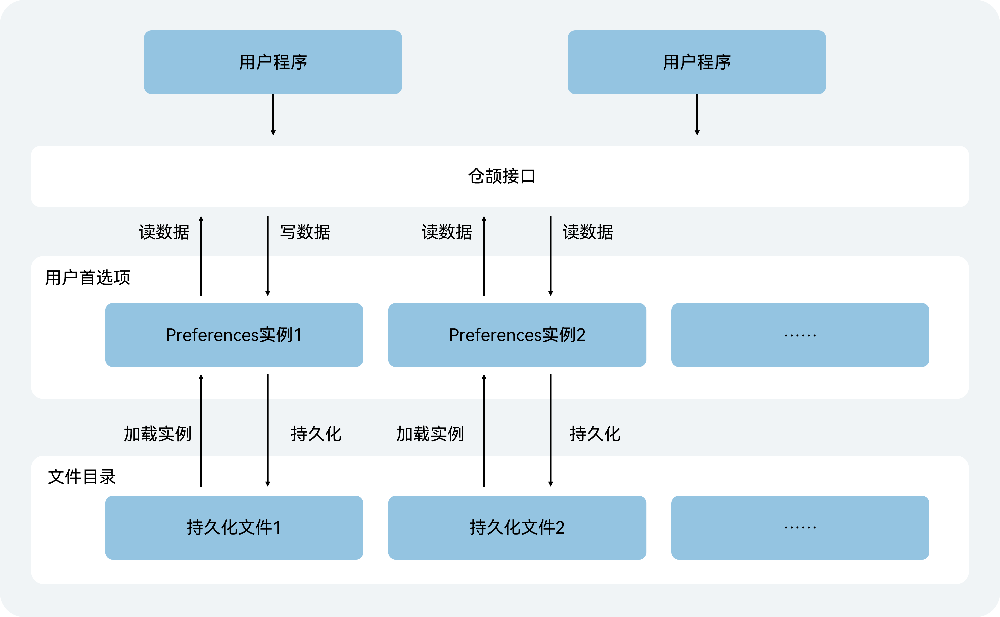

# 通过用户首选项实现数据持久化

## 场景介绍

用户首选项为应用提供Key-Value键值型的数据处理能力，支持应用持久化轻量级数据，并对其修改和查询。当用户希望有一个全局唯一存储的地方，可以采用用户首选项来进行存储。Preferences会将该数据缓存在内存中。当用户读取时，能够快速从内存中获取数据。当需要持久化时，可以使用flush接口将内存中的数据写入持久化文件中。Preferences会随着存放的数据量越多而导致应用占用的内存越大。因此，Preferences不适合存放过多的数据，也不支持通过配置加密，适用的场景一般为应用保存用户的个性化设置（字体大小，是否开启夜间模式）等。

## 运作机制

如图所示，用户程序通过仓颉接口调用用户首选项读写对应的数据文件。开发者可以将用户首选项持久化文件的内容加载到Preferences实例，每个文件唯一对应到一个Preferences实例，系统会通过静态容器将该实例存储在内存中，直到主动从内存中移除该实例或者删除该文件。

**图1** 用户首选项运作机制

 <!-- ToBeReviewd -->

## 约束限制

- 首选项无法保证进程并发安全，会有文件损坏和数据丢失的风险，不支持在多进程场景下使用。
- Key键为string类型，要求非空且长度不超过1024个字节。
- 如果Value值为string类型，请使用UTF-8编码格式，可以为空，不为空时长度不超过16MB。
- 当存储的数据中包含非UTF-8格式的字符串时，请使用Uint8Array类型存储，否则会造成持久化文件出现格式错误造成文件损坏。
- 当调用removePreferencesFromCache或者deletePreferences后，订阅的数据变更会主动取消订阅，重新getPreferences后需要重新订阅数据变更。
- 不允许deletePreferences与其他接口多线程、多进程并发调用，否则会发生不可预期行为。
- 内存会随着存储数据量的增大而增大，所以存储的数据量应该是轻量级的，建议存储的数据不超过一万条，否则会在内存方面产生较大的开销。

## 接口说明

以下是用户首选项持久化功能的相关接口，更多接口及使用方式请参见[用户首选项](../../../API_Reference/source_zh_cn/apis/ArkData/cj-apis-preferences.md)。

| 接口名称                                             | 描述                                         |
| --------------------------------------------------- | ----------------------------------------------|
| getPreferences(context: StageContext, options: PreferencesOptions): Preferences | 获取Preferences实例。|
| put(key: String, value: PreferencesValueType): Unit   | 将数据写入Preferences实例，可通过flush将Preferences实例持久化。 |
| has(key: String): Bool  | 检查Preferences实例是否包含名为给定Key的存储键值对。给定的Key值不能为空。 |
| get(key: String, defValue: PreferencesValueType): PreferencesValueType   | 获取键对应的值，如果值为null或者非默认值类型，返回默认数据defValue。 |
| delete(key: String): Unit  | 从Preferences实例中删除名为给定Key的存储键值对。 |
| flush(): Unit   | 将当前Preferences实例的数据异步存储到用户首选项持久化文件中。 |
| on(tp: String, callback: Callback1Argument\<String>): Unit | 订阅数据变更，订阅的数据发生变更后，在执行flush方法后，触发callback回调。 |
| off(tp: String, callback: Callback1Argument\<String>): Unit | 取消订阅数据变更。  |
| deletePreferences(context: StageContext, options: PreferencesOptions): Unit | 从内存中移除指定的Preferences实例。若Preferences实例有对应的持久化文件，则同时删除其持久化文件。 |

## 开发步骤

1. 导入模块。

    <!-- compile -->

    ```cangjie
    // xxx.cj
    import kit.ArkData.{ Preferences, PreferencesValueType }
    import kit.AbilityKit.getStageContext
    import kit.UIKit.Callback1Argument
    ```

2. 获取Preferences实例。

    <!-- compile -->

    ```cangjie
    // main_ability.cj
    import kit.AbilityKit.{ getStageContext, UIAbilityContext }
    import kit.ArkData.{ Preferences, PreferencesOptions }

    var globalAbilityContext: Option<UIAbilityContext> = Option<UIAbilityContext>.None
    var dataPreferences: Option<Preferences> = Option<Preferences>.None

    class MainAbility <: UIAbility {
        public init() {
            super()
            registerSelf()
        }

        public override func onCreate(want: Want, launchParam: LaunchParam): Unit {
            AppLog.info("MainAbility OnCreated.${want.abilityName}")
            // 获取context
            globalAbilityContext = this.context

            match (launchParam.launchReason) {
                case LaunchReason.START_ABILITY => AppLog.info("START_ABILITY")
                case _ => ()
            }
        }

        public override func onWindowStageCreate(windowStage: WindowStage): Unit {
            AppLog.info("MainAbility onWindowStageCreate.")
            windowStage.loadContent("EntryView")

            let options = PreferencesOptions("myStore")
            // 获取Preferences实例
            dataPreferences = Preferences.getPreferences(getStageContext(this.context), options)
        }
        // ...
    }
    ```

3. 写入数据。

    使用put()方法保存数据到缓存的Preferences实例中。在写入数据后，如有需要，可使用flush()方法将Preferences实例的数据存储到持久化文件。

    > **说明：**
    >
    > 当对应的键已经存在时，put()方法会覆盖其值。可以使用has()方法检查是否存在对应键值对。

    示例代码如下所示：

    <!-- compile -->

    ```cangjie
    // xxx.cj
    if (dataPreferences.getOrThrow().has("startup")) {
        AppLog.info("The key 'startup' is contained.")
    } else {
        AppLog.info("The key 'startup' does not contain.")
        // 此处以此键值对不存在时写入数据为例
        dataPreferences.getOrThrow().put("startup", PreferencesValueType.string("auto"))
    }
    ```

4. 读取数据。

    使用get()方法获取数据，即指定键对应的值。如果值为null或者非默认值类型，则返回默认数据。

    示例代码如下所示：

    <!-- compile -->

    ```cangjie
    // xxx.cj
    let val = dataPreferences.getOrThrow().get("startup", PreferencesValueType.string("default"))
    match(val) {
        case PreferencesValueType.string(n) => AppLog.info("The startup's value: ${n}")
        case _ => AppLog.info("error, value not string")
    }
    ```

5. 删除数据。

    使用delete()方法删除指定键值对，示例代码如下所示：

    <!-- compile -->

    ```cangjie
    // xxx.cj
    dataPreferences.getOrThrow().delete("startup")
    ```

6. 数据持久化。

    应用存入数据到Preferences实例后，可以使用flush()方法实现数据持久化。示例代码如下所示：

    <!-- compile -->

    ```cangjie
    // xxx.cj
    dataPreferences.getOrThrow().flush()
    ```

7. 订阅数据变更。

    应用订阅数据变更需要自定义Callback作为回调方法。订阅的Key值发生变更后，当执行flush()方法时，Callback被触发回调。示例代码如下所示：

    <!-- compile -->

    ```cangjie
    // xxx.cj
    // 自定义回调函数
    class Callback <: Callback1Argument<String> {
        public func invoke(arg: String): Unit {
            AppLog.info("callback： ${arg.toString()}")
        }
    }

    let preferenceCallback = Callback()
    dataPreferences.getOrThrow().on("change", preferenceCallback)
    // 数据产生变更，由“auto”变为“manual”
    dataPreferences.getOrThrow().put("startup", PreferencesValueType.string("manual"))
    AppLog.info("Succeeded in putting the value of 'startup'.")
    dataPreferences.getOrThrow().flush()
    ```

8. 删除指定文件。

    使用deletePreferences()方法从内存中移除指定文件对应的Preferences实例，包括内存中的数据。若该Preference存在对应的持久化文件，则同时删除该持久化文件，包括指定文件及其备份文件、损坏文件。

    > **说明：**
    >
    > - 调用该接口后，应用不允许再使用该Preferences实例进行数据操作，否则会出现数据一致性问题。
    > - 成功删除后，数据及文件将不可恢复。

    示例代码如下所示：

    <!-- compile -->

    ```cangjie
    // xxx.cj
    try {
        // 删除 Preferences 实例
        Preferences.deletePreferences(getStageContext(globalAbilityContext.getOrThrow()), "myStore")
    } catch (e: Exception) {
        AppLog.info("delete Preferences failed")
    }
    ```
