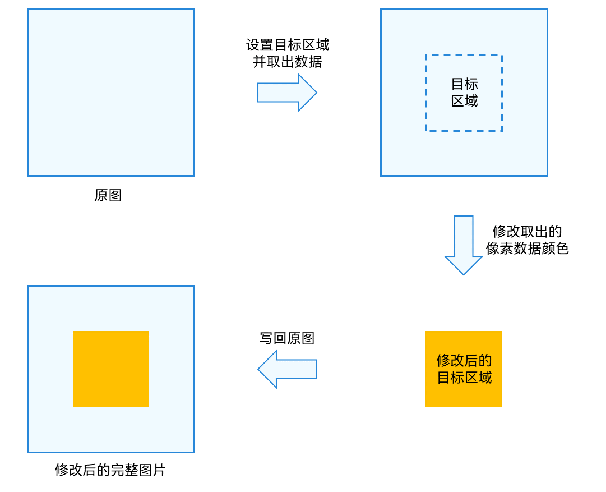

# 使用PixelMap完成位图操作

当需要对目标图片中的部分区域进行处理时，可以使用位图操作功能。此功能常用于图片美化等操作。

如下图所示，一张图片中，将指定的矩形区域像素数据读取出来，进行修改后，再写回原图片对应区域。

**图1** 位图操作示意图



## 开发步骤

位图操作相关API的详细介绍请参见[API参考](../../../../API_Reference/source_zh_cn/ImageKit/cj-apis-image.md#class-pixelmap)。

1. 完成[图片解码](./cj-image-decoding.md)，获取PixelMap位图对象。

2. 从PixelMap位图对象中获取信息。

    <!-- compile -->

    ```cangjie
    import kit.ImageKit.*
    // 获取图像像素的总字节数。
    let pixelBytesNumber = pixelMap.getPixelBytesNumber()
    // 获取图像像素每行字节数。
    let rowBytes = pixelMap.getBytesNumberPerRow()
    // 获取当前图像像素密度。像素密度是指每英寸图片所拥有的像素数量。像素密度越大，图片越精细。
    let density = pixelMap.getDensity()
    ```

3. 读取并修改目标区域像素数据，写回原图。
    > **说明：**
    > 建议readPixelsToBuffer和writeBufferToPixels成对使用，readPixels和writePixels成对使用，避免因图像像素格式不一致，造成PixelMap图像出现异常。

    <!-- compile -->

    ```cangjie
    // 场景一：读取并修改整张图片数据。
    // 按照PixelMap的像素格式，读取PixelMap的图像像素数据，并写入缓冲区中。
    let buffer = Array<UInt8>(Int64(pixelBytesNumber), repeat: 0)
    pixelMap.readPixelsToBuffer(buffer)

    // 按照PixelMap的像素格式，读取缓冲区中的图像像素数据，并写入PixelMap。
    pixelMap.writeBufferToPixels(buffer)

    // 场景二：读取并修改指定区域内的图片数据。
    // 固定按照BGRA_8888格式，读取PixelMap指定区域内的图像像素数据，并写入PositionArea.pixels缓冲区中，该区域由PositionArea.region指定。
    let area = PositionArea(Array<UInt8>(8, repeat: 0), 0, 8, Region(Size(1, 2), 0, 0))

    pixelMap.readPixels(area)

    // 固定按照BGRA_8888格式，读取PositionArea.pixels缓冲区中的图像像素数据，并写入PixelMap指定区域内，该区域由PositionArea.region指定。
    pixelMap.writePixels(area)
    ```

## 开发示例-复制（深拷贝）新的PixelMap

1. 完成[图片解码](./cj-image-decoding.md)，获取PixelMap位图对象。

2. 复制（深拷贝）一个新的PixelMap。
    > **说明：**
    > 创建新PixelMap时，必须将`srcPixelFormat`指定为原PixelMap的像素格式，否则新PixelMap的图像会出现异常。

    <!-- compile -->

    ```cangjie
     /**
      *  复制（深拷贝）一个新的PixelMap
      *
      * @param pixelMap - 被复制的PixelMap。
      * @param desiredPixelFormat - 新PixelMap的像素格式。如果不指定，则仍使用原PixelMap的像素格式。
      * @returns 新PixelMap。
      **/
    func clonePixelMap(pixelMap: PixelMap, desiredPixelFormat: ?PixelMapFormat): PixelMap {
        // 获取当前PixelMap的图片信息。
        let imageInfo = pixelMap.getImageInfo()
        // 读取当前PixelMap的图像像素数据，并按照当前PixelMap的像素格式写入缓冲区数组。
        let buffer = Array<UInt8>(Int64(pixelMap.getPixelBytesNumber()), repeat: 0)
        pixelMap.readPixelsToBuffer(buffer)
        // 根据当前PixelMap的图片信息，生成初始化选项。
        let options = InitializationOptions(
            imageInfo.size,
            // 假设的alphaType枚举值
            alphaType: AlphaType.Opaque,
            // 假设的editable值
            editable: true,
            // 当前PixelMap的像素格式。
            srcPixelFormat: imageInfo.pixelFormat,
            // 新PixelMap的像素格式。
            pixelFormat: desiredPixelFormat??imageInfo.pixelFormat,
            // 假设的scaleMode枚举值
            scaleMode: ScaleMode.FitTargetSize
            )
        // 根据初始化选项和缓冲区数组，生成新PixelMap。
        createPixelMap(buffer, options)
    }
    ```
