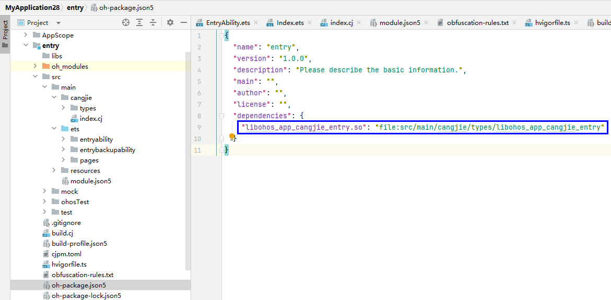

# 增加仓颉模块

该章节介绍如何在 DevEco Studio 的 ArkTS 工程中添加仓颉模块，主要分为在同一个 module 中添加仓颉模块及添加仓颉静态库模块，然后进行互操作调用。

## 在同一个 module 中添加仓颉模块

1. 按照下图所示，选中 ArkTS 的 entry 目录中的任意文件，单击右键，选择 **New -> Cangjie(Interop)**。

   

2. 点击 **Cangjie(Interop)** 按钮后，在选中的 ArkTS 模块下，自动创建 cjpm 的配置文件 cjpm.toml 和名为 `cangjie` 的文件夹。文件夹内包含模板代码文件 index.cj、用于存放仓颉的互操作接口声明文件 `types` 文件夹。如下图所示：

      

      并在 **entry -> oh-package.json5** 中自动生成仓颉的依赖：

      

## 添加仓颉静态库模块

1. 右键单击工程名，然后选择 **New->Module** 添加仓颉静态库模块。

   

2. 选择 **[Cangjie] Static Library**，单击 **Next**，在弹出窗口中将 **Module name** 改为 **cangjielib**。

   

3. 然后会生成一个 **cangjielib** 文件夹，其中内容为仓颉源码文件及配置文件。

   

4. 在 **types->index.cj** 文件中，添加互操作代码，以如下代码为例：

   ```cangjie
   // 包名
   package ohos_app_cangjie_cangjielib

   // 导入文件
   internal import ohos.ark_interop.JSModule
   internal import ohos.ark_interop.JSContext
   internal import ohos.ark_interop.JSCallInfo
   internal import ohos.ark_interop.JSValue

   // 互操作函数
   func sayHelloCJ(runtime: JSContext, callInfo: JSCallInfo): JSValue {
       let result = "cangjie har arkts use "
       runtime.string(result).toJSValue()
   }

   let EXPORT_MODULE = JSModule.registerModule {
       runtime, exports => exports["sayHelloCJ"] = runtime.function(sayHelloCJ).toJSValue()
   }
   ```

5. 在 **cangjielib->src->main->cangjie**"下创建互操作文件夹，命名为 **types**。

6. 在 **types->libohos_app_cangjie_entry->Index.d.ts** 中实现上述 index.cj 中 sayHelloCJ 相对应的 ArkTS 函数：

   ```ts
   export declare function sayHelloCJ(s: string): string
   ```

7. 配置**types->libohos_app_cangjie_entry->oh-package.json5**中**name**字段为互操作代码中对应的包名，该包名需要和**cangjielib->cjpm.toml**中配置的包名一致。例如，此处设置**name**为 `bohos_app_cangjie_cangjielib.so`。

   ```json
   {
     "name": "libohos_app_cangjie_cangjielib.so",
     "types": "./Index.d.ts",
     "version": "1.0.0",
     "description": ""
   }
   ```

8. 在 ArkTS 使用仓颉静态库模块时，在 **entry/oh-package.json5** 的 **dependencies** 中，增加对上述包的依赖：

   ```json
   // ...
     "dependencies": {
       "cangjielib": "file:../cangjielib",
       "libohos_app_cangjie_cangjielib.so": "file:../cangjielib/src/main/cangjie/types/libohos_app_cangjie_entry",
     }
   // ...
   ```

9. 然后再 **entry->src->main->ets** 中，正常使用该函数，以如下 **Index.ets** 为例：

   ```ts
   // 导入仓颉函数
   import { sayHelloCJ } from 'libohos_app_cangjie_cangjielib.so'

   @Entry
   @Component
   struct Index {
     @State message: string = 'Hello World';

     build() {
       RelativeContainer() {
         Text(this.message)
           .fontSize(40)
           .fontWeight(FontWeight.Bold)
           .alignRules({
             center: { anchor: '__container__', align: VerticalAlign.Center },
             middle: { anchor: '__container__', align: HorizontalAlign.Center }
           })
           .onClick(() => {
             // 使用仓颉函数
             this.message = sayHelloCJ("Cangjie")
           })
       }
       .height('100%')
       .width('100%')
     }
   }
   ```
