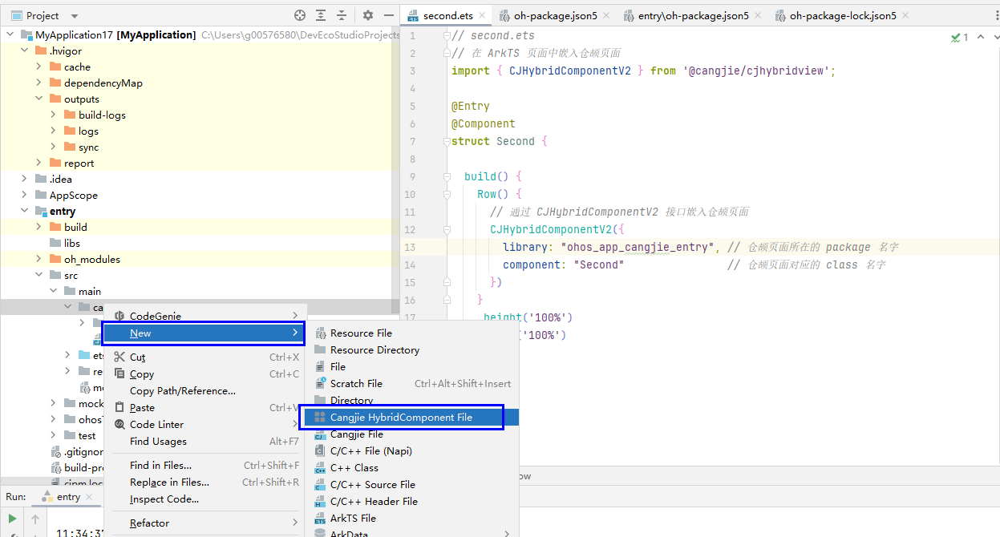

# 增加仓颉页面

在 ArkTS 使用仓颉中，支持增加仓颉页面（Page）。在 OpenHarmony 中，页面是应用程序界面的一部分，负责展示用户界面的元素，如文本、按钮、图片等，以及处理用户的交互操作。

> **说明：**
>
> 在仓颉与 ArkTS 混合开发场景中，仓颉页面不是一个真正意义上具有完整生命周期的页面，只能以组件的形式嵌入到 ArkTS 页面中，因此需要在 ArkTS 侧提供一个 @Entry 的页面作为容器，用于加载仓颉页面，以下将这种仓颉页面命名为仓颉页面组件。

在 DevEco Studio 中增加仓颉页面步骤如下：

1. 在 **Project** 窗口，打开 **entry > src > main**，右键单击 **cangjie** 文件夹，选择 **New > Cangjie HybridComponent File**，命名为 **Second**，如下图所示：

   

2. 在 Cangjie 目录下便会生成仓颉页面组件的文件：

   

   生成的 second.cj 文件内容如下：

   ```cangjie
   package ohos_app_cangjie_entry   // 包名

   import ohos.component.*
   import ohos.state_manage.*
   import ohos.state_macro_manage.*
   import ohos.hybrid_base.*

   // 该页面组件必须由HybridComponentEntry修饰
   @HybridComponentEntry
   @Component
   class Second {
       @State
       var msg: String = "Hello"
       // 仓颉组件构建
       public func build() {
           Column {
               Text(msg)
               Button("click to change Text").onClick {
                   => msg = "world"
               }
           }
       }
   }
   ```

   在 **entry->oh-package.json5** 中会生成页面组件的相关依赖：

   

3. 在  **entry->src->main->etc->pages** 中创建一个 ArkTS 文件，该文件作为容器加载仓颉页面组件（见本章节开头的说明），将其命名为 second.ets，文件内容如下：

   ```ts
   // 在 ArkTS 页面中嵌入仓颉页面组件
   // 导入接口函数
   import { CJHybridComponentV2 } from '@cangjie/cjhybridview';

   @Entry
   @Component
   struct Second {
     build() {
       Row() {
         // 通过 CJHybridComponentV2 接口嵌入仓颉页面
         CJHybridComponentV2({
           library: "ohos_app_cangjie_entry", // 仓颉页面所在的 package 名字
           component: "Second"                // 仓颉页面对应的 class 名字
         })
       }
       .height('100%')
       .width('100%')
     }
   }
   ```
