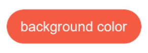
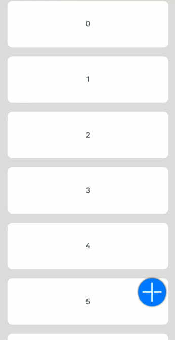

# Button

Button is a button component typically used to respond to user click actions. Its types include capsule button, circular button, and regular button. When used as a container, Button can incorporate child components to create buttons containing elements such as text and images. For specific usage, please refer to [Button](../../../reference/source_en/arkui-cj/cj-button-picker-button.md).

## Creating a Button

Buttons are created by calling interfaces, which can be done in two forms:

- Creating a button without child components using label and [ButtonOptions](../../../reference/source_en/arkui-cj/cj-button-picker-button.md#class-buttonoptions). Examples include shape and stateEffect in ButtonOptions.

  ```cangjie
  init(label: String, options: ButtonOptions)
  ```

  Here, label sets the button text, type sets the Button type, and the stateEffect property determines whether the click effect is enabled.

  ```cangjie
  Button('Ok', ButtonOptions(shape: ButtonType.Normal, stateEffect: true))
      .borderRadius(8)
      .backgroundColor(0x317aff)
      .width(90)
      .height(40)
  ```

  

- Creating a button with child components using [ButtonOptions](../../../reference/source_en/arkui-cj/cj-button-picker-button.md#class-buttonoptions). Examples include shape and stateEffect in ButtonOptions.

  ```cangjie
  init(options: ButtonOptions, content: () -> Unit)
  ```

  Only one child component is supported, which can be a basic component or a container component.

  ```cangjie
  Button(ButtonOptions(shape: ButtonType.Normal, stateEffect: true)){
      Row() {
          Image(@r(app.media.loading)).width(20).height(40).margin(left: 12)
          Text('loading').fontSize(12).fontColor(0xffffff).margin(left: 5, right: 12)
      }.alignItems(VerticalAlign.Center)
  }
  .borderRadius(8)
  .backgroundColor(0x317aff)
  .width(90)
  .height(40)
  ```

  

## Setting Button Types

Button has four optional types: Capsule, Circle, Normal, and ROUNDED_RECTANGLE, configured via the shape property.

- Capsule button (default type).

  The corners of this button type are automatically set to half the height and cannot be reconfigured via the borderRadius property.

  ```cangjie
  Button('Disable', ButtonOptions(shape: ButtonType.Capsule, stateEffect: false))
      .backgroundColor(0x317aff)
      .width(90)
      .height(40)
  ```

  

- Circular button.

  This button type is circular and does not support corner reconfiguration via borderRadius.

  ```cangjie
  Button('Circle', ButtonOptions(shape: ButtonType.Circle, stateEffect: false))
      .backgroundColor(0x317aff)
      .width(90)
      .height(90)
  ```

  

- Normal button.

  This button type has default corners of 0 and supports corner reconfiguration via borderRadius.

  ```cangjie
  Button('Ok', ButtonOptions(shape: ButtonType.Normal, stateEffect: true))
      .borderRadius(8)
      .backgroundColor(0x317aff)
      .width(90)
      .height(40)
  ```

  

## Customizing Styles

- Setting border radius.

  Use common properties to customize button styles. For example, set the button's border radius via the borderRadius property.

  ```cangjie
  Button('circle border', ButtonOptions(shape: ButtonType.Normal))
      .borderRadius(20)
      .height(40)
  ```

  

- Setting text styles.

  Add text styles to configure the display style of button text.

  ```cangjie
  Button('font style', ButtonOptions(shape: ButtonType.Normal))
      .fontSize(20)
      .fontColor(0xffffc0cb)
  ```

  

- Setting background color.

  Add the backgroundColor property to set the button's background color.

  ```cangjie
  Button('background color').backgroundColor(0xF55A42)
  ```

  

- Creating functional buttons.

  Create a button for delete operations.

  ```cangjie
  Button(ButtonOptions(shape: ButtonType.Circle, stateEffect: true)) {
      Image(@r(app.media.ic_public_delete_filled))
        .width(30)
        .height(30)
  }
  .width(55)
  .height(55)
  .margin(left:20)
  .backgroundColor(0xF55A42)
  ```

  

## Adding Events

The Button component is typically used to trigger certain actions. Bind the onClick event to define custom behaviors in response to click actions.

```cangjie
  Button('Ok', ButtonOptions(shape: ButtonType.Normal, stateEffect: true))
      .onClick{ evt =>
      Hilog.info(0, '', 'Button onClick')
  }
```

## Usage Examples

- Submitting forms.

  On user login/registration pages, use buttons for login or registration actions.

     <!-- run -->

  ```cangjie
  package ohos_app_cangjie_entry
  import kit.ArkUI.*
  import ohos.arkui.state_macro_manage.*

  @Entry
  @Component
  class EntryView {
      func build() {
          Column() {
              TextInput(placeholder: 'input your username')
                .margin(top: 20)
              TextInput(placeholder: 'input your password')
                .margin(top: 20)
              Button('Register')
                .width(300)
                .margin(top: 20)
                .onClick{ evt =>
                    // Actions to perform
                    }
          }
          .padding(20)
      }
  }
  ```

  

- Floating button.

  In scrollable interfaces, the button remains floating during scrolling.

     <!-- run -->

  ```cangjie
  package ohos_app_cangjie_entry
  import kit.ArkUI.*
  import ohos.arkui.state_macro_manage.*
  import kit.LocalizationKit.AppResource

  @Entry
  @Component
  class EntryView {
      private var arr: Array<Int64> = [0, 1, 2, 3, 4, 5, 6, 7, 8, 9];
      func build() {
          Stack() {
              List(space: 20, initialIndex: 0) {
                  ForEach(
                      this.arr,
                      itemGeneratorFunc: {
                          item: Int64, _: Int64 => ListItem() {
                              Text("${item}")
                                  .width(100.percent)
                                  .height(100)
                                  .fontSize(16)
                                  .textAlign(TextAlign.Center)
                                  .borderRadius(10)
                                  .backgroundColor(0xFFFFFF)
                          }
                      }
                  )
              }.width(90.percent)

              Button() {
                  Image(@r(app.media.startIcon))
                      .width(50)
                      .height(50)
              }
              .shape(ButtonType.Circle)
              .width(60)
              .height(60)
              .position(x: 80.percent, y: 600)
              .shadow(radius: 10.0)
              .onClick {
                  evt =>
                  // Actions to perform
              }
          }
          .width(100.percent)
          .height(100.percent)
          .backgroundColor(0xDCDCDC)
          .padding(top: 5)
      }
  }
  ```

  