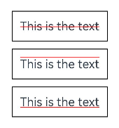
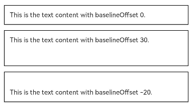
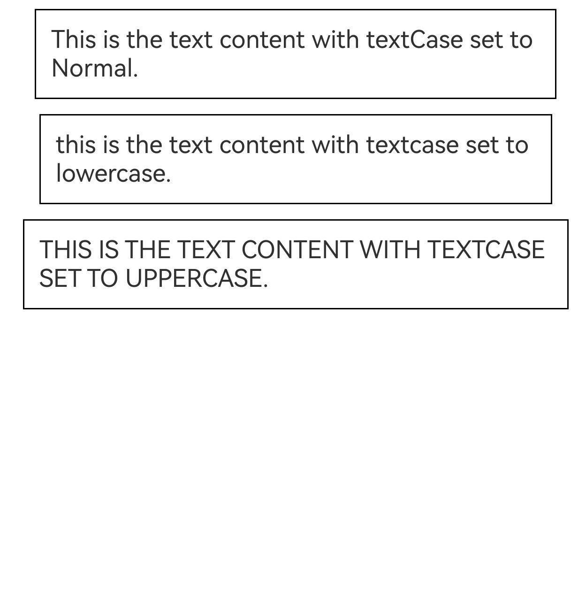

# Text Display (Text/Span)

Text is a text component typically used to display user views, such as the textual content of articles. It supports binding custom text selection menus, allowing users to choose different functions as needed. Additionally, it can extend custom menus to enrich available options and further enhance the user experience. Span is used to render inline text. For specific usage, please refer to the documentation for the [Text](../../../reference/source_en/arkui-cj/cj-text-input-text.md) and [Span](../../../reference/source_en/arkui-cj/cj-text-input-span.md) components.

## Creating Text

Text can be created in the following two ways:

- String literal.

  ```cangjie
  Text('I am a text segment')
  ```

  

- Referencing AppResource resources.

  Resource references can create AppResource-type objects via `@r`. The file location is `/resources/base/element/string.json`, with the following content:

  ```cangjie
  {
    "string": [
      {
        "name": "module_desc",
        "value": "Module description"
      }
    ]
  }
  ```

  ```cangjie
  Text(@r(app.string.module_desc))
    .baselineOffset(0)
    .fontSize(30)
    .border(width: 1)
    .padding(10)
    .width(300)
  ```

  

## Adding Child Components

[Span](../../../reference/source_en/arkui-cj/cj-text-input-span.md) can only be displayed as a child component of [Text](../../../reference/source_en/arkui-cj/cj-text-input-text.md) and [RichEditor](../../../reference/source_en/arkui-cj/cj-text-input-richeditor.md) components to render text content. Multiple Spans can be added within a single Text to display a segment of information, such as product manuals or agreements.

- Creating Span.

  The Span component must be embedded within a Text component to be displayed. A standalone Span component will not render any content.

     <!-- run -->

  ```cangjie
  package ohos_app_cangjie_entry
  import kit.ArkUI.*
  import ohos.arkui.state_macro_manage.*
  import ohos.resource_manager.*

  @Entry
  @Component
  class EntryView {
      func build() {
          Column() {
              Text() {
                  Span("I am Span")
              }
              .padding(10)
              .borderWidth(1)
          }
      }
  }
  ```

  

- Setting text decoration line and color.

  Use [decoration](../../../reference/source_en/arkui-cj/cj-text-input-span.md#func-decorationtextdecorationtype-resourcecolor) to set the text decoration line and color.

     <!-- run -->

  ```cangjie
  package ohos_app_cangjie_entry
  import kit.ArkUI.*
  import ohos.arkui.state_macro_manage.*

  @Entry
  @Component
  class EntryView {
      func build() {
          Scroll {
              Column {
                  Text() {
                      Span('I am Span1,').fontSize(16).fontColor(Color.Gray)
                        .decoration(decorationType: TextDecorationType.LineThrough, color: Color.Red)
                      Span('I am Span2').fontColor(Color.Blue).fontSize(16)
                        .fontStyle(FontStyle.Italic)
                        .decoration(decorationType: TextDecorationType.Underline, color: Color.Black)
                      Span(',I am Span3').fontSize(16). fontColor(Color.Gray)
                        .decoration(decorationType: TextDecorationType.Overline, color: Color.Green)
                  }
                  .borderWidth(1)
                  .padding(10)
              }
              .height(100.percent)
              .width(100.percent)
          }
      }
  }
  ```

  

- Use [textCase](../../../reference/source_en/arkui-cj/cj-text-input-span.md#func-textcasetextcase) to set text to always remain uppercase or lowercase.

     <!-- run -->

  ```cangjie
  package ohos_app_cangjie_entry
  import kit.ArkUI.*
  import ohos.arkui.state_macro_manage.*

  @Entry
  @Component
  class EntryView {
      func build() {
          Scroll {
              Column {
                  Text() {
                    Span('I am Upper-span').fontSize(12)
                      .textCase(TextCase.UpperCase)
                  }
                  .borderWidth(1)
                  .padding(10)
              }
              .height(100.percent)
              .width(100.percent)
          }
      }
  }
  ```

  

- Adding events.

  Since the Span component has no size information, it only supports adding click events [onClick](../../../reference/source_en/arkui-cj/cj-universal-event-click.md#func-onclickclickevent---unit).

     <!-- run -->

  ```cangjie
  package ohos_app_cangjie_entry
  import kit.ArkUI.*
  import ohos.arkui.state_macro_manage.*
  import ohos.resource_manager.*
  import ohos.hilog.*

  @Entry
  @Component
  class EntryView {
      func build() {
          Scroll() {
              Column() {
                    Text() {
                        Span('I am Upper-span').fontSize(12)
                            .textCase(TextCase.UpperCase)
                            .onClick{evt =>
                                Hilog.info(1，'1', 'test', 'I am Span——onClick')
                            }
                    }
              }
          }.height(100.percent).width(100.percent)
      }
  }
  ```

## Customizing Text Styles

- Use the [textAlign](../../../reference/source_en/arkui-cj/cj-text-input-text.md#textaligntextalign) property to set text alignment.

     <!-- run -->

  ```cangjie
  package ohos_app_cangjie_entry
  import kit.ArkUI.*
  import ohos.arkui.state_macro_manage.*

  @Entry
  @Component
  class EntryView {
      func build() {
          Scroll {
              Column {
                  Text('Left-aligned')
                      .width(300)
                      .textAlign(TextAlign.Start)
                      .border(width: 1)
                      .padding(10)
                  Text('Center-aligned')
                      .width(300)
                      .textAlign(TextAlign.Center)
                      .border(width: 1)
                      .padding(10)
                  Text('Right-aligned')
                      .width(300)
                      .textAlign(TextAlign.End)
                      .border(width: 1)
                      .padding(10)
              }
              .height(100.percent)
              .width(100.percent)
          }
      }
  }
  ```

  

- Use the [textOverflow](../../../reference/source_en/arkui-cj/cj-text-input-text.md#textoverflowtextoverflow) property to handle text overflow. `textOverflow` must be used with [maxLines](../../../reference/source_en/arkui-cj/cj-text-input-text.md#maxlinesint32) (by default, text wraps automatically).

     <!-- run -->

  ```cangjie
  package ohos_app_cangjie_entry
  import kit.ArkUI.*
  import ohos.arkui.state_macro_manage.*

  @Entry
  @Component
  class EntryView {
      func build() {
          Scroll {
              Column {
                  Text('This is the setting of textOverflow to Clip text content This is the setting of textOverflow to None text content. This is the setting of textOverflow to Clip text content This is the setting of textOverflow to None text content.')
                      .width(250)
                      .textOverflow(TextOverflow.None)
                      .maxLines(1)
                      .fontSize(12)
                      .border(width: 1)
                      .padding(10)
                  Text('I am an extra-long text, with ellipses displayed for any excess. I am an extra long text, with ellipses displayed for any excess.')
                      .width(250)
                      .textOverflow(TextOverflow.Ellipsis)
                      .maxLines(1)
                      .fontSize(12)
                      .border(width: 1)
                      .padding(10)
              }
              .height(100.percent)
              .width(100.percent)
          }
      }
  }
  ```

  

- Use the [lineHeight](../../../reference/source_en/arkui-cj/cj-text-input-text.md#func-lineheightlength) property to set text line height.

     <!-- run -->

  ```cangjie
  package ohos_app_cangjie_entry
  import kit.ArkUI.*
  import ohos.arkui.state_macro_manage.*

  @Entry
  @Component
  class EntryView {
      func build() {
          Scroll {
              Column {
                  Text('This is the text with the line height set. This is the text with the line height set.')
                      .width(300).fontSize(12).border(width: 1).padding(10)
                  Text('This is the text with the line height set. This is the text with the line height set.')
                      .width(300).fontSize(12).border(width: 1).padding(10)
                      .lineHeight(20)
              }
              .height(100.percent)
              .width(100.percent)
          }
      }
  }
  ```

  

- Use the [decoration](../../../reference/source_en/arkui-cj/cj-text-input-text.md#decorationtextdecorationtype-color-textdecorationstyle) property to set text decoration line style and color.

     <!-- run -->

  ```cangjie
  package ohos_app_cangjie_entry
  import kit.ArkUI.*
  import ohos.arkui.state_macro_manage.*

  @Entry
  @Component
  class EntryView {
      func build() {
          Scroll {
              Column {
                  Text('This is the text')
                      .decoration(
                          decorationType: TextDecorationType.LineThrough,
                          color: Color.Red
                      )
                      .borderWidth(1).padding(10).margin(5)
                  Text('This is the text')
                      .decoration(
                          decorationType: TextDecorationType.Overline,
                          color: Color.Red
                      )
                      .borderWidth(1).padding(10).margin(5)
                  Text('This is the text')
                      .decoration(
                          decorationType: TextDecorationType.Underline,
                          color: Color.Red
                      )
                      .borderWidth(1).padding(10).margin(5)
              }
              .height(100.percent)
              .width(100.percent)
          }
      }
  }
  ```

  

- Use the [baselineOffset](../../../reference/source_en/arkui-cj/cj-text-input-text.md#baselineoffsetlength) property to set the baseline offset of text.

     <!-- run -->

  ```cangjie
  package ohos_app_cangjie_entry
  import kit.ArkUI.*
  import ohos.arkui.state_macro_manage.*

  @Entry
  @Component
  class EntryView {
      func build() {
          Scroll {
              Column {
                  Text('This is the text content with baselineOffset 0.')
                      .baselineOffset(0)
                      .fontSize(12)
                      .border(width: 1)
                      .padding(10)
                      .width(100.percent)
                      .margin(5)
                  Text('This is the text content with baselineOffset 30.')
                      .baselineOffset(30)
                      .fontSize(12)
                      .border(width: 1)
                      .padding(10)
                      .width(100.percent)
                      .margin(5)
                  Text('This is the text content with baselineOffset -20.')
                      .baselineOffset(-20)
                      .fontSize(12)
                      .border(width: 1)
                      .padding(10)
                      .width(100.percent)
                      .margin(5)
              }
              .height(100.percent)
              .width(100.percent)
          }
      }
  }
  ```

  

- Use [minFontSize](../../../reference/source_en/arkui-cj/cj-text-input-text.md#minfontsizelength) and [maxFontSize](../../../reference/source_en/arkui-cj/cj-text-input-text.md#maxfontsizelength) for adaptive font sizing.

  `minFontSize` sets the minimum display font size for text, while `maxFontSize` sets the maximum display font size. Both properties must be set simultaneously to take effect and must be used with the [maxLines](../../../reference/source_en/arkui-cj/cj-text-input-text.md#maxlinesint32) property or layout size constraints. Setting either property alone will not produce any effect.

     <!-- run -->

  ```cangjie
  package ohos_app_cangjie_entry
  import kit.ArkUI.*
  import ohos.arkui.state_macro_manage.*

  @Entry
  @Component
  class EntryView {
      func build() {
          Scroll {
              Column {
                  Text('My maximum font size is 30, minimum font size is 5, width is 250, maxLines is 1')
                      .width(250)
                      .maxLines(1)
                      .maxFontSize(30)
                      .minFontSize(5)
                      .border(width: 1)
                      .padding(10)
                      .margin(5)
                  Text('My maximum font size is 30, minimum font size is 5, width is 250, maxLines is 2')
                      .width(250)
                      .maxLines(2)
                      .maxFontSize(30)
                      .minFontSize(5)
                      .border(width: 1)
                      .padding(10)
                      .margin(5)
                  Text('My maximum font size is 30, minimum font size is 15, width is 250, height is 50')
                      .width(250)
                      .height(50)
                      .maxFontSize(30)
                      .minFontSize(15)
                      .border(width: 1)
                      .padding(10)
                      .margin(5)
                  Text('My maximum font size is 30, minimum font size is 15, width is 250, height is 100')
                      .width(250)
                      .height(100)
                      .maxFontSize(30)
                      .minFontSize(15)
                      .border(width: 1)
                      .padding(10)
                      .margin(5)
              }
              .height(100.percent)
              .width(100.percent)
          }
      }
  }
  ```

  

- Use the [textCase](../../../reference/source_en/arkui-cj/cj-text-input-text.md#textcasetextcase) property to set text case.

     <!-- run -->

  ```cangjie
  package ohos_app_cangjie_entry
  import kit.ArkUI.*
  import ohos.arkui.state_macro_manage.*

  @Entry
  @Component
  class EntryView {
      func build() {
          Scroll {
              Column {
                  Text('This is the text content with textCase set to Normal.')
                      .textCase(TextCase.Normal)
                      .padding(10)
                      .border(width: 1)
                      .padding(10)
                      .margin(5)
                    // Text displayed in all lowercase
                  Text('This is the text content with textCase set to LowerCase.')
                      .textCase(TextCase.LowerCase)
                      .border(width: 1)
                      .padding(10)
                      .margin(5)
                    // Text displayed in all uppercase
                  Text('This is the text content with textCase set to UpperCase.')
                      .textCase(TextCase.UpperCase)
                      .border(width: 1)
                      .padding(10)
                      .margin(5)
              }
              .height(100.percent)
              .width(100.percent)
          }
      }
  }
  ```

  ## Adding Events

The Text component can add universal events, and can bind events such as [onClick](../../../reference/source_en/arkui-cj/cj-universal-event-click.md#func-onclickclickevent---unit) and [onTouch](../../../reference/source_en/arkui-cj/cj-universal-event-touch.md#func-ontouchtouchevent-unit) to respond to operations.

 <!-- run -->

```cangjie
package ohos_app_cangjie_entry
import kit.ArkUI.*
import ohos.arkui.state_macro_manage.*
import ohos.hilog.*

@Entry
@Component
class EntryView {
    func build() {
        Scroll {
            Column {
                Text('Click Me')
                    .onClick{ evt =>
                        Hilog.info(1，'1', 'test', 'This is the click response event of Text')
                    }
            }
            .height(100.percent)
            .width(100.percent)
        }
    }
}
```

## Scenario Example

This example demonstrates the effect of a trending search list using the maxLines, textOverflow, textAlign, and constraintSize properties.

 <!-- run -->

```cangjie
package ohos_app_cangjie_entry
import kit.ArkUI.*
import ohos.arkui.state_macro_manage.*

@Entry
@Component
class EntryView {
    func build() {
        Column() {
            Row() {
                Text("1").fontSize(14).fontColor(Color.Red).margin(left: 10, right: 10)
                Text("I am trending search term 1")
                    .fontSize(12)
                    .fontColor(Color.Blue)
                    .maxLines(1)
                    .textOverflow(TextOverflow.Ellipsis)
                    .fontWeight(W300)
                Text("Hot")
                    .margin(left: 6)
                    .textAlign(TextAlign.Center)
                    .fontSize(10)
                    .fontColor(Color.White)
                    .fontWeight(W600)
                    .backgroundColor(0x770100)
                    .borderRadius(5)
                    .width(15)
                    .height(14)
                }.width(100.percent).margin(5)

            Row() {
                Text("2").fontSize(14).fontColor(Color.Red).margin(left: 10, right: 10)
                Text("I am trending search term 2 I am trending search term 2 I am trending search term 2 I am trending search term 2 I am trending search term 2")
                    .fontSize(12)
                    .fontColor(Color.Blue)
                    .fontWeight(W300)
                    .constraintSize(maxWidth: 200)
                    .maxLines(1)
                    .textOverflow(TextOverflow.Ellipsis)
                Text("Trending")
                    .margin(left: 6)
                    .textAlign(TextAlign.Center)
                    .fontSize(10)
                    .fontColor(Color.White)
                    .fontWeight(W600)
                    .backgroundColor(0xCC5500)
                    .borderRadius(5)
                    .width(15)
                    .height(14)
                }.width(100.percent).margin(5)

            Row() {
                Text("3").fontSize(14).fontColor(Color(0xFFA500)).margin(left: 10, right: 10)
                Text("I am trending search term 3")
                    .fontSize(12)
                    .fontColor(Color.Blue)
                    .fontWeight(W300)
                    .maxLines(1)
                    .constraintSize(maxWidth: 200)
                    .textOverflow(TextOverflow.Ellipsis)
                Text("Trending")
                    .margin(left: 6)
                    .textAlign(TextAlign.Center)
                    .fontSize(10)
                    .fontColor(Color.White)
                    .fontWeight(W600)
                    .backgroundColor(0xCC5500)
                    .borderRadius(5)
                    .width(15)
                    .height(14)
                }.width(100.percent).margin(5)

            Row() {
                Text("4").fontSize(14).fontColor(Color.Gray).margin(left: 10, right: 10)
                Text("I am trending search term 4 I am trending search term 4 I am trending search term 4 I am trending search term 4 I am trending search term 4")
                    .fontSize(12)
                    .fontColor(Color.Blue)
                    .fontWeight(W300)
                    .constraintSize(maxWidth: 200)
                    .maxLines(1)
                    .textOverflow(TextOverflow.Ellipsis)
                }.width(100.percent).margin(5)
        }.width(100.percent)
    }
}
```

