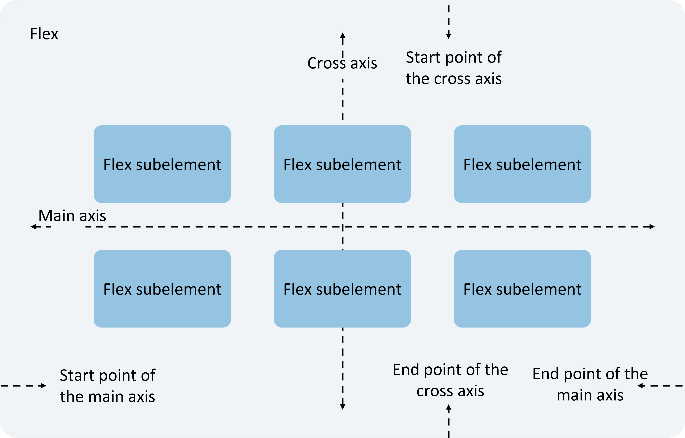
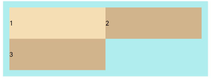
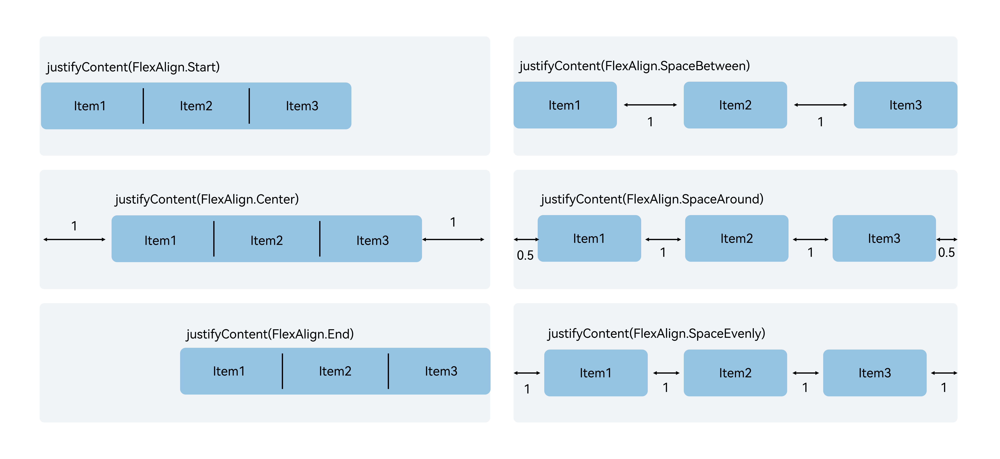

# Flex Layout (Flex)

## Overview

Flex layout ([Flex](../../../reference/source_en/arkui-cj/cj-row-column-stack-flex.md)) provides a more efficient way to arrange, align, and distribute remaining space among child elements within a container. It is commonly used for evenly distributing navigation bars in page headers, constructing page frameworks, and arranging multi-line data.

By default, a container has a main axis and a cross axis. Child elements are arranged along the main axis by default. The size of a child element along the main axis is called the main axis size, and the size along the cross axis is called the cross axis size.

**Figure 1** Flex container with horizontal main axis



## Basic Concepts

- **Main Axis**: The axis along which Flex components are laid out. Child elements are arranged along the main axis by default. The starting position of the main axis is called the main start, and the ending position is called the main end.

- **Cross Axis**: The axis perpendicular to the main axis. The starting position of the cross axis is called the cross start, and the ending position is called the cross end.

## Layout Direction

In flex layout, child elements within a container can be arranged in any direction. By setting the `direction` parameter, you can determine the direction of the main axis, thereby controlling the arrangement direction of child elements.

The flex layout direction is illustrated below:


- **FlexDirection.Row** (default): The main axis is horizontal, and child elements are arranged from the start along the horizontal direction.

    <!-- run -->

    ```cangjie
    package ohos_app_cangjie_entry
    import kit.ArkUI.*
    import ohos.arkui.state_macro_manage.*

    @Entry
    @Component
    class EntryView {
        func build() {
            Flex(direction: FlexDirection.Row) {
                Text('1')
                    .width(33.percent)
                    .height(50)
                    .backgroundColor(0xF5DEB3)
                Text('2')
                    .width(33.percent)
                    .height(50)
                    .backgroundColor(0xD2B48C)
                Text('3')
                    .width(33.percent)
                    .height(50)
                    .backgroundColor(0xF5DEB3)
            }
            .height(70)
            .width(90.percent)
            .padding(10)
            .backgroundColor(0xAFEEEE)
        }
    }
    ```

    

- **FlexDirection.RowReverse**: The main axis is horizontal, and child elements are arranged from the end in the opposite direction of `FlexDirection.Row`.

    <!-- run -->

    ```cangjie
    package ohos_app_cangjie_entry
    import kit.ArkUI.*
    import ohos.arkui.state_macro_manage.*

    @Entry
    @Component
    class EntryView {
        func build() {
            Flex(direction: FlexDirection.RowReverse) {
                Text('3')
                    .width(33.percent)
                    .height(50)
                    .backgroundColor(0xF5DEB3)
                Text('2')
                    .width(33.percent)
                    .height(50)
                    .backgroundColor(0xD2B48C)
                Text('1')
                    .width(33.percent)
                    .height(50)
                    .backgroundColor(0xF5DEB3)
            }
            .height(70)
            .width(90.percent)
            .padding(10)
            .backgroundColor(0xAFEEEE)
        }
    }
    ```

    

- **FlexDirection.Column**: The main axis is vertical, and child elements are arranged from the start along the vertical direction.

    <!-- run -->

    ```cangjie
    package ohos_app_cangjie_entry
    import kit.ArkUI.*
    import ohos.arkui.state_macro_manage.*

    @Entry
    @Component
    class EntryView {
        func build() {
            Flex(direction: FlexDirection.Column) {
                Text('1')
                    .width(100.percent)
                    .height(50)
                    .backgroundColor(0xF5DEB3)
                Text('2')
                    .width(100.percent)
                    .height(50)
                    .backgroundColor(0xD2B48C)
                Text('3')
                    .width(100.percent)
                    .height(50)
                    .backgroundColor(0xF5DEB3)
            }
            .height(70)
            .width(90.percent)
            .padding(10)
            .backgroundColor(0xAFEEEE)
        }
    }
    ```

    

- **FlexDirection.ColumnReverse**: The main axis is vertical, and child elements are arranged from the end in the opposite direction of `FlexDirection.Column`.

    <!-- run -->

    ```cangjie
    package ohos_app_cangjie_entry
    import kit.ArkUI.*
    import ohos.arkui.state_macro_manage.*

    @Entry
    @Component
    class EntryView {
        func build() {
            Flex(direction: FlexDirection.ColumnReverse) {
                Text('1')
                    .width(100.percent)
                    .height(50)
                    .backgroundColor(0xF5DEB3)
                Text('2')
                    .width(100.percent)
                    .height(50)
                    .backgroundColor(0xD2B48C)
                Text('3')
                    .width(100.percent)
                    .height(50)
                    .backgroundColor(0xF5DEB3)
            }
            .height(70)
            .width(90.percent)
            .padding(10)
            .backgroundColor(0xAFEEEE)
        }
    }
    ```

    

## Layout Wrapping

Flex layout can be single-line or multi-line. By default, all child elements in a Flex container are arranged on a single line (also called the "axis"). The `wrap` property controls whether the Flex layout is single-line or multi-line when the sum of the main axis sizes of child elements exceeds the main axis size of the container. In multi-line layout, the direction of new lines is determined by the cross axis.

- **FlexWrap.NoWrap** (default): No wrapping. If the total width of child elements exceeds the parent's width, the child elements will be compressed.

    <!-- run -->

    ```cangjie
    package ohos_app_cangjie_entry
    import kit.ArkUI.*
    import ohos.arkui.state_macro_manage.*

    @Entry
    @Component
    class EntryView {
        func build() {
            Flex(wrap: FlexWrap.NoWrap) {
                Text('1')
                    .width(50.percent)
                    .height(50)
                    .backgroundColor(0xF5DEB3)
                Text('2')
                    .width(50.percent)
                    .height(50)
                    .backgroundColor(0xD2B48C)
                Text('3')
                    .width(50.percent)
                    .height(50)
                    .backgroundColor(0xF5DEB3)
            }
            .width(90.percent)
            .padding(10)
            .backgroundColor(0xAFEEEE)
        }
    }
    ```

    

- **FlexWrap.Wrap**: Wrapping enabled. Each line of child elements is arranged along the main axis.

    <!-- run -->

    ```cangjie
    package ohos_app_cangjie_entry
    import kit.ArkUI.*
    import ohos.arkui.state_macro_manage.*

    @Entry
    @Component
    class EntryView {
        func build() {
            Flex(wrap: FlexWrap.Wrap) {
                Text('1')
                    .width(50.percent)
                    .height(50)
                    .backgroundColor(0xF5DEB3)
                Text('2')
                    .width(50.percent)
                    .height(50)
                    .backgroundColor(0xD2B48C)
                Text('3')
                    .width(50.percent)
                    .height(50)
                    .backgroundColor(0xD2B48C)
            }
            .width(90.percent)
            .padding(10)
            .backgroundColor(0xAFEEEE)
        }
    }
    ```

    

- **FlexWrap.WrapReverse**: Wrapping enabled. Each line of child elements is arranged in the opposite direction of the main axis.

    <!-- run -->

    ```cangjie
    package ohos_app_cangjie_entry
    import kit.ArkUI.*
    import ohos.arkui.state_macro_manage.*

    @Entry
    @Component
    class EntryView {
        func build() {
            Flex(wrap: FlexWrap.WrapReverse) {
                Text('1')
                    .width(50.percent)
                    .height(50)
                    .backgroundColor(0xF5DEB3)
            Text('2')
                    .width(50.percent)
                    .height(50)
                    .backgroundColor(0xD2B48C)
                Text('3')
                    .width(50.percent)
                    .height(50)
                    .backgroundColor(0xF5DEB3)
            }
            .width(90.percent)
            .padding(10)
            .backgroundColor(0xAFEEEE)
        }
    }
    ```

    

## Main Axis Alignment

Use the `justifyContent` parameter to set the alignment of child elements along the main axis.



- **FlexAlign.Start** (default): Child elements are aligned to the start of the main axis. The first child element aligns with the parent's edge, and other elements align with the previous element.

    <!-- run -->

    ```cangjie
    package ohos_app_cangjie_entry
    import kit.ArkUI.*
    import ohos.arkui.state_macro_manage.*

    @Entry
    @Component
    class EntryView {
        func build() {
            Flex(justifyContent: FlexAlign.Start) {
                Text('1')
                    .width(20.percent)
                    .height(50)
                    .backgroundColor(0xF5DEB3)
                Text('2')
                    .width(20.percent)
                    .height(50)
                    .backgroundColor(0xD2B48C)
                Text('3')
                    .width(20.percent)
                    .height(50)
                    .backgroundColor(0xF5DEB3)
            }
            .width(90.percent)
            .padding(top: 10, bottom: 10)
            .backgroundColor(0xAFEEEE)
        }
    }
    ```

    

- **FlexAlign.Center**: Child elements are centered along the main axis.

    <!-- run -->

    ```cangjie
    package ohos_app_cangjie_entry
    import kit.ArkUI.*
    import ohos.arkui.state_macro_manage.*

    @Entry
    @Component
    class EntryView {
        func build() {
            Flex(justifyContent: FlexAlign.Center) {
                Text('1')
                    .width(20.percent)
                    .height(50)
                    .backgroundColor(0xF5DEB3)
                Text('2')
                    .width(20.percent)
                    .height(50)
                    .backgroundColor(0xD2B48C)
                Text('3')
                    .width(20.percent)
                    .height(50)
                    .backgroundColor(0xF5DEB3)
            }
            .width(90.percent)
            .padding(top: 10, bottom: 10)
    .padding(top: 10, bottom: 10)
            .backgroundColor(0xAFEEEE)
        }
    }
    ```

    

- **FlexAlign.End**: Child elements are aligned to the end of the main axis. The last child element aligns with the parent's edge, and other elements align with the next element.

    <!-- run -->

    ```cangjie
    package ohos_app_cangjie_entry
    import kit.ArkUI.*
    import ohos.arkui.state_macro_manage.*

    @Entry
    @Component
    class EntryView {
        func build() {
            Flex(justifyContent: FlexAlign.End) {
                Text('1')
                    .width(20.percent)
                    .height(50)
                    .backgroundColor(0xF5DEB3)
                Text('2')
                    .width(20.percent)
                    .height(50)
                    .backgroundColor(0xD2B48C)
                Text('3')
                    .width(20.percent)
                    .height(50)
                    .backgroundColor(0xF5DEB3)
            }
            .width(90.percent)
            .padding(top: 10, bottom: 10)
            .backgroundColor(0xAFEEEE)
        }
    }
    ```

    

- **FlexAlign.SpaceBetween**: Child elements are evenly distributed along the main axis, with equal spacing between adjacent elements. The first and last elements align with the parent's edges.

    <!-- run -->

    ```cangjie
    package ohos_app_cangjie_entry
    import kit.ArkUI.*
    import ohos.arkui.state_macro_manage.*

    @Entry
    @Component
    class EntryView {
        func build() {
            Flex(justifyContent: FlexAlign.SpaceBetween) {
                Text('1')
                    .width(20.percent)
                    .height(50)
                    .backgroundColor(0xF5DEB3)
                Text('2')
                    .width(20.percent)
                    .height(50)
                    .backgroundColor(0xD2B48C)
                Text('3')
                    .width(20.percent)
                    .height(50)
                    .backgroundColor(0xF5DEB3)
            }
            .width(90.percent)
            .padding(top: 10, bottom: 10)
            .backgroundColor(0xAFEEEE)
        }
    }
    ```

    

- **FlexAlign.SpaceAround**: Child elements are evenly distributed along the main axis, with equal spacing between adjacent elements. The spacing between the first element and the main start, and the last element and the main end, is half the spacing between adjacent elements.

    <!-- run -->

    ```cangjie
    package ohos_app_cangjie_entry
    import kit.ArkUI.*
    import ohos.arkui.state_macro_manage.*

    @Entry
    @Component
    class EntryView {
        func build() {
            Flex(justifyContent: FlexAlign.SpaceAround) {
                Text('1')
                    .width(20.percent)
                    .height(50)
                    .backgroundColor(0xF5DEB3)
                Text('2')
                    .width(20.percent)
                    .height(50)
                    .backgroundColor(0xD2B48C)
                Text('3')
                    .width(20.percent)
                    .height(50)
                    .backgroundColor(0xF5DEB3)
            }
            .width(90.percent)
            .padding(top: 10, bottom: 10)
            .backgroundColor(0xAFEEEE)
        }
    }
    ```

    

- **FlexAlign.SpaceEvenly**: Child elements are evenly distributed along the main axis, with equal spacing between adjacent elements, between the first element and the main start, and between the last element and the main end.

    <!-- run -->

    ```cangjie
    package ohos_app_cangjie_entry
    import kit.ArkUI.*
    import ohos.arkui.state_macro_manage.*

    @Entry
    @Component
    class EntryView {
        func build() {
            Flex(justifyContent: FlexAlign.SpaceEvenly) {
                Text('1')
                    .width(20.percent)
                    .height(50)
                    .backgroundColor(0xF5DEB3)
                Text('2')
                    .width(20.percent)
                    .height(50)
                    .backgroundColor(0xD2B48C)
                Text('3')
                    .width(20.percent)
                    .height(50)
                    .backgroundColor(0xF5DEB3)
            }
            .width(90.percent)
            .padding(top: 10, bottom: 10)
            .backgroundColor(0xAFEEEE)
        }
    }
    ```

    ## Cross-Axis Alignment

Both containers and child elements can set cross-axis alignment, with child element alignment settings taking higher priority.

### Container Component Cross-Axis Alignment

The `alignItems` parameter of the Flex component can be used to set the cross-axis alignment of child elements.

- `ItemAlign.Auto`: Uses the default configuration in the Flex container.

    <!-- run -->

    ```cangjie
    package ohos_app_cangjie_entry
    import kit.ArkUI.*
    import ohos.arkui.state_macro_manage.*

    @Entry
    @Component
    class EntryView {
        func build() {
            Flex(alignItems: ItemAlign.Auto) {
                Text('1')
                    .width(33.percent)
                    .height(30)
                    .backgroundColor(0xF5DEB3)
                Text('2')
                    .width(33.percent)
                    .height(40)
                    .backgroundColor(0xD2B48C)
                Text('3')
                    .width(33.percent)
                    .height(50)
                    .backgroundColor(0xF5DEB3)
            }
            .size(width: 90.percent, height: 80)
            .padding(10)
            .backgroundColor(0xAFEEEE)
        }
    }
    ```

    

- `ItemAlign.Start`: Aligns to the start of the cross-axis direction.

    <!-- run -->

    ```cangjie
    package ohos_app_cangjie_entry
    import kit.ArkUI.*
    import ohos.arkui.state_macro_manage.*

    @Entry
    @Component
    class EntryView {
        func build() {
            Flex(alignItems: ItemAlign.Start) {
                Text('1')
                    .width(33.percent)
                    .height(30)
                    .backgroundColor(0xF5DEB3)
                Text('2')
                    .width(33.percent)
                    .height(40)
                    .backgroundColor(0xD2B48C)
                Text('3')
                    .width(33.percent)
                    .height(50)
                    .backgroundColor(0xF5DEB3)
            }
            .size(width: 90.percent, height: 80)
            .padding(10)
            .backgroundColor(0xAFEEEE)
        }
    }
    ```

    

- `ItemAlign.Center`: Centers alignment along the cross-axis direction.

    <!-- run -->

    ```cangjie
    package ohos_app_cangjie_entry
    import kit.ArkUI.*
    import ohos.arkui.state_macro_manage.*

    @Entry
    @Component
    class EntryView {
        func build() {
            Flex(alignItems: ItemAlign.Center) {
                Text('1')
                    .width(33.percent)
                    .height(30)
                    .backgroundColor(0xF5DEB3)
                Text('2')
                    .width(33.percent)
                    .height(40)
                    .backgroundColor(0xD2B48C)
                Text('3')
                    .width(33.percent)
                    .height(50)
                    .backgroundColor(0xF5DEB3)
            }
            .size(width: 90.percent, height: 80)
            .padding(10)
            .backgroundColor(0xAFEEEE)
        }
    }
    ```

    

- `ItemAlign.End`: Aligns to the end of the cross-axis direction.

    <!-- run -->

    ```cangjie
    package ohos_app_cangjie_entry
    import kit.ArkUI.*
    import ohos.arkui.state_macro_manage.*

    @Entry
    @Component
    class EntryView {
        func build() {
            Flex(alignItems: ItemAlign.End) {
                Text('1')
                    .width(33.percent)
                    .height(30)
                    .backgroundColor(0xF5DEB3)
                Text('2')
                    .width(33.percent)
                    .height(40)
                    .backgroundColor(0xD2B48C)
                Text('3')
                    .width(33.percent)
                    .height(50)
                    .backgroundColor(0xF5DEB3)
            }
            .size(width: 90.percent, height: 80)
            .padding(10)
            .backgroundColor(0xAFEEEE)
        }
    }
    ```

    

- `ItemAlign.Stretch`: Stretches to fill the cross-axis direction, expanding to container size when dimensions are not set.

    <!-- run -->

    ```cangjie
    package ohos_app_cangjie_entry
    import kit.ArkUI.*
    import ohos.arkui.state_macro_manage.*

    @Entry
    @Component
    class EntryView {
        func build() {
            Flex(alignItems: ItemAlign.Stretch) {
                Text('1')
                    .width(33.percent)
                    .backgroundColor(0xF5DEB3)
                Text('2')
                    .width(33.percent)
                    .backgroundColor(0xD2B48C)
                Text('3')
                    .width(33.percent)
                    .backgroundColor(0xF5DEB3)
            }
            .size(width: 90.percent, height: 80)
            .padding(10)
            .backgroundColor(0xAFEEEE)
        }
    }
    ```

    

- `ItemAlign.Baseline`: Aligns text baselines along the cross-axis direction.

    <!-- run -->

    ```cangjie
    package ohos_app_cangjie_entry
    import kit.ArkUI.*
    import ohos.arkui.state_macro_manage.*

    @Entry
    @Component
    class EntryView {
        func build() {
            Flex(alignItems: ItemAlign.Baseline) {
                Text('1')
                    .width(33.percent)
                    .height(30)
                    .backgroundColor(0xF5DEB3)
                Text('2')
                    .width(33.percent)
                    .height(40)
                    .backgroundColor(0xD2B48C)
                Text('3')
                    .width(33.percent)
                    .height(50)
                    .backgroundColor(0xF5DEB3)
            }
            .size(width: 90.percent, height: 80)
            .padding(10)
            .backgroundColor(0xAFEEEE)
        }
    }
    ```

    

### Child Element Cross-Axis Alignment

The [`alignSelf`](../../../reference/source_en/arkui-cj/cj-universal-attribute-flexlayout.md#func-alignselfitemalign) attribute of child elements can also set their alignment format along the parent container's cross-axis, overriding the `alignItems` configuration in the Flex layout container. As shown in the following example:

 <!-- run -->

```cangjie
package ohos_app_cangjie_entry
import kit.ArkUI.*
import ohos.arkui.state_macro_manage.*

@Entry
@Component
class EntryView {
    func build() {
        Flex(direction: FlexDirection.Row, alignItems: ItemAlign.Center) { // Container sets child elements to center
            Text('alignSelf Start')
                .width(25.percent)
                .height(80)
                .alignSelf(ItemAlign.Start)
                .backgroundColor(0xF5DEB3)
            Text('alignSelf Baseline')
                .alignSelf(ItemAlign.Baseline)
                .width(25.percent)
                .height(80)
                .backgroundColor(0xD2B48C)
            Text('alignSelf Baseline')
                .width(25.percent)
                .height(100)
                .backgroundColor(0xF5DEB3)
                .alignSelf(ItemAlign.Baseline)
            Text('no alignSelf')
                .width(25.percent)
                .height(100)
                .backgroundColor(0xD2B48C)
            Text('no alignSelf')
                .width(25.percent)
                .height(100)
                .backgroundColor(0xF5DEB3)
        }
        .width(90.percent)
        .height(220)
        .backgroundColor(0xAFEEEE)
    }
}
```


In the above example, the `alignItems` in the Flex container sets the cross-axis alignment of child elements to center. When child elements have their own `alignSelf` attributes, they override the parent component's `alignItems` value, displaying as defined by `alignSelf`.

### Content Alignment

The [`alignContent`](../../../reference/source_en/arkui-cj/cj-row-column-stack-flex.md#var-aligncontent) parameter can be used to set the alignment of child element rows within the remaining space of the cross-axis. This only takes effect in multi-line Flex layouts. Optional values include:

- `FlexAlign.Start`: Aligns child element rows to the start of the cross-axis.

    <!-- run -->

    ```cangjie
    package ohos_app_cangjie_entry
    import kit.ArkUI.*
    import ohos.arkui.state_macro_manage.*

    @Entry
    @Component
    class EntryView {
        func build() {
            Flex(justifyContent: FlexAlign.SpaceBetween, wrap: FlexWrap.Wrap, alignContent: FlexAlign.Start) {
                Text('1')
                    .width(30.percent)
                    .height(20)
                    .backgroundColor(0xF5DEB3)
                Text('2')
                    .width(60.percent)
                    .height(20)
                    .backgroundColor(0xD2B48C)
                Text('3')
                    .width(40.percent)
                    .height(20)
                    .backgroundColor(0xD2B48C)
                Text('4')
                    .width(30.percent)
                    .height(20)
                    .backgroundColor(0xF5DEB3)
                Text('5')
                    .width(20.percent)
                    .height(20)
                    .backgroundColor(0xD2B48C)
            }
            .width(90.percent)
            .height(100)
            .backgroundColor(0xAFEEEE)
        }
    }
    ```

    

- `FlexAlign.Center`: Centers child element rows along the cross-axis direction.

    <!-- run -->

    ```cangjie
    package ohos_app_cangjie_entry
    import kit.ArkUI.*
    import ohos.arkui.state_macro_manage.*

    @Entry
    @Component
    class EntryView {
        func build() {
            Flex(justifyContent: FlexAlign.SpaceBetween, wrap: FlexWrap.Wrap, alignContent: FlexAlign.Center) {
                Text('1')
                    .width(30.percent)
                    .height(20)
                    .backgroundColor(0xF5DEB3)
                Text('2')
                    .width(60.percent)
                    .height(20)
                    .backgroundColor(0xD2B48C)
                Text('3')
                    .width(40.percent)
                    .height(20)
                    .backgroundColor(0xD2B48C)
                Text('4')
                    .width(30.percent)
                    .height(20)
                    .backgroundColor(0xF5DEB3)
                Text('5')
                    .width(20.percent)
                    .height(20)
                    .backgroundColor(0xD2B48C)
            }
            .width(90.percent)
            .height(100)
            .backgroundColor(0xAFEEEE)
        }
    }
    ```

    

- `FlexAlign.End`: Aligns child element rows to the end of the cross-axis.

    <!-- run -->

    ```cangjie
    package ohos_app_cangjie_entry
    import kit.ArkUI.*
    import ohos.arkui.state_macro_manage.*

    @Entry
    @Component
    class EntryView {
        func build() {
            Flex(justifyContent: FlexAlign.SpaceBetween, wrap: FlexWrap.Wrap, alignContent: FlexAlign.End) {
                Text('1')
                    .width(30.percent)
                    .height(20)
                    .backgroundColor(0xF5DEB3)
                Text('2')
                    .width(60.percent)
                    .height(20)
                    .backgroundColor(0xD2B48C)
                Text('3')
                    .width(40.percent)
                    .height(20)
                    .backgroundColor(0xD2B48C)
                Text('4')
                    .width(30.percent)
                    .height(20)
                    .backgroundColor(0xF5DEB3)
                Text('5')
                    .width(20.percent)
                    .height(20)
                    .backgroundColor(0xD2B48C)
            }
            .width(90.percent)
            .height(100)
            .backgroundColor(0xAFEEEE)
        }
    }
    ```

    

- `FlexAlign.SpaceBetween`: Aligns child element rows to both ends of the cross-axis, with equal vertical spacing between rows.

    <!-- run -->

    ```cangjie
    package ohos_app_cangjie_entry
    import kit.ArkUI.*
    import ohos.arkui.state_macro_manage.*

    @Entry
    @Component
    class EntryView {
        func build() {
            Flex(justifyContent: FlexAlign.SpaceBetween, wrap: FlexWrap.Wrap, alignContent: FlexAlign.SpaceBetween) {
                Text('1')
                    .width(30.percent)
                    .height(20)
                    .backgroundColor(0xF5DEB3)
                Text('2')
                    .width(60.percent)
                    .height(20)
                    .backgroundColor(0xD2B48C)
                Text('3')
                    .width(40.percent)
                    .height(20)
                    .backgroundColor(0xD2B48C)
                Text('4')
                    .width(30.percent)
                    .height(20)
                    .backgroundColor(0xF5DEB3)
                Text('5')
                    .width(20.percent)
                    .height(20)
                    .backgroundColor(0xD2B48C)
            }
            .width(90.percent)
            .height(100)
            .backgroundColor(0xAFEEEE)
        }
    }
    ```

    

- `FlexAlign.SpaceAround`: Equal spacing between child element rows, with twice the distance between the first/last row and the cross-axis ends.

    <!-- run -->

    ```cangjie
    package ohos_app_cangjie_entry
    import kit.ArkUI.*
    import ohos.arkui.state_macro_manage.*

    @Entry
    @Component
    class EntryView {
        func build() {
            Flex(justifyContent: FlexAlign.SpaceBetween, wrap: FlexWrap.Wrap, alignContent: FlexAlign.SpaceAround) {
                Text('1')
                    .width(30.percent)
                    .height(20)
                    .backgroundColor(0xF5DEB3)
                Text('2')
                    .width(60.percent)
                    .height(20)
                    .backgroundColor(0xD2B48C)
                Text('3')
                    .width(40.percent)
                    .height(20)
                    .backgroundColor(0xD2B48C)
                Text('4')
                    .width(30.percent)
                    .height(20)
                    .backgroundColor(0xF5DEB3)
                Text('5')
                    .width(20.percent)
                    .height(20)
                    .backgroundColor(0xD2B48C)
            }
            .width(90.percent)
            .height(100)
            .backgroundColor(0xAFEEEE)
        }
    }
    ```

    

- `FlexAlign.SpaceEvenly`: Equal spacing between all child element rows, including the distance between the first/last row and the cross-axis ends.

    <!-- run -->

    ```cangjie
    package ohos_app_cangjie_entry
    import kit.ArkUI.*
    import ohos.arkui.state_macro_manage.*

    @Entry
    @Component
    class EntryView {
        func build() {
            Flex(justifyContent: FlexAlign.SpaceBetween, wrap: FlexWrap.Wrap, alignContent: FlexAlign.SpaceEvenly) {
                Text('1')
                    .width(30.percent)
                    .height(20)
                    .backgroundColor(0xF5DEB3)
                Text('2')
                    .width(60.percent)
                    .height(20)
                    .backgroundColor(0xD2B48C)
                Text('3')
                    .width(40.percent)
                    .height(20)
                    .backgroundColor(0xD2B48C)
                Text('4')
                    .width(30.percent)
                    .height(20)
                    .backgroundColor(0xF5DEB3)
                Text('5')
                    .width(20.percent)
                    .height(20)
                    .backgroundColor(0xD2B48C)
            }
            .width(90.percent)
            .height(100)
            .backgroundColor(0xAFEEEE)
        }
    }
    ```

    ## Adaptive Stretching

When the size of the flex layout parent component is too small, the following properties of child elements can be set to determine their proportion within the parent container, achieving an adaptive layout.

- [flexBasis](../../../reference/source_en/arkui-cj/cj-universal-attribute-flexlayout.md#func-flexbasislength): Sets the base size of the child element along the main axis of the parent container. If this property is set, the space occupied by the child element will be the value specified by this property. If not set, the space will be determined by the width/height value.

    <!-- run -->

    ```cangjie
    package ohos_app_cangjie_entry
    import kit.ArkUI.*
    import ohos.arkui.state_macro_manage.*

    @Entry
    @Component
    class EntryView {
        func build() {
            Flex() {
                Text('flexBasis("auto")')
                    .flexBasis(0) // If width is not set and flexBasis is 0, the width is determined by the content itself
                    .height(100)
                    .backgroundColor(0xF5DEB3)
                Text('flexBasis("auto")' + ' width("40%")')
                    .width(40.percent)
                    .flexBasis(0) // If width is set and flexBasis is 0, the width value is used
                    .height(100)
                    .backgroundColor(0xD2B48C)

                Text('flexBasis(100)') // If width is not set and flexBasis is 100, the width is 100.vp
                    .flexBasis(100)
                    .height(100)
                    .backgroundColor(0xF5DEB3)

                Text('flexBasis(100)')
                    .flexBasis(100)
                    .width(200) // If flexBasis is 100, it overrides the width setting, and the width becomes 100.vp
                    .height(100)
                    .backgroundColor(0xD2B48C)
            }
            .width(90.percent)
            .height(120)
            .padding(10)
            .backgroundColor(0xAFEEEE)
        }
    }
    ```

    

- [flexGrow](../../../reference/source_en/arkui-cj/cj-universal-attribute-flexlayout.md#func-flexgrowfloat64): Sets the proportion of the parent container's remaining space allocated to the component with this property. Used to distribute the remaining space of the parent component.

    <!-- run -->

    ```cangjie
    package ohos_app_cangjie_entry
    import kit.ArkUI.*
    import ohos.arkui.state_macro_manage.*

    @Entry
    @Component
    class EntryView {
        func build() {
            Flex() {
                Text('flexGrow(2)')
                    .flexGrow(2)
                    .width(100)
                    .height(100)
                    .backgroundColor(0xF5DEB3)
                Text('flexGrow(3)')
                    .flexGrow(3)
                    .width(100)
                    .height(100)
                    .backgroundColor(0xD2B48C)

                Text('no flexGrow')
                    .width(100)
                    .height(100)
                    .backgroundColor(0xF5DEB3)
            }
            .width(380)
            .height(120)
            .padding(10)
            .backgroundColor(0xAFEEEE)
        }
    }
    ```

    

    The parent container width is 420.vp, and the original widths of the three child elements are 100.vp each, with left and right padding totaling 20.vp. The total width is 320.vp, leaving 100.vp of remaining space. This remaining space is distributed among the child elements based on the flexGrow ratio. Child elements without flexGrow set do not participate in the distribution.

    The first and second elements distribute the remaining 100.vp in a 2:3 ratio. The first element's width becomes 100.vp + (100.vp * 2/5) = 140.vp, and the second element's width becomes 100.vp + (100.vp * 3/5) = 160.vp.

- [flexShrink](../../../reference/source_en/arkui-cj/cj-universal-attribute-flexlayout.md#func-flexshrinkfloat64): Sets the compression ratio of child elements when the parent container has insufficient space.

    <!-- run -->

    ```cangjie
    package ohos_app_cangjie_entry
    import kit.ArkUI.*
    import ohos.arkui.state_macro_manage.*

    @Entry
    @Component
    class EntryView {
        func build() {
            Flex(direction: FlexDirection.Row) {
                Text('flexShrink(3)')
                    .flexShrink(3)
                    .width(200)
                    .height(100)
                    .backgroundColor(0xF5DEB3)

                Text('no flexShrink')
                    .width(200)
                    .height(100)
                    .backgroundColor(0xD2B48C)

                Text('flexShrink(2)')
                    .flexShrink(2)
                    .width(200)
                    .height(100)
                    .backgroundColor(0xF5DEB3)
            }
            .width(380)
            .height(120)
            .padding(10)
            .backgroundColor(0xAFEEEE)
        }
    }
    ```

    

## Usage Example

Using flex layout, you can achieve the following effects: child elements arranged horizontally, justified at both ends, with equal spacing between them, and centered vertically.

 <!-- run -->

```cangjie
package ohos_app_cangjie_entry
import kit.ArkUI.*
import ohos.arkui.state_macro_manage.*

@Entry
@Component
class EntryView {
    func build() {
        Column() {
            Column(space: 5) {
                Flex(
                    direction: FlexDirection.Row, wrap: FlexWrap.NoWrap,
                        justifyContent: FlexAlign.SpaceBetween, alignItems: ItemAlign.Center) {
                    Text('1')
                        .width(30.percent)
                        .height(50)
                        .backgroundColor(0xF5DEB3)
                    Text('2')
                        .width(30.percent)
                        .height(50)
                        .backgroundColor(0xD2B48C)
                    Text('3')
                        .width(30.percent)
                        .height(50)
                        .backgroundColor(0xF5DEB3)
                }
                .height(70)
                .width(90.percent)
                .backgroundColor(0xAFEEEE)
            }
            .width(100.percent)
            .margin(top: 5)
        }.width(100.percent)
    }
}
```

