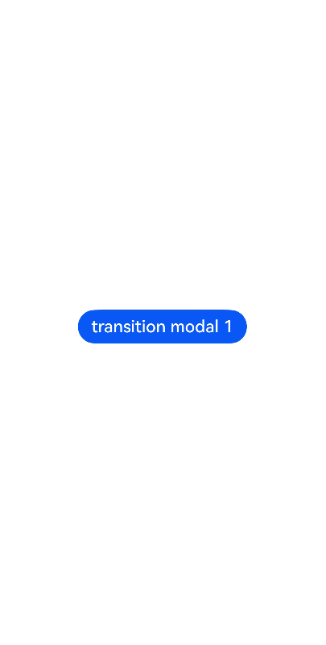

# Modal Page Overview  

A modal page is an interactive popup with a large panel and expansive view. Like other popup components, modal pages are typically used to temporarily display information requiring user attention or pending operations while maintaining the current context. Compared to other popup components, the content of a modal page must be implemented by developers through custom components, often presenting a significantly larger view. By default, user interaction is required to exit the modal page. ArkUI currently provides two types of modal page components: **half-modal** and **full-modal**.  

- **Half-modal:** Developers can use this modal page to achieve diverse visual effects. It supports displaying different styles of half-modal pages on devices of varying widths. Users can close the half-modal page by swiping sideways, clicking the mask layer, clicking the close button, or pulling down.  

  

- **Full-modal:** Developers can use this modal page to achieve a full-screen modal popup effect. By default, it requires a sideways swipe to close.  

  

## Usage Scenarios  

| Interface | Usage Scenario |  
|:---|:---|  
| [bindContentCover](./cj-contentcover-page.md) | Used for custom full-screen modal display interfaces. Combined with transition animations and shared element animations, it can achieve complex transition effects, such as clicking a thumbnail to view a larger image. |  
| [bindSheet](./cj-sheet-page.md) | Used for half-modal display interfaces, such as share dialogs. |