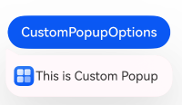

# Popup  

The Popup attribute can be bound to a component to display a popup bubble prompt, configuring the popup content, interaction logic, and display state. It is primarily used for scenarios such as screen recording and informational popup reminders.  

There are two types of popups: one is the system-provided popup [PopupOptions](../../../reference/source_en/arkui-cj/cj-universal-attribute-popup.md#struct-popupoptions), and the other is a customizable popup [CustomPopupOptions](../../../reference/source_en/arkui-cj/cj-universal-attribute-popup.md#struct-custompopupoptions). Among them, `PopupOptions` configures buttons via `primaryButton` and `secondaryButton` to create a popup with buttons, while `CustomPopupOptions` uses the `builder` to define a custom popup.  

The popup can be configured as a modal or non-modal window using the [mask](../../../reference/source_en/arkui-cj/cj-universal-attribute-popup.md#var-mask-1) property. When `mask` is set to `true` or a color value, the popup behaves as a modal window; when `mask` is `false`, it acts as a non-modal window.  

## Text Popup  

Text popups are commonly used to display informational prompts with text only, without any interactive elements. The Popup attribute must be bound to a component. When the `show` parameter in `bindPopup` is set to `true`, the popup appears.  

In the following example, the Popup attribute is bound to a Button component. Each click on the Button toggles the `handlePopup` boolean value. When the value is `true`, the `bindPopup` triggers the popup.  

<!-- run -->  

```cangjie  
package ohos_app_cangjie_entry  

import kit.ArkUI.*  
import ohos.arkui.state_macro_manage.*  

@Entry  
@Component  
class EntryView {  
    @State var handlePopup: Bool = false  
    func build() {  
        Column {  
            Button('CustomPopupOptions')  
                .onClick {  
                    e => this.handlePopup = !this.handlePopup  
                }  
                .bindPopup(  
                    this.handlePopup,  
                    CustomPopupOptions(builder: {=>}, showInSubWindow: false)  
                )  
        }.width(100.percent).padding(top: 5)  
    }  
}  
```  

  

## Adding State Change Events to Popup  

The `onStateChange` parameter adds a callback event for popup state changes, allowing detection of the current popup display state.  

<!-- run -->  

```cangjie  
package ohos_app_cangjie_entry  

import kit.ArkUI.*  
import ohos.arkui.state_macro_manage.*  

@Entry  
@Component  
class EntryView {  
    @State var handlePopup: Bool = false  
    func build() {  
        Column() {  
            Button('CustomPopupOptions')  
                .onClick({  
                    e => this.handlePopup = !this.handlePopup  
                })  
                .bindPopup(  
                    this.handlePopup,  
                    CustomPopupOptions(  
                        builder: {=>},  
                        showInSubWindow: false,  
                        onStateChange: {  
                            e =>  
                            if (!e.isVisible) {  
                                this.handlePopup = false  
                            }  
                        }  
                    )  
                )  
        }.width(100.percent).padding(top: 5)  
    }  
}  
```  

  

## Popup with Buttons  

The `primaryButton` and `secondaryButton` properties allow configuring up to two buttons in the popup for simple interactions. Developers can define actions via the `action` parameter.  

<!-- run -->  

```cangjie  
package ohos_app_cangjie_entry  

import kit.ArkUI.*  
import ohos.arkui.state_macro_manage.*  

@Entry  
@Component  
class EntryView {  
    @State var handlePopup: Bool = false  
    func build() {  
        Column() {  
            Button('CustomPopupOptions')  
                .margin(top: 200)  
                .onClick {  
                    e => this.handlePopup = !this.handlePopup  
                }  
                .bindPopup(  
                    this.handlePopup,  
                    CustomPopupOptions(  
                        builder: {=>},  
                        showInSubWindow: false,  
                        onStateChange: {  
                            e =>  
                            if (!e.isVisible) {  
                                this.handlePopup = false  
                            }  
                        }  
                    )  
                )  
        }.width(100.percent).padding(top: 5)  
    }  
}  
```  

  

## Popup Animation  

The popup's entrance and exit animations can be controlled using the `transition` property.  

<!-- run -->  

```cangjie  
package ohos_app_cangjie_entry  

import kit.ArkUI.*  
import ohos.arkui.state_macro_manage.*  

@Entry  
@Component  
class EntryView {  
    @State var handlePopup: Bool = false  
    @State var customPopup: Bool = false  
    @State var custom: String = "Custom Wait"  
    // Popup builder defines the popup content  
    @Builder  
    func popupBuilder() {  
        Row() {  
            Text('Custom Popup with transitionEffect').fontSize(10)  
        }  
        .height(50)  
        .padding(5)  
    }  

    func build() {  
        Flex(direction: FlexDirection.Column) {  
            // CustomPopupOptions configures the popup content  
            Button('CustomPopupOptions')  
                .position(x: 80, y: 300)  
                .onClick {  
                    e => this.customPopup = !this.customPopup  
                }  
                .bindPopup(  
                    this.customPopup,  
                    CustomPopupOptions(  
                        builder: bind(popupBuilder, this),  
                        placement: Placement.Top,  
                        showInSubWindow: false,  
                        onStateChange: {  
                            e =>  
                            custom = "stateChange: ${e.isVisible}"  
                            if (!e.isVisible) {  
                                this.customPopup = true  
                            }  
                        },  
                        // Sets the popup's entrance and exit animations as scaling effects  
                        transition: TransitionEffect  
                            .scale(ScaleOptions(x: 1.0, y: 0.0))  
                            .animation(AnimateParam(duration: 500, curve: Curve.Ease))  
                    )  
                )  
        }.width(100.percent).padding(top: 5)  
    }  
}  
```  

  

## Custom Popup  

Developers can use the `builder` in `CustomPopupOptions` to create custom popups. The `@Builder` can include any custom content. Additionally, parameters like `popupColor` can control the popup's appearance.  

<!-- run -->  

```cangjie  
package ohos_app_cangjie_entry  

import kit.ArkUI.*  
import ohos.arkui.state_macro_manage.*  
import kit.LocalizationKit.*  

@Entry  
@Component  
class EntryView {  
    @State var customPopup: Bool = false  
    @State var custom: String = "Custom Wait"  
    // Popup builder defines the popup content  
    @Builder  
    func popupBuilder() {  
        Row(space: 2) {  
            Image(@r(app.media.startIcon))  
                .width(24)  
                .height(24)  
                .margin(left: 5)  
            Text('This is Custom Popup').fontSize(15)  
        }  
        .width(200)  
        .height(50)  
        .padding(5)  
    }  
    func build() {  
        Column() {  
            Button('CustomPopupOptions')  
                .position(x: 100, y: 200)  
                .onClick {  
                    e => this.customPopup = !this.customPopup  
                }  
                .bindPopup(  
                    this.customPopup,  
                    CustomPopupOptions(  
                        builder: bind(popupBuilder, this), // Popup content  
                        placement: Placement.Bottom, // Popup position  
                        popupColor: Color.Red, // Popup background color  
                        showInSubWindow: false,  
                        onStateChange: {  
                            evt =>  
                            custom = "stateChange: ${evt.isVisible}"  
                            if (!evt.isVisible) {  
                                customPopup = true  
                            }  
                        }  
                    )  
                )  
        }.height(100.percent)  
    }  
}  
```  

The `placement` parameter positions the popup relative to the target component. The popup builder triggers the display of informational prompts, guiding users through operations and enhancing the UI experience.  

  

## Popup Styling  

In addition to customizing popups via `builder`, developers can also configure the popup's appearance and display effects through APIs.  

- **Background Color**: The popup's default background is transparent but includes a default blur effect (COMPONENT_ULTRA_THICK on devices).  
- **Mask Style**: The popup has a transparent mask by default.  
- **Display Size**: The popup size is determined by the internal `builder` size or the `message` length.  
- **Display Position**: The popup appears below the host component by default but can be adjusted using the `Placement` API.  

The following example demonstrates popup styling by configuring `popupColor` (background color), `mask` (mask style), `width` (popup width), and `placement` (display position).  

<!-- run -->  

```cangjie  
package ohos_app_cangjie_entry  

import kit.ArkUI.*  
import ohos.arkui.state_macro_manage.*  

@Entry  
@Component  
class EntryView {  
    @State var handlePopup: Bool = false  
    func build() {  
        Column(space: 100) {  
            Button('PopupOptions')  
                .onClick{  
                    e => this.handlePopup = !this.handlePopup  
                }  
                .bindPopup(  
                    this.handlePopup,  
                    CustomPopupOptions(  
                        builder: {=>},  
                        width: 200,  
                        popupColor: Color.Red,  
                        mask: Color(0x33d9d9d9), // Sets the popup background color  
                        placement: Placement.Top,  
                        showInSubWindow: false,  
                        backgroundBlurStyle: BlurStyle.None  
                    )  
                    // Disabling the blur effect requires turning off the popup's blur background  
                )  
        }.width(100.percent)  
    }  
}  
```  

