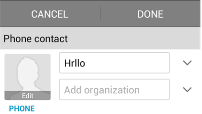

# International UI Design  

A set of effective international UI layout design rules can establish product tonality in global design while ensuring operational consistency. Adhering to the following design rules significantly enhances the globalization quality of applications.  

## Space Reservation and Flexible Layout  

Translated texts vary greatly in length across languages, and translations may increase the length of interface text. To ensure that UI strings are not truncated when translated into other languages, the best practice is to adopt flexible dynamic layouts—where UI controls dynamically adjust and reflow based on text length. If flexible layouts cannot be guaranteed during development, sufficient text space should be reserved. Based on English as the reference, the recommended space reservation ratios for translations relative to the original English strings are as follows:  

| English Character Count | Space Reservation Ratio |  
| ----------------------- | ----------------------- |  
| ≤ 10                    | 100%–200%               |  
| 11–20                   | 80%–100%                |  
| 21–30                   | 60%–80%                 |  
| 31–50                   | 40%–60%                 |  
| 51–70                   | 30%–40%                 |  
| ≥ 71                    | 30%                     |  

## Interface Mirroring  

Different countries have varying text alignment and reading directions. For example, English follows a left-to-right (LTR) order, while Arabic and Hebrew use a right-to-left (RTL) order. To ensure UI content aligns with local users' language habits, UI element layouts must support interface mirroring, as shown in Figures 1 and 2. Key design considerations for UI element mirroring include:  

- **UI Layout Mirroring**: The UI arrangement should allow RTL content to display in its original layout, providing a bidirectional market experience. For example, "ABC" should appear as "ABC" in LTR but as "CBA" in RTL.  

- **UI Element Mirroring**: Directional UI controls and icons must follow mirroring rules, as illustrated in Figures 3, 4, and 5. Icons without directional attributes or those representing real-world objects (e.g., clock faces) do not require mirroring.  

- **Touch and Interaction**: Ensure touch or interaction sequences follow RTL reading order. For instance, swiping left typically navigates backward, but in RTL languages, swiping right should indicate backward navigation.  

- **Mixed Text Support**: Text direction support enables seamless mixed-text presentation (e.g., bidirectional versions containing English text and vice versa).  

**Figure 1** Standard Layout Example (English)  

  

**Figure 2** Mirrored Layout Example (Arabic)  

  

**Figure 3** Standard Icon Resources  

  

**Figure 4** Icon Resources for RTL Language Systems  

  

**Figure 5** Mirrored Controls for RTL Language Systems  

