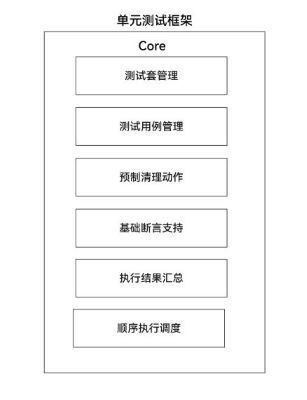
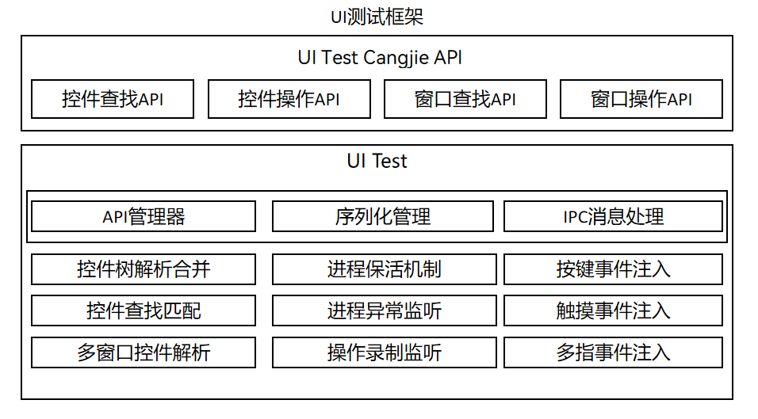

# 自动化测试框架使用指导

## 概述

仓颉自动化测试框架由两个概念组成，分别是仓颉OpenHarmony单元测试框架与UiTest。

仓颉OpenHarmony单元测试框架基于仓颉语言自带的单元测试库std.unittest实现，其提供了基础的单元测试用例编写、单元测试用例执行与测试报告生成能力。在std.unittest的基础上，使用TestRunner对OH平台进行了适配，使得其能在应用中使用。

UiTest提供了UI组件的查找和操作能力，用户通过调用UiTest提供的接口可以编写测试脚本以实现UI自动化测试。UiTest框架同时也以hdc shell命令的形式对外提供了获取截屏、获取控件树、录制用户操作、注入UI模拟操作等辅助测试能力。

本指南介绍了仓颉自动化测试框架的主要功能、实现原理、环境准备，以及测试脚本编写和执行方法。

## 实现原理

测试框架分为单元测试框架和UI测试框架。

单元测试框架是测试框架的基础底座，提供了最基本的用例识别、调度、执行及结果汇总的能力。

UI测试框架主要对外提供了UiTest API供开发人员在对应测试场景调用，而其脚本的运行基础仍是单元测试框架。

### 单元测试框架

- 单元测试框架主要功能

  

- 脚本基础流程

    - 根据-s unittest参数找到对应的TestRunner.registerCreator，实例化TestRunner，并依次执行onPrepare和onRun
    - onRun中进行启动参数的解析，识别出执行哪些测试用例，以及timeout等信息
    - 调用仓颉内核unittest初始化测试套并执行测试套，测试结果以xml形式保存于设备`/data/app/el1/100/base/${bundleName}/tests`
    - 所有指定的测试套执行结束后，读取xml测试报告，打印到终端，以及hilog日志

### UI测试框架

- UI测试框架主要功能



## 基于Cangjie编写和执行测试

### 搭建环境

DevEco Studio可参考其官网介绍进行[下载](https://developer.harmonyos.com/cn/develop/deveco-studio#download)，并进行相关的配置动作。

### 新建和编写测试脚本

#### 新建测试脚本

<!--RP1-->
在DevEco Studio中新建应用开发工程，其中ohosTest目录即为测试脚本所在的目录。
<!--RP1End-->

#### 编写单元测试脚本

本章节主要描述单元测试框架支持能力，以及能力的使用方法。

在单元测试框架，测试脚本需要包含如下基本元素：

1. 依赖导包，以便使用依赖的测试接口。
2. 测试代码编写，主要编写测试代码的相关逻辑，如接口调用等。
3. 断言接口调用，设置测试代码中的检查点，如无检查点，则不可认为一个完整的测试脚本。

    如下示例代码实现的场景是：启动测试页面，检查设备当前显示的页面是否为预期页面。

    <!-- compile -->

    ```cangjie
    //example_test.cj
    import kit.TestKit.*
    import kit.AbilityKit.*
    import std.unittest.*
    import std.unittest.common.*
    import std.unittest.testmacro.*

    @Test
    class TestExample00 {
        @TestCase
        func testUiExample(): Unit {
            let delegator = AbilityDelegatorRegistry.getAbilityDelegator()
            let bundleName = AbilityDelegatorRegistry
                .getArguments()
                .bundleName
            AppLog.info("uitest: TestUiExample begin")
            //start tested ability
            let want = Want(bundleName: bundleName, abilityName: 'EntryAbility')
            delegator
                .startAbility(want)
                .get()
            sleep(Duration.second * 5)
            //check top display ability
            let ability = delegator.getCurrentTopAbility()
            AppLog.info("get top ability")
            @Expect(ability.context.abilityInfo.name, 'EntryAbility')
        }
    }
    ```

#### 编写UI测试脚本

本章节主要介绍UI测试框架支持能力，以及对应能力API的使用方法。

UI测试基于单元测试，UI测试脚本在单元测试脚本上增加了对UiTest接口，具体请参考[API文档](../../../reference/source_zh_cn/TestKit/cj-apis-ui_test.md)。

如下的示例代码是在上面的单元测试脚本基础上增量编写，实现的场景是：在启动的应用页面上进行点击操作，然后检测当前页面变化是否为预期变化。

1. 编写index.cj页面代码，作为被测示例demo。

    <!-- compile -->

    ```cangjie
    import ohos.base.*
    import ohos.arkui.component.*
    import ohos.arkui.state_management.*
    import ohos.arkui.state_macro_manage.*

    @Entry
    @Component
    class EntryView {
        @State
        var message: String = "Hello World"

        func build() {
            Row {
                Column {
                    Text(this.message)
                        .fontSize(50)
                        .fontWeight(FontWeight.Bold)
                    Text("Next")
                        .fontSize(50)
                        .margin(top: 20)
                        .fontWeight(FontWeight.Bold)
                    Text("after click")
                        .fontSize(50)
                        .margin(top: 20)
                        .fontWeight(FontWeight.Bold)
                }.width(100.percent)
            }.height(100.percent)
        }
    }
    ```

2. 在ohosTest > cangjie 文件夹下example_test.cj文件中编写具体测试代码。

    <!-- compile -->

    ```cangjie
    import kit.TestKit.*
    import kit.AbilityKit.*
    import std.unittest.*
    import std.unittest.common.*
    import std.unittest.testmacro.*

    @Test
    class TestExample00 {
        @TestCase
        func testUiExample(): Unit {
            let delegator = AbilityDelegatorRegistry.getAbilityDelegator()
            let bundleName = AbilityDelegatorRegistry
                .getArguments()
                .bundleName
            AppLog.info("uitest: TestUiExample begin")
            //start tested ability
            let want = Want(bundleName: bundleName, abilityName: 'EntryAbility')
            delegator
                .startAbility(want)
                .get()
            sleep(Duration.second * 5)
            //check top display ability
            let ability = delegator.getCurrentTopAbility()
            AppLog.info("get top ability")
            @Expect(ability.context.abilityInfo.name, 'EntryAbility')
            // ui test code
            // init driver
            let driver = Driver.create()
            driver.delayMs(1000)
            let button = driver.findComponent(On().text('Next'))
            //click button
            button.click()
            driver.delayMs(1000)
            //check text
            driver.assertComponentExist(On().text('after click'))
            driver.pressBack()
        }
    }
    ```

### 执行测试脚本

#### 在DevEco Studio执行

脚本执行需要连接硬件设备。通过点击按钮执行测试套级别执行，即执行testClass方法中定义的全部测试用例。


**查看测试结果**

测试执行完毕后可直接在DevEco Studio中查看测试结果，如下图示例所示。


#### 在CMD执行

脚本执行需要连接硬件设备，将应用测试包安装到测试设备上，在cmd窗口中执行aa命令，完成对用例测试。

> **说明：**
>
> 使用cmd的方式，需要配置好hdc相关的环境变量。

**aa test命令执行配置参数**

| 执行参数全写  | 执行参数缩写 | 执行参数含义     | 执行参数示例  |
| ------------- | ------ | ------- | ------------ |
| --bundleName  | -b   | 应用Bundle名称。  | - b com.test.example    |
| --packageName | -p  | 应用模块名，适用于FA模型应用。 | - p com.test.example.entry         |
| --moduleName  | -m   | 应用模块名，适用于STAGE模型应用。        | -m entry     |
| NA    | -s  | 特定参数，以\<key, value>键值对方式传入。 | - s unittest OpenHarmonyTestRunner |

框架当前支持多种用例执行方式，通过上表中的-s参数后的配置键值对参数传入触发，如下表所示。

| 配置参数名     | 配置参数含义   | 配置参数取值                                               | 配置参数示例    |
| ------------ | ------------------- | ------------- | -------- |
| unittest| 用例执行所使用OpenHarmonyTestRunner对象。| OpenHarmonyTestRunner或用户自定义runner名称 | - s unittest OpenHarmonyTestRunner   |
| class |指定要执行的测试套或测试用例。| {testClassName}#{testCaseName},{testClassName}  | -s class attributeTest#testAttributeIt|

目前仅支持以TestClass为粒度执行测试套，不支持指定用例TestCase粒度执行。

**在cmd窗口执行test命令**

> **说明：**
>
> 参数配置和命令均是基于Stage模型。

示例代码1：执行所有测试用例。

```shell
hdc shell aa test -b xxx -m xxx -s unittest OpenHarmonyTestRunner
```

示例代码2：执行指定的TestClass测试套用例，指定多个需用逗号隔开。

```shell
  hdc shell aa test -b xxx -m xxx -s unittest OpenHarmonyTestRunner -s class s1,s2
```

**查看测试结果**

- cmd执行完成后,会打印如下相关日志信息。

```xml
<?xml version="1.0" encoding="UTF-8"?>
<testsuite name="default.TestExample00" tests="1" failures="0" errors="0" skipped="0" time="7.990736" timestamp="2025-05-22T10:42:47.544499427+08:00">
        <testcase name="testUiExample" classname="default.TestExample00" assertions="1" time="7.989778"/>
</testsuite>
```

| 日志输出字段    | 日志输出字段含义    |
| -----------| --------------|
| testsuite.name | 当前执行用例测试套名称。|
| testsuite.tests    | 当前测试套用例总数。 |
| testsuite.failures | 测试套失败用例个数 |
| testsuite.errors | 测试套发生错误用例个数 |
| testsuite.skipped | 测试套跳过未执行用例个数 |
| testsuite.time | 测试套执行时长(秒) |
| testsuite.timestamp | 测试套执行开始时间戳 |
| testcase.name | 用例名称 |
| testcase.classname | 用例所属测试套名称 |
| testcase.assertions | 用例中实际断言个数 |
| testcase.time | 用例执行时长(秒) |

> **说明：**
>
> 当处于breakOnError模式，用例发生错误时，注意查看Ignore以及中断说明。

## 基于shell命令测试

在开发过程中，若需要快速进行截屏、录屏、注入UI模拟操作、获取控件树等操作，可以使用shell命令，更方便完成相应测试。

> **说明：**
>
> 使用cmd的方式，需要配置好hdc相关的环境变量。

**命令列表**

| 命令  | 配置参数   |描述      |
|-------|-------------|-------|
| help   | help|  显示uitest工具能够支持的命令信息。  |
| screenCap       |[-p] | 截屏。非必填。<br>指定存储路径和文件名，只支持存放在/data/local/tmp/下。<br>默认存储路径：/data/local/tmp，文件名：时间戳 + .png。 |
| dumpLayout      |[-p] \<-i \| -a>|支持在daemon运行时执行获取控件树。<br> **-p** ：指定存储路径和文件名，只支持存放在/data/local/tmp/下。默认存储路径：/data/local/tmp，文件名：时间戳 + .json。<br> **-i** ：不过滤不可见控件，也不做窗口合并。<br> **-a** ：保存 BackgroundColor、 Content、FontColor、FontSize、extraAttrs 属性数据。<br> **默认** ：不保存上述属性数据。<br> **-a和-i** 不可同时使用。 |
| uiRecord        | uiRecord \<record \| read>|录制Ui操作。  <br> **record** ：开始录制，将当前界面操作记录到/data/local/tmp/record.csv，结束录制操作使用Ctrl+C结束录制。  <br> **read** ：读取并且打印录制数据。<br>各参数代表的含义请参考[用户录制操作](#用户录制操作)。|
| uiInput| \<help \| click \| doubleClick \| longClick \| fling \| swipe \| drag \| dircFling \| inputText \| keyEvent>| 注入UI模拟操作。<br>各参数代表的含义请参考[注入ui模拟操作](#注入ui模拟操作)。   |
| --version | --version|获取当前工具版本信息。   |
| start-daemon|start-daemon| 拉起uitest测试进程。 |

### 截图使用示例

```bash
# 存储路径：/data/local/tmp，文件名：时间戳 + .png。
hdc shell uitest screenCap
# 指定存储路径和文件名，存放在/data/local/tmp/下。
hdc shell uitest screenCap -p /data/local/tmp/1.png
```

### 获取控件树使用示例

```bash
hdc shell uitest dumpLayout -p /data/local/tmp/1.json
```

### 用户录制操作

> **说明：**
>
> 录制过程中，需等待当前操作的识别结果在命令行输出后，再进行下一步操作。

```bash
# 将当前界面操作记录到/data/local/tmp/record.csv，结束录制操作使用Ctrl+C结束录制。
hdc shell uitest uiRecord record
# 读取并打印录制数据。
hdc shell uitest uiRecord read
```

以下举例为：record数据中包含的字段及字段含义，仅供参考。

```text
{
  "ABILITY": "com.ohos.launcher.MainAbility", // 前台应用界面
  "BUNDLE": "com.ohos.launcher", // 操作应用
  "CENTER_X": "", // 预留字段,暂未使用
  "CENTER_Y": "", // 预留字段,暂未使用
  "EVENT_TYPE": "pointer", //
  "LENGTH": "0", // 总体步长
  "OP_TYPE": "click", //事件类型，当前支持点击、双击、长按、拖拽、滑动、抛滑动作录制
  "VELO": "0.000000", // 离手速度
  "direction.X": "0.000000",// 总体移动X方向
  "direction.Y": "0.000000", // 总体移动Y方向
  "duration": 33885000.0, // 手势操作持续时间
  "fingerList": [{
    "LENGTH": "0", // 总体步长
    "MAX_VEL": "40000", // 最大速度
    "VELO": "0.000000", // 离手速度
    "W1_BOUNDS": "{"bottom":361,"left":37,"right":118,"top":280}", // 起点控件bounds
    "W1_HIER": "ROOT,3,0,0,0,0,0,0,0,0,5,0,0,0,0,0,0,0", // 起点控件hierarchy
    "W1_ID": "", // 起点控件id
    "W1_Text": "", // 起点控件text
    "W1_Type": "Image", // 起点控件类型
    "W2_BOUNDS": "{"bottom":361,"left":37,"right":118,"top":280}", // 终点控件bounds
    "W2_HIER": "ROOT,3,0,0,0,0,0,0,0,0,5,0,0,0,0,0,0,0", // 终点控件hierarchy
    "W2_ID": "", // 终点控件id
    "W2_Text": "", // 终点控件text
    "W2_Type": "Image", // 终点控件类型
    "X2_POSI": "47", // 终点X
    "X_POSI": "47", // 起点X
    "Y2_POSI": "301", // 终点Y
    "Y_POSI": "301", // 起点Y
    "direction.X": "0.000000", // x方向移动量
    "direction.Y": "0.000000" // Y方向移动量
  }],
  "fingerNumber": "1" //手指数量
}
```

### 注入UI模拟操作

| 命令   | 必填 | 描述    |
|------|------|-----------------|
| help   | 是    | uiInput命令相关帮助信息。 |
| click   | 是    | 模拟单击操作。      |
| doubleClick   | 是    | 模拟双击操作。      |
| longClick   | 是    | 模拟长按操作。     |
| fling   | 是    | 模拟快滑操作。   |
| swipe   | 是    | 模拟慢滑操作。     |
| drag   | 是    | 模拟拖拽操作。     |
| dircFling   | 是    | 模拟指定方向滑动操作。     |
| inputText   | 是    | 模拟输入框输入文本操作。     |
| keyEvent   | 是    | 模拟实体按键事件（如：键盘，电源键，返回上一级，返回桌面等），以及组合按键操作。     |

#### uiInput click/doubleClick/longClick使用示例

| 配置参数    | 必填 | 描述   |
|---------|------|-----------------|
| point_x | 是      | 点击x坐标点。 |
| point_y | 是       | 点击y坐标点。 |

```shell
# 执行单击事件。
hdc shell uitest uiInput click 100 100

# 执行双击事件。
hdc shell uitest uiInput doubleClick 100 100

# 执行长按事件。
hdc shell uitest uiInput longClick 100 100
```

#### uiInput fling使用示例

| 配置参数  | 必填   | 描述      |
|------|------------------|-----------------|
| from_x   | 是  | 滑动起点x坐标。 |
| from_y   | 是    | 滑动起点y坐标。 |
| to_x   | 是   | 滑动终点x坐标。 |
| to_y   | 是   | 滑动终点y坐标。 |
| swipeVelocityPps_   | 否      | 滑动速度，单位：px/s，取值范围：200-40000。<br> 默认值：600。 |
| stepLength_   | 否 | 滑动步长。默认值：滑动距离/50。<br>  **为实现更好的模拟效果，推荐参数缺省/使用默认值。**  |

```shell
# 执行快滑操作，stepLength_缺省。
hdc shell uitest uiInput fling 10 10 200 200 500
```

#### uiInput swipe/drag使用示例

| 配置参数  | 必填             | 描述               |
|------|------------------|-----------------|
| from_x   | 是     | 滑动起点x坐标。 |
| from_y   | 是    | 滑动起点y坐标。 |
| to_x   | 是    | 滑动终点x坐标。 |
| to_y   | 是    | 滑动终点y坐标。 |
| swipeVelocityPps_   | 否      | 滑动速度，单位：px/s，取值范围：200-40000。<br> 默认值: 600。 |

```shell
# 执行慢滑操作。
hdc shell uitest uiInput swipe 10 10 200 200 500

# 执行拖拽操作。
hdc shell uitest uiInput drag 10 10 100 100 500
```

#### uiInput dircFling使用示例

| 配置参数  | 必填  | 描述 |
|------------|-------------|----------|
| direction  | 否 | 滑动方向，取值范围：[0,1,2,3]，默认值为0。<br> 0代表向左滑动，1代表向右滑动，2代表向上滑动，3代表向下滑动。    |
| swipeVelocityPps_ | 否| 滑动速度，单位：px/s，取值范围：200-40000。<br> 默认值: 600。    |
| stepLength   | 否   | 滑动步长。<br> 默认值: 滑动距离/50。为更好的模拟效果，推荐参数缺省/使用默认值。 |

```shell
# 执行左滑操作。
hdc shell uitest uiInput dircFling 0 500
# 执行向右滑动操作。
hdc shell uitest uiInput dircFling 1 600
# 执行向上滑动操作。
hdc shell uitest uiInput dircFling 2
# 执行向下滑动操作。
hdc shell uitest uiInput dircFling 3
```

#### uiInput inputText使用示例

| 配置参数  | 必填   | 描述 |
|------|---------|----------|
| point_x   | 是 | 输入框x坐标点。 |
| point_y   | 是   | 输入框y坐标点。 |
| text   | 是   | 输入文本内容。  |

```shell
# 执行输入框输入操作。
hdc shell uitest uiInput inputText 100 100 hello
```

#### uiInput keyEvent使用示例

| 配置参数   | 必填  | 描述 |
|------|------|----------|
| keyID1   | 是    | 实体按键对应ID，取值范围：KeyCode/Back/Home/Power。<br>当取Back/Home/Power时，不支持输入组合键。 |
| keyID2    | 否    | 实体按键对应ID。 |
| keyID3    | 否    | 实体按键对应ID。 |

> **说明：**
>
> 最多支持传入是三个键值，键值的具体取值请参考[KeyCode](../../../reference/source_zh_cn/arkui-cj/cj-universal-event-key.md#var-keycode)。

```shell
# 返回主页。
hdc shell uitest uiInput keyEvent Home
# 返回。
hdc shell uitest uiInput keyEvent Back
# 组合键粘贴。
hdc shell uitest uiInput keyEvent 2072 2038
```

### 获取版本信息

```bash
hdc shell uitest --version
```

### 拉起uitest测试进程

```shell
hdc shell uitest start-daemon
```

> **说明**
>
> 设备需调成开发者模式。
>
> 仅由aa test命令拉起的进程才具备调用UITest接口的能力；例如由aa start所拉起的Ability在调用UITest接口时将报错。
>
> 测试hap的[APL等级级别](../security/AccessToken/cj-app-permission-mgmt-overview.md#权限机制中的基本概念)需为system_basic、normal。

## 常见问题

### UI测试用例常见问题

**1. 失败日志有“Get windows failed/GetRootByWindow failed”错误信息**

**问题描述**

UI测试用例执行失败，查看hilog日志发现日志中有“Get windows failed/GetRootByWindow failed”错误信息。

**可能原因**

系统ArkUI开关未开启，导致被测试界面控件树信息未生成。

**解决方法**

执行如下命令，并重启设备再次执行用例。

```shell
hdc shell param set persist.ace.testmode.enabled 1
```

**2. 失败日志有“uitest-api dose not allow calling concurrently”错误信息**

**问题描述**

UI测试用例执行失败，查看hilog日志发现日志中有“uitest-api dose not allow calling concurrently”错误信息。

**可能原因**

1. 用例中多线程并发调用UITest相关接口，UITest接口不支持并发调用。
2. 测试环境中存在多进程并发执行UITest用例，导致拉起多个UITest进程，框架不支持多进程调用。

**解决方法**

1. 检查用例实现，避免多线程并发调用UITest相关接口。
2. 检查测试环境，避免多进程同时执行UITest相关用例。

**3. 失败日志有“does not exist on current UI! Check if the UI has changed after you got the widget object”错误信息**

**问题描述**

UI测试用例执行失败，查看hilog日志发现日志中有“does not exist on current UI! Check if the UI has changed after you got the widget object”错误信息。

**可能原因**

在用例中代码查找到目标控件后，设备界面发生了变化，导致查找到的控件丢失，无法进行下一步的模拟操作。

**解决方法**

重新执行UI测试用例。
