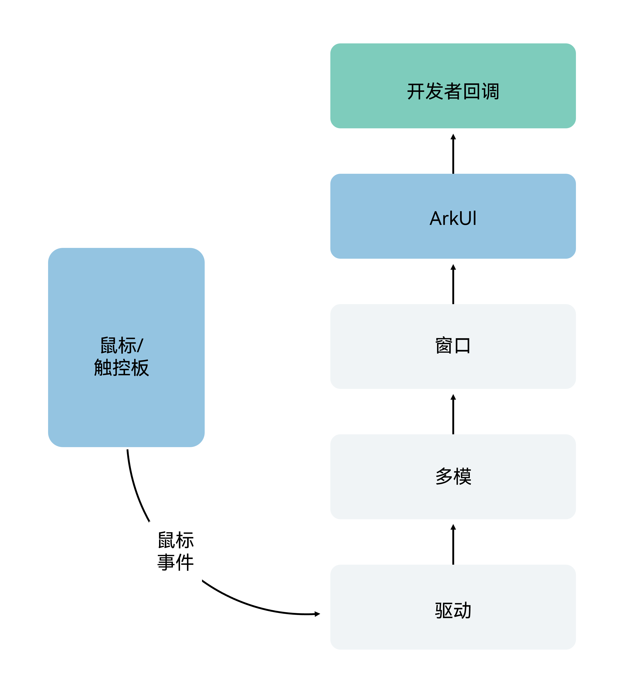
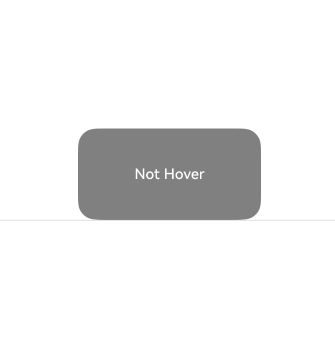
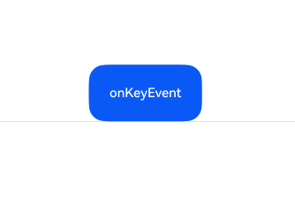

# 键鼠事件

键鼠事件指键盘，鼠标外接设备的输入事件。

## 鼠标事件

支持的鼠标事件包含通过外设鼠标、触控板触发的事件。

鼠标可触发以下事件：

| 名称                                       | 描述                                       |
|:---------------------------------------- |:---------------------------------------- |
|  onHover(callback: (isHover: Bool)->Unit) | 鼠标进入或退出组件时，触发该事件。<br>isHover：表示鼠标是否悬浮在组件上，鼠标进入时为true，退出时为false。|
|  onMouse(callback: (event: MouseEvent)->Unit) | 当前组件被鼠标按键点击时或者鼠标在组件上悬浮移动时，触发该事件。<br>event返回值包含触发事件时的时间戳、鼠标按键、动作、鼠标位置在整个屏幕上的坐标和相对于当前组件的坐标。|

鼠标事件的原理如下图所示：



鼠标事件传递到ArkUI之后，会先判断鼠标事件是否是左键的按下/抬起/移动，然后做出不同响应：

- 是：鼠标事件先转换成相同位置的触摸事件，执行触摸事件的碰撞测试、手势判断和回调响应。接着去执行鼠标事件的碰撞测试和回调响应。

- 否：事件仅用于执行鼠标事件的碰撞测试和回调响应。

> **说明：**
>
> 所有单指可响应的触摸事件/手势事件，均可通过鼠标左键来操作和响应。例如当我们需要开发单击Button跳转页面的功能、且需要支持手指点击和鼠标左键点击，那么只绑定一个点击事件（onClick）就可以实现该效果。若需要针对手指和鼠标左键的点击实现不一样的效果，可以在onClick回调中，使用回调参数中的source字段即可判断出当前触发事件的来源是手指还是鼠标。

### onHover

```cangjie
public func onHover(callback: (Bool)->Unit): This
```

鼠标悬浮事件。参数类型为Bool，表示鼠标进入组件或离开组件。该事件不支持自定义冒泡设置，默认父子冒泡。

若组件绑定了该接口，当鼠标指针从组件外部进入到该组件的瞬间会触发事件，参数值为true；鼠标指针离开组件的瞬间也会触发该事件，参数值为false。

> **说明：**
>
> 事件冒泡：在一个树形结构中，当子节点处理完一个事件后，再将该事件交给它的父节点处理。

 <!-- run -->

```cangjie
package ohos_app_cangjie_entry

import kit.ArkUI.*
import ohos.arkui.state_macro_manage.*

@Entry
@Component
class EntryView {
    @State
    var hoverText: String = 'Not Hover'
    @State
    var color: Color = Color.Gray

    func build() {
        Column() {
            Button(this.hoverText)
                .width(200)
                .height(100)
                .backgroundColor(this.color)
                .onHover(
                    {
                        isHover => // 使用onHover接口监听鼠标是否悬浮在Button组件上
                        if (isHover) {
                            this.hoverText = 'Hovered!'
                            this.color = Color.Green
                        } else {
                            this.hoverText = ' Hover'
                            this.color = Color.Gray
                        }
                    })
        }
            .width(100.percent)
            .height(100.percent)
            .justifyContent(FlexAlign.Center)
    }
}

```

该示例创建了一个Button组件，初始背景色为灰色，内容为“Not Hover”，示例中的Button组件绑定了onHover回调。

当鼠标从Button外移动到Button内的瞬间，回调响应，参数值为true，将组件的背景色改成Color.Green，内容变为“Hovered!”。

当鼠标从Button内移动到Button外的瞬间，回调响应，参数值为false，又将组件变成了初始的样式。


### onMouse

```cangjie
public func onMouse(callback: (MouseEvent)->Unit): This
```

鼠标事件回调。绑定该API的组件每当鼠标指针在该组件内产生行为（MouseAction）时，触发事件回调，参数为[MouseEvent](../../../reference/source_zh_cn/arkui-cj/cj-universal-event-mouse.md#class-mouseevent)对象，表示触发此次的鼠标事件。该事件支持自定义冒泡设置，默认父子冒泡。常用于开发者自定义的鼠标行为逻辑处理。

开发者可以通过回调中的MouseEvent对象获取触发事件的坐标（screenX/screenY/x/y）、按键（[MouseButton](../../../reference/source_zh_cn/arkui-cj/cj-common-types.md#enum-mousebutton)）、行为（[MouseAction](../../../reference/source_zh_cn/arkui-cj/cj-common-types.md#enum-mouseaction)）、时间戳（timestamp）、交互组件的区域（[EventTarget](../../../reference/source_zh_cn/arkui-cj/cj-universal-event-click.md#class-eventtarget)）、事件来源（[SourceType](../../../reference/source_zh_cn/arkui-cj/cj-common-types.md#enum-sourcetype)）等。

> **说明：**
>
> 按键（MouseButton）的值：Left/Right/Middle/Back/Forward 均对应鼠标上的实体按键，当这些按键被按下或松开时触发这些按键的事件。None表示无按键，会出现在鼠标没有按键按下或松开的状态下，移动鼠标所触发的事件中。

 <!-- run -->

```cangjie
package ohos_app_cangjie_entry
import kit.ArkUI.*
import ohos.arkui.state_macro_manage.*

@Entry
@Component
class EntryView {
    @State var buttonText: String = ''
    @State var columnText: String = ''
    @State var hoverText: String = 'Not Hover'
    @State var color: Color = Color.Gray

    func build() {
        Column(space: 20) {
            Button(this.hoverText)
                .width(200)
                .height(100)
                .backgroundColor(this.color)
                .onHover({isHover =>
                    if (isHover) {
                        this.hoverText = 'Hovered!'
                        this.color = Color.Green
                    } else {
                        this.hoverText = 'Not Hover'
                        this.color = Color.Gray
                    }
                })
                .onMouse({event =>
                this.buttonText = "Button onMouse:\n" +
                    "x,y = (${event.x},${event.y})\n" +
                    "windowXY=(${event.screenX},${event.screenY})"
                })
            Divider()
            Text(this.buttonText).fontColor(Color.Green)
            Divider()
            Text(this.columnText).fontColor(Color.Red)
        }
        .width(100.percent)
        .height(100.percent)
        .justifyContent(FlexAlign.Center)
        .borderWidth(2.px)
        .borderColor(Color.Red)
        .onMouse({event =>
                this.columnText = "Column onMouse:\n" +
                    "x,y = (${event.x},${event.y})\n" +
                    "windowXY=(${event.screenX},${event.screenY})"
        })
    }
}
```



## 按键事件

### onKeyEvent

```cangjie
public func onKeyEvent(callback: (KeyEvent)->Unit): This
```

当绑定方法的组件处于获焦状态下，外设键盘的按键事件会触发该方法，回调参数为[KeyEvent](../../../reference/source_zh_cn/arkui-cj/cj-universal-event-key.md#class-keyevent)，可由该参数获得当前按键事件的按键行为（[KeyType](../../../reference/source_zh_cn/arkui-cj/cj-common-types.md#enum-keytype)）、按键英文名称（keyText）、事件来源设备类型（[KeySource](../../../reference/source_zh_cn/arkui-cj/cj-common-types.md#enum-keysource)）、事件来源设备id（deviceId）、元键按压状态（metaKey）、时间戳（timestamp）。

 <!-- run -->

```cangjie
package ohos_app_cangjie_entry
import kit.ArkUI.*
import ohos.arkui.state_macro_manage.*

@Entry
@Component
class EntryView {
    @State var buttonText: String = ''
    @State var buttonType: String = ''
    @State var columnText: String = ''
    @State var columnType: String = ''

    func build() {
        Column() {
            Button('onKeyEvent')
                .defaultFocus(true)
                .width(140)
                .height(70)
                .onKeyEvent({ event =>
                    if (event.keyType == KeyType.Down) {
                        this.buttonType = 'Down'
                    }
                    if (event.keyType == KeyType.Up) {
                        this.buttonType = 'Up'
                    }
                    this.buttonText = """
                        Button:
                        KeyType: ${this.buttonType}
                        KeyCode: ${event.keyCode.toString()}
                        KeyText: ${event.keyText.toString()}
                    """
                })

            Divider()
            Text(this.buttonText).fontColor(Color.Green)

            Divider()
            Text(this.columnText).fontColor(Color.Red)
        }
        .width(100.percent)
        .height(100.percent)
        .justifyContent(FlexAlign.Center)
        .onKeyEvent({ event =>
            if (event.keyType == KeyType.Down) {
                this.columnType = 'Down'
            }
            if (event.keyType == KeyType.Up) {
                this.columnType = 'Up'
            }
            this.columnText = """
                Column:
                KeyType: ${this.columnType}
                KeyCode: ${event.keyCode.toString()}
                KeyText: ${event.keyText.toString()}
            """
        })
    }
}
```

上述示例中给组件Button和其父容器Column绑定onKeyEvent。应用打开页面加载后，组件树上第一个可获焦的非容器组件自动获焦，设置Button为当前页面的默认焦点，由于Button是Column的子节点，Button获焦也同时意味着Column获焦。获焦机制请参见[焦点事件](./cj-common-events-focus-event.md)。


打开应用后，依次在键盘上按这些按键：空格、回车、左Ctrl、左Shift、字母A、字母Z。

> **说明：**
>
> - 由于onKeyEvent事件默认是冒泡的，所以Button和Column的onKeyEvent都可以响应。
> - 每个按键都有2次回调，分别对应KeyType.Down和KeyType.Up，表示按键被按下，然后抬起。

如果要阻止冒泡，即仅Button响应键盘事件，Column不响应，在Button的onKeyEvent回调中加入event.stopPropagation()方法即可，如下：

 <!-- run -->

```cangjie
package ohos_app_cangjie_entry
import kit.ArkUI.*
import ohos.arkui.state_macro_manage.*

@Entry
@Component
class EntryView {
    @State var buttonText: String = ''
    @State var buttonType: String = ''
    @State var columnText: String = ''
    @State var columnType: String = ''

    func build() {
        Column() {
            Button('onKeyEvent')
                .defaultFocus(true)
                .width(140)
                .height(70)
                .onKeyEvent({ event =>
                    // 通过stopPropagation阻止事件冒泡
                    event.stopPropagation()
                    if (event.keyType == KeyType.Down) {
                        this.buttonType = 'Down'
                    }
                    if (event.keyType == KeyType.Up) {
                        this.buttonType = 'Up'
                    }
                    this.buttonText = """
                        Button:
                        KeyType: ${this.buttonType}
                        KeyCode: ${event.keyCode.toString()}
                        KeyText: ${event.keyText.toString()}
                    """
                })

            Divider()
            Text(this.buttonText).fontColor(Color.Green)

            Divider()
            Text(this.columnText).fontColor(Color.Red)
        }
        .width(100.percent)
        .height(100.percent)
        .justifyContent(FlexAlign.Center)
        .onKeyEvent({ event =>
            if (event.keyType == KeyType.Down) {
                this.columnType = 'Down'
            }
            if (event.keyType == KeyType.Up) {
                this.columnType = 'Up'
            }
            this.columnText = """
                Column:
                KeyType: ${this.columnType}
                KeyCode: ${event.keyCode.toString()}
                KeyText: ${event.keyText.toString()}
            """
        })
    }
}
```


