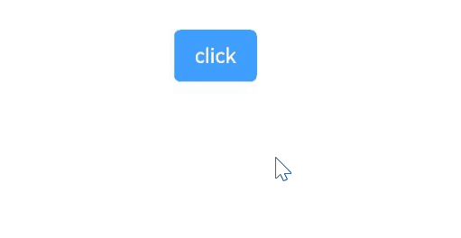
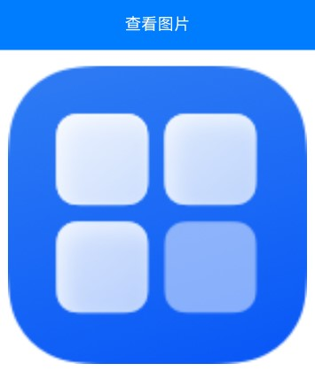
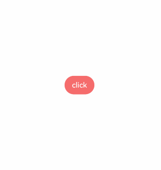
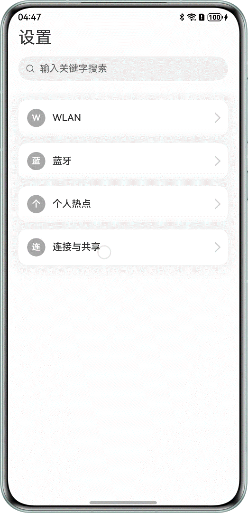

# 模态转场

模态转场是新的界面覆盖在旧的界面上，旧的界面不消失的一种转场方式。

**表1** 模态转场接口

| 接口                                       | 说明                | 使用场景                                     |
|:---------------------------------------- |:----------------- |:---------------------------------------- |
| [bindContentCover](../../../reference/source_zh_cn/arkui-cj/cj-universal-attribute-bindcontentcover.md) | 弹出全屏的模态组件。        | 用于自定义全屏的模态展示界面，结合转场动画和共享元素动画可实现复杂转场动画效果，如缩略图片点击后查看大图。 |
| [bindSheet](../../../reference/source_zh_cn/arkui-cj/cj-universal-attribute-sheettransition.md#func-bindsheetbool----unit-sheetoptions) | 弹出半模态组件。          | 用于半模态展示界面，如分享框。                          |
| [bindMenu](../../../reference/source_zh_cn/arkui-cj/cj-universal-attribute-menu.md#func-bindmenu---unit) | 弹出菜单，点击组件后弹出。     | 需要Menu菜单的场景，如一般应用的“+”号键。                 |
| [bindContextMenu](../../../reference/source_zh_cn/arkui-cj/cj-universal-attribute-menu.md#func-bindcontextmenu---unit-responsetype) | 弹出菜单，长按或者右键点击后弹出。 | 长按浮起效果，一般结合拖拽框架使用，如桌面图标长按浮起。             |
| [bindPopup](../../../reference/source_zh_cn/arkui-cj/cj-universal-attribute-popup.md#func-bindpopupbool-custompopupoptions) | 弹出Popup弹框。        | Popup弹框场景，如点击后对某个组件进行临时说明。               |
| [if](./rendering_control/cj-rendering-control-ifelse.md)                                       | 通过if新增或删除组件。      | 用来在某个状态下临时显示一个界面，这种方式的返回导航需要由开发者监听接口实现。  |

## 使用bindContentCover构建全屏模态转场效果

[bindContentCover](../../../reference/source_zh_cn/arkui-cj/cj-universal-attribute-bindcontentcover.md)接口用于为组件绑定全屏模态页面，在组件出现和消失时可通过设置转场参数ModalTransition添加过渡动效。使用bindContentCover构建全屏模态转场效果步骤示例如下：

- 定义全屏模态转场效果[bindContentCover](../../../reference/source_zh_cn/arkui-cj/cj-universal-attribute-bindcontentcover.md)。

- 定义模态展示界面。

   ```cangjie
   // 通过@Builder构建模态展示界面
   @Builder
   func MyBuilder() {
     Column {
       Text("my model view")
     }
     // 通过转场动画实现出现消失转场动画效果，transition需要加在builder下的第一个组件
     .transition(TransitionEffect.translate(TranslateOptions(y: 1000)).animation(AnimateParam(curve: Curve.Smooth)))
   }
   ```

- 通过模态接口调起模态展示界面，通过转场动画或者共享元素动画实现对应的动画效果。

   ```cangjie
   // 模态转场控制变量
   @State var isPresent: Bool = false

   Button("Click to present model view")
     // 通过选定的模态接口，绑定模态展示界面，ModalTransition是内置的ContentCover转场动画类型，这里选择None代表系统不加默认动画，通过onDisappear控制状态变量变换
     .bindContentCover(this.isPresent, this.MyBuilder, options: ContentCoverOptions(
               modalTransition: ModalTransition.Default,
               onDisappear: {
                => if (this.isPresent) {
                  this.isPresent = !this.isPresent
                 }
               }
     ))
     .onClick({
        evt => this.isPresent = !this.isPresent
      // 改变状态变量，显示模态界面
     })
   ```

完整示例代码和效果如下。

 <!-- run -->

```cangjie
package ohos_app_cangjie_entry

import kit.ArkUI.*
import ohos.arkui.state_macro_manage.*

class PersonList {
    var name: String
    var cardnum: String
    public init(name: String, cardnum: String) {
        this.name = name
        this.cardnum = cardnum
    }
}

@Entry
@Component
class EntryView {
    private var personList: Array<PersonList> = [
        PersonList("王**", "1234***********789"),
        PersonList("宋*", "2345***********789"),
        PersonList("许**", "3456***********789"),
        PersonList("唐*", "4567***********789")
    ]

    @State
    var isPresent: Bool = false

    @Builder
    func MyBuilder() {
        Column {
            Row {
                Text("选择乘车人")
                    .fontSize(20.vp)
                    .fontColor(Color.White)
                    .width(100.percent)
                    .textAlign(TextAlign.Center)
                    .padding(top: 30.vp, bottom: 15.vp)
            }.backgroundColor(0x007dfe)

            Row {
                Text("+ 添加乘车人")
                    .fontSize(16.vp)
                    .fontColor(0x333333)
                    .margin(top: 10.vp)
                    .padding(top: 20.vp, bottom: 20.vp)
                    .width(92.percent)
                    .borderRadius(10.vp)
                    .textAlign(TextAlign.Center)
                    .backgroundColor(Color.White)
            }

            Column {
                ForEach(
                    this.personList,
                    itemGeneratorFunc: {
                        item: PersonList, index: Int64 => Row {
                            Column {
                                if (index % 2 == 0) {
                                    Column {
                                    }
                                    .width(20.vp)
                                    .height(20.vp)
                                    .border(width: 1.vp, color: 0x007dfe)
                                    .backgroundColor(0x007dfe)
                                } else {
                                    Column {
                                    }
                                    .width(20.vp)
                                    .height(20.vp)
                                    .border(width: 1.vp, color: 0x007dfe)
                                }
                            }.width(20.percent)

                            Column {
                                Text(item.name)
                                    .fontColor(0x333333)
                                    .fontSize(18.vp)
                                Text(item.cardnum)
                                    .fontColor(0x666666)
                                    .fontSize(14.vp)
                            }
                                .width(60.percent)
                                .alignItems(HorizontalAlign.Start)

                            Column {
                                Text("编辑")
                                    .fontColor(0x007dfe)
                                    .fontSize(16.vp)
                            }.width(20.percent)
                        }
                        .padding(top: 10.vp, bottom: 10.vp)
                        .border(width: 1.vp, color: 0xf1f1f1)
                        .width(92.percent)
                        .backgroundColor(Color.White)
                    }
                )
            }.padding(top: 20.vp, bottom: 20.vp)

            Text("确认")
                .width(90.percent)
                .height(40.vp)
                .textAlign(TextAlign.Center)
                .borderRadius(10.vp)
                .fontColor(Color.White)
                .backgroundColor(0x007dfe)
                .onClick({
                    evt => this.isPresent = !this.isPresent
                })
        }
        .size(width: 100.percent, height: 100.percent)
        .backgroundColor(0xf5f5f5)
        .transition(
            TransitionEffect
                .translate(TranslateOptions(y: 1000))
                .animation(AnimateParam(curve: Curve.Smooth)))
    }

    func build() {
        Column {
            Row {
                Text("确认订单")
                    .fontSize(20.vp)
                    .fontColor(Color.White)
                    .width(100.percent)
                    .textAlign(TextAlign.Center)
                    .padding(top: 30.vp, bottom: 60.vp)
            }.backgroundColor(0x007dfe)

            Column {
                Row {
                    Column {
                        Text("00:25")
                        Text("始发站")
                    }.width(30.percent)

                    Column {
                        Text("G1234")
                        Text("8时1分")
                    }.width(30.percent)

                    Column {
                        Text("08:26")
                        Text("终点站")
                    }.width(30.percent)
                }
            }
            .width(92.percent)
            .padding(15.percent)
            .margin(top: -30)
            .backgroundColor(Color.White)
            .shadow(radius: 30.0, color: 0xaaaaaa)
            .borderRadius(10.vp)

            Column {
                Text("+ 选择乘车人")
                    .fontSize(18.vp)
                    .fontColor(Color(0xFFA500))
                    .fontWeight(FontWeight.Bold)
                    .padding(top: 10.vp, bottom: 10.vp)
                    .width(60.percent)
                    .textAlign(TextAlign.Center)
                    .borderRadius(15.vp)
                    .bindContentCover(
                        this.isPresent,
                        this.MyBuilder,
                        options: ContentCoverOptions(
                            modalTransition: ModalTransition.Default,
                            onDisappear: {
                                => if (this.isPresent) {
                                    this.isPresent = !this.isPresent
                                }
                            }
                        )
                    )
                    .onClick({
                        evt => this.isPresent = !this.isPresent
                    })
            }.padding(top: 60.vp)
        }
    }
}
```


## 使用bindSheet构建半模态转场效果

[bindSheet](../../../reference/source_zh_cn/arkui-cj/cj-universal-attribute-sheettransition.md#func-bindsheetbool----unit-sheetoptions)属性可为组件绑定半模态页面，在组件出现时可通过设置自定义或默认的内置高度确定半模态大小。构建半模态转场动效的步骤基本与使用[bindContentCover](../../../reference/source_zh_cn/arkui-cj/cj-universal-attribute-bindcontentcover.md)构建全屏模态转场动效相同。

完整示例和效果如下。

 <!-- run -->

```cangjie
package ohos_app_cangjie_entry

import kit.ArkUI.*
import ohos.arkui.state_macro_manage.*

@Entry
@Component
class EntryView {
    @State
    var isShowSheet: Bool = false
    private let menusList: Array<String> = ["不要辣", "少放辣", "多放辣", "不要香菜", "不要香葱", "不要一次性餐具",
        "需要一次性餐具"]

    @Builder
    func mySheet() {
        Column {
            Flex(direction: FlexDirection.Row, wrap: FlexWrap.Wrap) {
                ForEach(
                    this.menusList,
                    itemGeneratorFunc: {
                        item: String, index: Int64 => Text(item)
                            .fontSize(16.vp)
                            .fontColor(0x333333)
                            .backgroundColor(0xf1f1f1)
                            .borderRadius(8.vp)
                            .margin(10.vp)
                            .padding(10.vp)
                    }
                )
            }.padding(top: 18.vp)
        }
        .width(100.percent)
        .height(100.percent)
        .backgroundColor(Color.White)
    }

    func build() {
        Column {
            Text("口味与餐具")
                .fontSize(28.vp)
                .padding(top: 30.vp, bottom: 30.vp)
            Column {
                Row {
                    Row {
                    }
                    .width(10.vp)
                    .height(10.vp)
                    .backgroundColor(0xa8a8a8)
                    .margin(right: 12.vp)
                    .borderRadius(20.vp)
                    Column {
                        Text("选择点餐口味和餐具")
                            .fontSize(16.vp)
                            .fontWeight(FontWeight.Medium)
                    }.alignItems(HorizontalAlign.Start)

                    Blank()

                    Row {
                    }
                    .width(12.vp)
                    .height(12.vp)
                    .margin(right: 15.vp)
                    .border(width: 2.vp, color: 0xcccccc)
                    .rotate(angle: 45.0)
                }
                .borderRadius(15.vp)
                .shadow(radius: 100.0, color: 0xededed)
                .width(90.percent)
                .alignItems(VerticalAlign.Center)
                .padding(left: 15.vp, top: 15.vp, bottom: 15.vp)
                .backgroundColor(Color.White)
                .bindSheet(
                    this.isShowSheet,
                    this.mySheet,
                    options: SheetOptions(
                        height: SheetSize.FitContent,
                        dragBar: false,
                        onDisappear: {
                            => this.isShowSheet = !this.isShowSheet
                        }
                    )
                )
                .onClick({evt => this.isShowSheet = !this.isShowSheet})
            }.width(100.percent)
        }
        .width(100.percent)
        .height(100.percent)
        .backgroundColor(0xf1f1f1)
    }
}
```


## 使用bindMenu实现菜单弹出效果

[bindMenu](../../../reference/source_zh_cn/arkui-cj/cj-universal-attribute-menu.md#func-bindmenuarraymenuelement-menuoptions)为组件绑定弹出式菜单，通过点击触发。完整示例和效果如下。

 <!-- run -->

```cangjie
package ohos_app_cangjie_entry

import kit.ArkUI.*
import ohos.arkui.state_macro_manage.*
import ohos.hilog.*

@Entry
@Component
class EntryView {
    @State
    var items: Array<MenuElement> = [
        MenuElement(value: "菜单项1", action: {=> Hilog.info(0, "cangjie", "handle Menu1 select")}),
        MenuElement(value: "菜单项2", action: {=> Hilog.info(0, "cangjie", "handle Menu2 select")})
    ]

    func build() {
        Column {
            Button("click")
                .backgroundColor(0x409eff)
                .borderRadius(5.vp)
                .bindMenu(this.items)
        }
        .justifyContent(FlexAlign.Center)
        .width(100.percent)
        .height(437.vp)
    }
}
```



## 使用bindContextMenu实现菜单弹出效果

[bindContextMenu](../../../reference/source_zh_cn/arkui-cj/cj-universal-attribute-menu.md#func-bindcontextmenu---unit-responsetype-contextmenuoptions)为组件绑定弹出式菜单，通过长按或右键点击触发。完整示例和效果如下。

完整示例和效果如下。

 <!-- run -->

```cangjie
package ohos_app_cangjie_entry
import kit.ArkUI.*
import ohos.arkui.state_macro_manage.*
import ohos.resource_manager.*

@Entry
@Component
class EntryView {
    private var menu: Array<String> = ["保存图片", "收藏", "搜一搜"]
    private var pics: Array<AppResource> = [@r(app.media.startIcon)]

    @Builder
    func myMenu() {
        Column {
            ForEach(
                this.menu,
                itemGeneratorFunc: {
                    item: String, index: Int64 => Row {
                        Text(item)
                            .fontSize(18.vp)
                            .width(100.percent)
                            .textAlign(TextAlign.Center)
                    }
                    .padding(15.vp)
                    .border(width: 1.vp, color: 0xcccccc)
                }
            )
        }
        .width(140.vp)
        .borderRadius(15.vp)
        .shadow(radius: 15.0, color: 0xf1f1f1)
        .backgroundColor(0xf1f1f1)
    }

    func build() {
        Column {
            Row {
                Text("查看图片")
                    .fontSize(20.vp)
                    .fontColor(Color.White)
                    .width(100.percent)
                    .textAlign(TextAlign.Center)
                    .padding(top: 20.vp, bottom: 20.vp)
            }.backgroundColor(0x007dfe)

            Column {
                ForEach(
                    this.pics,
                    itemGeneratorFunc: {
                        item: AppResource, index: Int64 => Row {
                            Image(item)
                                .width(100.percent)
                        }
                        .padding(top: 20.vp, bottom: 20.vp, left: 10.vp, right: 10.vp)
                        .bindContextMenu(builder: this.myMenu, responseType: ResponseType.LongPress)
                    }
                )
            }
        }
        .width(100.percent)
        .alignItems(HorizontalAlign.Center)
    }
}
```



## 使用bindPopUp实现气泡弹窗效果

[bindpopup](../../../reference/source_zh_cn/arkui-cj/cj-universal-attribute-popup.md)属性可为组件绑定弹窗，并设置弹窗内容，交互逻辑和显示状态。

完整示例和代码如下。

 <!-- run -->

```cangjie
package ohos_app_cangjie_entry

import kit.ArkUI.*
import ohos.arkui.state_macro_manage.*

@Entry
@Component
class EntryView {
    @State
    var customPopup: Bool = false

    @Builder
    func popupBuilder() {
        Column(space: 2.vp) {
            Row {
            }
            .width(64.vp)
            .height(64.vp)
            .backgroundColor(0x409eff)
            Text("Popup")
                .fontSize(10.vp)
                .fontColor(Color.White)
        }
        .justifyContent(FlexAlign.SpaceAround)
        .width(100.vp)
        .height(100.vp)
        .padding(5.vp)
        .backgroundColor(Color.Red)
    }

    func build() {
        Column {
            Button("click")
                .onClick({
                    evt => this.customPopup = !this.customPopup
                })
                .backgroundColor(0xf56c6c)
                .bindPopup(
                    this.customPopup,
                    CustomPopupOptions(
                        builder: bind(popupBuilder, this),
                        placement: Placement.Top,
                        maskColor: Color(0x33000000),
                        popupColor: Color(0xf56c6c),
                        enableArrow: true,
                        autoCancel: true,
                        showInSubWindow: false,
                        onStateChange: {
                            e => if (!e.isVisible) {
                                this.customPopup = false
                            }
                        }
                    )
                )
        }
        .justifyContent(FlexAlign.Center)
        .width(100.percent)
        .height(437.vp)
    }
}
```



## 使用if实现模态转场

上述模态转场接口需要绑定到其他组件上，通过监听状态变量改变调起模态界面。同时，也可以通过if范式，通过新增/删除组件实现模态转场效果。

完整示例和代码如下。

 <!-- run -->

```cangjie
package ohos_app_cangjie_entry

import kit.ArkUI.*
import ohos.arkui.ui_context.*
import ohos.arkui.state_macro_manage.*

@Entry
@Component
class EntryView {
    private var listArr: Array<String> = ["WLAN", "蓝牙", "个人热点", "连接与共享"]
    private var shareArr: Array<String> = ["投屏", "打印", "VPN", "私人DNS", "NFC"]
    @State
    var isShowShare: Bool = false
    private func shareFunc(): Unit {
        getUIContext().animateTo(
            AnimateParam(duration: 500),
            {
                => this.isShowShare = !this.isShowShare
            }
        )
    }

    func build() {
        Stack {
            Column {
                Column {
                    Text("设置")
                    .fontSize(28.vp)
                    .fontColor(0x333333)
                }
                .width(90.percent)
                .padding(top: 40.vp, bottom: 15.vp)
                .alignItems(HorizontalAlign.Start)

                Search(placeholder: "输入关键字搜索")
                .width(90.percent)
                .height(40.vp)
                .margin(bottom: 20.vp)

                List(initialIndex: 0) {
                    ForEach(
                        this.listArr,
                        itemGeneratorFunc: {item: String, index: Int64 =>
                            ListItem {
                                Row {
                                    Row {
                                        Text((item
                                            .toRuneArray()
                                            .get(0) ?? r'0').toString())
                                            .fontColor(Color.White)
                                            .fontSize(14.vp)
                                            .fontWeight(FontWeight.Bold)
                                    }
                                    .width(30.vp)
                                    .height(30.vp)
                                    .backgroundColor(0xa8a8a8)
                                    .margin(right: 12.vp)
                                    .borderRadius(20.vp)
                                    .justifyContent(FlexAlign.Center)

                                    Column {
                                        Text(item)
                                            .fontSize(16.vp)
                                            .fontWeight(FontWeight.Medium)
                                    }.alignItems(HorizontalAlign.Start)

                                    Blank()

                                    Row {
                                    }
                                    .width(12.vp)
                                    .height(12.vp)
                                    .margin(right: 15.vp)
                                    .border(width: 2.vp, color: 0xcccccc)
                                    .borderWidth(EdgeWidths(top: 2.vp, right: 2.vp))
                                    .rotate(angle: 45.0)
                                }
                                .borderRadius(15.vp)
                                .shadow(radius: 100.0, color: 0xededed)
                                .width(90.percent)
                                .alignItems(VerticalAlign.Center)
                                .padding(top: 15.vp, bottom: 15.vp, left: 15.vp)
                                .backgroundColor(Color.White)
                            }
                            .width(100.percent)
                            .margin(top: 12.vp)
                            .onClick({
                                evt => if (item.endsWith("共享")) {
                                    this.shareFunc()
                                }
                            })
                        },
                        keyGeneratorFunc: {item: String, index: Int64 => item.toString()}
                    )
                }.width(100.percent).height(80.percent)
            }
            .width(100.percent)
            .height(100.percent)
            .backgroundColor(0xfefefe)

            if (this.isShowShare) {
                Column {
                    Column {
                        Row {
                            Row {
                                Row {
                                }
                                .width(16.vp)
                                .height(16.vp)
                                .border(width: 2.vp, color: 0x333333)
                                .borderWidth(EdgeWidths(top: 2.vp, left: 2.vp))
                                .rotate(angle: -45.0)
                            }
                            .padding(left: 15.vp, right: 10.vp)
                            .onClick({
                                evt => this.shareFunc()
                            })
                            Text("连接与共享")
                                .fontSize(28.vp)
                                .fontColor(0x333333)
                        }.padding(top: 30.vp)
                    }
                    .width(90.percent)
                    .padding(bottom: 15.vp, top: 40.vp)
                    .alignItems(HorizontalAlign.Start)

                    List(initialIndex: 0) {
                        ForEach(
                            this.shareArr,
                            itemGeneratorFunc: {item: String, Index: Int64 =>
                                ListItem {
                                    Row {
                                        Row {
                                            Text((item
                                                .toRuneArray()
                                                .get(0) ?? r'0').toString())
                                                .fontColor(Color.White)
                                                .fontSize(14.vp)
                                                .fontWeight(FontWeight.Bold)
                                        }
                                        .width(30.vp)
                                        .height(30.vp)
                                        .backgroundColor(0xa8a8a8)
                                        .margin(right: 12.vp)
                                        .borderRadius(20.vp)
                                        .justifyContent(FlexAlign.Center)

                                        Column {
                                            Text(item)
                                                .fontSize(16.vp)
                                                .fontWeight(FontWeight.Medium)
                                        }.alignItems(HorizontalAlign.Start)

                                        Blank()

                                        Row {
                                        }
                                        .width(12.vp)
                                        .height(12.vp)
                                        .margin(right: 15.vp)
                                        .border(width: 2.vp, color: 0xcccccc)
                                        .borderWidth(EdgeWidths(top: 2.vp, right: 2.vp))
                                        .rotate(angle: 45.0)
                                    }
                                    .borderRadius(15.vp)
                                    .shadow(radius: 100.0, color: 0xededed)
                                    .width(90.percent)
                                    .alignItems(VerticalAlign.Center)
                                    .padding(left: 15.vp, top: 15.vp, bottom: 15.vp)
                                    .backgroundColor(Color.White)
                                }.width(100.percent).margin(top: 12.vp)
                            },
                            keyGeneratorFunc: {item: String, index: Int64 => item.toString()}
                        )
                    }.width(100.percent).height(80.percent)
                }
                .width(100.percent)
                .height(100.percent)
                .backgroundColor(0xffffff)
                .transition(
                    TransitionEffect
                        .OPACITY
                        .combine(TransitionEffect.translate(TranslateOptions(x: 100.percent)))
                        .combine(TransitionEffect.scale(ScaleOptions(x: 0.95, y: 0.95))))
            }
        }
    }
}
```


