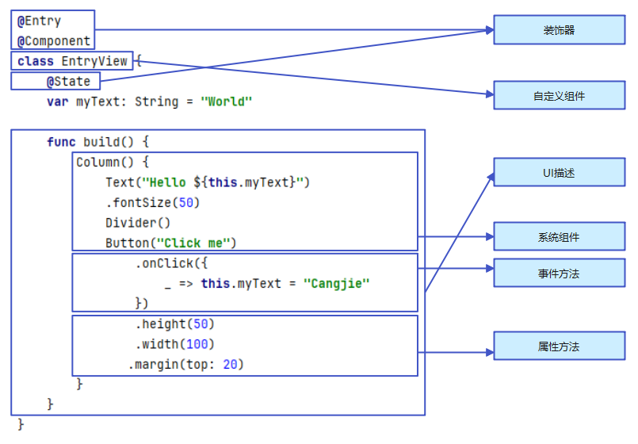

# 基本语法概述

在初步了解了仓颉语言之后，我们以一个具体的示例来说明仓颉的基本组成。如下图所示，当开发者点击按钮时，文本内容从“Hello World”变为“Hello Cangjie”。

**图1** 示例效果图

本示例中，仓颉的基本组成如下所示。

**图2** 仓颉的基本组成

> **说明：**
>
> 自定义变量不能与基础通用属性/事件名重复。

- 宏： 用于修饰类、结构、方法以及变量，并赋予其特殊的含义。如上述示例中@Entry、@Component和@State都是宏，[@Component](./cj-create-custom-components.md#component)表示自定义组件，[@Entry](./cj-create-custom-components.md#entry)表示该自定义组件为入口组件，[@State](../state_management/cj-macro-state.md)表示组件中的状态变量，状态变量变化会触发UI刷新。

- [UI描述](./cj-declarative-ui-description.md)：以声明式的方式来描述UI的结构，例如build()方法中的代码块。

- [自定义组件](./cj-create-custom-components.md)：可复用的UI单元，可组合其他组件，如上述被@Component修饰的class EntryView。

- 系统组件：ArkUI框架中默认内置的基础和容器组件，可直接被开发者调用，比如示例中的Column、Text、Divider、Button。

- [属性方法](ToAddLink)：组件可以通过链式调用配置多项属性，如fontSize()、width()、height()、backgroundColor()等。

- [事件方法](ToAddLink)：组件可以通过链式调用设置多个事件的响应逻辑，如跟随在Button后面的onClick()。

除此之外，仓颉扩展了多种语法范式来使开发更加便捷：

- [@Builder](./cj-macro-builder.md)/[@BuilderParam](./cj-macro-builderparam.md)：特殊的封装UI描述的方法，细粒度的封装和复用UI描述。
