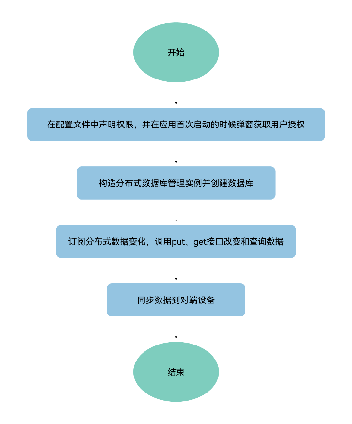

# 通过关系型数据库实现数据持久化

## 场景介绍

关系型数据库基于SQLite组件，适用于存储包含复杂关系数据的场景，比如一个班级的学生信息，需要包括姓名、学号、各科成绩等，又或者公司的雇员信息，需要包括姓名、工号、职位等。由于数据之间有较强的对应关系，复杂程度比键值型数据更高，此时需要使用关系型数据库来持久化保存数据。

大数据量场景下查询数据可能会导致耗时长甚至应用无响应，对于此类情况建议如下：

- 单次查询数据量不超过5000条。
- 拼接SQL语句尽量简洁。
- 合理地分批次查询。

## 基本概念

- **谓词：** 数据库中用来代表数据实体的性质、特征或者数据实体之间关系的词项，主要用来定义数据库的操作条件。
- **结果集：** 指用户查询之后的结果集合，可以对数据进行访问。结果集提供了灵活的数据访问方式，可以更方便地拿到用户想要的数据。

## 运作机制

关系型数据库对应用提供通用的操作接口，底层使用SQLite作为持久化存储引擎，支持SQLite具有的数据库特性，包括但不限于事务、索引、视图、触发器、外键、参数化查询和预编译SQL语句。

**图1** 关系型数据库运作机制



## 约束限制

- 系统默认日志方式是WAL（Write Ahead Log）模式，系统默认落盘方式是FULL模式。
- 数据库中有4个读连接和1个写连接，线程获取到空闲读连接时，即可进行读取操作。当没有空闲读连接且有空闲写连接时，会将写连接当做读连接来使用。
- 为保证数据的准确性，数据库同一时间只能支持一个写操作。
- 当应用被卸载完成后，设备上的相关数据库文件及临时文件会被自动清除。
- 仓颉侧支持的基本数据类型：Int64、Float64、String、二进制类型数据、Bool。
- 为保证插入并读取数据成功，建议单条数据不要超过2M。超出该大小，可能出现插入成功但读取失败的情况。

## 接口说明

以下是关系型数据库持久化功能的相关接口，更多接口及使用方式请参见[关系型数据库](../../../reference/source_zh_cn/ArkData/cj-apis-relational_store.md)。

| 接口名称 | 描述 |
| -------- | -------- |
| getRdbStore(context: StageContext, config: StoreConfig): RdbStore | 获取一个RdbStore用于操作关系型数据库。开发者可按需配置RdbStore的参数，并通过RdbStore调用相关接口执行数据操作。 |
| executeSql(sql: String, bindArgs: Array\<RelationalStoreValueType>): Unit | 执行包含指定参数但不返回值的SQL语句。 |
| insert(table: String, values: Map\<String, RelationalStoreValueType>): Int64 | 向目标表中插入一行数据。 |
| update(values: Map\<String, RelationalStoreValueType>, predicates: RdbPredicates): Int64 | 根据predicates的指定实例对象更新数据库中的数据。 |
| delete(predicates: RdbPredicates): Int64 | 根据predicates的指定实例对象从数据库中删除数据。 |
| query(predicates: RdbPredicates, columns: Array\<String>): ResultSet| 根据指定条件查询数据库中的数据。 |
| deleteRdbStore(context: StageContext, name: String): Unit | 删除数据库。 |

## 开发步骤

关系型数据库在操作或存储过程中，可能由于各种原因发生非预期异常（抛出14800011）。此时需要对数据库进行重建并恢复数据，以保障正常的应用开发。

1. 使用关系型数据库实现数据持久化，需要获取一个RdbStore，其中包括建库、建表、升降级等操作。示例代码如下所示：

    <!-- compile -->

    ```cangjie
    import ohos.business_exception.BusinessException
    import kit.ArkData.*
    import kit.AbilityKit.getStageContext
    import std.collection.HashMap
    import kit.AbilityKit.{UIAbility, AbilityStage, Want, LaunchParam, LaunchReason, UIAbilityContext}
    import ohos.data.relational_store.RdbStore
    import kit.ArkData.{StoreConfig, getRdbStore, RdbPredicates, deleteRdbStore}
    import ohos.data.relational_store.SecurityLevel as RelationalStoreSecurityLevel
    import kit.ArkUI.{WindowStage}

    let storeConfig_ = StoreConfig(
    RelationalStoreSecurityLevel.S3,// 数据库安全级别
    name: "RdbTest.db", // 数据库文件名
    encrypt: false, // 可选参数，指定数据库是否加密，默认不加密
    customDir: "customDir/subCustomDir", // 可选参数，数据库自定义路径。数据库将在如下的目录结构中被创建：context.databaseDir + '/rdb/' + customDir，其中context.databaseDir是应用沙箱对应的路径，'/rdb/'表示创建的是关系型数据库，customDir表示自定义的路径。当此参数不填时，默认在本应用沙箱目录下创建RdbStore实例。
    )

    let storeConfig = StoreConfig(
        "RdbTest.db", // 数据库文件名
        RelationalStoreSecurityLevel.S3, // 数据库安全级别
        encrypt: false, // 可选参数，指定数据库是否加密，默认不加密
        customDir: "customDir/subCustomDir", // 可选参数，数据库自定义路径。数据库将在如下的目录结构中被创建：context.databaseDir + '/rdb/' + customDir，其中context.databaseDir是应用沙箱对应的路径，'/rdb/'表示创建的是关系型数据库，customDir表示自定义的路径。当此参数不填时，默认在本应用沙箱目录下创建RdbStore实例。
    )

    // 判断数据库版本，如果不匹配则需进行升降级操作
    // 假设当前数据库版本为3，表结构：EMPLOYEE (ID, NAME, AGE, SALARY, CODES)
    const SQL_CREATE_TABLE = "CREATE TABLE EMPLOYEE(ID int NOT NULL, NAME varchar(255) NOT NULL, AGE int, SALARY float NOT NULL, CODES Bit NOT NULL, PRIMARY KEY (Id))"
    var rdbStore: Option<RdbStore> = Option<RdbStore>.None

    // 此处示例在Ability中实现，使用者也可以在其他合理场景中使用
    class MainAbility <: UIAbility {
        public init() {
            super()
            registerSelf()
        }

        public override func onCreate(want: Want, launchParam: LaunchParam): Unit {
            match (launchParam.launchReason) {
                case LaunchReason.StartAbility => Hilog.info(0, "cangjie", "START_ABILITY")
                case _ => ()
            }
        }

        public override func onWindowStageCreate(windowStage: WindowStage): Unit {
            Hilog.info(0, "cangjie", "MainAbility onWindowStageCreate.")
            windowStage.loadContent("EntryView")
            let store = getRdbStore(this.context, storeConfig)
            store.executeSql(SQL_CREATE_TABLE) // 创建数据表
            store.executeSql('ALTER TABLE EMPLOYEE ADD COLUMN AGE INTEGER')
            store.executeSql('ALTER TABLE EMPLOYEE DROP COLUMN ADDRESS TEXT')
            rdbStore = store
            // 进行数据库的增、删、改、查等操作
            // ...
        }
        // ...
    }
    ```

    > **说明：**
    >
    > - 应用创建的数据库与其上下文（Context）有关，即使使用同样的数据库名称，但不同的应用上下文，会产生多个数据库，例如每个Ability都有各自的上下文。
    > - 当应用首次获取数据库（调用getRdbStore）后，在应用沙箱内会产生对应的数据库文件。使用数据库的过程中，在与数据库文件相同的目录下可能会产生以-wal和-shm结尾的临时文件。此时若开发者希望移动数据库文件到其它地方使用查看，则需要同时移动这些临时文件，当应用被卸载完成后，其在设备上产生的数据库文件及临时文件也会被移除。
    > - 错误码的详细介绍请参见[通用错误码](../../../reference/source_zh_cn/cj-errorcode-universal.md)和[关系型数据库错误码](../../../reference/source_zh_cn/ArkData/cj-errorcode-data-rdb.md)。

2. 获取到RdbStore后，调用insert()接口插入数据。示例代码如下所示：

    <!-- compile -->

    ```cangjie
    import ohos.data.relational_store.ValueType as RelationalStoreValueType 

    var values = HashMap<String, RelationalStoreValueType>()
    values.add("ID", RelationalStoreValueType.Integer(1))
    values.add("NAME", RelationalStoreValueType.StringValue("Lisa"))
    values.add("AGE", RelationalStoreValueType.Integer(18))
    values.add("SALARY", RelationalStoreValueType.Double(100.5))
    values.add("CODES", RelationalStoreValueType.Boolean(true))
    rdbStore.getOrThrow().insert("EMPLOYEE", values)
    ```

    > **说明：**
    >
    > 关系型数据库没有显式的flush操作实现持久化，数据插入即保存在持久化文件。

3. 根据谓词指定的实例对象，对数据进行修改或删除。

    调用update()方法修改数据，调用delete()方法删除数据。示例代码如下所示：

    <!-- compile -->

    ```cangjie
    // 修改数据
    try {
        let predicates1 = RdbPredicates('EMPLOYEE')  // 创建表'EMPLOYEE'的predicates
        predicates1.equalTo("NAME", RelationalStoreValueType.StringValue("Lisa")) // 匹配表"EMPLOYEE"中"NAME"为"Lisa"的字段

        var values = HashMap<String, RelationalStoreValueType>()
        values.add("NAME", RelationalStoreValueType.StringValue("TOM"))
        values.add("AGE", RelationalStoreValueType.Integer(88))
        values.add("SALARY", RelationalStoreValueType.Double(9999.513))
        let rowsCnt = rdbStore.getOrThrow().update(values, predicates1)
    } catch (e: BusinessException) {
        Hilog.error(0, "ErrorCode: ${e.code}", e.message)
    }

    // 删除数据
    try {
        let predicates1 = RdbPredicates('EMPLOYEE')  // 创建表'EMPLOYEE'的predicates
        predicates1.equalTo("NAME", RelationalStoreValueType.StringValue("Lisa")) // 匹配表"EMPLOYEE"中"NAME"为"Lisa"的字段

        let rowsCnt = rdbStore.getOrThrow().delete(predicates1)
    } catch (e: BusinessException) {
        Hilog.error(0, "ErrorCode: ${e.code}", e.message)
    }
    ```

4. 根据谓词指定的查询条件查找数据。

    调用query()方法查找数据，返回一个ResultSet结果集。示例代码如下所示：

    <!-- compile -->

    ```cangjie
    try {
        let predicates2 = RdbPredicates('EMPLOYEE')  // 创建表'EMPLOYEE'的predicates
        predicates2.equalTo("NAME", RelationalStoreValueType.StringValue("Rose")) // 匹配表"EMPLOYEE"中"NAME"为"Lisa"的字段

        let columns = ["ID", "NAME", "AGE", "SALARY", "CODES"]
        let resultSet = rdbStore.getOrThrow().query(predicates2, columns:columns)
        // resultSet是一个数据集合的游标，默认指向第-1个记录，有效的数据从0开始。

        while (resultSet.goToNextRow()) {
            let id = resultSet.getLong(resultSet.getColumnIndex('ID'))
            let name = resultSet.getString(resultSet.getColumnIndex('NAME'))
            let age = resultSet.getLong(resultSet.getColumnIndex('AGE'))
            let salary = resultSet.getDouble(resultSet.getColumnIndex('SALARY'))
        }
        // 释放数据集的内存
        resultSet.close()
    } catch (e: BusinessException) {
        Hilog.error(0, "ErrorCode: ${e.code}", e.message)
    }
    ```

    > **说明：**
    >
    > 当应用完成查询数据操作，不再使用结果集（ResultSet）时，请及时调用close方法关闭结果集，释放系统为其分配的内存。

5. 在同路径下备份数据库。关系型数据库支持两种手动备份和自动备份（仅系统应用可用）两种方式，详情请参见[关系型数据库备份](cj-data-backup-and-restore.md#关系型数据库备份)。

    此处以手动备份为例：

    <!-- compile -->

    ```cangjie
    try {
        // "Backup.db"为备份数据库文件名，默认在RdbStore同路径下备份。也可指定路径：customDir + "backup.db"
        rdbStore.getOrThrow().backup("Backup.db")
        Hilog.info(0, "cangjie", "Succeeded in backup data.")
    } catch (e: BusinessException) {
        Hilog.error(0, "ErrorCode: ${e.code}", e.message)
    }
    ```

6. 从备份数据库中恢复数据。关系型数据库支持两种方式：恢复手动备份数据和恢复自动备份数据（仅系统应用可用），详情请参见[关系型数据库数据恢复](cj-data-backup-and-restore.md#关系型数据库数据恢复)。

    此处以调用[restore](../../../reference/source_zh_cn/ArkData/cj-apis-relational_store.md#func-restorestring)接口恢复手动备份数据为例：

    <!-- compile -->

    ```cangjie
    try {
        rdbStore.getOrThrow().restore("Backup.db")
        Hilog.info(0, "cangjie", "Succeeded in backup data.")
    } catch (e: BusinessException) {
        Hilog.error(0, "ErrorCode: ${e.code}", e.message)
    }
    ```

7. 删除数据库。

    调用deleteRdbStore()方法，删除数据库及数据库相关文件。示例代码如下：

    <!-- compile -->

    ```cangjie
    try {
        deleteRdbStore(this.context, StoreConfig(RelationalStoreSecurityLevel.S3, name: "RdbTest.db", ))
        Hilog.info(0, "cangjie", "Succeeded in delete RdbStore.")
    } catch (e: BusinessException) {
        Hilog.error(0, "ErrorCode: ${e.code}", e.message)
    }
    ```
