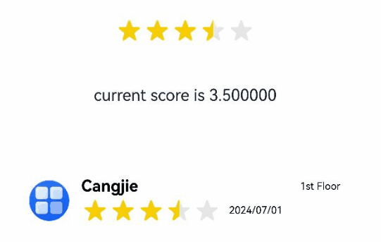
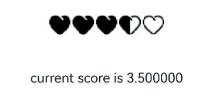

# Rating

A component that provides the ability to select a rating within a given range.

## Import Module

```cangjie
import kit.ArkUI.*
```

## Subcomponents

None

## Creating the Component

### init(Float64, Bool)

```cangjie
public init(rating!: Float64, indicator!: Bool = false)
```

**Function:** Constructs a component for selecting ratings within a specified range.

**System Capability:** SystemCapability.ArkUI.ArkUI.Full

**Since Version:** 21

**Parameters:**

| Parameter Name | Type | Required | Default Value | Description |
|:---|:---|:---|:---|:---|
| rating | Float64 | Yes | - | **Named parameter.** Sets and receives the rating value.<br>Initial value: 0.<br>Valid range: [0, stars]. Values below 0 are set to 0, and values above stars are set to the maximum value stars. |
| indicator | Bool | No | false | **Named parameter.** Sets the rating component to be used as an indicator, preventing rating changes.<br>Initial value: false, allowing ratings.<br>**Note:**<br>When indicator=true, the default component height is height=12.0.vp, and component width=height * stars. When indicator=false, the default component height is height=28.0.vp, and component width=height * stars. |

## Common Attributes/Common Events

Common Attributes: All supported.

Common Events: All supported.

## Component Attributes

### func starStyle(ResourceStr, ResourceStr, ResourceStr)

```cangjie
public func starStyle(backgroundUri!: ResourceStr, foregroundUri!: ResourceStr, secondaryUri!: ResourceStr = backgroundUri): This
```

**Function:** Sets the style of the rating. The image types supported by this attribute refer to the [Image](./cj-image-video-image.md#image) component. Supports loading local and network images but does not currently support PixelMap type or Resource resources.

Default image loading is asynchronous; synchronous loading is not supported.

**System Capability:** SystemCapability.ArkUI.ArkUI.Full

**Since Version:** 21

**Parameters:**

| Parameter Name | Type | Required | Default Value | Description |
|:---|:---|:---|:---|:---|
| backgroundUri | [ResourceStr](../BasicServicesKit/cj-apis-base.md#interface-resourcestr) | Yes | - | **Named parameter.** The image link for unselected stars, which can be customized by the user or use the system default image. |
| foregroundUri | [ResourceStr](../BasicServicesKit/cj-apis-base.md#interface-resourcestr) | Yes | - | **Named parameter.** The image path for selected stars, which can be customized by the user or use the system default image. |
| secondaryUri | [ResourceStr](../BasicServicesKit/cj-apis-base.md#interface-resourcestr) | No | backgroundUri | **Named parameter.** The image path for partially selected stars, which can be customized by the user or use the system default image. |

> **Notes:**
>
> - backgroundUri: The image link for unselected stars, which can be customized by the user or use the system default image.
> - foregroundUri: The image path for selected stars, which can be customized by the user or use the system default image.
> - secondaryUri: The image path for partially selected stars, which can be customized by the user or use the system default image.
> - When the rating dimensions are [width, height], the drawing area for a single image is [width / stars, height].
> - To specify a square drawing area, it is recommended to set custom dimensions as [height * stars, height], where width = height * stars.
> - If the image path set for backgroundUri, foregroundUri, or secondaryUri is incorrect, the image will not be displayed.
> - If backgroundUri or foregroundUri is set to an empty string, the rating component will load the system default star image.
> - If secondaryUri is not set or is set to an empty string, it defaults to backgroundUri, effectively equivalent to only setting foregroundUri and backgroundUri.

### func stars(Int32)

```cangjie
public func stars(starCount: Int32): This
```

**Function:** Sets the total number of stars. If set to a value less than or equal to 0, the initial value is displayed.

**System Capability:** SystemCapability.ArkUI.ArkUI.Full

**Since Version:** 21

**Parameters:**

| Parameter Name | Type | Required | Default Value | Description |
|:---|:---|:---|:---|:---|
| starCount | Int32 | Yes | - | Sets the total number of stars.<br>Initial value: 5. |

### func stepSize(Float64)

```cangjie
public func stepSize(size: Float64): This
```

**Function:** Sets the step size for rating operations. If set to a value less than 0.1, the initial value is displayed.

**System Capability:** SystemCapability.ArkUI.ArkUI.Full

**Since Version:** 21

**Parameters:**

| Parameter Name | Type | Required | Default Value | Description |
|:---|:---|:---|:---|:---|
| size | Float64 | Yes | - | The step size for rating operations.<br>Initial value: 0.5.<br>Valid range: [0.1, stars]. |

## Component Events

### func onChange((Float64) -> Unit)

```cangjie
public func onChange(callback: (Float64) -> Unit): This
```

**Function:** Triggers this callback when the rating of the rating bar changes.

**System Capability:** SystemCapability.ArkUI.ArkUI.Full

**Since Version:** 21

**Parameters:**

| Parameter Name | Type | Required | Default Value | Description |
|:---|:---|:---|:---|:---|
| callback | (Float64)->Unit | Yes | - | The rating of the rating bar. |

## Example Code

### Example 1 (Setting Default Rating Style)

This example creates a default star rating style.

<!-- run -->

```cangjie
package ohos_app_cangjie_entry

import kit.ArkUI.*
import ohos.arkui.state_macro_manage.*
internal import kit.LocalizationKit.*

@Entry
@Component
class EntryView {
    @State var rating: Float64 = 3.5

    func build() {
        Column() {
            Column() {
                Rating(rating: rating,indicator: false)
                  .stars(5)
                  .stepSize(0.5)
                  .margin(24)
                  .onChange({value: Float64 =>
                    this.rating = value
                    })
                Text("current score is ${this.rating}")
                    .fontSize(16)
                    .fontColor(0x182431)
                    .margin( 16 )
              }.width(360).height(113).backgroundColor(Color.White).margin(top: 68 )
            Row() {
                Image(@r(app.media.startIcon))
                    .width(40)
                    .height(40)
                    .borderRadius(20)
                    .margin(left: 24 )
                Column() {
                    Text("Cangjie")
                        .fontSize(16)
                        .fontColor(Color.Black)
                        .fontWeight(FontWeight.Bold)
                    Row() {
                        Rating(rating: 3.5, indicator: false ).margin(top: 1, right: 8 )
                        Text("2024/07/01")
                            .fontSize(10)
                            .fontColor(Color.Black)
                        }
                }.margin(left: 12 ).alignItems(HorizontalAlign.Start)

                Text("1st Floor")
                    .fontSize(10)
                    .fontColor(Color.Black)
                    .position( x: 295, y: 8 )
             }.width(360).height(56).backgroundColor(Color.White).margin(top: 64 )
        }.width(100.percent).height(100.percent)
    }
}
```



### Example 2 (Setting Rating Style)

This example customizes the star image links by configuring starStyle.

<!-- run -->

```cangjie
package ohos_app_cangjie_entry
import kit.ArkUI.*
import ohos.arkui.state_macro_manage.*

@Entry
@Component
class EntryView {
    @State var rating: Float64 = 3.5
    @State var backPng: String = ""
    @State var forePng: String = ""

    func build() {
        Column() {
            Rating(rating: rating,indicator: false)
                .stars(5)
                .stepSize(0.5)
                .starStyle(
                    backgroundUri: backPng,
                    foregroundUri: forePng
                )
                .margin(24)
                .onChange({value: Float64 =>
                    this.rating = value
                })
            Text("current score is ${this.rating}")
                .fontSize(16)
                .fontColor(0x182431)
                .margin(16)
        }
        .width(100.percent)
        .padding(top: 5)
    }
}
```

