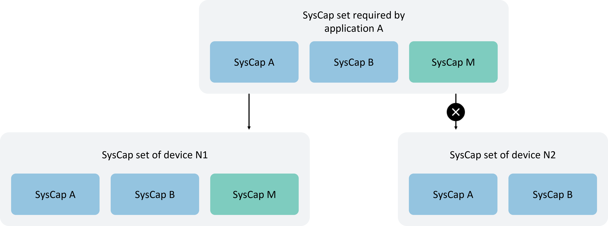
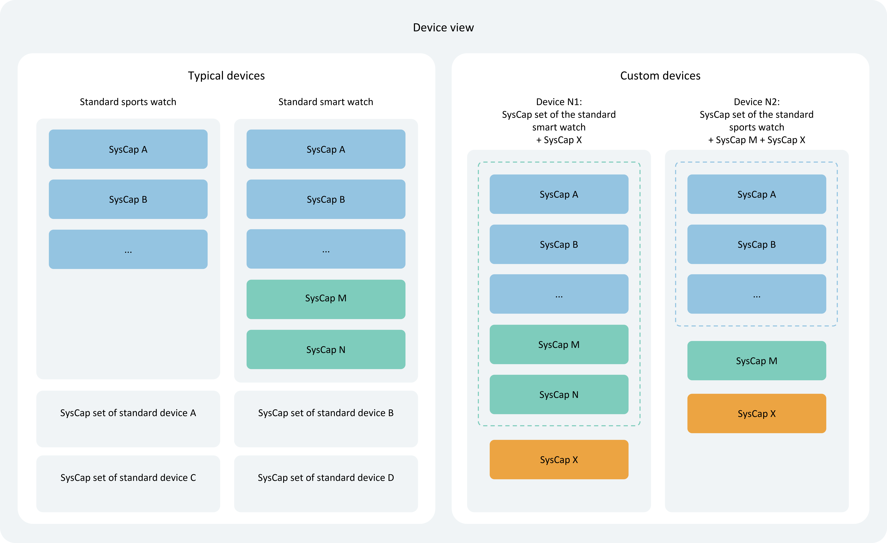
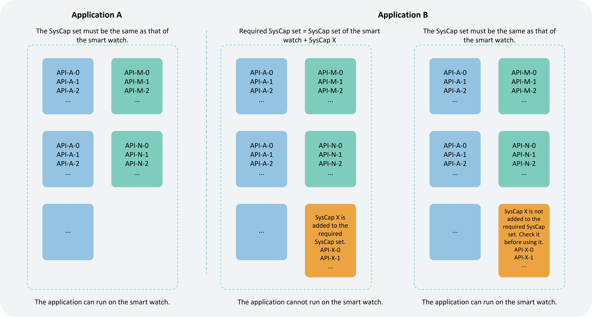
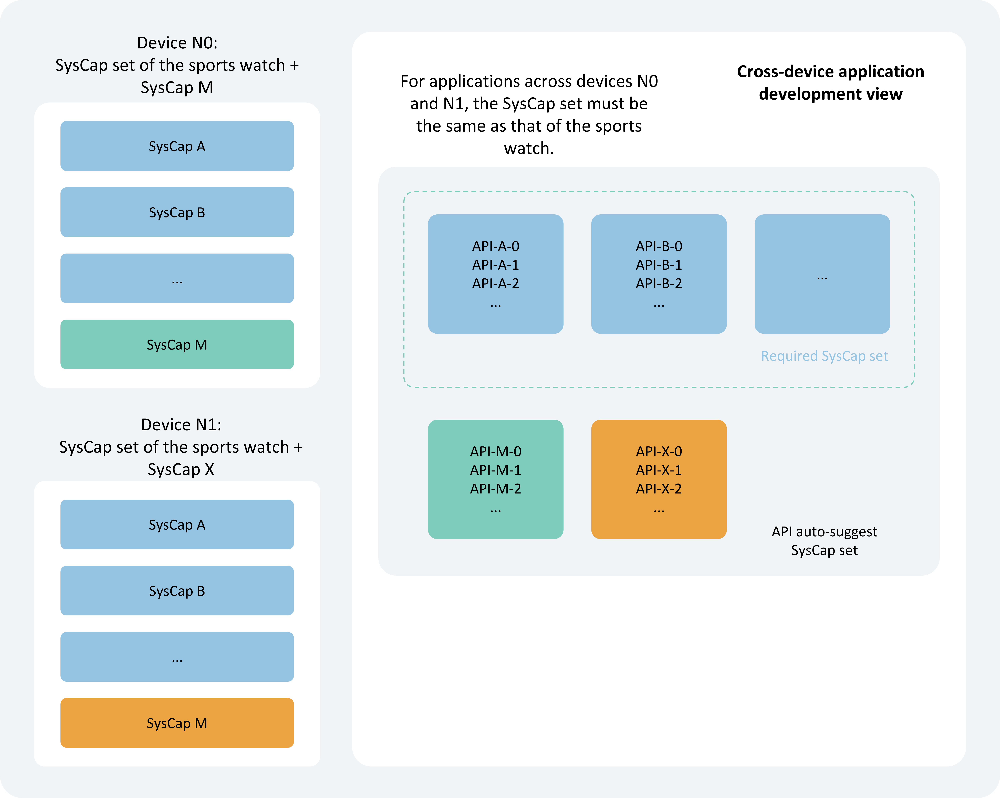
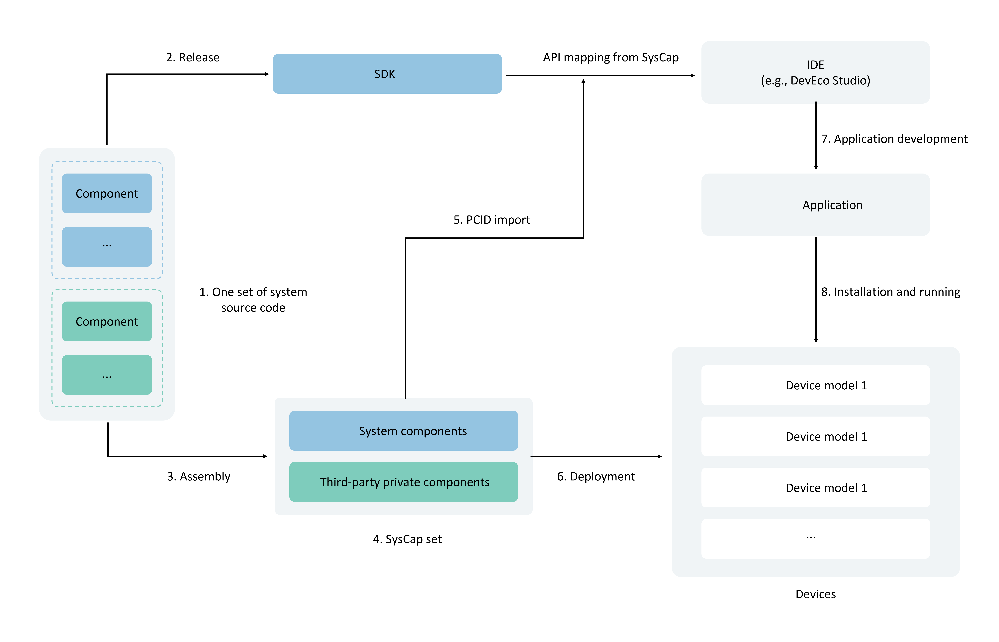

# SystemCapability Usage Guide

## Overview

### SystemCapability and APIs

SysCap, short for SystemCapability, refers to each relatively independent feature in the operating system, such as Bluetooth, WiFi, NFC, camera, etc., each being a system capability. Each system capability corresponds to multiple APIs, which coexist or disappear depending on whether the target device supports that system capability, and are provided to developers for association along with DevEco Studio.


Developers can query OpenHarmony's capability set in the [SysCap List](cj-phone-syscap-list.md).

### Supported Capability Set, Associated Capability Set, and Required Capability Set

Supported capability set, associated capability set, and required capability set are all collections of system capabilities.

The supported capability set describes device capabilities, while the required capability set describes application capabilities. If the required capability set of application A is a subset of the supported capability set of device N, then application A can be distributed and installed on device N; otherwise, it cannot.

The associated capability set is the system capability collection where DevEco Studio can associate APIs during the development of the application.



### Devices and Supported Capability Sets

Each device corresponds to a different supported capability set based on its hardware capabilities.

The SDK divides devices into two groups: typical devices and custom devices. The supported capability sets of typical devices are defined by OpenHarmony, while those of custom devices are provided by device manufacturers.



### Device and SDK Capability Correspondence

The SDK provides a full set of APIs to DevEco Studio. DevEco Studio identifies the device type selected in the developer's project, locates the supported capability set of that device, filters the APIs included in the supported capability set, and provides API association.


## SysCap Development Guide

### Obtaining PCID

PCID, short for Product Compatibility ID, contains SysCap information supported by the current device. The certification center for obtaining PCIDs of all devices is under construction. Currently, the PCID of a device needs to be obtained from the corresponding device manufacturer.

### Importing PCID

DevEco Studio projects support the import of PCIDs. The SysCap output after decoding the imported PCID file will be written into the syscap.json file.

Right-click on the project directory and select "Import Product Compatibility ID" to upload the PCID file and import it into syscap.json.


### Configuring Associated Capability Set and Required Capability Set

DevEco Studio automatically configures the associated capability set and required capability set based on the settings supported by the created project. Developers can also modify them manually.
For the associated capability set, developers can add more system capabilities to use more APIs in DevEco Studio. However, note that these APIs may not be supported on the device and need to be checked before use.
For the required capability set, developers should modify it with caution, as improper modifications may prevent the application from being distributed to the target device.

```json
// syscap.json
{
 "devices": {
  "general": [            // Each typical device corresponds to a syscap supported capability set, and multiple typical devices can be configured
   "default",
   "car"
  ],
  "custom": [             // Manufacturer-defined custom devices
   {
    "Custom Device": [
     "SystemCapability.Communication.SoftBus.Core"
    ]
   }
  ]
 },
 "development": {             // The union of the sycap collection in addedSysCaps and the syscap collections supported by the devices configured in devices forms the associated capability set
  "addedSysCaps": [
   "SystemCapability.Location.Location.Lite"
  ]
 },
 "production": {              // Used to generate rpcid. Add with caution, as it may prevent the application from being distributed to the target device
  "addedSysCaps": [],      // The intersection of the syscap collections supported by the devices configured in devices, plus the addedSysCaps collection and minus the removedSysCaps collection, forms the required capability set
  "removedSysCaps": []     // The application can be distributed to the device only when this required capability set is a subset of the device's supported capability set
 }
}
```

### Single-Device Application Development

By default, the associated capability set and required capability set of the application are equal to the supported system capability set of the device. Developers should modify the required capability set with caution.



### Cross-Device Application Development

By default, the associated capability set of the application is the union of the supported capability sets of multiple devices, while the required capability set is the intersection.



### Checking API Availability

The Cangjie API is currently provided to help determine whether a specific API can be used.

```cangjie
import ohos.base.canIUse

if(canIUse("SystemCapability.ArkUI.ArkUI.Full")){
    Hilog.info(0, "SysCap", "Supports SystemCapability.ArkUI.ArkUI.Full")
}else{
    Hilog.info(0, "SysCap", "Does not support SystemCapability.ArkUI.ArkUI.Full")
}
```

### Checking Differences in the Same Capability Across Different Devices

Even for the same system capability, there may be differences across different devices. For example, the camera capability on a tablet is superior to that on a smart wearable device.

```cangjie
import ohos.base.*
import kit.UserAuthenticationKit.*
import kit.PerformanceAnalysisKit.Hilog

try {
    let userAuthInstance = getUserAuthInstance(
        AuthParam([], [UserAuthType.PIN], AuthTrustLevel.ATL1),
        WidgetParam("TEST PIN_ATL1", "")
    )
    userAuthInstance.on("result", {u => userAuthInstance.off("result")})
    userAuthInstance.start()
} catch (e: Exception) {
    Hilog.error(0, "AppLogCj", "auth catch error: ${e.toString()}")
}
```

### How SysCap Differences Between Devices Arise

The SysCap of devices varies due to the different combinations of components assembled by product solution vendors. The overall process is as follows:



1. A set of operating system source code consists of optional and mandatory component sets. Different components correspond to different external system capabilities, i.e., there is a mapping relationship between components and SysCap.

2. A normalized SDK is released, with a mapping relationship between APIs and SysCap.

3. Product solution vendors can assemble components as needed based on hardware capabilities and product requirements.

4. The components configured for the product can be system components or privately developed third-party components. Since there is a mapping between components and SysCap, the SysCap collection of the product can be obtained after assembly.

5. The SysCap set is encoded to generate PCID (Product Compatibility ID). Application developers can import the PCID into DevEco Studio, decode it into SysCap, and handle compatibility differences in device SysCap during development.

6. The system parameters deployed on the device include the SysCap set. The system provides native interfaces and application interfaces for components and applications within the system to query whether a specific SysCap exists.

7. During application development, the necessary SysCap of the application will be encoded into RPCID (Required Product Compatibility ID) and written into the application installation package. During installation, the package manager decodes the RPCID to obtain the SysCap required by the application and compares it with the SysCap currently available on the device. If the required SysCap are all satisfied, the installation succeeds.

8. During application runtime, the device's SysCap can be queried via the canIUse interface to ensure compatibility across different devices.