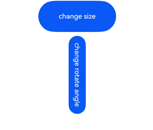

# 属性动画

组件的某些通用属性变化时，可以通过属性动画实现渐变过渡效果，提升用户体验。支持的属性包括[width](./cj-universal-attribute-size.md#func-widthlength)、[height](./cj-universal-attribute-size.md#func-heightlength)、[backgroundColor](cj-universal-attribute-background.md#func-backgroundcolorresourcecolor)、[opacity](cj-universal-attribute-opacity.md#func-opacityfloat64)、[scale](./cj-universal-attribute-transform.md#func-scalefloat32-float32-float32-length-length)、[rotate](./cj-universal-attribute-transform.md#func-rotatefloat32-float32-float32-float64-length-length)、[translate](./cj-universal-attribute-transform.md#func-translatelength-length-length)等。布局类改变宽高的动画，内容都是直接到终点状态，例如文字、[Canvas](./cj-canvas-drawing-canvas.md)的内容等，如果要内容跟随宽高变化，可以使用[renderFit](./cj-universal-attribute-renderfit.md)属性配置。

## 导入模块

```cangjie
import kit.ArkUI.*
```

## func animationEnd()

```cangjie
public func animationEnd(): This
```

**功能：** 结束动画。

**系统能力：** SystemCapability.ArkUI.ArkUI.Full

**起始版本：** 21

## func animationStart(AnimateParam)

```cangjie
public func animationStart(value: AnimateParam): This
```

**功能：** 开始动画。

**系统能力：** SystemCapability.ArkUI.ArkUI.Full

**起始版本：** 21

**参数：**

|参数名|类型|必填|默认值|说明|
|:---|:---|:---|:---|:---|
|value|[AnimateParam](./cj-common-types.md#class-animateparam)|是|-|动画参数。|

## 示例代码

该示例通过animation实现了组件的属性动画。

<!-- run -->

```cangjie
package ohos_app_cangjie_entry
import kit.ArkUI.*
import ohos.arkui.state_macro_manage.*
import kit.PerformanceAnalysisKit.Hilog

let animateOpt1 = AnimateParam(
    duration: 1200,
    curve: Curve.EaseOut,
    delay: 500,
    iterations: 3,
    playMode: PlayMode.Normal,
    onFinish: {
        => Hilog.info(0, "cangjie", "onfinish")
    },
    expectedFrameRateRange: ExpectedFrameRateRange(
        min: 20,
        max: 120,
        expected: 90
    )
)
let animateOpt2 = AnimateParam(
    duration: 1200,
    curve: Curve.Friction,
    delay: 500,
    iterations: -1, // 设置-1表示动画无限循环
    playMode: PlayMode.Alternate,
    onFinish: {
        => Hilog.info(0, "cangjie", "onfinish")
    },
    expectedFrameRateRange: ExpectedFrameRateRange(
        min: 20,
        max: 120,
        expected: 90
    )
)

@Entry
@Component
class EntryView {
    @State var widthSize: Length = 250.vp
    @State var heightSize: Length = 100.vp
    @State var rotateAngle: Float32 = 0.0
    @State var flag: Bool = true
    func build() {
        Column() {
            Button("change size")
                .animationStart(animateOpt1)
                .onClick {
                   evt =>
                    if (this.flag) {
                        this.widthSize = 150.vp
                        this.heightSize = 60.vp
                    } else {
                        this.widthSize = 250.vp
                        this.heightSize = 100.vp
                    }
                    this.flag = !this.flag
                }
                .margin(30)
                .animationEnd()
                .width(this.widthSize)
                .height(this.heightSize)
            Button('change rotate angle')
                .animationStart(animateOpt2)
                .onClick {
                   evt => this.rotateAngle = 90.0
                }
                .margin(50)
                .rotate(angle:this.rotateAngle,)
                .animationEnd()
        }
        .width(100.percent)
        .margin(top: 20)
    }
}
```


