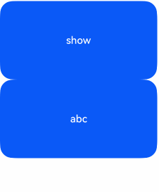
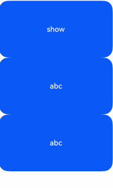

# 组件内转场 (transition)

组件内转场主要通过transition属性配置转场参数，在组件插入和删除时显示过渡动效，主要用于容器组件中的子组件插入和删除时，提升用户体验。

> **说明：**
>
> 当前有两种方式触发组件的transition：
>
> - 当组件插入或删除时（如if条件改变、ForEach新增删除组件），会递归的触发所有新插入/删除的组件的transition效果。
> - 当组件[Visibility](./cj-universal-attribute-visibility.md)属性在可见和不可见之间改变时，只触发该组件的transition效果。

## 导入模块

```cangjie
import kit.ArkUI.*
```

## func transition(?TransitionEffect)

```cangjie
public func transition(value: ?TransitionEffect): T
```

**功能：** 设置组件插入显示和删除隐藏的过渡效果。

**系统能力：** SystemCapability.ArkUI.ArkUI.Full

**起始版本：** 22

**参数：**

|参数名|类型|必填|默认值|说明|
|:---|:---|:---|:---|:---|
|value|?[TransitionEffect](#class-transitioneffect)|是|-|以函数的形式指定转场效果。|

**返回值：**

|类型|说明|
|:----|:----|
|T|返回组件实例。|

## func transition(?TransitionEffect, ?TransitionFinishCallback)

```cangjie
public func transition(value: ?TransitionEffect, onFinish: ?TransitionFinishCallback): T
```

**功能：** 设置组件插入显示和删除隐藏的过渡效果和转场动画结束回调。

**系统能力：** SystemCapability.ArkUI.ArkUI.Full

**起始版本：** 22

**参数：**

|参数名|类型|必填|默认值|说明|
|:---|:---|:---|:---|:---|
|value|?[TransitionEffect](#class-transitioneffect)|是|-|以函数的形式指定转场效果。|
|onFinish|?TransitionFinishCallback|是|-|组件转场动画的结束回调类型。<br>该参数为true表示该转场回调是出现动画的结束回调，该参数为false表示该转场回调是消失动画的结束回调。|

**返回值：**

|类型|说明|
|:----|:----|
|T|返回组件实例。|

## class TranslateOptions

```cangjie
public class TranslateOptions {
    public var x: ?Length
    public var y: ?Length
    public var z: ?Length
    public init(x!: ?Length = None, y!: ?Length = None, z!: ?Length = None)
}
```

**功能：** 定义平移选项。

**系统能力：** SystemCapability.ArkUI.ArkUI.Full

**起始版本：** 22

### var x

```cangjie
public var x: ?Length
```

**功能：** x轴上的平移距离。对于数字类型，单位为vp，取值范围为(-∞, +∞)。

**类型：** ?Length

**读写能力：** 可读写

**系统能力：** SystemCapability.ArkUI.ArkUI.Full

**起始版本：** 22

### var y

```cangjie
public var y: ?Length
```

**功能：** y轴上的平移距离。对于数字类型，单位为vp，取值范围为(-∞, +∞)。

**类型：** ?Length

**读写能力：** 可读写

**系统能力：** SystemCapability.ArkUI.ArkUI.Full

**起始版本：** 22

### var z

```cangjie
public var z: ?Length
```

**功能：** z轴上的平移距离。对于数字类型，单位为vp，取值范围为(-∞, +∞)。

**类型：** ?Length

**读写能力：** 可读写

**系统能力：** SystemCapability.ArkUI.ArkUI.Full

**起始版本：** 22

### init(?Length, ?Length, ?Length)

```cangjie
public init(x!: ?Length = None, y!: ?Length = None, z!: ?Length = None)
```

**功能：** TranslateOptions构造函数。

**系统能力：** SystemCapability.ArkUI.ArkUI.Full

**起始版本：** 22

**参数：**

|参数名|类型|必填|默认值|说明|
|:---|:---|:---|:---|:---|
|x|?Length|否|None|**命名参数。** x轴上的平移距离。初始值：0.0.vp|
|y|?Length|否|None|**命名参数。** y轴上的平移距离。初始值：0.0.vp|
|z|?Length|否|None|**命名参数。** z轴上的平移距离。初始值：0.0.vp|

## class ScaleOptions

```cangjie
public class ScaleOptions {
    public var x: ?Float32
    public var y: ?Float32
    public var z: ?Float32
    public var centerX: ?Length
    public var centerY: ?Length
    public init(x!: ?Float32 = None, y!: ?Float32 = None, z!: ?Float32 = None, centerX!: ?Length = None,
        centerY!: ?Length = None)
}
```

**功能：** 缩放参数。

**系统能力：** SystemCapability.ArkUI.ArkUI.Full

**起始版本：** 22

### var x

```cangjie
public var x: ?Float32
```

**功能：** x轴上的缩放比例。
x > 1: 组件沿x轴放大。
0 < x < 1: 组件沿x轴缩小。
x < 0: 组件沿x轴反方向缩放。

**类型：** ?Float32

**读写能力：** 可读写

**系统能力：** SystemCapability.ArkUI.ArkUI.Full

**起始版本：** 22

### var y

```cangjie
public var y: ?Float32
```

**功能：** y轴上的缩放比例。
y > 1: 组件沿y轴放大。
0 < y < 1: 组件沿y轴缩小。
y < 0: 组件沿y轴反方向缩放。

**类型：** ?Float32

**读写能力：** 可读写

**系统能力：** SystemCapability.ArkUI.ArkUI.Full

**起始版本：** 22

### var z

```cangjie
public var z: ?Float32
```

**功能：** z轴上的缩放比例。
z > 1: 组件沿z轴放大。
0 < z < 1: 组件沿z轴缩小。
z < 0: 组件沿z轴反方向缩放。

**类型：** ?Float32

**读写能力：** 可读写

**系统能力：** SystemCapability.ArkUI.ArkUI.Full

**起始版本：** 22

### var centerX

```cangjie
public var centerX: ?Length
```

**功能：** 变换中心点（锚点）的X坐标。单位为vp。

**类型：** ?Length

**读写能力：** 可读写

**系统能力：** SystemCapability.ArkUI.ArkUI.Full

**起始版本：** 22

### var centerY

```cangjie
public var centerY: ?Length
```

**功能：** 变换中心点（锚点）的Y坐标。单位为vp。

**类型：** ?Length

**读写能力：** 可读写

**系统能力：** SystemCapability.ArkUI.ArkUI.Full

**起始版本：** 22

### init(?Float32, ?Float32, ?Float32, ?Length, ?Length)

```cangjie
public init(x!: ?Float32 = None, y!: ?Float32 = None, z!: ?Float32 = None, centerX!: ?Length = None,
        centerY!: ?Length = None)
```

**功能：** ScaleOptions构造函数。

**系统能力：** SystemCapability.ArkUI.ArkUI.Full

**起始版本：** 22

**参数：**

|参数名|类型|必填|默认值|说明|
|:---|:---|:---|:---|:---|
|x|?Float32|否|None|**命名参数。** x轴上的缩放比例。初始值：1.0|
|y|?Float32|否|None|**命名参数。** y轴上的缩放比例。初始值：1.0|
|z|?Float32|否|None|**命名参数。** z轴上的缩放比例。初始值：1.0|
|centerX|?Length|否|None|**命名参数。** 变换中心点（锚点）的X坐标。单位为vp。初始值：50.percent|
|centerY|?Length|否|None|**命名参数。** 变换中心点（锚点）的Y坐标。单位为vp。初始值：50.percent|

## class RotateOptions

```cangjie
public class RotateOptions {
    public var angle: ?Float32
    public var x: ?Float32
    public var y: ?Float32
    public var z: ?Float32
    public var centerX: ?Length
    public var centerY: ?Length
    public var centerZ: ?Length
    public var perspective: ?Float32
    public init(angle: ?Float32, x!: ?Float32 = None, y!: ?Float32 = None, z!: ?Float32 = None, centerX!: ?Length = None,
        centerY!: ?Length = None, centerZ!: ?Length = None, perspective!: ?Float32 = None)
}
```

**功能：** 旋转参数。

**系统能力：** SystemCapability.ArkUI.ArkUI.Full

**起始版本：** 22

### var angle

```cangjie
public var angle: ?Float32
```

**功能：** 旋转角度。取值为正时相对于旋转轴方向顺时针转动，取值为负时相对于旋转轴方向逆时针转动。

**类型：** ?Float32

**读写能力：** 可读写

**系统能力：** SystemCapability.ArkUI.ArkUI.Full

**起始版本：** 22

### var x

```cangjie
public var x: ?Float32
```

**功能：** 旋转轴向量的X坐标。

**类型：** ?Float32

**读写能力：** 可读写

**系统能力：** SystemCapability.ArkUI.ArkUI.Full

**起始版本：** 22

### var y

```cangjie
public var y: ?Float32
```

**功能：** 旋转轴向量的Y坐标。

**类型：** ?Float32

**读写能力：** 可读写

**系统能力：** SystemCapability.ArkUI.ArkUI.Full

**起始版本：** 22

### var z

```cangjie
public var z: ?Float32
```

**功能：** 旋转轴向量的Z坐标。

**类型：** ?Float32

**读写能力：** 可读写

**系统能力：** SystemCapability.ArkUI.ArkUI.Full

**起始版本：** 22

### var centerX

```cangjie
public var centerX: ?Length
```

**功能：** 变换中心点x轴坐标。表示组件变换中心点（即锚点）的x方向坐标。

**类型：** ?Length

**读写能力：** 可读写

**系统能力：** SystemCapability.ArkUI.ArkUI.Full

**起始版本：** 22

### var centerY

```cangjie
public var centerY: ?Length
```

**功能：** 变换中心点y轴坐标。表示组件变换中心点（即锚点）的y方向坐标。

**类型：** ?Length

**读写能力：** 可读写

**系统能力：** SystemCapability.ArkUI.ArkUI.Full

**起始版本：** 22

### var centerZ

```cangjie
public var centerZ: ?Length
```

**功能：** Z轴锚点，即3D旋转中心点的z分量。

**类型：** ?Length

**读写能力：** 可读写

**系统能力：** SystemCapability.ArkUI.ArkUI.Full

**起始版本：** 22

### var perspective

```cangjie
public var perspective: ?Float32
```

**功能：** 相机放置的z轴坐标。数值大小表示视距，即相机到z=0平面的距离。取值的正负决定了相机观察的方向。当perspective=0，系统会自动计算适合的相机z轴位置，取值为负数。旋转轴和旋转中心点都基于坐标系设定，组件发生位移时，坐标系不会随之移动。

**类型：** ?Float32

**读写能力：** 可读写

**系统能力：** SystemCapability.ArkUI.ArkUI.Full

**起始版本：** 22

### init(?Float32, ?Float32, ?Float32, ?Length, ?Length, ?Length, ?Float32)

```cangjie
public init(angle: ?Float32, x!: ?Float32 = None, y!: ?Float32 = None, z!: ?Float32 = None, centerX!: ?Length = None,
        centerY!: ?Length = None, centerZ!: ?Length = None, perspective!: ?Float32 = None)
```

**功能：** RotateOptions构造函数。

**系统能力：** SystemCapability.ArkUI.ArkUI.Full

**起始版本：** 22

**参数：**

|参数名|类型|必填|默认值|说明|
|:---|:---|:---|:---|:---|
|angle|?Float32|是|-|角度参数。|
|x|?Float32|否|None|**命名参数。** 旋转轴向量的X坐标。初始值：0.0|
|y|?Float32|否|None|**命名参数。** 旋转轴向量的Y坐标。初始值：0.0|
|z|?Float32|否|None|**命名参数。** 旋转轴向量的Z坐标。初始值：0.0|
|centerX|?Length|否|None|**命名参数。** 变换中心点（锚点）的X坐标。单位为vp。初始值：50.percent|
|centerY|?Length|否|None|**命名参数。** 变换中心点（锚点）的Y坐标。单位为vp。初始值：50.percent|
|centerZ|?Length|否|None|**命名参数。** Z轴锚点，即3D旋转中心点的z分量。初始值：0|
|perspective|?Float32|否|None|**命名参数。** 用户到z=0平面的距离。轴和旋转中心是基于坐标系设置的，当组件移动时坐标系保持不变。初始值：0.0|

## class TransitionEffect

```cangjie
public class TransitionEffect {}
```

**功能：** 以函数形式指定转场效果类型。

> **说明：**
>
> - TransitionEffect可通过combine函数实现多个转场效果的组合，可以为每个效果分别指定animation参数，且前一效果的animation的参数也可适用于后一效果。例如，TransitionEffect.OPACITY.animation(AnimateParam(duration: 1000)).combine(TransitionEffect.translate(TranslateOptions(x:100)))，则时长为1000ms的动画参数对OPACITY和translate均生效。

**系统能力：** SystemCapability.ArkUI.ArkUI.Full

**起始版本：** 22

### static let IDENTITY

```cangjie
public static let IDENTITY: TransitionEffect
```

**功能：** 禁用转场效果。

**类型：** TransitionEffect

**读写能力：** 只读

**系统能力：** SystemCapability.ArkUI.ArkUI.Full

**起始版本：** 22

### static let OPACITY

```cangjie
public static let OPACITY: TransitionEffect
```

**功能：** 定义透明度为0的转场效果，等效于TransitionEffect.opacity(0.0)。

**类型：** TransitionEffect

**读写能力：** 只读

**系统能力：** SystemCapability.ArkUI.ArkUI.Full

**起始版本：** 22

### static let SLIDE

```cangjie
public static let SLIDE: TransitionEffect
```

**功能：** 定义滑动转场效果。

**类型：** TransitionEffect

**读写能力：** 只读

**系统能力：** SystemCapability.ArkUI.ArkUI.Full

**起始版本：** 22

### static let SLIDE_SWITCH

```cangjie
public static let SLIDE_SWITCH: TransitionEffect
```

**功能：** 指定出现时从右先缩小再放大侧滑入、消失时从左侧先缩小再放大滑出的转场效果。自带动画参数，也可覆盖动画参数，自带的动画参数时长600ms，指定动画曲线cubicBezierCurve(0.24, 0.0, 0.50, 1.0)，最小缩放比例为0.8。

**类型：** TransitionEffect

**读写能力：** 只读

**系统能力：** SystemCapability.ArkUI.ArkUI.Full

**起始版本：** 22

### static func opacity(Float64)

```cangjie
public static func opacity(alpha: Float64): TransitionEffect
```

**功能：** 设置组件转场时的透明度效果。

**系统能力：** SystemCapability.ArkUI.ArkUI.Full

**起始版本：** 22

**参数：**

|参数名|类型|必填|默认值|说明|
|:---|:---|:---|:---|:---|
|alpha|Float64|是|-|设置组件转场时的透明度效果，为插入时起点和删除时终点的值。取值范围：[0, 1]。<br> **说明：** <br>设置小于0的非法值按0处理，大于1的非法值按1处理。|

**返回值：**

|类型|说明|
|:----|:----|
|TransitionEffect|返回转场效果。|

### static func translate(TranslateOptions)

```cangjie
public static func translate(options: TranslateOptions): TransitionEffect
```

**功能：** 设置组件转场时的平移效果。

**系统能力：** SystemCapability.ArkUI.ArkUI.Full

**起始版本：** 22

**参数：**

|参数名|类型|必填|默认值|说明|
|:---|:---|:---|:---|:---|
|options|[TranslateOptions](#class-translateoptions)|是|-|设置组件转场时的平移效果，为插入时起点和删除时终点的值。|

**返回值：**

|类型|说明|
|:----|:----|
|TransitionEffect|返回转场效果。|

### static func scale(?ScaleOptions)

```cangjie
public static func scale(options: ?ScaleOptions): TransitionEffect
```

**功能：** 设置组件转场时的缩放效果。

**系统能力：** SystemCapability.ArkUI.ArkUI.Full

**起始版本：** 22

**参数：**

|参数名|类型|必填|默认值|说明|
|:---|:---|:---|:---|:---|
|options|?ScaleOptions|是|-|设置组件转场时的缩放效果，为插入时起点和删除时终点的值。|

**返回值：**

|类型|说明|
|:----|:----|
|TransitionEffect|返回转场效果。|

### static func rotate(?RotateOptions)

```cangjie
public static func rotate(options: ?RotateOptions): TransitionEffect
```

**功能：** 设置组件转场时的旋转效果。

**系统能力：** SystemCapability.ArkUI.ArkUI.Full

**起始版本：** 22

**参数：**

|参数名|类型|必填|默认值|说明|
|:---|:---|:---|:---|:---|
|options|?RotateOptions|是|-|设置组件转场时的旋转效果，为插入时起点和删除时终点的值。|

**返回值：**

|类型|说明|
|:----|:----|
|TransitionEffect|返回转场效果。|

### static func move(TransitionEdge)

```cangjie
public static func move(edge: TransitionEdge): TransitionEffect
```

**功能：** 指定组件转场时从屏幕边缘滑入和滑出的效果。

**系统能力：** SystemCapability.ArkUI.ArkUI.Full

**起始版本：** 22

**参数：**

|参数名|类型|必填|默认值|说明|
|:---|:---|:---|:---|:---|
|edge|[TransitionEdge](#enum-transitionedge)|是|-|指定组件转场时从屏幕边缘滑入和滑出的效果，本质为平移效果，为插入时起点和删除时终点的值。|

**返回值：**

|类型|说明|
|:----|:----|
|TransitionEffect|返回转场效果。|

### static func asymmetric(TransitionEffect, TransitionEffect)

```cangjie
public static func asymmetric(appear: TransitionEffect, disappear: TransitionEffect): TransitionEffect
```

**功能：** 用于指定非对称的转场效果。

> **说明：**
>
> 如不通过asymmetric函数构造TransitionEffect，则表明该效果在组件出现和消失时均生效。

**系统能力：** SystemCapability.ArkUI.ArkUI.Full

**起始版本：** 22

**参数：**

|参数名|类型|必填|默认值|说明|
|:---|:---|:---|:---|:---|
|appear|[TransitionEffect](#class-transitioneffect)|是|-|指定出现的转场效果。|
|disappear|[TransitionEffect](#class-transitioneffect)|是|-|指定消失的转场效果。|

**返回值：**

|类型|说明|
|:----|:----|
|TransitionEffect|返回转场效果。|

### func animation(?AnimateParam)

```cangjie
public func animation(param: ?AnimateParam): TransitionEffect
```

**功能：** 指定该TransitionEffect的动画参数。

> **说明：**
>
> 该参数只用来指定动画参数，其入参AnimateParam的onFinish回调不生效。如果通过combine进行TransitionEffect的组合，前一TransitionEffect的动画参数也可用于后一TransitionEffect。

**系统能力：** SystemCapability.ArkUI.ArkUI.Full

**起始版本：** 22

**参数：**

|参数名|类型|必填|默认值|说明|
|:---|:---|:---|:---|:---|
|param|?AnimateParam|是|-|动画效果参数。|

**返回值：**

|类型|说明|
|:----|:----|
|TransitionEffect|返回转场效果。|

### func combine(TransitionEffect)

```cangjie
public func combine(transitionEffect: TransitionEffect): TransitionEffect
```

**功能：** 用于对TransitionEffect进行链式组合，以形成包含多种转场效果的TransitionEffect。

**系统能力：** SystemCapability.ArkUI.ArkUI.Full

**起始版本：** 22

**参数：**

|参数名|类型|必填|默认值|说明|
|:---|:---|:---|:---|:---|
|transitionEffect|[TransitionEffect](#class-transitioneffect)|是|-|用于链式组合的组件转场效果。|

**返回值：**

|类型|说明|
|:----|:----|
|TransitionEffect|返回转场效果。|

## enum TransitionEdge

```cangjie
public enum TransitionEdge <: Equatable<TransitionEdge> {
    | Top
    | Bottom
    | Start
    | End
    | ...
}
```

**功能：** 定义边缘对象。

**系统能力：** SystemCapability.ArkUI.ArkUI.Full

**起始版本：** 22

**父类型：**

- Equatable\<TransitionEdge>

### Top

```cangjie
Top
```

**功能：** 顶部边缘。

**系统能力：** SystemCapability.ArkUI.ArkUI.Full

**起始版本：** 22

### Bottom

```cangjie
Bottom
```

**功能：** 窗口的底部边缘。

**系统能力：** SystemCapability.ArkUI.ArkUI.Full

**起始版本：** 22

### Start

```cangjie
Start
```

**功能：** 窗口的起始边缘，对于从左到右的脚本是左边缘，对于从右到左的脚本是右边缘。

**系统能力：** SystemCapability.ArkUI.ArkUI.Full

**起始版本：** 22

### End

```cangjie
End
```

**功能：** 窗口的结束边缘，对于从左到右的脚本是右边缘，对于从右到左的脚本是左边缘。

**系统能力：** SystemCapability.ArkUI.ArkUI.Full

**起始版本：** 22

### operator func !=(TransitionEdge)

```cangjie
public operator func !=(other: TransitionEdge): Bool
```

**功能：** 比较两个枚举值是否不相等。

**系统能力：** SystemCapability.ArkUI.ArkUI.Full

**起始版本：** 22

**参数：**

|参数名|类型|必填|默认值|说明|
|:---|:---|:---|:---|:---|
|other|[TransitionEdge](#enum-transitionedge)|是|-|待比较的另一个枚举值。|

**返回值：**

|类型|说明|
|:----|:----|
|Bool|如果两个枚举值不相等则返回true，否则返回false。|

### operator func ==(TransitionEdge)

```cangjie
public operator func ==(other: TransitionEdge): Bool
```

**功能：** 比较两个枚举值是否相等。

**系统能力：** SystemCapability.ArkUI.ArkUI.Full

**起始版本：** 22

**参数：**

|参数名|类型|必填|默认值|说明|
|:---|:---|:---|:---|:---|
|other|[TransitionEdge](#enum-transitionedge)|是|-|待比较的另一个枚举值。|

**返回值：**

|类型|说明|
|:----|:----|
|Bool|如果两个枚举值相等则返回true，否则返回false。|

## 示例代码

### 示例代码1（使用同一接口实现图片出现消失）

该示例主要演示如何通过同一TransitionEffect来实现图片的出现与消失，出现和消失互为逆过程。

<!-- run -->

```cangjie
package ohos_app_cangjie_entry
import kit.ArkUI.*
import ohos.arkui.state_macro_manage.*
import ohos.hilog.*

@Entry
@Component
class EntryView {
    @State var flag = true
    @State var show = "show"
    func build() {
        Column {
            Button(this.show)
                .onClick({
                    evt =>
                    Hilog.info(0, "cangjie", "Hello Cangjie")
                    if (this.flag) {
                        this.show = "hide"
                    } else {
                        this.show = "show"
                    }
                    this.flag = !this.flag
                })
                .width(800.px)
                .height(400.px)

            if (this.flag) {
                Button("abc")
                    .width(800.px)
                    .height(400.px)
                    .transition(
                        TransitionEffect
                            .OPACITY
                            .animation(AnimateParam(duration: 2000, curve: Curve.Ease))
                            .combine(TransitionEffect.rotate(RotateOptions(180.0, z: 1.0))))
            }
        }
    }
}
```



### 示例代码2（使用不同接口实现图片出现消失）

该示例主要演示使用不同TransitionEffect来实现图片的出现和消失。

<!-- run -->

```cangjie
package ohos_app_cangjie_entry
import kit.ArkUI.*
import ohos.arkui.state_macro_manage.*
import ohos.hilog.*

@Entry
@Component
class EntryView {
    @State var flag = true
    @State var show = "show"
    func build() {
        Column {
            Button(this.show)
                .onClick({
                    evt =>
                    Hilog.info(0, "cangjie", "Hello Cangjie")
                    if (this.flag) {
                        this.show = "hide"
                    } else {
                        this.show = "show"
                    }
                    this.flag = !this.flag
                })
                .width(800.px)
                .height(400.px)

            if (this.flag) {
                Button("abc")
                    .width(800.px)
                    .height(400.px)
                    .transition(
                        TransitionEffect
                            .OPACITY
                            .animation(AnimateParam(duration: 2000, curve: Curve.Ease))
                            .combine(TransitionEffect.rotate(RotateOptions(180.0, z: 1.0))))

                Button("abc")
                    .width(800.px)
                    .height(400.px)
                    .transition(
                        TransitionEffect
                            .asymmetric(
                                TransitionEffect.scale(ScaleOptions()),
                                TransitionEffect.IDENTITY
                            )
                            .animation(AnimateParam(duration: 2000, curve: Curve.Ease)))
            }
        }
    }
}
```



### 示例代码3（设置父子组件为transition）

该示例主要演示通过父子组件都配置transition来实现图片的出现和消失。

<!-- run -->

```cangjie
package ohos_app_cangjie_entry
import kit.ArkUI.*
import ohos.arkui.state_macro_manage.*
import ohos.hilog.*
import ohos.resource_manager.AppResource

@Entry
@Component
class EntryView {
    @State var flag = true
    @State var show = "show"
    func build() {
        Column {
            Button(this.show)
                .onClick({
                    evt =>
                    Hilog.info(0, "cangjie", "Hello Cangjie")
                    if (this.flag) {
                        this.show = "hide"
                    } else {
                        this.show = "show"
                    }
                    this.flag = !this.flag
                })
                .width(800.px)
                .height(400.px)

            if (this.flag) {
                Column() {
                    Row() {
                        Image(@r(app.media.startIcon))
                            .width(150)
                            .height(150)
                            .id("image1")
                            .transition(TransitionEffect
                                .OPACITY
                                .animation(AnimateParam(duration: 2000)))
                    }
                    Image(@r(app.media.startIcon))
                        .width(150)
                        .height(150)
                        .id("image2")
                        .transition(TransitionEffect
                            .OPACITY
                            .animation(AnimateParam(duration: 1000)))
                }.transition(TransitionEffect
                    .OPACITY
                    .animation(AnimateParam(duration: 1000)))
            }
        }
    }
}
```


