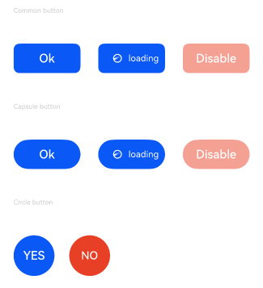
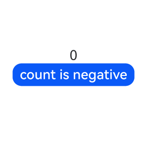
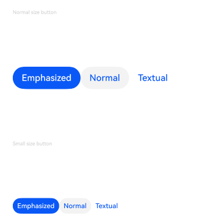

# Button

按钮组件，可快速创建不同样式的按钮。

## 导入模块

```cangjie
import kit.ArkUI.*
```

## 子组件

可以包含单个子组件。

## 创建组件

### init()

```cangjie
public init()
```

**功能：** 创建按钮。

**系统能力：** SystemCapability.ArkUI.ArkUI.Full

**起始版本：** 22

### init(() -> Unit)

```cangjie
public init(child: () -> Unit)
```

**功能：** 创建包含子组件的按钮。

**系统能力：** SystemCapability.ArkUI.ArkUI.Full

**起始版本：** 22

**参数：**

|参数名|类型|必填|默认值|说明|
|:---|:---|:---|:---|:---|
|child|() -> Unit|是|-|按钮包含的子组件。|

### init(ResourceStr)

```cangjie
public init(label: ResourceStr)
```

**功能：** 使用文本内容创建相应的按钮组件，此时Button无法包含子组件。
文本内容默认单行显示。

**系统能力：** SystemCapability.ArkUI.ArkUI.Full

**起始版本：** 22

**参数：**

|参数名|类型|必填|默认值|说明|
|:---|:---|:---|:---|:---|
|label|ResourceStr|是|-|按钮文本内容。当文本字符的长度超过按钮本身的宽度时，文本将会被截断。|

### init(?ButtonOptions)

```cangjie
public init(options: ?ButtonOptions)
```

**功能：** 使用文本内容创建相应的按钮组件，此时Button无法包含子组件。

**系统能力：** SystemCapability.ArkUI.ArkUI.Full

**起始版本：** 22

**参数：**

|参数名|类型|必填|默认值|说明|
|:---|:---|:---|:---|:---|
|options|?ButtonOptions|是|-|配置按钮的显示样式。|

### init(?ButtonOptions, () -> Unit)

```cangjie
public init(options: ?ButtonOptions, child: () -> Unit)
```

**功能：** 创建可以包含子组件且有显示样式的按钮。

**系统能力：** SystemCapability.ArkUI.ArkUI.Full

**起始版本：** 22

**参数：**

|参数名|类型|必填|默认值|说明|
|:---|:---|:---|:---|:---|
|options|?ButtonOptions|是|-|配置按钮的显示样式。|
|child|() -> Unit|是|-|按钮包含的子组件。|

### init(?ResourceStr, ?ButtonOptions)

```cangjie
public init(label: ?ResourceStr, options: ?ButtonOptions)
```

**功能：** 使用文本内容创建相应的按钮组件，此时Button无法包含子组件。
文本内容默认单行显示。

**系统能力：** SystemCapability.ArkUI.ArkUI.Full

**起始版本：** 22

**参数：**

|参数名|类型|必填|默认值|说明|
|:---|:---|:---|:---|:---|
|label|?ResourceStr|是|-|设置文本内容。当文本字符的长度超过按钮本身的宽度时，文本将会被截断。|
|options|?ButtonOptions|是|-|配置按钮的显示样式。|

## 通用属性/通用事件

通用属性：全部支持。

通用事件：全部支持。

## 组件属性

### func buttonStyle(?ButtonStyleMode)

```cangjie
public func buttonStyle(value: ?ButtonStyleMode): This
```

**功能：** 设置Button组件的样式和重要程度。

**系统能力：** SystemCapability.ArkUI.ArkUI.Full

**起始版本：** 22

**参数：**

|参数名|类型|必填|默认值|说明|
|:---|:---|:---|:---|:---|
|value|?ButtonStyleMode|是|-| Button组件的样式和重要程度。|

### func fontColor(?ResourceColor)

```cangjie
public func fontColor(color: ?ResourceColor): This
```

**功能：** 根据指定的Color，设置下拉按钮本身的文本颜色。

**系统能力：** SystemCapability.ArkUI.ArkUI.Full

**起始版本：** 22

**参数：**

|参数名|类型|必填|默认值|说明|
|:---|:---|:---|:---|:---|
|color|?ResourceColor|是|-| 按钮文本颜色。|

### func fontFamily(?ResourceStr)

```cangjie
public func fontFamily(value: ?ResourceStr): This
```

**功能：** 设置字体列表。

**系统能力：** SystemCapability.ArkUI.ArkUI.Full

**起始版本：** 22

**参数：**

|参数名|类型|必填|默认值|说明|
|:---|:---|:---|:---|:---|
|value|?ResourceStr|是|-| 按钮文本内容。|

### func fontSize(?Length)

```cangjie
public func fontSize(value: ?Length): This
```

**功能：** 设置字体大小。

**系统能力：** SystemCapability.ArkUI.ArkUI.Full

**起始版本：** 22

**参数：**

|参数名|类型|必填|默认值|说明|
|:---|:---|:---|:---|:---|
|value|?Length|是|-|按钮文本大小。|

### func fontStyle(?FontStyle)

```cangjie
public func fontStyle(value: ?FontStyle): This
```

**功能：** 设置字体样式。

**系统能力：** SystemCapability.ArkUI.ArkUI.Full

**起始版本：** 22

**参数：**

|参数名|类型|必填|默认值|说明|
|:---|:---|:---|:---|:---|
|value|?FontStyle|是|-| 按钮文本样式。|

### func fontWeight(?FontWeight)

```cangjie
public func fontWeight(value: ?FontWeight): This
```

**功能：** 设置文本的字体粗细，设置过大可能会在不同字体下有截断。

**系统能力：** SystemCapability.ArkUI.ArkUI.Full

**起始版本：** 22

**参数：**

|参数名|类型|必填|默认值|说明|
|:---|:---|:---|:---|:---|
|value|?FontWeight|是|-| 按钮文本粗细。|

### func shape(?ButtonType)

```cangjie
public func shape(value: ?ButtonType): This
```

**功能：** 设置Button组件的形状。

**系统能力：** SystemCapability.ArkUI.ArkUI.Full

**起始版本：** 22

**参数：**

|参数名|类型|必填|默认值|说明|
|:---|:---|:---|:---|:---|
|value|?ButtonType|是|-|按键形状类型。|

### func stateEffect(?Bool)

```cangjie
public func stateEffect(value: ?Bool): This
```

**功能：** 设置是否开启按压态显示效果。

**系统能力：** SystemCapability.ArkUI.ArkUI.Full

**起始版本：** 22

**参数：**

|参数名|类型|必填|默认值|说明|
|:---|:---|:---|:---|:---|
|value|?Bool|是|-|按钮按下时是否开启按压态显示效果，当设置为false时，按压效果关闭。|

## 基础类型定义

### class ButtonOptions

```cangjie
public class ButtonOptions {
    public var shape: ?ButtonType
    public var stateEffect: ?Bool
    public var buttonStyle: ?ButtonStyleMode
    public var controlSize: ?ControlSize
    public var role: ?ButtonRole
    public init(
        shape!: ?ButtonType = None,
        stateEffect!: ?Bool = None,
        buttonStyle!: ?ButtonStyleMode = None,
        controlSize!: ?ControlSize = None,
        role!: ?ButtonRole = None
    )
}
```

**功能：** 配置按钮的显示样式。

**系统能力：** SystemCapability.ArkUI.ArkUI.Full

**起始版本：** 22

#### var buttonStyle

```cangjie
public var buttonStyle: ?ButtonStyleMode
```

**功能：** 描述按钮的样式和重要程度。

**类型：** ?[ButtonStyleMode](#enum-buttonstylemode)

**读写能力：** 可读写

**系统能力：** SystemCapability.ArkUI.ArkUI.Full

**起始版本：** 22

#### var controlSize

```cangjie
public var controlSize: ?ControlSize
```

**功能：** 描述按钮的尺寸。

**类型：** ?[ControlSize](./cj-common-types.md#enum-controlsize)

**读写能力：** 可读写

**系统能力：** SystemCapability.ArkUI.ArkUI.Full

**起始版本：** 22

#### var role

```cangjie
public var role: ?ButtonRole
```

**功能：** 描述按钮的角色。

**类型：** ?[ButtonRole](#enum-buttonrole)

**读写能力：** 可读写

**系统能力：** SystemCapability.ArkUI.ArkUI.Full

**起始版本：** 22

#### var shape

```cangjie
public var shape: ?ButtonType
```

**功能：** 描述按钮的形状。

**类型：** ?[ButtonType](#enum-buttontype)

**读写能力：** 可读写

**系统能力：** SystemCapability.ArkUI.ArkUI.Full

**起始版本：** 22

#### var stateEffect

```cangjie
public var stateEffect: ?Bool
```

**功能：** 按钮按下时是否开启按压态显示效果。

**类型：** ?Bool

**读写能力：** 可读写

**系统能力：** SystemCapability.ArkUI.ArkUI.Full

**起始版本：** 22

#### init(?ButtonType, ?Bool, ?ButtonStyleMode, ?ControlSize, ?ButtonRole)

```cangjie
public init(
    shape!: ?ButtonType = None,
    stateEffect!: ?Bool = None,
    buttonStyle!: ?ButtonStyleMode = None,
    controlSize!: ?ControlSize = None,
    role!: ?ButtonRole = None
)
```

**功能：** 创建ButtonOptions类型的对象。

**系统能力：** SystemCapability.ArkUI.ArkUI.Full

**起始版本：** 22

**参数：**

|参数名|类型|必填|默认值|说明|
|:---|:---|:---|:---|:---|
|shape|?ButtonType|否|None|**命名参数。** 按钮的形状。初始值：ButtonType.Capsule|
|stateEffect|?Bool|否|None|**命名参数。** 按钮按下时是否开启按压态显示效果，当设置为false时，按压效果关闭。初始值：true|
|buttonStyle|?ButtonStyleMode|否|None|**命名参数。** 描述按钮的样式和重要程度。初始值：ButtonStyleMode.Emphasized|
|controlSize|?ControlSize|否|None|**命名参数。** 描述按钮的尺寸。初始值：ControlSize.Normal|
|role|?ButtonRole|否|None|**命名参数。** 描述按钮的角色。初始值：ButtonRole.Normal|

### enum ButtonRole

```cangjie
public enum ButtonRole <: Equatable<ButtonRole> {
    | Normal
    | Error
    | ...
}
```

**功能：** 按钮的角色。

**系统能力：** SystemCapability.ArkUI.ArkUI.Full

**起始版本：** 22

**父类型：**

- Equatable\<ButtonRole>

#### Error

```cangjie
Error
```

**功能：** 警示按钮。

**系统能力：** SystemCapability.ArkUI.ArkUI.Full

**起始版本：** 22

#### Normal

```cangjie
Normal
```

**功能：** 正常按钮。

**系统能力：** SystemCapability.ArkUI.ArkUI.Full

**起始版本：** 22

#### operator func !=(ButtonRole)

```cangjie
public operator func !=(other: ButtonRole): Bool
```

**功能：** 判断两个ButtonRole是否不相等。

**系统能力：** SystemCapability.ArkUI.ArkUI.Full

**起始版本：** 22

**参数：**

|参数名|类型|必填|默认值|说明|
|:---|:---|:---|:---|:---|
|other|[ButtonRole](#enum-buttonrole)|是|-|待比较的另一个枚举值。|

**返回值：**

|类型|说明|
|:----|:----|
|Bool|如果两个枚举值不相等则返回true，否则返回false。|

#### operator func ==(ButtonRole)

```cangjie
public operator func ==(other: ButtonRole): Bool
```

**功能：** 判断两个ButtonRole是否相等。

**系统能力：** SystemCapability.ArkUI.ArkUI.Full

**起始版本：** 22

**参数：**

|参数名|类型|必填|默认值|说明|
|:---|:---|:---|:---|:---|
|other|[ButtonRole](#enum-buttonrole)|是|-|待比较的另一个枚举值。|

**返回值：**

|类型|说明|
|:----|:----|
|Bool|如果两个枚举值相等则返回true，否则返回false。|

### enum ButtonStyleMode

```cangjie
public enum ButtonStyleMode <: Equatable<ButtonStyleMode> {
    | Normal
    | Emphasized
    | Textual
    | ...
}
```

**功能：** 按钮的重要程度。

**系统能力：** SystemCapability.ArkUI.ArkUI.Full

**起始版本：** 22

**父类型：**

- Equatable\<ButtonStyleMode>

#### Emphasized

```cangjie
Emphasized
```

**功能：** 强调按钮（用于强调当前操作）。

**系统能力：** SystemCapability.ArkUI.ArkUI.Full

**起始版本：** 22

#### Normal

```cangjie
Normal
```

**功能：** 普通按钮（一般界面操作）。

**系统能力：** SystemCapability.ArkUI.ArkUI.Full

**起始版本：** 22

#### Textual

```cangjie
Textual
```

**功能：** 文本按钮（纯文本，无背景颜色）。

**系统能力：** SystemCapability.ArkUI.ArkUI.Full

**起始版本：** 22

#### operator func !=(ButtonStyleMode)

```cangjie
public operator func !=(other: ButtonStyleMode): Bool
```

**功能：** 判断两个ButtonStyleMode是否不相等。

**系统能力：** SystemCapability.ArkUI.ArkUI.Full

**起始版本：** 22

**参数：**

|参数名|类型|必填|默认值|说明|
|:---|:---|:---|:---|:---|
|other|[ButtonStyleMode](#enum-buttonstylemode)|是|-|待比较的另一个枚举值。|

**返回值：**

|类型|说明|
|:----|:----|
|Bool|如果两个枚举值不相等则返回true，否则返回false。|

#### operator func ==(ButtonStyleMode)

```cangjie
public operator func ==(other: ButtonStyleMode): Bool
```

**功能：** 判断两个ButtonStyleMode是否相等。

**系统能力：** SystemCapability.ArkUI.ArkUI.Full

**起始版本：** 22

**参数：**

|参数名|类型|必填|默认值|说明|
|:---|:---|:---|:---|:---|
|other|[ButtonStyleMode](#enum-buttonstylemode)|是|-|待比较的另一个枚举值。|

**返回值：**

|类型|说明|
|:----|:----|
|Bool|如果两个枚举值相等则返回true，否则返回false。|

### enum ButtonType

```cangjie
public enum ButtonType <: Equatable<ButtonType> {
    | Normal
    | Capsule
    | Circle
    | RoundRectangle
    | ...
}
```

**功能：** 按键形状类型。

**系统能力：** SystemCapability.ArkUI.ArkUI.Full

**起始版本：** 22

**父类型：**

- Equatable\<ButtonType>

#### Normal

```cangjie
Normal
```

**功能：** 普通按钮（默认不带圆角）。

**系统能力：** SystemCapability.ArkUI.ArkUI.Full

**起始版本：** 22

#### Capsule

```cangjie
Capsule
```

**功能：** 胶囊型按钮（圆角默认为高度的一半）。

**系统能力：** SystemCapability.ArkUI.ArkUI.Full

**起始版本：** 22

#### Circle

```cangjie
Circle
```

**功能：** 圆形按钮。

**系统能力：** SystemCapability.ArkUI.ArkUI.Full

**起始版本：** 22

#### RoundRectangle

```cangjie
RoundRectangle
```

**功能：** 圆角矩形按钮。

**系统能力：** SystemCapability.ArkUI.ArkUI.Full

**起始版本：** 22

#### operator func !=(ButtonType)

```cangjie
public operator func !=(other: ButtonType): Bool
```

**功能：** 判断两个ButtonType是否不相等。

**系统能力：** SystemCapability.ArkUI.ArkUI.Full

**起始版本：** 22

**参数：**

|参数名|类型|必填|默认值|说明|
|:---|:---|:---|:---|:---|
|other|[ButtonType](#enum-buttontype)|是|-|待比较的另一个枚举值。|

**返回值：**

|类型|说明|
|:----|:----|
|Bool|如果两个枚举值不相等则返回true，否则返回false。|

#### operator func ==(ButtonType)

```cangjie
public operator func ==(other: ButtonType): Bool
```

**功能：** 判断两个ButtonType是否相等。

**系统能力：** SystemCapability.ArkUI.ArkUI.Full

**起始版本：** 22

**参数：**

|参数名|类型|必填|默认值|说明|
|:---|:---|:---|:---|:---|
|other|[ButtonType](#enum-buttontype)|是|-|待比较的另一个枚举值。|

**返回值：**

|类型|说明|
|:----|:----|
|Bool|如果两个枚举值相等则返回true，否则返回false。|

## 示例代码

### 示例1（设置按钮的显示样式）

该示例实现了两种创建按钮的方式，包含子组件或使用文本内容创建相应的按钮。

<!-- run -->

```cangjie

package ohos_app_cangjie_entry
import kit.ArkUI.*
import ohos.arkui.state_macro_manage.*
import ohos.hilog.*

func loggerInfo(str: String) {
    Hilog.info(0, "CangjieTest", str)
}

@Entry
@Component
class EntryView {
    func build() {
        Flex(direction: FlexDirection.Column, alignItems: ItemAlign.Start, justifyContent: FlexAlign.SpaceBetween) {
            Text("Common button").fontSize(9).fontColor(0xCCCCCC)

            Flex(alignItems: ItemAlign.Center, justifyContent: FlexAlign.SpaceBetween) {
                Button("Ok").shape(ButtonType.Normal).stateEffect(true).borderRadius(8)
                    .width(90)
                Button(ButtonOptions()) {
                    Row() {
                        LoadingProgress().width(20).height(20).color(Color.White)
                        Text("loading").fontSize(12).fontColor(0xffffff).margin(left: 5, right: 12)
                    }.alignItems(VerticalAlign.Center).width(90).height(40)
                }.shape(ButtonType.Normal).stateEffect(true).borderRadius(8).width(90)
                Button("Disable").shape(ButtonType.Normal).stateEffect(true).opacity(0.5)
                    .borderRadius(8).width(90)
                }

            Text("Capsule button").fontSize(9).fontColor(0xCCCCCC)

            Flex(alignItems: ItemAlign.Center, justifyContent: FlexAlign.SpaceBetween) {
                Button("Ok").shape(ButtonType.Capsule).stateEffect(true).borderRadius(8)
                    .width(90)
                Button(ButtonOptions()) {
                    Row() {
                        LoadingProgress().width(20).height(20).color(Color.White)
                        Text("loading").fontSize(12).fontColor(0xffffff).margin(left: 5, right: 12)
                    }.alignItems(VerticalAlign.Center).width(90).height(40)
                }.shape(ButtonType.Capsule).stateEffect(true).borderRadius(8).width(90)
                .onClick({ evt =>
                    loggerInfo("The login is successful")
                })
                Button("Disable").shape(ButtonType.Capsule).stateEffect(true).opacity(0.5)
                    .borderRadius(8).width(90)
            }

            Text("Circle button").fontSize(9).fontColor(0xCCCCCC)

            Flex(alignItems: ItemAlign.Center, wrap: FlexWrap.Wrap) {
                Button("YES").shape(ButtonType.Circle).stateEffect(true).width(55)
                    .height(55)
                Button("NO").shape(ButtonType.Capsule).stateEffect(true).width(55)
                    .height(55).margin(left: 20).fontSize(15)
                }
        }.height(400).padding(left: 35, right: 35, top: 35)
    }
}
```



### 示例2（为按钮添加渲染控制）

该示例通过if/else控制按钮的显示文本。

<!-- run -->

```cangjie

package ohos_app_cangjie_entry
import kit.ArkUI.*
import ohos.arkui.state_macro_manage.*

@Entry
@Component
class EntryView {
    @State var count: UInt32 = 0
    func build() {
        Column() {
            Text('${this.count}')
                .fontSize(30)
                .onClick({ evt =>
                    this.count ++
                })
          if (this.count <= 0) {
            Button('count is negative').fontSize(30).height(50)
          } else if (this.count % 2 == 0) {
            Button('count is even').fontSize(30).height(50)
          } else {
            Button('count is odd').fontSize(30).height(50)
          }
        }.height(100.percent).width(100.percent).justifyContent(FlexAlign.Center)
    }
}
```



### 示例3（设置不同尺寸按钮的重要程度）

该示例通过配置controlSize、buttonStyle实现不同尺寸按钮的重要程度。

<!-- run -->

```cangjie

package ohos_app_cangjie_entry
import kit.ArkUI.*
import ohos.arkui.state_macro_manage.*

@Entry
@Component
class EntryView {
    @State var txt: String = 'overflowTextOverlengthTextOverflow.Clip'
    func build() {
        Flex(direction: FlexDirection.Column, alignItems: ItemAlign.Start, justifyContent: FlexAlign.SpaceBetween) {
            Text('Normal size button').fontSize(9).fontColor(0xCCCCCC)
            Flex(alignItems: ItemAlign.Center, wrap: FlexWrap.Wrap) {
                Button('Emphasized').buttonStyle(ButtonStyleMode.Emphasized)
                Button('Normal').buttonStyle(ButtonStyleMode.Normal)
                Button('Textual').buttonStyle(ButtonStyleMode.Textual)
            }

            Text('Small size button').fontSize(9).fontColor(0xCCCCCC)
            Flex(alignItems: ItemAlign.Center, wrap: FlexWrap.Wrap) {
                Button('Emphasized', ButtonOptions(controlSize: ControlSize.Small)).buttonStyle(ButtonStyleMode.Emphasized)
                Button('Normal', ButtonOptions(controlSize: ControlSize.Small)).buttonStyle(ButtonStyleMode.Normal)
                Button('Textual', ButtonOptions(controlSize: ControlSize.Small)).buttonStyle(ButtonStyleMode.Textual)
            }
        }.height(400).padding(left: 35, right: 35, top: 35)
    }
}
```



### 示例4（设置按钮的角色）

该示例通过配置role实现按钮的角色。

<!-- run -->

```cangjie

package ohos_app_cangjie_entry
import kit.ArkUI.*
import ohos.arkui.state_macro_manage.*

@Entry
@Component
class EntryView {
    @State var txt: String = 'overflowTextOverlengthTextOverflow.Clip'
    func build() {
        Flex(direction: FlexDirection.Column, alignItems: ItemAlign.Start, justifyContent: FlexAlign.SpaceBetween) {
            Text('Role is Normal button').fontSize(9).fontColor(0xCCCCCC)
            Flex(alignItems: ItemAlign.Center, wrap: FlexWrap.Wrap) {
                Button('Emphasized', ButtonOptions(role: ButtonRole.Normal)).buttonStyle(ButtonStyleMode.Emphasized)
                Button('Normal', ButtonOptions(role: ButtonRole.Normal)).buttonStyle(ButtonStyleMode.Normal)
                Button('Textual', ButtonOptions(role: ButtonRole.Normal)).buttonStyle(ButtonStyleMode.Textual);
            }

            Text('Role is Error button').fontSize(9).fontColor(0xCCCCCC)
            Flex(alignItems: ItemAlign.Center, wrap: FlexWrap.Wrap) {
                Button('Emphasized', ButtonOptions(role: ButtonRole.Error)).buttonStyle(ButtonStyleMode.Emphasized)
                Button('Normal', ButtonOptions(role: ButtonRole.Error)).buttonStyle(ButtonStyleMode.Normal)
                Button('Textual', ButtonOptions(role: ButtonRole.Error)).buttonStyle(ButtonStyleMode.Textual);
            }
        }.height(400).padding(left: 35, right: 35, top: 35)
    }
}
```


