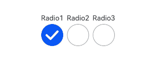

# Radio

单选框，提供相应的用户交互选择项。

## 导入模块

```cangjie
import kit.ArkUI.*
```

## 子组件

无

## 创建组件

### init(?String, ?String)

```cangjie
public init(value!: ?String, group!: ?String)
```

**功能：** 创建单选框组件。

**系统能力：** SystemCapability.ArkUI.ArkUI.Full

**起始版本：** 22

**参数：**

|参数名|类型|必填|默认值|说明|
|:---|:---|:---|:---|:---|
|value|?String|是|-|**命名参数。** 当前单选框的值。<br>初始值：""。|
|group|?String|是|-|**命名参数。** 当前单选框的所属群组名称，相同group的Radio只能有一个被选中。<br>初始值：""。|

## 通用属性/通用事件

通用属性：全部支持。

通用事件：全部支持。

## 组件属性

### func checked(?Bool)

```cangjie
public func checked(value: ?Bool): This
```

**功能：** 单选框的选中状态。

**系统能力：** SystemCapability.ArkUI.ArkUI.Full

**起始版本：** 22

**参数：**

|参数名|类型|必填|默认值|说明|
|:---|:---|:---|:---|:---|
|value|?Bool|是|-|设置单选框的选中状态。<br>初始值：false。<br>**说明**：value为true时，表示从未选中变为选中。value为false时，表示从选中变为未选中。|

## 组件事件

### func onChange(?(Bool) -> Unit)

```cangjie
public func onChange(callback: ?(Bool) -> Unit): This
```

**功能：** 单选框选中状态改变时触发该事件。

**系统能力：** SystemCapability.ArkUI.ArkUI.Full

**起始版本：** 22

**参数：**

|参数名|类型|必填|默认值|说明|
|:---|:---|:---|:---|:---|
|callback|?(Bool)->Unit|是|-|单选框的状态。<br>初始值：{ _ => }。|


## 示例代码

该示例通过配置checkedBackgroundColor实现自定义单选框的底板颜色。

<!-- run -->

```cangjie

package ohos_app_cangjie_entry
import kit.ArkUI.*
import ohos.arkui.state_macro_manage.*

@Entry
@Component
class EntryView {
    @State var radioName: String = "Null"

    func build() {
        Flex(direction: FlexDirection.Row, justifyContent: FlexAlign.Center, alignItems: ItemAlign.Center) {
            Column() {
                Text("Radio1")
                Radio(group: "radioGroup", value: "Radio1").checked(true).height(50).width(50)
            }
            Column() {
                Text("Radio2")
                Radio(group: "radioGroup", value: "Radio2").checked(true).height(50).width(50)
            }
            Column() {
                Text("Radio3")
                Radio(group: "radioGroup", value: "Radio3").checked(true).height(50).width(50)
            }
        }
    }
}
```



