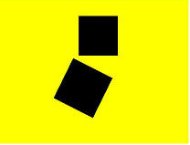

# Matrix2D

矩阵对象，可以对矩阵进行缩放、旋转、平移等变换。

## 导入模块

```cangjie
import kit.ArkUI.*
```

## class Matrix2D

```cangjie
public class Matrix2D {
    public init(unit!: LengthMetricsUnit = LengthMetricsUnit.DEFAULT)
}
```

**功能：** 矩阵对象类型。

**系统能力：** SystemCapability.ArkUI.ArkUI.Full

**起始版本：** 21

### prop rotateX

```cangjie
public mut prop rotateX: Float64
```

**功能：** 水平倾斜系数。

**系统能力：** SystemCapability.ArkUI.ArkUI.Full

**类型：** Float64

**读写能力：** 可读写

**起始版本：** 21

### prop rotateY

```cangjie
public mut prop rotateY: Float64
```

**功能：** 垂直倾斜系数。

**系统能力：** SystemCapability.ArkUI.ArkUI.Full

**类型：** Float64

**读写能力：** 可读写

**起始版本：** 21

### prop scaleX

```cangjie
public mut prop scaleX: Float64
```

**功能：** 水平缩放系数。

**系统能力：** SystemCapability.ArkUI.ArkUI.Full

**类型：** Float64

**读写能力：** 可读写

**起始版本：** 21

### prop scaleY

```cangjie
public mut prop scaleY: Float64
```

**功能：** 垂直缩放系数。

**系统能力：** SystemCapability.ArkUI.ArkUI.Full

**类型：** Float64

**读写能力：** 可读写

**起始版本：** 21

### prop translateX

```cangjie
public mut prop translateX: Float64
```

**功能：** 水平平移距离。默认单位：vp。

**系统能力：** SystemCapability.ArkUI.ArkUI.Full

**类型：** Float64

**读写能力：** 可读写

**起始版本：** 21

### prop translateY

```cangjie
public mut prop translateY: Float64
```

**功能：** 垂直平移距离。默认单位：vp。

**系统能力：** SystemCapability.ArkUI.ArkUI.Full

**类型：** Float64

**读写能力：** 可读写

**起始版本：** 21

### init(LengthMetricsUnit)

```cangjie
public init(unit!: LengthMetricsUnit = LengthMetricsUnit.Default)
```

**功能：** 创建Matrix2D类型的矩阵对象。

**系统能力：** SystemCapability.ArkUI.ArkUI.Full

**起始版本：** 21

**参数：**

|参数名|类型|必填|默认值|说明|
|:---|:---|:---|:---|:---|
|unit|[LengthMetricsUnit](./cj-common-types.md#enum-lengthmetricsunit)|否|LengthMetricsUnit.Default|**命名参数。** 用来配置Matrix2D对象的单位模式，配置后无法动态更改，配置方法同[CanvasRenderingContext2D](./cj-canvas-drawing-canvasrenderingcontext2d.md#class-canvasrenderingcontext2d)。|

### func identity()

```cangjie
public func identity(): This
```

**功能：** 创建一个单位矩阵。

**系统能力：** SystemCapability.ArkUI.ArkUI.Full

**起始版本：** 21

### func invert()

```cangjie
public func invert(): This
```

**功能：** 得到当前矩阵的逆矩阵。

**系统能力：** SystemCapability.ArkUI.ArkUI.Full

**起始版本：** 21

### func rotate(Float64, Float64, Float64)

```cangjie
public func rotate(degree: Float64, rx!: Float64 = 0.0, ry!: Float64 = 0.0): This
```

**功能：** 以旋转点为中心，对当前矩阵进行右乘旋转运算。

**系统能力：** SystemCapability.ArkUI.ArkUI.Full

**起始版本：** 21

**参数：**

|参数名|类型|必填|默认值|说明|
|:---|:---|:---|:---|:---|
|degree|Float64|是|-|旋转角度。顺时针方向为正角度，可以通过 degree * Math.PI / 180 将角度转换为弧度值。默认单位：弧度。|
|rx|Float64|否|0.0|**命名参数。** 旋转点的水平方向坐标。默认单位：vp。|
|ry|Float64|否|0.0|**命名参数。** 旋转点的垂直方向坐标。默认单位：vp。|

### func scale(Float64, Float64)

```cangjie
public func scale(sx!: Float64 = 1.0, sy!: Float64 = 1.0): This
```

**功能：** 对当前矩阵进行右乘缩放运算。

**系统能力：** SystemCapability.ArkUI.ArkUI.Full

**起始版本：** 21

**参数：**

|参数名|类型|必填|默认值|说明|
|:---|:---|:---|:---|:---|
|sx|Float64|否|1.0|**命名参数。** 水平缩放比例系数。|
|sy|Float64|否|1.0|**命名参数。** 垂直缩放比例系数。|

### func translate(Float64, Float64)

```cangjie
public func translate(tx!: Float64 = 0.0, ty!: Float64 = 0.0): This
```

**功能：** 对当前矩阵进行左乘平移运算。

**系统能力：** SystemCapability.ArkUI.ArkUI.Full

**起始版本：** 21

**参数：**

|参数名|类型|必填|默认值|说明|
|:---|:---|:---|:---|:---|
|tx|Float64|否|0.0|**命名参数。** 水平方向平移距离。默认单位：vp。|
|ty|Float64|否|0.0|**命名参数。** 垂直方向平移距离。默认单位：vp。|

## 示例代码

<!-- run -->

```cangjie

package ohos_app_cangjie_entry

import kit.ArkUI.*
import ohos.arkui.state_macro_manage.*

@Entry
@Component
class EntryView {
    private let settings: RenderingContextSettings = RenderingContextSettings(antialias: true)
    private let context1: CanvasRenderingContext2D = CanvasRenderingContext2D(this.settings)
    private let matrix: Matrix2D = Matrix2D()

    func build() {
        Row {
            Canvas(this.context1)
                .width(240.vp)
                .height(180.vp)
                .backgroundColor(0xffff00)
                .onReady(
                    {
                        =>
                        this.context1.fillRect(100.0, 20.0, 50.0, 50.0)
                        this.matrix.scaleX = 1.0
                        this.matrix.scaleY = 1.0
                        this.matrix.rotateX = -0.5
                        this.matrix.rotateY = 0.5
                        this.matrix.translateX = 10.0
                        this.matrix.translateY = 10.0
                        this.context1.setTransform(this.matrix)
                        this.context1.fillRect(100.0, 20.0, 50.0, 50.0)
                    }
                )
        }.height(100.percent).width(100.percent)
    }
}
```


