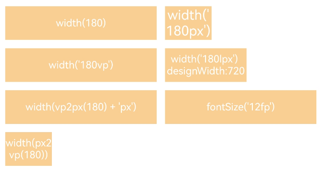

# 像素单位

仓颉提供4种像素单位，采用vp为基准数据单位。

|名称|描述|
|:---|:---|
| px | 屏幕物理像素单位。|
| vp | 屏幕密度相关像素，根据屏幕像素密度转换为屏幕物理像素，当数值不带单位时，默认单位vp。在实际宽度为1440物理像素的屏幕上，1vp约等于3px。<br/>**说明：** <br/> vp与px的比例与屏幕像素密度有关。|
| fp | 字体像素，与vp类似适用屏幕密度变化，随系统字体大小设置变化。 |
| lpx | 视窗逻辑像素单位，lpx单位为实际屏幕宽度与逻辑宽度（通过designWidth配置）的比值，designWidth默认值为720。当designWidth为720时，在实际宽度为1440物理像素的屏幕上，1lpx为2px大小。 |

## 导入模块

```cangjie
import kit.ArkUI.*
```

## func fp2px(Length)

```cangjie
public func fp2px(value: Length): Option<Length>
```

**功能：** 将fp单位的数值转换为以px为单位的数值。

**系统能力：** SystemCapability.ArkUI.ArkUI.Full

**起始版本：** 22

**参数：**

|参数名|类型|必填|默认值|说明|
|:---|:---|:---|:---|:---|
|value|[Length](./cj-common-types.md#interface-length)|是|-|需转换的fp单位的数值。|

**返回值：**

|类型|说明|
|:----|:----|
|Option\<[Length](./cj-common-types.md#interface-length)>|转换后以px为单位的数值。|

## func lpx2px(Length)

```cangjie
public func lpx2px(value: Length): Option<Length>
```

**功能：** 将lpx单位的数值转换为以px为单位的数值。

**系统能力：** SystemCapability.ArkUI.ArkUI.Full

**起始版本：** 22

**参数：**

|参数名|类型|必填|默认值|说明|
|:---|:---|:---|:---|:---|
|value|[Length](./cj-common-types.md#interface-length)|是|-|需转换的lpx单位的数值。|

**返回值：**

|类型|说明|
|:----|:----|
|Option\<[Length](./cj-common-types.md#interface-length)>|转换后以px为单位的数值。|

## func px2fp(Length)

```cangjie
public func px2fp(value: Length): Option<Length>
```

**功能：** 将px单位的数值转换为以fp为单位的数值。

**系统能力：** SystemCapability.ArkUI.ArkUI.Full

**起始版本：** 22

**参数：**

|参数名|类型|必填|默认值|说明|
|:---|:---|:---|:---|:---|
|value|[Length](./cj-common-types.md#interface-length)|是|-|需转换的px单位的数值。|

**返回值：**

|类型|说明|
|:----|:----|
|Option\<[Length](./cj-common-types.md#interface-length)>|转换后以fp为单位的数值。|

## func px2lpx(Length)

```cangjie
public func px2lpx(value: Length): Option<Length>
```

**功能：** 将px单位的数值转换为以lpx为单位的数值。

**系统能力：** SystemCapability.ArkUI.ArkUI.Full

**起始版本：** 22

**参数：**

|参数名|类型|必填|默认值|说明|
|:---|:---|:---|:---|:---|
|value|[Length](./cj-common-types.md#interface-length)|是|-|需转换的px单位的数值。|

**返回值：**

|类型|说明|
|:----|:----|
|Option\<[Length](./cj-common-types.md#interface-length)>|转换后以lpx为单位的数值。|

## func px2vp(Length)

```cangjie
public func px2vp(value: Length): Option<Length>
```

**功能：** 将px单位的数值转换为以vp为单位的数值。<br>说明：默认使用当前UI实例所在屏幕的虚拟像素比进行转换，UI实例未创建时，使用默认屏幕的虚拟像素比进行转换。

**系统能力：** SystemCapability.ArkUI.ArkUI.Full

**起始版本：** 22

**参数：**

|参数名|类型|必填|默认值|说明|
|:---|:---|:---|:---|:---|
|value|[Length](./cj-common-types.md#interface-length)|是|-|需转换的px单位的数值。|

**返回值：**

|类型|说明|
|:----|:----|
|Option\<[Length](./cj-common-types.md#interface-length)>|转换后以vp为单位的数值。|

## func vp2px(Length)

```cangjie
public func vp2px(value: Length): Option<Length>
```

**功能：** 将vp单位的数值转换为以px为单位的数值。<br>说明：默认使用当前UI实例所在屏幕的虚拟像素比进行转换，UI实例未创建时，使用默认屏幕的虚拟像素比进行转换。

**系统能力：** SystemCapability.ArkUI.ArkUI.Full

**起始版本：** 22

**参数：**

|参数名|类型|必填|默认值|说明|
|:---|:---|:---|:---|:---|
|value|[Length](./cj-common-types.md#interface-length)|是|-|需转换的vp单位的数值。|

**返回值：**

|类型|说明|
|:----|:----|
|Option\<[Length](./cj-common-types.md#interface-length)>|转换后以px为单位的数值。|

## 示例代码

<!-- run -->

```cangjie

package ohos_app_cangjie_entry

import kit.ArkUI.*
import ohos.arkui.state_macro_manage.*

@Entry
@Component
class EntryView {
    @State var isShow: Bool = false
    func build() {
        Column() {
            Flex(wrap: FlexWrap.Wrap) {
                Column() {
                    Text("width(180)")
                        .width(180)
                        .height(40)
                        .backgroundColor(0xF9CF93)
                        .textAlign(TextAlign.Center)
                        .fontColor(Color.White)
                        .fontSize(22.vp)
                }.margin(5)

                Column() {
                    Text("width('180px')")
                        .width(180.px)
                        .height(40)
                        .backgroundColor(0xF9CF93)
                        .textAlign(TextAlign.Center)
                        .fontColor(Color.White)
                }.margin(5)

                Column() {
                    Text("width('180vp')")
                        .width(180.vp)
                        .height(40)
                        .backgroundColor(0xF9CF93)
                        .textAlign(TextAlign.Center)
                        .fontColor(Color.White)
                        .fontSize(22.vp)
                }.margin(5)

                Column() {
                    Text("width('180lpx') designWidth:720")
                        .width(180.lpx)
                        .height(40)
                        .backgroundColor(0xF9CF93)
                        .textAlign(TextAlign.Center)
                        .fontColor(Color.White)
                        .fontSize(22.vp)
                }.margin(5)

                Column() {
                    Text("width(vp2px(180) + 'px')")
                        .width(getUIContext().vp2px(180.vp) ?? 180.vp)
                        .height(40)
                        .backgroundColor(0xF9CF93)
                        .textAlign(TextAlign.Center)
                        .fontColor(Color.White)
                        .fontSize(22.vp)
                }.margin(5)

                Column() {
                    Text("fontSize('22fp')")
                        .width(180)
                        .height(40)
                        .backgroundColor(0xF9CF93)
                        .textAlign(TextAlign.Center)
                        .fontColor(Color.White)
                        .fontSize(22.fp)
                }.margin(5)

                Column() {
                    Text("width(px2vp(180))")
                        .width(getUIContext().px2vp(180.px) ?? 180.px )
                        .height(40)
                        .backgroundColor(0xF9CF93)
                        .textAlign(TextAlign.Center)
                        .fontColor(Color.White)
                        .fontSize(22.fp)
                }.margin(5)
            }.width(100.percent)
        }
    }
}

```

