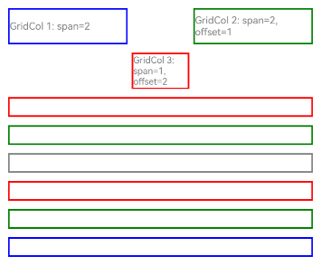
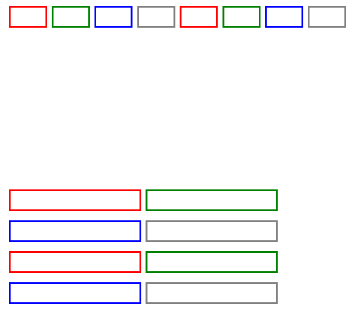

# GridCol

栅格子组件，必须作为栅格容器组件([GridRow](./cj-grid-layout-gridrow.md))的子组件使用。

## 导入模块

```cangjie
import kit.ArkUI.*
```

## 子组件

可以包含单个子组件。

## 创建组件

### init(?Int32, ?Int32, ?Int32, () -> Unit)

```cangjie
public init(span!: ?Int32 = None, offset!: ?Int32 = None, order!: ?Int32 = None, child!: () -> Unit = {=>})
```

**功能：** 创建一个栅格布局子组件。

**系统能力：** SystemCapability.ArkUI.ArkUI.Full

**起始版本：** 22

**参数：**

|参数名|类型|必填|默认值|说明|
|:---|:---|:---|:---|:---|
|span|?Int32|否|None| **命名参数。** 栅格子组件占用栅格容器组件([GridRow](./cj-grid-layout-gridrow.md))的列数。<br>span为0表示该元素不参与布局计算，即不会被渲染。<br>初始值：1|
|offset|?Int32|否|None| **命名参数。** 栅格子组件相对于前一个栅格子组件偏移的列数。<br>初始值：0|
|order|?Int32|否|None| **命名参数。** 元素的序号，根据栅格子组件的序号，从小到大对栅格子组件做排序。<br>初始值：0|
|child|() -> Unit|否|{=>}| **命名参数。** GridCol容器的子组件。|

### init(?GridColOptions, ?GridColOptions, ?GridColOptions, () -> Unit)

```cangjie
public init(
    span!: ?GridColOptions,
    offset!: ?GridColOptions,
    order!: ?GridColOptions,
    child!: () -> Unit = {=>}
)
```

**功能：** 创建栅格子组件。

**系统能力：** SystemCapability.ArkUI.ArkUI.Full

**起始版本：** 22

**参数：**

|参数名|类型|必填|默认值|说明|
|:---|:---|:---|:---|:---|
|span|?GridColOptions|否|None| **命名参数。** 占用列数。<br>初始值：GridColOptions(1)|
|offset|?GridColOptions|否|None| **命名参数。** 相对于前一个栅格子组件偏移的列数。<br>初始值：GridColOptions(0)|
|order|?GridColOptions|否|None| **命名参数。** 元素的序号，根据栅格子组件的序号，从小到大对栅格子组件做排序。<br>初始值：GridColOptions(0)|
|child|() -> Unit|否|{=>}| **命名参数。** GridCol 容器的子组件。|

## 通用属性/通用事件

通用属性：全部支持。

通用事件：全部支持。

## 组件属性

### func gridColOffset(?Int32)

```cangjie
public func gridColOffset(value: ?Int32): This
```

**功能：** 设置相对于前一个栅格子组件偏移的列数。

**系统能力：** SystemCapability.ArkUI.ArkUI.Full

**起始版本：** 22

**参数：**

|参数名|类型|必填|默认值|说明|
|:---|:---|:---|:---|:---|
|value|?Int32|否|-|相对于前一个栅格子组件偏移的列数。<br>初始值：12。|

### func gridColOffset(?GridColOptions)

```cangjie
public func gridColOffset(value: ?GridColOptions): This
```

**功能：** 设置相对于前一个栅格子组件偏移的列数。

**系统能力：** SystemCapability.ArkUI.ArkUI.Full

**起始版本：** 22

**参数：**

|参数名|类型|必填|默认值|说明|
|:---|:---|:---|:---|:---|
|value|?GridColOptions|否|-|相对于前一个栅格子组件偏移的列数。|

### func order(?Int32)

```cangjie
public func order(value: ?Int32): This
```

**功能：** 设置相对于前一个栅格子组件偏移的列数。

**系统能力：** SystemCapability.ArkUI.ArkUI.Full

**起始版本：** 22

**参数：**

|参数名|类型|必填|默认值|说明|
|:---|:---|:---|:---|:---|
|value|?Int32|否|-|相对于前一个栅格子组件偏移的列数。<br>初始值：12。|

### func order(?GridColOptions)

```cangjie
public func order(value: ?GridColOptions): This
```

**功能：** 设置元素的序号，根据栅格子组件的序号，从小到大对栅格子组件做排序。

**系统能力：** SystemCapability.ArkUI.ArkUI.Full

**起始版本：** 22

**参数：**

|参数名|类型|必填|默认值|说明|
|:---|:---|:---|:---|:---|
|value|?GridColOptions|否|-|元素的序号。|

### func span(?Int32)

```cangjie
public func span(value: ?Int32): This
```

**功能：** 设置占用列数。

**系统能力：** SystemCapability.ArkUI.ArkUI.Full

**起始版本：** 22

**参数：**

|参数名|类型|必填|默认值|说明|
|:---|:---|:---|:---|:---|
|value|?Int32|否|-|占用列数。<br>初始值：12。<br>span为0表示该元素不参与布局计算，即不会被渲染。|

### func span(?GridColOptions)

```cangjie
public func span(value: ?GridColOptions): This
```

**功能：** 设置占用列数。

**系统能力：** SystemCapability.ArkUI.ArkUI.Full

**起始版本：** 22

**参数：**

|参数名|类型|必填|默认值|说明|
|:---|:---|:---|:---|:---|
|value|?GridColOptions|否|-|占用列数。<br>span为0表示该元素不参与布局计算，即不会被渲染。|

## 基础类型定义

### class GridColOptions

```cangjie
public class GridColOptions {
    public var xs: ?Int32
    public var sm: ?Int32
    public var md: ?Int32
    public var lg: ?Int32
    public var xl: ?Int32
    public var xxl: ?Int32
    public init(
        xs!: ?Int32 = None,
        sm!: ?Int32 = None,
        md!: ?Int32 = None,
        lg!: ?Int32 = None,
        xl!: ?Int32 = None,
        xxl!: ?Int32 = None
    )
    public init(value: ?Int32)
}
```

**功能：** 用于自定义指定在不同宽度设备类型上，栅格子组件占据的栅格数量单位。

**系统能力：** SystemCapability.ArkUI.ArkUI.Full

**起始版本：** 22

**父类型：** 无

#### var lg

```cangjie
public var lg: ?Int32
```

**功能：** 在栅格大小为lg的设备上，栅格子组件占据的列数或偏移的列数。

**类型：** ?Int32

**读写能力：** 可读写

**系统能力：** SystemCapability.ArkUI.ArkUI.Full

**起始版本：** 22

#### var md

```cangjie
public var md: ?Int32
```

**功能：** 在栅格大小为md的设备上，栅格子组件占据的列数或偏移的列数。

**类型：** ?Int32

**读写能力：** 可读写

**系统能力：** SystemCapability.ArkUI.ArkUI.Full

**起始版本：** 22

#### var sm

```cangjie
public var sm: ?Int32
```

**功能：** 在栅格大小为sm的设备上，栅格子组件占据的列数或偏移的列数。

**类型：** ?Int32

**读写能力：** 可读写

**系统能力：** SystemCapability.ArkUI.ArkUI.Full

**起始版本：** 22

#### var xl

```cangjie
public var xl: ?Int32
```

**功能：** 在栅格大小为xl的设备上，栅格子组件占据的列数或偏移的列数。

**类型：** ?Int32

**读写能力：** 可读写

**系统能力：** SystemCapability.ArkUI.ArkUI.Full

**起始版本：** 22

#### var xs

```cangjie
public var xs: ?Int32
```

**功能：** 在栅格大小为xs的设备上，栅格子组件占据的列数或偏移的列数。

**类型：** ?Int32

**读写能力：** 可读写

**系统能力：** SystemCapability.ArkUI.ArkUI.Full

**起始版本：** 22

#### var xxl

```cangjie
public var xxl: ?Int32
```

**功能：** 在栅格大小为xxl的设备上，栅格子组件占据的列数或偏移的列数。

**类型：** ?Int32

**读写能力：** 可读写

**系统能力：** SystemCapability.ArkUI.ArkUI.Full

**起始版本：** 22

#### init(?Int32, ?Int32, ?Int32, ?Int32, ?Int32, ?Int32)

```cangjie
public init(
    xs!: ?Int32 = None,
    sm!: ?Int32 = None,
    md!: ?Int32 = None,
    lg!: ?Int32 = None,
    xl!: ?Int32 = None,
    xxl!: ?Int32 = None
)
```

**功能：** 构造一个GridColOptions对象。

**系统能力：** SystemCapability.ArkUI.ArkUI.Full

**起始版本：** 22

**参数：**

|参数名|类型|必填|默认值|说明|
|:---|:---|:---|:---|:---|
|xs|?Int32|否|None| **命名参数。** 在栅格大小为xs的设备上，栅格子组件占据的列数或偏移的列数。<br>初始值：12|
|sm|?Int32|否|None| **命名参数。** 在栅格大小为sm的设备上，栅格子组件占据的列数或偏移的列数。<br>初始值：12|
|md|?Int32|否|None| **命名参数。** 在栅格大小为md的设备上，栅格子组件占据的列数或偏移的列数。<br>初始值：12|
|lg|?Int32|否|None| **命名参数。** 在栅格大小为lg的设备上，栅格子组件占据的列数或偏移的列数。<br>初始值：12|
|xl|?Int32|否|None| **命名参数。** 在栅格大小为xl的设备上，栅格子组件占据的列数或偏移的列数。<br>初始值：12|
|xxl|?Int32|否|None| **命名参数。** 在栅格大小为xxl的设备上，栅格子组件占据的列数或偏移的列数。<br>初始值：12|

#### init(?Int32)

```cangjie
public init(value: ?Int32)
```

**功能：** 构造一个GridColOptions对象。

**系统能力：** SystemCapability.ArkUI.ArkUI.Full

**起始版本：** 22

**参数：**

|参数名|类型|必填|默认值|说明|
|:---|:---|:---|:---|:---|
|value|?Int32|是|-|在任意栅格大小的设备上，栅格子组件占据的列数或偏移的列数。<br>初始值：12|

## 示例代码

### GridCol常用方法示例

该示例用于说明GridCol常用方法、构造函数以及循环渲染的使用，并展示span、offset的效果。

<!-- run -->

```cangjie
package ohos_app_cangjie_entry
import kit.ArkUI.*
import ohos.arkui.state_macro_manage.*

@Entry
@Component
class EntryView {
    var bgColors: Array<Color> = [Color.Red, Color.Green, Color.Gray, Color.Red, Color.Green, Color.Blue, Color.Gray]
    var currentBp: String = ""
    func build() {
        Column {
            //GridRow设置中一行有5列
            GridRow(
                columns: 5,
                gutter: GutterOptions(x: 5.vp, y: 10.vp),
                breakpoints: BreakPoints(
                    value: [400.vp, 600.vp, 800.vp],
                    reference: BreakpointsReference.WindowSize
                ),
                direction: GridRowDirection.Row
            ) {
                //GridCol栅格子组件，必须作为栅格容器组件(GridRow)的子组件使用。
                //构造第1个GridCol子组件，栅格占2列，为第1,2列
                GridCol() {
                    Row() {
                        Text("GridCol 1: span=2")
                            .fontColor(Color.Gray)
                            .fontSize(12)
                    }
                        .width(100.percent)
                        .height(40.vp)
                }
                .borderColor(Color.Blue)
                .borderWidth(2.vp)
                .span(2)
                //构造第2个GridCol子组件，栅格占2列，离上一个栅格的偏移列数为1列，因此该栅格占第4.5列
                GridCol() {
                    Row() {
                        Text("GridCol 2: span=2, offset=1")
                            .fontColor(Color.Gray)
                            .fontSize(12)
                    }
                    .width(100.percent)
                    .height(40.vp)
                }
                .borderColor(Color.Green)
                .borderWidth(2.vp)
                .span(2)
                .gridColOffset(1)
                //构造第3个GridCol子组件，栅格占1列，距离上一个栅格偏移列数为2列，由于换行，因此该栅格占下一行的第3列
                GridCol() {
                    Row() {
                        Text("GridCol 3: span=1, offset=2")
                            .fontColor(Color.Gray)
                            .fontSize(11)
                    }
                    .width(100.percent)
                    .height(40.vp)
                }
                .borderColor(Color.Red)
                .borderWidth(2.vp)
                .span(1)
                .gridColOffset(2)

                //循环渲染栅格子组件
                ForEach(
                    bgColors,
                    itemGeneratorFunc: {
                        color: Color, index: Int64 => GridCol() {
                            Row().height(20.vp)
                        }
                        .borderWidth(2.vp)
                        .borderColor(color)
                        .span(GridColOptions(xs: 12, sm: 12, md: 12, lg: 12, xl: 12, xxl: 12))
                        .id("my_GridCol")
                    }
                )
            }
            .width(100.percent)
            .height(100.percent)
            .onBreakpointChange({
                bp => currentBp = bp
            })
            .alignItems(ItemAlign.Center)
        }
        .margin(left: 10, right:10, top: 5, bottom: 5)
        .height(300)
    }
}
```



### 与Gridrow组合使用示例

请参考栅格容器示例代码（[GridRow](./cj-grid-layout-gridrow.md#示例代码)）


