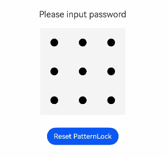

# PatternLock

图案密码锁组件，以九宫格图案的方式输入密码，用于密码验证场景。手指在PatternLock组件区域按下时开始进入输入状态，手指离开屏幕时结束输入状态完成密码输入。

## 导入模块

```cangjie
import kit.ArkUI.*
```

## 子组件

无

## 创建组件

### init(?PatternLockController)

```cangjie
public init(controller!: ?PatternLockController = None)
```

**功能：** 创建一个PatternLock组件。

**系统能力：** SystemCapability.ArkUI.ArkUI.Full

**起始版本：** 22

**参数：**

|参数名|类型|必填|默认值|说明|
|:---|:---|:---|:---|:---|
|controller|?PatternLockController|否|None|**命名参数。** 设置PatternLock组件控制器，可用于控制组件状态重置。|

## 通用属性/通用事件

通用属性：全部支持。

通用事件：全部支持。

## 组件属性

### func activeColor(?ResourceColor)

```cangjie
public func activeColor(value: ?ResourceColor): This
```

**功能：** 设置宫格圆点在"激活"状态的填充颜色，"激活"状态为手指经过圆点但还未选中的状态。

**系统能力：** SystemCapability.ArkUI.ArkUI.Full

**起始版本：** 22

**参数：**

|参数名|类型|必填|默认值|说明|
|:---|:---|:---|:---|:---|
|value|?ResourceColor|是|-|宫格圆点在"激活"状态的填充颜色。初始值：0xff182431。|

### func autoReset(?Bool)

```cangjie
public func autoReset(value: ?Bool): This
```

**功能：** 设置在完成密码输入后再次在组件区域按下时是否重置组件状态。

**系统能力：** SystemCapability.ArkUI.ArkUI.Full

**起始版本：** 22

**参数：**

|参数名|类型|必填|默认值|说明|
|:---|:---|:---|:---|:---|
|value|?Bool|是|-|在完成密码输入后再次在组件区域按下时是否重置组件状态。为true时，完成密码输入后再次在组件区域按下时会重置组件状态（即清除之前输入的密码）；为false时，不会重置组件状态。初始值：true。|

### func circleRadius(?Length)

```cangjie
public func circleRadius(value: ?Length): This
```

**功能：** 设置宫格中圆点的半径。设置为0或负数时取初始值。

**系统能力：** SystemCapability.ArkUI.ArkUI.Full

**起始版本：** 22

**参数：**

|参数名|类型|必填|默认值|说明|
|:---|:---|:---|:---|:---|
|value|?Length|是|-|宫格中圆点的半径。初始值：6.vp。|

### func pathColor(?ResourceColor)

```cangjie
public func pathColor(value: ?ResourceColor): This
```

**功能：** 设置连线的颜色。

**系统能力：** SystemCapability.ArkUI.ArkUI.Full

**起始版本：** 22

**参数：**

|参数名|类型|必填|默认值|说明|
|:---|:---|:---|:---|:---|
|value|?ResourceColor|是|-|连线的颜色。初始值：0x33182431。|

### func pathStrokeWidth(?Length)

```cangjie
public func pathStrokeWidth(value: ?Length): This
```

**功能：** 设置连线的宽度。设置为0或负数时连线不显示。

**系统能力：** SystemCapability.ArkUI.ArkUI.Full

**起始版本：** 22

**参数：**

|参数名|类型|必填|默认值|说明|
|:---|:---|:---|:---|:---|
|value|?Length|是|-|连线的宽度。初始值：12.vp。|

### func regularColor(?ResourceColor)

```cangjie
public func regularColor(value: ?ResourceColor): This
```

**功能：** 设置宫格圆点在"未选中"状态的填充颜色。

**系统能力：** SystemCapability.ArkUI.ArkUI.Full

**起始版本：** 22

**参数：**

|参数名|类型|必填|默认值|说明|
|:---|:---|:---|:---|:---|
|value|?ResourceColor|是|-|宫格圆点在"未选中"状态的填充颜色。初始值：0xff182431。|

### func selectedColor(?ResourceColor)

```cangjie
public func selectedColor(value: ?ResourceColor): This
```

**功能：** 设置宫格圆点在"选中"状态的填充颜色。

**系统能力：** SystemCapability.ArkUI.ArkUI.Full

**起始版本：** 22

**参数：**

|参数名|类型|必填|默认值|说明|
|:---|:---|:---|:---|:---|
|value|?ResourceColor|是|-|宫格圆点在"选中"状态的填充颜色。初始值：0xff182431。|

### func sideLength(?Length)

```cangjie
public func sideLength(value: ?Length): This
```

**功能：** 设置组件的宽度和高度（宽高相同）。设置为0或负数时组件不显示。

**系统能力：** SystemCapability.ArkUI.ArkUI.Full

**起始版本：** 22

**参数：**

|参数名|类型|必填|默认值|说明|
|:---|:---|:---|:---|:---|
|value|?Length|是|-|组件的宽度和高度。初始值：288.vp。|

## 组件事件

### func onPatternComplete(?(Array\<Int32>) -> Unit)

```cangjie
public func onPatternComplete(callback: ?(Array<Int32>) -> Unit): This
```

**功能：** 密码输入结束时，触发该事件。

**系统能力：** SystemCapability.ArkUI.ArkUI.Full

**起始版本：** 22

**参数：**

|参数名|类型|必填|默认值|说明|
|:---|:---|:---|:---|:---|
|callback|?(Array\<Int32>) -> Unit|是|-|密码输入结束时触发该回调。回调参数：与选中宫格圆点顺序一致的数字数组，数字为选中宫格圆点的索引值（第一行圆点从左往右依次为0、1、2，第二行圆点依次为3、4、5，第三行圆点依次为6、7、8）。|

## 基础类型定义

### class PatternLockController

```cangjie
public class PatternLockController {
    public init()
}
```

**功能：** PatternLock组件的控制器，可以通过它进行组件状态重置。

**系统能力：** SystemCapability.ArkUI.ArkUI.Full

**起始版本：** 22

#### init()

```cangjie
public init()
```

**功能：** 创建一个PatternLockController对象。

**系统能力：** SystemCapability.ArkUI.ArkUI.Full

**起始版本：** 22

#### func reset()

```cangjie
public func reset(): Unit
```

**功能：** 重置组件状态。

**系统能力：** SystemCapability.ArkUI.ArkUI.Full

**起始版本：** 22

## 示例代码

<!-- run -->

```cangjie
package ohos_app_cangjie_entry

import kit.ArkUI.*
import ohos.arkui.state_macro_manage.*
import std.collection.*

@Entry
@Component
class EntryView {
    @State var passwords: ObservedArrayList<Int32> = ObservedArrayList<Int32>([])
    @State var message: String = 'please input password!'
    let patternLockController = PatternLockController()

    func build() {
        Column() {
            Text(this.message)
                .textAlign(TextAlign.Center)
                .margin(20)
                .fontSize(20)

            PatternLock(controller: this.patternLockController)
                .sideLength(200.vp)
                .circleRadius(9.vp)
                .pathStrokeWidth(18.vp)
                .activeColor(Color(0xB0C4DE))
                .selectedColor(Color(0x228B22))
                .pathColor(Color(0x90EE90))
                .backgroundColor(Color(0xF5F5F5))
                .autoReset(true)
                .onPatternComplete(
                    {
                        input: Array<Int32> =>
                        //输入的密码长度小于5时，提示重新输入
                        if (input.size < 5) {
                            this.message = 'The password length needs to be greater than 5, please enter again.'
                            return
                        }
                        // 判断密码长度是否大于0
                        if (this.passwords.size > 0) {
                            // 判断两次输入的密码是否相同，相同则提示密码设置成功，否则提示重新输入
                            if (this.passwords.get().toString() == input.toString()) {
                                this.passwords = ObservedArrayList<Int32>(input)
                                this.message = 'Set password successfully: ' + this.passwords.get().toString()
                            } else {
                                this.message = 'Inconsistent passwords, please enter again.'
                            }
                        } else {
                            // 提示第二次输入密码
                            this.passwords = ObservedArrayList<Int32>(input)
                            this.message = "Please enter again."
                        }
                    }
                )

            Button('Reset PatternLock')
                .margin(30)
                .onClick(
                    {
                        evt => // 重置密码锁
                        this.patternLockController.reset()
                        this.passwords = ObservedArrayList<Int32>([])
                        this.message = 'Please input password'
                    }
                )
        }.width(100.percent).height(100.percent)
    }
}
```

