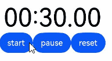

# TextTimer

通过文本显示计时信息并控制其计时器状态的组件。

在组件不可见时时间变动将停止，组件的可见状态基于[onVisibleAreaChange](./cj-universal-event-visibleareachange.md#func-onvisibleareachangearrayfloat64-bool-float64-unit---unit)处理，可见阈值ratios大于0即视为可见状态。

## 导入模块

```cangjie
import kit.ArkUI.*
```

## 子组件

无

## 创建组件

### init(?Bool, ?Int64, ?TextTimerController)

```cangjie
public init(isCountDown!: ?Bool = None, count!: ?Int64 = None,
    controller!: ?TextTimerController = None)
```

**功能：** 创建一个包含倒计时设置、计时时间和控制器的TextTimer对象。

**系统能力：** SystemCapability.ArkUI.ArkUI.Full

**起始版本：** 22

**参数：**

|参数名|类型|必填|默认值|说明|
|:---|:---|:---|:---|:---|
|isCountDown|?Bool|否|None| **命名参数。** 是否倒计时。<br>初始值：false。|
|count|?Int64|否|None| **命名参数。** 计时器时间（isCountDown为true时生效），单位为毫秒。<br>初始值：60000。|
|controller|?TextTimerController|否|None| **命名参数。** TextTimer控制器。|

## 通用属性/通用事件

通用属性：全部支持。

通用事件：全部支持。

## 组件属性

### func fontColor(?ResourceColor)

```cangjie
public func fontColor(value: ?ResourceColor): This
```

**功能：** 设置字体颜色。

**系统能力：** SystemCapability.ArkUI.ArkUI.Full

**起始版本：** 22

**参数：**

|参数名|类型|必填|默认值|说明|
|:---|:---|:---|:---|:---|
|value|?ResourceColor|是|-|字体颜色。|

### func fontFamily(?ResourceStr)

```cangjie
public func fontFamily(value: ?ResourceStr): This
```

**功能：** 设置字体列表。

**系统能力：** SystemCapability.ArkUI.ArkUI.Full

**起始版本：** 22

**参数：**

|参数名|类型|必填|默认值|说明|
|:---|:---|:---|:---|:---|
|value|?ResourceStr|是|-|字体列表。<br>初始字体：'HarmonyOS Sans'。|

### func fontSize(?Length)

```cangjie
public func fontSize(value: ?Length): This
```

**功能：** 设置字体大小。

**系统能力：** SystemCapability.ArkUI.ArkUI.Full

**起始版本：** 22

**参数：**

|参数名|类型|必填|默认值|说明|
|:---|:---|:---|:---|:---|
|value|?Length|是|-|字体大小。初始值：16.0.fp。|

### func fontStyle(?FontStyle)

```cangjie
public func fontStyle(value: ?FontStyle): This
```

**功能：** 设置字体样式。

**系统能力：** SystemCapability.ArkUI.ArkUI.Full

**起始版本：** 22

**参数：**

|参数名|类型|必填|默认值|说明|
|:---|:---|:---|:---|:---|
|value|?FontStyle|是|-|字体样式。<br>初始值：FontStyle.Normal。|

### func fontWeight(?FontWeight)

```cangjie
public func fontWeight(value: ?FontWeight): This
```

**功能：** 设置字体粗细。

**系统能力：** SystemCapability.ArkUI.ArkUI.Full

**起始版本：** 22

**参数：**

|参数名|类型|必填|默认值|说明|
|:---|:---|:---|:---|:---|
|value|?FontWeight|是|-|字体粗细。初始值：FontWeight.Normal|

### func format(?String)

```cangjie
public func format(value: ?String): This
```

**功能：** 设置自定义格式。

**系统能力：** SystemCapability.ArkUI.ArkUI.Full

**起始版本：** 22

**参数：**

|参数名|类型|必填|默认值|说明|
|:---|:---|:---|:---|:---|
|value|?String|是|-|自定义格式。<br>默认值：'HH:mm:ss.SS'。|

### func textShadow(?Array\<ShadowOptions>)

```cangjie
public func textShadow(value: ?Array<ShadowOptions>): This
```

**功能：** 设置文本阴影。

**系统能力：** SystemCapability.ArkUI.ArkUI.Full

**起始版本：** 22

**参数：**

|参数名|类型|必填|默认值|说明|
|:---|:---|:---|:---|:---|
|value|?Array\<ShadowOptions>|是|-|阴影选项数组。|

### func textShadow(?ShadowOptions)

```cangjie
public func textShadow(value: ?ShadowOptions): This
```

**功能：** 设置文本阴影。

**系统能力：** SystemCapability.ArkUI.ArkUI.Full

**起始版本：** 22

**参数：**

|参数名|类型|必填|默认值|说明|
|:---|:---|:---|:---|:---|
|value|?ShadowOptions|是|-|阴影选项。|

## 组件事件

### func onTimer(?(Int64, Int64) -> Unit)

```cangjie
public func onTimer(event: ?(Int64, Int64) -> Unit): This
```

**功能：** 时间文本变化时触发该回调。

**系统能力：** SystemCapability.ArkUI.ArkUI.Full

**起始版本：** 22

**参数：**

|参数名|类型|必填|默认值|说明|
|:---|:---|:---|:---|:---|
|event|?(Int64, Int64) -> Unit|是|-|时间文本变化时的回调函数。初始值: { _, _ => }。|

## 基础类型定义

### class TextTimerController

```cangjie
public class TextTimerController {
    public init()
}
```

**功能：** TextTimerController是TextTimer组件的控制器，可以定义该类型的对象并绑定至TextTimer组件，实现对TextTimer组件的控制。

**系统能力：** SystemCapability.ArkUI.ArkUI.Full

**起始版本：** 22

#### init()

```cangjie
public init()
```

**功能：** TextTimerController的构造函数。

**系统能力：** SystemCapability.ArkUI.ArkUI.Full

**起始版本：** 22

#### func pause()

```cangjie
public func pause(): Unit
```

**功能：** 提供计时器的暂停事件。

**系统能力：** SystemCapability.ArkUI.ArkUI.Full

**起始版本：** 22

#### func reset()

```cangjie
public func reset(): Unit
```

**功能：** 提供重置计时器的事件。

**系统能力：** SystemCapability.ArkUI.ArkUI.Full

**起始版本：** 22

#### func start()

```cangjie
public func start(): Unit
```

**功能：** 提供计时器的启动事件。

**系统能力：** SystemCapability.ArkUI.ArkUI.Full

**起始版本：** 22

## 示例代码

### 示例1 （支持手动启停的文本计时器）

该示例展示了TextTimer组件的基本使用方法，通过format属性设置计时器的文本显示格式。

用户可以通过点击"start"、"pause"、"reset"按钮，开启、暂停、重置计时器。

<!-- run -->

```cangjie
package ohos_app_cangjie_entry
import kit.ArkUI.*
import ohos.hilog.*
import ohos.arkui.state_macro_manage.*

@Entry
@Component
class EntryView {
    var textTimerController: TextTimerController = TextTimerController()
    @State var format: String = 'mm:ss.SS'
    func build() {
        Column {
            TextTimer(isCountDown: true, count: 30000, controller: this.textTimerController)
                .format(this.format)
                .fontColor(Color.Black)
                .fontSize(50)
                .onTimer({utc, elapsedTime =>
                    Hilog.info(0, "AppLogCj", "time has been changed")
                })
            Row() {
                Button("start").onClick({ evt =>
                  this.textTimerController.start()
                })
                Button("pause").onClick({ evt =>
                  this.textTimerController.pause()
                })
                Button("reset").onClick({ evt =>
                    this.textTimerController.reset()
                })
            }
        }
    }
}

```



### 示例2（设定文本阴影样式）

该示例通过textShadow属性设置计时器的文本阴影样式。

<!-- run -->

```cangjie
package ohos_app_cangjie_entry

import kit.ArkUI.*
import ohos.arkui.state_macro_manage.*

@Entry
@Component
class EntryView {
    @State var textShadows: Array<ShadowOptions> = [
        ShadowOptions(
            radius: 10.0,
            color: Color.Red,
            offsetX: 10.0,
            offsetY: 0.0
        ),
        ShadowOptions(
            radius: 10.0,
            color: Color.Black,
            offsetX: 20.0,
            offsetY: 0.0
        ),
        ShadowOptions(
            radius: 10.0,
            color: Color.Gray,
            offsetX: 30.0,
            offsetY: 0.0
        ),
        ShadowOptions(
        radius: 10.0,
        color: Color.Green,
        offsetX: 40.0,
        offsetY: 0.0
        ),
        ShadowOptions(
        radius: 10.0,
        color: Color.Blue,
        offsetX: 100.0,
        offsetY: 0.0
        )]
    func build() {
        Column(space: 8) {
            TextTimer().fontSize(50).textShadow(this.textShadows)
        }
    }
}
```


### 示例3（创建之后立即执行计时）

该示例展示了TextTimer计时器如何在创建完成之后立即开始计时。

<!-- run -->

```cangjie
package ohos_app_cangjie_entry

import kit.ArkUI.*
import ohos.hilog.*
import ohos.arkui.state_macro_manage.*

@Entry
@Component
class EntryView {
    var textTimerController: TextTimerController = TextTimerController()
    @State var format: String = 'mm:ss.SS'

    func build() {
        Column(space: 8) {
            Scroll().height(20.percent)
            Button("openTextTimer").onClick({
                evt =>

            })
            TextTimer( isCountDown: true, count: 30000, controller: this.textTimerController )
                .format(this.format)
                .fontColor(Color.Black)
                .fontSize(50)
                .onTimer({
                    utc: Int64, elapsedTime: Int64 =>
                        Hilog.info(0, "AppLogCj", 'textTimer notCountDown utc is：${utc.toString()}, elapsedTime: ${elapsedTime.toString()}')
                })
                .onAppear({ =>
                    this.textTimerController.start()
                })
        }
    }
}
```

