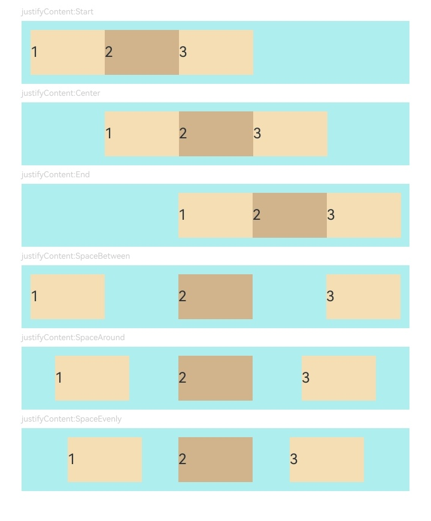
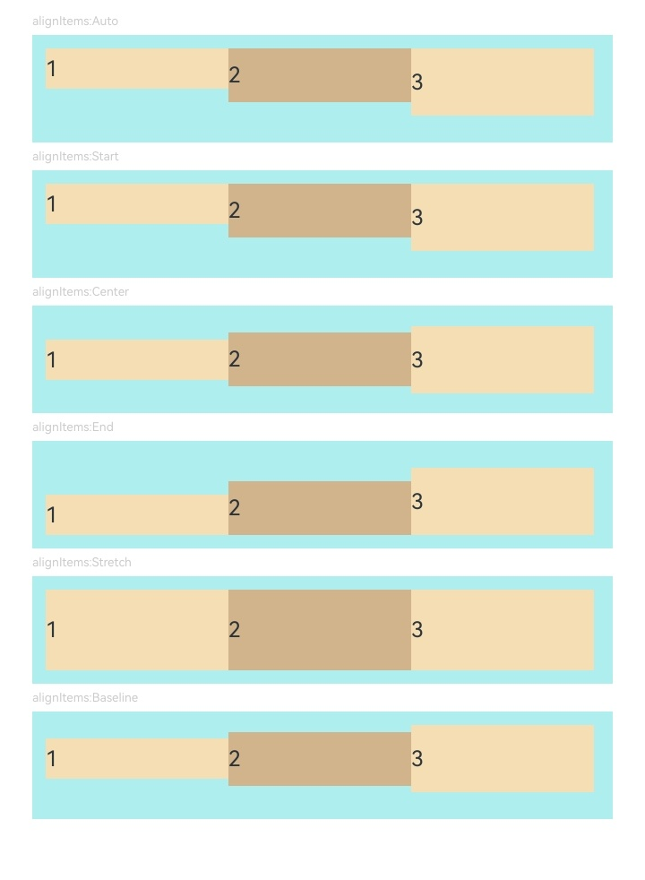
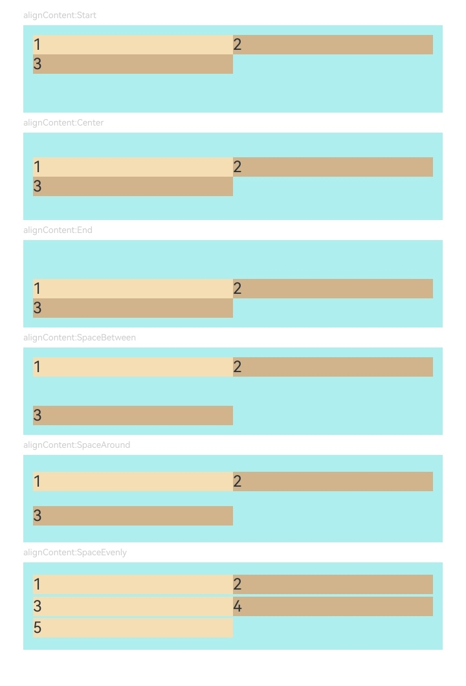

# Flex

Flex是以弹性方式布局子组件的容器组件，提供更加有效的方式对容器内的子元素进行排列、对齐和分配剩余空间。

具体指南请参考[弹性布局](../../../Dev_Guide/source_zh_cn/arkui-cj/cj-layout-development-flex-layout.md)。

> **说明：**
>
> - Flex组件在渲染时存在二次布局过程，因此在对性能有严格要求的场景下建议使用[Column](cj-row-column-stack-column.md)、[Row](cj-row-column-stack-row.md)代替。
> - Flex组件主轴默认不设置时撑满父容器，[Column](cj-row-column-stack-column.md)、[Row](cj-row-column-stack-row.md)组件主轴不设置时默认是跟随子节点大小。
> - 主轴长度可设置为auto使Flex自适应子组件布局，自适应时，Flex长度受constraintSize属性以及父容器传递的最大最小长度限制且constraintSize属性优先级更高。

## 导入模块

```cangjie
import kit.ArkUI.*
```

## 子组件

可以包含子组件。

## 创建组件

### init(?FlexDirection, ?FlexWrap, ?FlexAlign, ?ItemAlign, ?FlexAlign, () -> Unit)

```cangjie
public init(direction!: ?FlexDirection = None, wrap!: ?FlexWrap = None,
    justifyContent!: ?FlexAlign = None, alignItems!: ?ItemAlign = None,
    alignContent!: ?FlexAlign = None, child!: () -> Unit = {=>})
```

**功能：** 创建一个Flex容器。

**系统能力：** SystemCapability.ArkUI.ArkUI.Full

**起始版本：** 22

**参数：**

|参数名|类型|必填|默认值|说明|
|:---|:---|:---|:---|:---|
|direction|?FlexDirection|否|None| **命名参数。** 初始值: FlexDirection.Row 子组件在Flex容器上排列的方向，即主轴的方向。|
|wrap|?FlexWrap|否|None| **命名参数。** 初始值: FlexWrap.NoWrap Flex容器是单行/列还是多行/列排列。|
|justifyContent|?FlexAlign|否|None| **命名参数。** 初始值: FlexAlign.Start 所有子组件在Flex容器主轴上的对齐格式。|
|alignItems|?ItemAlign|否|None| **命名参数。** 初始值: ItemAlign.Start 所有子组件在Flex容器交叉轴上的对齐格式。|
|alignContent|?FlexAlign|否|None| **命名参数。** 初始值: FlexAlign.Start 交叉轴中有额外的空间时，多行内容的对齐方式。仅在wrap为Wrap或WrapReverse下生效。|
|child|()->Unit|否|{=>}| **命名参数。** 声明容器内的子组件。|

## 通用属性/通用事件

通用属性：除文本样式外，其余全部支持；对于自身独有 alignItems 属性的容器组件，通用属性 align 不生效。

通用事件：全部支持。

## 示例代码

### 示例1（子组件排列方向）

该示例通过设置direction实现不同的子组件排列方向效果。

<!-- run -->

```cangjie
package ohos_app_cangjie_entry
import kit.ArkUI.*
import ohos.arkui.state_macro_manage.*
import std.collection.*

@Entry
@Component
class EntryView {
    func build() {
        Column {
            Column(space: 5) {
                Text("direction:Row")
                .fontSize(9)
                .fontColor(0xCCCCCC)
                .width(90.percent)

                // 子组件在容器主轴上行布局
                Flex(direction: FlexDirection.Row) {
                    Text("1")
                    .width(20.percent)
                    .height(50)
                    .backgroundColor(0xF5DEB3)
                    Text("2")
                    .width(20.percent)
                    .height(50)
                    .backgroundColor(0xD2B48C)
                    Text("3")
                    .width(20.percent)
                    .height(50)
                    .backgroundColor(0xF5DEB3)
                    Text("4")
                    .width(20.percent)
                    .height(50)
                    .backgroundColor(0xD2B48C)
                }
                .height(70)
                .width(90.percent)
                .padding(10)
                .backgroundColor(0xAFEEEE)

                Text("direction:RowReverse")
                .fontSize(9)
                .fontColor(0xCCCCCC)
                .width(90.percent)
                // 子组件在容器主轴上反向行布局
                Flex(direction: FlexDirection.RowReverse) {
                    Text("1")
                    .width(20.percent)
                    .height(50)
                    .backgroundColor(0xF5DEB3)
                    Text("2")
                    .width(20.percent)
                    .height(50)
                    .backgroundColor(0xD2B48C)
                    Text("3")
                    .width(20.percent)
                    .height(50)
                    .backgroundColor(0xF5DEB3)
                    Text("4")
                    .width(20.percent)
                    .height(50)
                    .backgroundColor(0xD2B48C)
                }
                .height(70)
                .width(90.percent)
                .padding(10)
                .backgroundColor(0xAFEEEE)

                Text("direction:Column")
                .fontSize(9)
                .fontColor(0xCCCCCC)
                .width(90.percent)
                // 子组件在容器主轴上列布局
                Flex(direction: FlexDirection.Column) {
                    Text("1")
                    .width(100.percent)
                    .height(50)
                    .backgroundColor(0xF5DEB3)
                    Text("2")
                    .width(100.percent)
                    .height(50)
                    .backgroundColor(0xD2B48C)
                    Text("3")
                    .width(100.percent)
                    .height(50)
                    .backgroundColor(0xF5DEB3)
                    Text("4")
                    .width(100.percent)
                    .height(50)
                    .backgroundColor(0xD2B48C)
                }
                .width(90.percent)
                .height(160)
                .padding(10)
                .backgroundColor(0xAFEEEE)
                Text("direction:ColumnReverse")
                .fontSize(9)
                .fontColor(0xCCCCCC)
                .width(90.percent)
                // 子组件在容器主轴上反向列布局
                Flex(direction: FlexDirection.ColumnReverse) {
                    Text("1")
                    .width(100.percent)
                    .height(50)
                    .backgroundColor(0xF5DEB3)
                    Text("2")
                    .width(100.percent)
                    .height(50)
                    .backgroundColor(0xD2B48C)
                    Text("3")
                    .width(100.percent)
                    .height(50)
                    .backgroundColor(0xF5DEB3)
                    Text("4")
                    .width(100.percent)
                    .height(50)
                    .backgroundColor(0xD2B48C)
                }
                .width(90.percent)
                .height(160)
                .padding(10)
                .backgroundColor(0xAFEEEE)
            }
            .width(100.percent)
            .margin(top: 5)
        }
        .width(100.percent)
    }
}
```


### 示例2（子组件单/多行排列）

该示例通过设置wrap实现子组件单行或多行的排列效果。

<!-- run -->

```cangjie
package ohos_app_cangjie_entry
import kit.ArkUI.*
import ohos.arkui.state_macro_manage.*

@Entry
@Component
class EntryView {
    func build() {
        Column {
            Column(space: 5) {
                Text("Wrap")
                .fontSize(9)
                .fontColor(0xCCCCCC)
                .width(90.percent)
                Flex(wrap: FlexWrap.Wrap) {
                    Text("1")
                    .width(50.percent)
                    .height(50)
                    .backgroundColor(0xF5DEB3)
                    Text("2")
                    .width(50.percent)
                    .height(50)
                    .backgroundColor(0xD2B48C)
                    Text("3")
                    .width(50.percent)
                    .height(50)
                    .backgroundColor(0xD2B48C)
                }
                .width(90.percent)
                .padding(10)
                .backgroundColor(0xAFEEEE)

                Text("NoWrap")
                .fontSize(9)
                .fontColor(0xCCCCCC)
                .width(90.percent)
                Flex(wrap: FlexWrap.NoWrap) {
                    Text("1")
                    .width(50.percent)
                    .height(50)
                    .backgroundColor(0xF5DEB3)
                    Text("2")
                    .width(50.percent)
                    .height(50)
                    .backgroundColor(0xD2B48C)
                    Text("3")
                    .width(50.percent)
                    .height(50)
                    .backgroundColor(0xF5DEB3)
                }
                .width(90.percent)
                .padding(10)
                .backgroundColor(0xAFEEEE)

                Text("WrapReverse")
                .fontSize(9)
                .fontColor(0xCCCCCC)
                .width(90.percent)
                Flex(wrap: FlexWrap.WrapReverse, direction:FlexDirection.Row) {
                    Text("1")
                    .width(50.percent)
                    .height(50)
                    .backgroundColor(0xF5DEB3)
                    Text("2")
                    .width(50.percent)
                    .height(50)
                    .backgroundColor(0xD2B48C)
                    Text("3")
                    .width(50.percent)
                    .height(50)
                    .backgroundColor(0xD2B48C)
                }
                .width(90.percent)
                .height(120)
                .padding(10)
                .backgroundColor(0xAFEEEE)
            }
            .width(100.percent)
            .margin(top: 5)
        }
        .width(100.percent)
    }
}
```


### 示例3（子组件在主轴上的对齐格式）

该示例通过设置justifyContent实现子组件在主轴上不同的对齐效果。

<!-- run -->

```cangjie
package ohos_app_cangjie_entry
import kit.ArkUI.*
import ohos.arkui.state_macro_manage.*
import std.collection.*

@Component
class JustifyContentFlex{
    // 初始化对齐方式：子组件在容器主轴上首端对齐
    var justifyContent :  FlexAlign  = FlexAlign.Start

    func build(){
        Flex(justifyContent:this.justifyContent){
            Text('1').width(20.percent).height(50).backgroundColor(0xF5DEB3)
            Text('2').width(20.percent).height(50).backgroundColor(0xD2B48C)
            Text('3').width(20.percent).height(50).backgroundColor(0xF5DEB3)
        }
        .width(90.percent)
        .padding(10)
        .backgroundColor(0xAFEEEE)
    }
}

@Entry
@Component
class EntryView {
    func build() {
        Column {
            Column(space: 5) {
                Text('justifyContent:Start').fontSize(9).fontColor(0xCCCCCC).width(90.percent)
                JustifyContentFlex()// 子组件在容器主轴上首端对齐
                Text('justifyContent:Center').fontSize(9).fontColor(0xCCCCCC).width(90.percent)
                JustifyContentFlex(justifyContent:FlexAlign.Center)// 子组件在容器主轴上居中对齐
                Text('justifyContent:End').fontSize(9).fontColor(0xCCCCCC).width(90.percent)
                JustifyContentFlex(justifyContent:FlexAlign.End)// 子组件在容器主轴上尾端对齐
                Text('justifyContent:SpaceBetween').fontSize(9).fontColor(0xCCCCCC).width(90.percent)
                // 子组件在容器主轴上均分容器布局，第一个子组件与行首对齐，最后一个子组件与行尾对齐。
                JustifyContentFlex(justifyContent:FlexAlign.SpaceBetween)
                Text('justifyContent:SpaceAround').fontSize(9).fontColor(0xCCCCCC).width(90.percent)
                // 子组件在容器主轴上均分容器布局，第一个子组件与行首对齐，最后一个子组件与行尾对齐。
                JustifyContentFlex(justifyContent:FlexAlign.SpaceAround)
                Text('justifyContent:SpaceEvenly').fontSize(9).fontColor(0xCCCCCC).width(90.percent)
                // 子组件在容器主轴上均分容器布局，子组件之间的距离与第一子组件到行首、最后一个子组件到行尾的距离相等
                JustifyContentFlex(justifyContent:FlexAlign.SpaceEvenly)
            }
            .width(100.percent)
            .margin(top: 5)
        }
        .width(100.percent)
    }
}
```



### 示例4（子组件在交叉轴上的对齐方式）

该示例通过设置alignItems实现子组件在主轴上的不同的对齐效果。

<!-- run -->

```cangjie
package ohos_app_cangjie_entry
import kit.ArkUI.*
import ohos.arkui.state_macro_manage.*
import std.collection.*

@Component
class AlignItemsFlex{
    // 初始化对齐方式：子组件在容器交叉轴上首部对齐
    var alignItems :  ItemAlign  = ItemAlign.Auto

    func build(){
        Flex(alignItems:this.alignItems){
            Text('1').width(33.percent).height(30).backgroundColor(0xF5DEB3)
            Text('2').width(33.percent).height(40).backgroundColor(0xD2B48C)
            Text('3').width(33.percent).height(50).backgroundColor(0xF5DEB3)
        }
        .width(90.percent)
        .height(80)
        .padding(10)
        .backgroundColor(0xAFEEEE)
    }
}

@Entry
@Component
class EntryView {
    func build() {
        Column {
            Column(space: 5) {
                Text('alignItems:Auto').fontSize(9).fontColor(0xCCCCCC).width(90.percent)
                // 子组件在容器交叉轴上首部对齐
                AlignItemsFlex()
                Text('alignItems:Start').fontSize(9).fontColor(0xCCCCCC).width(90.percent)
                // 子组件在容器交叉轴上首部对齐
                AlignItemsFlex(alignItems:ItemAlign.Start)
                Text('alignItems:Center').fontSize(9).fontColor(0xCCCCCC).width(90.percent)
                // 子组件在容器交叉轴上居中对齐
                AlignItemsFlex(alignItems:ItemAlign.Center)
                Text('alignItems:End').fontSize(9).fontColor(0xCCCCCC).width(90.percent)
                // 子组件在容器交叉轴上尾部对齐
                AlignItemsFlex(alignItems:ItemAlign.End)
                Text('alignItems:Stretch').fontSize(9).fontColor(0xCCCCCC).width(90.percent)
                // 子组件在容器交叉轴上拉伸填充
                AlignItemsFlex(alignItems:ItemAlign.Stretch)
                Text('alignItems:Baseline').fontSize(9).fontColor(0xCCCCCC).width(90.percent)
                // 子组件在容器交叉轴上与文本基线对齐
                AlignItemsFlex(alignItems:ItemAlign.Baseline)
            }
            .width(100.percent)
            .margin(top: 5)
        }
        .width(100.percent)
    }
}
```



### 示例5（多行内容的对齐方式）

该示例通过设置alignContent实现多行内容的不同对齐效果。

<!-- run -->

```cangjie
package ohos_app_cangjie_entry
import kit.ArkUI.*
import ohos.arkui.state_macro_manage.*
import std.collection.*

@Component
class AlignContentFlex{
    // 初始化对其方式：多行布局下子组件首部对齐
    var alignContent :  FlexAlign  = FlexAlign.Start

    func build(){
        Flex(wrap: FlexWrap.Wrap, alignContent:this.alignContent){
            Text('1').width(50.percent).height(20).backgroundColor(0xF5DEB3)
            Text('2').width(50.percent).height(20).backgroundColor(0xD2B48C)
            Text('3').width(50.percent).height(20).backgroundColor(0xD2B48C)
        }
        .width(90.percent)
        .height(90)
        .padding(10)
        .backgroundColor(0xAFEEEE)
    }
}

@Entry
@Component
class EntryView {
    func build() {
        Column {
            Column(space: 5) {
                Text('alignContent:Start').fontSize(9).fontColor(0xCCCCCC).width(90.percent)
                // 多行布局下子组件首部对齐
                AlignContentFlex()
                Text('alignContent:Center').fontSize(9).fontColor(0xCCCCCC).width(90.percent)
                // 多行布局下子组件居中对齐
                AlignContentFlex(alignContent:FlexAlign.Center)
                Text('alignContent:End').fontSize(9).fontColor(0xCCCCCC).width(90.percent)
                // 多行布局下子组件尾部对齐
                AlignContentFlex(alignContent:FlexAlign.End)
                Text('alignContent:SpaceBetween').fontSize(9).fontColor(0xCCCCCC).width(90.percent)
                // 多行布局下第一行子组件与列首对齐，最后一行子组件与列尾对齐
                AlignContentFlex(alignContent:FlexAlign.SpaceBetween)
                Text('alignContent:SpaceAround').fontSize(9).fontColor(0xCCCCCC).width(90.percent)
                // 多行布局下第一行子组件到列首的距离和最后一行子组件到列尾的距离是相邻行之间距离的一半
                AlignContentFlex(alignContent:FlexAlign.SpaceAround)
                Text('alignContent:SpaceEvenly').fontSize(9).fontColor(0xCCCCCC).width(90.percent)
                // 多行布局下相邻行之间的距离与第一行子组件到列首的距离、最后一行子组件到列尾的距离完全一样
                Flex(wrap: FlexWrap.Wrap, alignContent:FlexAlign.SpaceEvenly){
                    Text('1').width(50.percent).height(20).backgroundColor(0xF5DEB3)
                    Text('2').width(50.percent).height(20).backgroundColor(0xD2B48C)
                    Text('3').width(50.percent).height(20).backgroundColor(0xF5DEB3)
                    Text('4').width(50.percent).height(20).backgroundColor(0xD2B48C)
                    Text('5').width(50.percent).height(20).backgroundColor(0xF5DEB3)
                }
                .width(90.percent)
                .height(90)
                .padding(10)
                .backgroundColor(0xAFEEEE)
            }
            .width(100.percent)
            .margin(top: 5)
        }
        .width(100.percent)
    }
}
```

