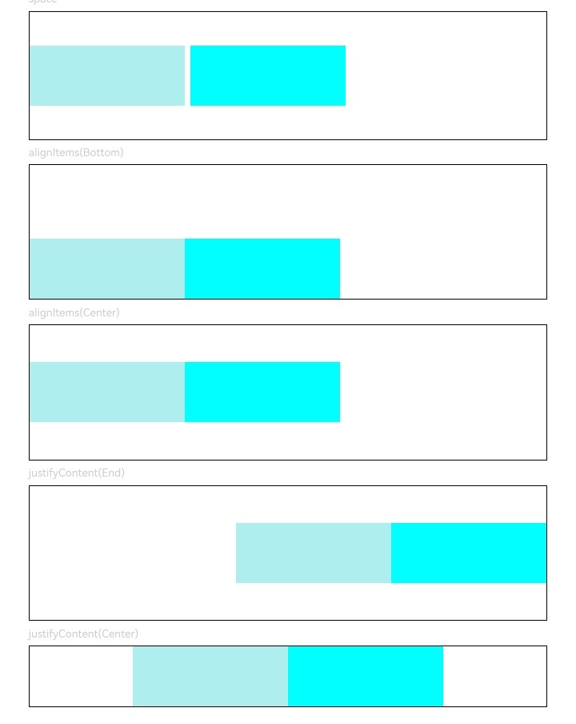

# Row

沿水平方向布局的容器。

## 子组件

可以包含子组件。

## 创建组件

### init(Length, () -> Unit)

```cangjie

public init(space!: Length = 0.vp, child!: () -> Unit = {=>})
```

**功能：** 创建一个包含子组件的Row容器。

**系统能力：** SystemCapability.ArkUI.ArkUI.Full

**起始版本：** 21

**参数：**

|参数名|类型|必填|默认值|说明|
|:---|:---|:---|:---|:---|
|space|[Length](../BasicServicesKit/cj-apis-base.md#interface-length)|否|0.vp|横向布局元素间距。<br>space为负数或者justifyContent设置为FlexAlign.SpaceBetween、FlexAlign.SpaceAround、FlexAlign.SpaceEvenly时不生效。<br> 初始值：0，单位：vp <br> **说明：** 可选值为大于等于0的数字。|
|child|()->Unit|否|{ => }|容器内的子组件。|

## 通用属性/通用事件

通用属性：全部支持

通用事件：全部支持

## 组件属性

### func alignItems(VerticalAlign)

```cangjie

public func alignItems(value: VerticalAlign): This
```

**功能：** 设置子组件在垂直方向上的对齐格式。

**系统能力：** SystemCapability.ArkUI.ArkUI.Full

**起始版本：** 21

**参数：**

|参数名|类型|必填|默认值|说明|
|:---|:---|:---|:---|:---|
|value|[VerticalAlign](cj-common-types.md#enum-verticalalign)|是|-|子组件在水平方向上的对齐格式。<br> 初始值：FlexAlign.Start|

### func justifyContent(FlexAlign)

```cangjie

public func justifyContent(value: FlexAlign): This
```

**功能：** 设置子组件在水平方向上的对齐格式。

**系统能力：** SystemCapability.ArkUI.ArkUI.Full

**起始版本：** 21

**参数：**

|参数名|类型|必填|默认值|说明|
|:---|:---|:---|:---|:---|
|value|[FlexAlign](cj-common-types.md#enum-flexalign)|是|-|子组件在水平方向上的对齐格式。<br> 初始值：FlexAlign.Start|

## 示例代码

本示例展示了Row设置alignItems和justifyContent属性的用法。

<!-- run -->

```cangjie
package ohos_app_cangjie_entry
import kit.ArkUI.*
import ohos.arkui.state_macro_manage.*

@Entry
@Component
class EntryView {
    func build() {
            Column(space: 5) {
            // 设置子组件水平方向的间距为5
                Text("space")
                .fontSize(9)
                .fontColor(0xCCCCCC)
                .width(90.percent)
                Row(space: 5) {
                    Row()
                    .width(30.percent)
                    .height(50)
                    .backgroundColor(0xAFEEEE)
                    Row()
                    .width(30.percent)
                    .height(50)
                    .backgroundColor(0x00FFFF)
                }
                .width(90.percent)
                .height(107)
                .border(width: 1.vp)

                // 设置子元素垂直方向对齐方式
                Text("alignItems(Bottom)")
                .fontSize(9)
                .fontColor(0xCCCCCC)
                .width(90.percent)
                Row() {
                    Row()
                    .width(30.percent)
                    .height(50)
                    .backgroundColor(0xAFEEEE)
                    Row()
                    .width(30.percent)
                    .height(50)
                    .backgroundColor(0x00FFFF)
                }
                .alignItems(VerticalAlign.Bottom)
                .width(90.percent)
                .height(15.percent)
                .border(width: 1.vp)

                Text("alignItems(Center)")
                .fontSize(9)
                .fontColor(0xCCCCCC)
                .width(90.percent)
                Row() {
                    Row()
                    .width(30.percent)
                    .height(50)
                    .backgroundColor(0xAFEEEE)
                    Row()
                    .width(30.percent)
                    .height(50)
                    .backgroundColor(0x00FFFF)
                }
                .alignItems(VerticalAlign.Center)
                .width(90.percent)
                .height(15.percent)
                .border(width: 1.vp)

              // 设置子元素水平方向对齐方式
                Text("justifyContent(End)")
                .fontSize(9)
                .fontColor(0xCCCCCC)
                .width(90.percent)
                Row() {
                    Row()
                    .width(30.percent)
                    .height(50)
                    .backgroundColor(0xAFEEEE)
                    Row()
                    .width(30.percent)
                    .height(50)
                    .backgroundColor(0x00FFFF)
                }
                .height(15.percent)
                .width(90.percent)
                .border(width: 1.vp)
                .justifyContent(FlexAlign.End)

                Text("justifyContent(Center)")
                .fontSize(9)
                .fontColor(0xCCCCCC)
                .width(90.percent)
                Row() {
                    Row()
                    .width(30.percent)
                    .height(50)
                    .backgroundColor(0xAFEEEE)
                    Row()
                    .width(30.percent)
                    .height(50)
                    .backgroundColor(0x00FFFF)
                }
                .width(90.percent)
                .border(width: 1.vp)
                .justifyContent(FlexAlign.Center)
            }
            .width(100.percent)
            .padding(top: 5)
        }
}
```


