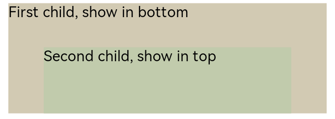

# Stack

堆叠容器，子组件按照顺序依次入栈，后一个子组件覆盖前一个子组件。

## 导入模块

```cangjie
import kit.ArkUI.*
```

## 子组件

可以包含子组件。

## 创建组件

### init(Alignment, () -> Unit)

```cangjie

public init(alignContent!: Alignment = Alignment.Center, child!: () -> Unit = {=>})
```

**功能：** 创建一个包含子组件的Stack容器，子组件对齐方式是alignContent。

**系统能力：** SystemCapability.ArkUI.ArkUI.Full

**起始版本：** 21

**参数：**

|参数名|类型|必填|默认值|说明|
|:---|:---|:---|:---|:---|
|alignContent|[Alignment](cj-common-types.md#enum-alignment)|否|Alignment.Center|设置子组件在容器内的对齐方式。<br> 初始值：Alignment.Center|
|child|()->Unit|否|{ => }|声明容器内的子组件。|

## 通用属性/通用事件

通用属性：全部支持。

通用事件：全部支持。

## 组件属性

### func alignContent(Alignment)

```cangjie

public func alignContent(value: Alignment): This
```

**功能：** 设置所有子组件在容器内的对齐方式。该属性与[通用属性align](cj-universal-attribute-location.md#func-alignalignment)同时设置时，后设置的属性生效。

**系统能力：** SystemCapability.ArkUI.ArkUI.Full

**起始版本：** 21

**参数：**

|参数名|类型|必填|默认值|说明|
|:---|:---|:---|:---|:---|
|value|[Alignment](cj-common-types.md#enum-alignment)|是|-|所有子组件在容器内的对齐方式。 <br> 初始值：Alignment.Center|

## 示例代码

Stack的alignContent设置为Alignment.Bottom条件下子组件显示效果。

<!-- run -->

```cangjie
package ohos_app_cangjie_entry

import kit.ArkUI.*
import ohos.arkui.state_macro_manage.*

@Entry
@Component
class EntryView {
    func build() {
        Stack(alignContent: Alignment.Bottom) {
            Text("First child, show in bottom")
                .width(90.percent)
                .height(100.percent)
                .backgroundColor(0xd2cab3)
                .align(Alignment.Top)
            Text("Second child, show in top")
                .width(70.percent)
                .height(60.percent)
                .backgroundColor(0xc1cbac)
                .align(Alignment.Top)
        }
            .width(100.percent)
            .height(150)
            .margin(top: 5)
    }
}

```


