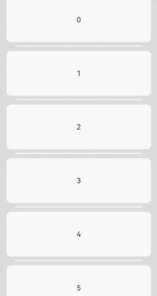
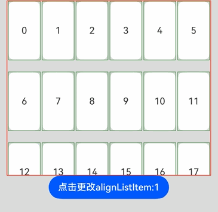
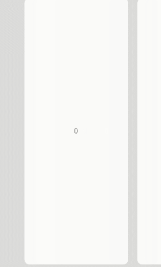

# List

一个包含一系列相同宽度的列表项的容器组件。适合连续、多行呈现同类数据，例如图片和文本。

## 导入模块

```cangjie
import kit.ArkUI.*
```

## 子组件

仅支持[ListItem](./cj-scroll-swipe-listitem.md)、[ListItemGroup](./cj-scroll-swipe-listgroup.md)子组件。支持渲染控制类型（[if/else](../../../Dev_Guide/source_zh_cn/arkui-cj/rendering_control/cj-rendering-control-ifelse.md)、[ForEach](../../../Dev_Guide/source_zh_cn/arkui-cj/rendering_control/cj-rendering-control-foreach.md)、[LazyForEach](./cj-state-rendering-lazyforeach.md)）。

> **说明：**
>
> List的子组件的索引值计算规则：
>
> * 按子组件的顺序依次递增。
> * if/else语句中，只有条件成立的分支内的子组件会参与索引值计算，条件不成立的分支内子组件不计算索引值。
> * ForEach/LazyForEach语句中，会计算展开所有子节点索引值。
> * [if/else](../../../Dev_Guide/source_zh_cn/arkui-cj/rendering_control/cj-rendering-control-ifelse.md)、[ForEach](../../../Dev_Guide/source_zh_cn/arkui-cj/rendering_control/cj-rendering-control-foreach.md)、[LazyForEach](./cj-state-rendering-lazyforeach.md)发生变化以后，会更新子节点索引值。
> * ListItemGroup作为一个整体计算一个索引值，ListItemGroup内部的ListItem不计算索引值。
> * List子组件visibility属性设置为Hidden或None依然会计算索引值。

## 创建组件

### init(?Int64, ?Int32, ?Scroller, () -> Unit)

```cangjie
public init(
    space!: ?Int64 = None,
    initialIndex!: ?Int32 = None,
    scroller!: ?Scroller = Option<Scroller>.None,
    child!: () -> Unit
)
```

**功能：** 创建一个可包含子组件的List容器。

**系统能力：** SystemCapability.ArkUI.ArkUI.Full

**起始版本：** 22

**参数：**

|参数名|类型|必填|默认值|说明|
|:---|:---|:---|:---|:---|
|space|?Int64|否|None| **命名参数。** 子组件主轴方向的间隔。|
|initialIndex|?Int32|否|None|**命名参数。** 设置当前List初次加载时视口起始位置显示的item，即显示第一个item，如果设置的值超过了当前List最后一个item的索引值，则设置为不生效。|
|scroller|?[Scroller](cj-scroll-swipe-scroll.md#class-scroller)|否|Option\<Scroller>.None| **命名参数。** 可滚动组件的控制器。用于与可滚动组件进行绑定。|
|child|() -> Unit|是|-| **命名参数。** 声明容器内的List子组件。|

## 通用属性/通用事件

通用属性：全部支持。还支持滚动组件通用组件。

通用事件：全部支持。

## 组件属性

### func alignListItem(?ListItemAlign)

```cangjie
public func alignListItem(value: ?ListItemAlign): This
```

**功能：** 设置List交叉轴方向宽度大于ListItem交叉轴宽度 * lanes时，ListItem在List交叉轴方向的布局方式。

**系统能力：** SystemCapability.ArkUI.ArkUI.Full

**起始版本：** 22

**参数：**

|参数名|类型|必填|默认值|说明|
|:---|:---|:---|:---|:---|
|value|?ListItemAlign|是|-|交叉轴方向的布局方式。初始值：ListItemAlign.Start。|

### func cachedCount(?Int32)

```cangjie
public func cachedCount(value: ?Int32): This
```

**功能：** 设置列表中ListItem/ListItemGroup的预加载数量，懒加载场景只会预加载List显示区域外cachedCount的内容，非懒加载场景会全部加载。懒加载、非懒加载都只布局List显示区域+List显示区域外cachedCount的内容。

List设置cachedCount后，显示区域外上下各会预加载并布局cachedCount行ListItem。计算ListItem行数时，会计算ListItemGroup内部的ListItem行数。如果ListItemGroup内没有ListItem，则整个ListItemGroup算一行。

List下嵌套使用LazyForEach，并且LazyForEach下嵌套使用ListItemGroup时，LazyForEach会在List显示区域外上下各会创建cachedCount个ListItemGroup。

**系统能力：** SystemCapability.ArkUI.ArkUI.Full

**起始版本：** 22

**参数：**

|参数名|类型|必填|默认值|说明|
|:---|:---|:---|:---|:---|
|value|?Int32|是|-|列表中ListItem/ListItemGroup的预加载数量。初始值：1。|

### func chainAnimation(?Bool)

```cangjie
public func chainAnimation(value: ?Bool): This
```

**功能：** 设置是否启用链式动画，链式动画效果在列表滚动或拖拽到顶部或底部边界时提供视觉上的连接或"链式"效果。

**系统能力：** SystemCapability.ArkUI.ArkUI.Full

**起始版本：** 22

**参数：**

|参数名|类型|必填|默认值|说明|
|:---|:---|:---|:---|:---|
|value|?Bool|是|-|是否启用链式动画。初始值：false。|

### func divider(Option\<ListDividerOptions>)

```cangjie
public func divider(value: Option<ListDividerOptions>): This
```

**功能：** 设置列表项的分割线样式。默认情况下没有分割线。

**系统能力：** SystemCapability.ArkUI.ArkUI.Full

**起始版本：** 22

**参数：**

|参数名|类型|必填|默认值|说明|
|:---|:---|:---|:---|:---|
|value|Option\<ListDividerOptions>|是|-|分割线样式配置。|

### func edgeEffect(?EdgeEffect)

```cangjie
public func edgeEffect(value: ?EdgeEffect): This
```

**功能：** 设置滚动到边界时使用的边缘效果。

**系统能力：** SystemCapability.ArkUI.ArkUI.Full

**起始版本：** 22

**参数：**

|参数名|类型|必填|默认值|说明|
|:---|:---|:---|:---|:---|
|value|?EdgeEffect|是|-|边缘效果类型。初始值：EdgeEffect.Spring。|

### func lanes(?Int32)

```cangjie
public func lanes(value: ?Int32): This
```

**功能：** 设置列表中列或行的数量。当值设置为gutter类型时，表示列之间的间隙。当列数大于1时生效。

**系统能力：** SystemCapability.ArkUI.ArkUI.Full

**起始版本：** 22

**参数：**

|参数名|类型|必填|默认值|说明|
|:---|:---|:---|:---|:---|
|value|?Int32|是|-|列表中列或行的数量。初始值：1。|

### func lanes(?Length, ?Length)

```cangjie
public func lanes(minLength!: ?Length, maxLength!: ?Length): This
```

**功能：** 设置列表中列或行的数量。当值设置为gutter类型时，表示列之间的间隙。当列数大于1时生效。

**系统能力：** SystemCapability.ArkUI.ArkUI.Full

**起始版本：** 22

**参数：**

|参数名|类型|必填|默认值|说明|
|:---|:---|:---|:---|:---|
|minLength|?Length|是|-| **命名参数。** 列或行的最小长度。初始值：(-1.0).vp。|
|maxLength|?Length|是|-| **命名参数。** 列或行的最大长度。初始值：(-1.0).vp。|

### func listDirection(?Axis)

```cangjie
public func listDirection(value: ?Axis): This
```

**功能：** 设置列表项排列的方向。

**系统能力：** SystemCapability.ArkUI.ArkUI.Full

**起始版本：** 22

**参数：**

|参数名|类型|必填|默认值|说明|
|:---|:---|:---|:---|:---|
|value|?Axis|是|-|列表项排列方向。初始值：Axis.Vertical。|

### func multiSelectable(?Bool)

```cangjie
public func multiSelectable(value: ?Bool): This
```

**功能：** 设置是否启用多选。

**系统能力：** SystemCapability.ArkUI.ArkUI.Full

**起始版本：** 22

**参数：**

|参数名|类型|必填|默认值|说明|
|:---|:---|:---|:---|:---|
|value|?Bool|是|-|是否启用多选。初始值：false。|

### func sticky(?StickyStyle)

```cangjie
public func sticky(value: ?StickyStyle): This
```

**功能：** 设置是否将ListItemGroup中的header固定在顶部或将footer固定在底部。

**系统能力：** SystemCapability.ArkUI.ArkUI.Full

**起始版本：** 22

**参数：**

|参数名|类型|必填|默认值|说明|
|:---|:---|:---|:---|:---|
|value|?StickyStyle|是|-|粘性样式。初始值：StickyStyle.None。|

## 组件事件

### func onScrollFrameBegin(?(Float64, ScrollState) -> onScrollFrameBeginHandleResult)

```cangjie
public func onScrollFrameBegin(event: ?(Float64, ScrollState) -> onScrollFrameBeginHandleResult): This
```

**功能：** 每帧滚动开始时触发。

**系统能力：** SystemCapability.ArkUI.ArkUI.Full

**起始版本：** 22

**参数：**

|参数名|类型|必填|默认值|说明|
|:---|:---|:---|:---|:---|
|event|?(Float64, ScrollState) -> onScrollFrameBeginHandleResult|是|-|滚动帧开始事件回调。初始值：{ _, _ => onScrollFrameBeginHandleResult(offsetRemain: 0.0) }。|

### func onScrollIndex(?(Int32, Int32, Int32) -> Unit)

```cangjie
public func onScrollIndex(event: ?(Int32, Int32, Int32) -> Unit): This
```

**功能：** 当子组件进入或离开列表显示区域时触发。

**系统能力：** SystemCapability.ArkUI.ArkUI.Full

**起始版本：** 22

**参数：**

|参数名|类型|必填|默认值|说明|
|:---|:---|:---|:---|:---|
|event|?(Int32, Int32, Int32) -> Unit|是|-|滚动索引事件回调。初始值：{ _, _, _ => }。|

## 基础类型定义

### class onScrollFrameBeginHandleResult

```cangjie
public class onScrollFrameBeginHandleResult {
    public var offsetRemain: ?Float64
    public init(offsetRemain!: ?Float64)
}
```

**功能：** 滚动帧开始处理结果。

**系统能力：** SystemCapability.ArkUI.ArkUI.Full

**起始版本：** 22

**父类型：** 无

#### var offsetRemain

```cangjie
public var offsetRemain: ?Float64
```

**功能：** 剩余偏移量。

**类型：** ?Float64

**读写能力：** 可读写

**系统能力：** SystemCapability.ArkUI.ArkUI.Full

**起始版本：** 22

#### init(?Float64)

```cangjie
public init(offsetRemain!: ?Float64)
```

**功能：** 创建onScrollFrameBeginHandleResult对象。

**系统能力：** SystemCapability.ArkUI.ArkUI.Full

**起始版本：** 22

**参数：**

|参数名|类型|必填|默认值|说明|
|:---|:---|:---|:---|:---|
|offsetRemain|?Float64|是|-| **命名参数。** 剩余偏移量。初始值：0.0。|

## 示例代码

### 示例1 （添加滚动事件）

该示例实现了设置纵向列表，并在当前显示界面发生改变时回调索引。

<!-- run -->

```cangjie
package ohos_app_cangjie_entry
import kit.ArkUI.*
import ohos.arkui.state_macro_manage.*
import ohos.hi_trace_meter.*
import ohos.hiviewdfx.hi_app_event.*
import ohos.hilog.*

func loggerInfo(str: String) {
    Hilog.info(0, "CangjieTest", str)
}

@Entry
@Component
class EntryView {
    let arr =[0, 1, 2, 3, 4, 5, 6, 7, 8, 9]
    func build() {
        Stack(alignContent: Alignment.TopStart){
            Column() {
                List( space: 20, initialIndex: 0 ) {
                    ForEach(this.arr, itemGeneratorFunc: {item:Int64,_:Int64 =>
                            ListItem() {
                                Text("${item}")
                                .width(100.percent).height(100).fontSize(16)
                                .textAlign(TextAlign.Center).borderRadius(10).backgroundColor(0xFFFFFF)
                            }
                            })
                }.id("list")
                .listDirection(Axis.Vertical) // 排列方向
                .scrollBar(BarState.Off)
                //.friction(0.6)
                .divider(ListDividerOptions(strokeWidth: 2.px, color: Color(0xFFFFFF), startMargin: 20.px, endMargin: 20.px)) // 每行之间的分界线
                .edgeEffect(EdgeEffect.Spring) // 边缘效果设置为Spring
                .onScrollIndex({firstIndex: Int32, lastIndex: Int32, middleIndex: Int32 =>
                        loggerInfo("first" + firstIndex.toString())
                        loggerInfo("last" + lastIndex.toString())
                        loggerInfo("middle" + middleIndex.toString())
                      })
                .width(90.percent)
                }
            .width(100.percent)
            .height(100.percent)
            .backgroundColor(0xDCDCDC)
            .padding(top: 5.px )
        }
    }
}

```



### 示例2 （设置子元素对齐）

该示例展示了不同ListItemAlign枚举值下，List组件交叉轴方向子元素对齐效果。

<!-- run -->

```cangjie
package ohos_app_cangjie_entry
import kit.ArkUI.*
import ohos.arkui.state_macro_manage.*

@Entry
@Component
class EntryView {
    let arr: Array<String> = ["0", "1", "2", "3", "4", "5", "6", "7", "8", "9", "10", "11", "12", "13", "14", "15",
        "16", "17", "18", "19"]
    @State var alignListItem: ListItemAlign = ListItemAlign.Start

    func build() {
        Column() {
            List(space: 20, initialIndex: 0) {
                ForEach(
                    this.arr,
                    itemGeneratorFunc: {
                        item: String, _: Int64 => ListItem() {
                            Text("${item}")
                            .width(100.percent)
                            .height(100)
                            .fontSize(16)
                            .textAlign(TextAlign.Center)
                            .borderRadius(10).backgroundColor(0xFFFFFF)
                        }.border(width: 2.px, color: Color.Green).width(55)
                    }
                )
            }
            .height(300)
            .width(90.percent)
            .border(width: 3.px, color: Color.Red)
            .lanes(6)
            .alignListItem(
                this.alignListItem)
            .scrollBar(BarState.Off)
            Button("点击更改alignListItem}").onClick(
                {
                 evt => match (this.alignListItem) {
                    case ListItemAlign.Start =>
                        this.alignListItem = ListItemAlign.Center
                    case ListItemAlign.Center =>
                        this.alignListItem = ListItemAlign.End
                    case ListItemAlign.End =>
                        this.alignListItem = ListItemAlign.Start
                    case _ => return
                }
            })
        }.width(100.percent).height(100.percent).backgroundColor(0xDCDCDC).padding(top: 5.px)
    }
}
```



### 示例3 （设置编辑模式）

该示例展示了如何设置当前List组件是否处于可编辑模式。

<!-- run -->

```cangjie
package ohos_app_cangjie_entry
import kit.ArkUI.*
import ohos.arkui.state_macro_manage.*

@Entry
@Component
class EntryView {
  @State var arr:ObservedArrayList<Int64> = ObservedArrayList<Int64>([0, 1, 2, 3, 4, 5, 6, 7, 8, 9])
  @State var editFlag: Bool = false

  func build() {
    Stack(alignContent: Alignment.TopStart ) {
      Column() {
        List(space: 20, initialIndex: 0 ) {
          ForEach(this.arr, itemGeneratorFunc:{item: Int64,index: Int64  =>
            ListItem() {
              Flex(direction:FlexDirection.Row, alignItems:ItemAlign.Center) {
                Text("${item}" )
                  .width(100.percent)
                  .height(80)
                  .fontSize(20)
                  .textAlign(TextAlign.Center)
                  .borderRadius(10)
                  .backgroundColor(0xFFFFFF)
                  .flexShrink(1)
                if (this.editFlag) {
                  Button() {
                    Text("delete").fontSize(16)
                  }.width(30.percent).height(40)
                  .onClick({event =>
                    if (index >=0 && index<this.arr.size) {
                      //BaseLog.info( "${this.arr[index]}Delete")
                      this.arr.remove(index)
                      //Hilog.info(0, "AppLogCj", this.arr.size.toString())
                      this.editFlag = false
                   }
                  }).stateEffect(true)
                }
              }
            }
          })
        }.width(90.percent)
        .scrollBar(BarState.Off)
      }.width(100.percent)

      Button("edit list")
        .onClick({event=>
          this.editFlag = !this.editFlag
        }).margin(top: 5, left: 20 )
    }.width(100.percent).height(100.percent).backgroundColor(0xDCDCDC).padding(top: 5)
  }
}
```


### 示例4 （设置限位对齐）

该示例展示了List组件设置居中限位的实现效果。

<!-- run -->

```cangjie
package ohos_app_cangjie_entry
import kit.ArkUI.*
import ohos.arkui.state_macro_manage.*
import std.collection.ArrayList

@Entry
@Component
class EntryView {
   let arr: ArrayList<Int64> =  ArrayList<Int64>([0,1,2,3,4,5,6,7,8,9,10,11,12,13,14,15,16,17,18,19])
   let scrollerForList = Scroller()

  func build() {
    Column() {
      Row() {
        List(space: 20, initialIndex: 3, scroller: this.scrollerForList ) {
          ForEach(this.arr, itemGeneratorFunc:{item:Int64,_:Int64=>
            ListItem() {
              Text("${item}")
                .width(100.percent).height(100).fontSize(16)
                .textAlign(TextAlign.Center)
            }
            .borderRadius(10).backgroundColor(0xFFFFFF)
            .width(60.percent)
            .height(80.percent)
          } )
        }
        .chainAnimation(true)
        .edgeEffect(EdgeEffect.Spring)
        .listDirection(Axis.Horizontal)
        .height(100.percent)
        .width(100.percent)
        .borderRadius(10.px)
        .backgroundColor(0xDCDCDC)
      }
      .width(100.percent)
      .height(100.percent)
      .backgroundColor(0xDCDCDC)
      .padding(top: 10.px )
    }
  }
}
```

