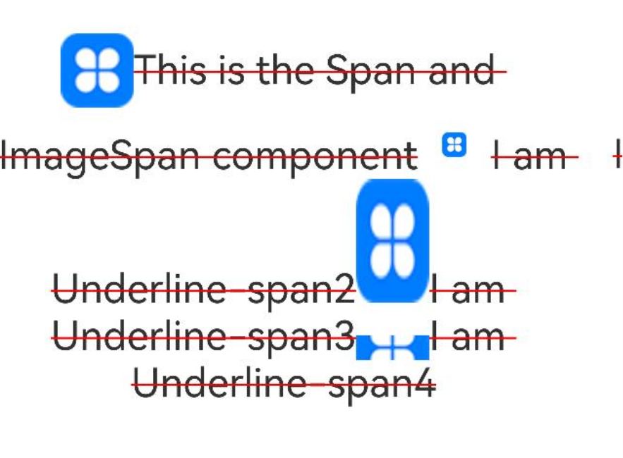

# ImageSpan

作为[Text](./cj-text-input-text.md#text)组件的子组件，用于显示行内图片。

## 导入模块

```cangjie
import kit.ArkUI.*
```

## 子组件

无

## 创建组件

### init(?ResourceStr)

```cangjie
public init(value: ?ResourceStr)
```

**功能：** 创建ImageSpan组件。

**系统能力：** SystemCapability.ArkUI.ArkUI.Full

**起始版本：** 22

**参数：**

|参数名|类型|必填|默认值|说明|
|:---|:---|:---|:---|:---|
|value|?ResourceStr|是|-|图片的数据源，支持本地图片和网络图片。|

### init(?PixelMap)

```cangjie
public init(value: ?PixelMap)
```

**功能：** 创建ImageSpan组件。

**系统能力：** SystemCapability.ArkUI.ArkUI.Full

**起始版本：** 22

**参数：**

|参数名|类型|必填|默认值|说明|
|:---|:---|:---|:---|:---|
|value|?PixelMap|是|-|图片的数据源，支持本地图片和网络图片。|

## 通用属性/通用事件

通用属性：支持[尺寸设置](./cj-universal-attribute-size.md)、[背景设置](./cj-universal-attribute-background.md)、[边框设置](./cj-universal-attribute-border.md)。

通用事件：仅支持[点击事件](./cj-universal-event-click.md#func-onclick)。

## 组件属性

### func colorFilter(?ColorFilter)

```cangjie
public func colorFilter(filter: ?ColorFilter): This
```

**功能：** 设置图像的颜色滤镜效果。

**系统能力：** SystemCapability.ArkUI.ArkUI.Full

**起始版本：** 22

**参数：**

|参数名|类型|必填|默认值|说明|
|:---|:---|:---|:---|:---|
|filter|?ColorFilter|是|-|颜色滤镜效果。|

### func objectFit(?ImageFit)

```cangjie
public func objectFit(value: ?ImageFit): This
```

**功能：** 设置图片的缩放类型。

**系统能力：** SystemCapability.ArkUI.ArkUI.Full

**起始版本：** 22

**参数：**

|参数名|类型|必填|默认值|说明|
|:---|:---|:---|:---|:---|
|value|?ImageFit|是|-|图片的缩放类型。|

### func verticalAlign(?ImageSpanAlignment)

```cangjie
public func verticalAlign(value: ?ImageSpanAlignment): This
```

**功能：** 设置图片基于行高的对齐方式。

**系统能力：** SystemCapability.ArkUI.ArkUI.Full

**起始版本：** 22

**参数：**

|参数名|类型|必填|默认值|说明|
|:---|:---|:---|:---|:---|
|value|?ImageSpanAlignment|是|-|图片基于文本的对齐方式。|

## 组件事件

### func onComplete(?ImageCompleteCallback)

```cangjie
public func onComplete(callback: ?ImageCompleteCallback): This
```

**功能：** 图片数据加载成功和解码成功时均触发该事件。

**系统能力：** SystemCapability.ArkUI.ArkUI.Full

**起始版本：** 22

**参数：**

|参数名|类型|必填|默认值|说明|
|:---|:---|:---|:---|:---|
|callback|?ImageCompleteCallback|是|-|回调函数，图片数据加载成功和解码成功时触发。参数：成功加载的图片尺寸。|

### func onError(?ImageErrorCallback)

```cangjie
public func onError(callback: ?ImageErrorCallback): This
```

**功能：** 图片加载异常时触发该事件。

**系统能力：** SystemCapability.ArkUI.ArkUI.Full

**起始版本：** 22

**参数：**

|参数名|类型|必填|默认值|说明|
|:---|:---|:---|:---|:---|
|callback|?ImageErrorCallback|是|-|回调函数，图片加载出现异常时触发。参数：图片加载异常信息。|

## 示例代码

### 示例1

该示例通过verticalAlign、objectFit属性展示了ImageSpan的对齐方式以及缩放效果。

<!-- run -->

```cangjie
package ohos_app_cangjie_entry

import kit.ArkUI.*
import ohos.arkui.state_macro_manage.*
import ohos.i18n.*
import ohos.resource_manager.*

@Entry
@Component
class EntryView {
    func build() {
        Column {
            Flex(direction: FlexDirection.Column, alignItems: ItemAlign.Center, justifyContent: FlexAlign.Center) {
                Text() {
                    //以设定大小和排布方式加载图片资源
                    ImageSpan(@r(app.media.startIcon))
                        .width(150.px)
                        .height(250.px)
                        .objectFit(ImageFit.Contain)
                        .verticalAlign(ImageSpanAlignment.Center)
                    //对图片进行文本修饰
                    Span("This is the Span and ImageSpan component")
                        .decoration(decorationType: TextDecorationType.LineThrough, color: Color.Red).fontSize(25)
                    ImageSpan(@r(app.media.startIcon))
                       .width(150.px)
                       .height(50.px)
                        .objectFit(ImageFit.Contain)
                       .verticalAlign(ImageSpanAlignment.Top)
                    Span("I am Underline-span2")
                        .decoration(decorationType: TextDecorationType.LineThrough, color: Color.Red).fontSize(25)
                    ImageSpan(@r(app.media.startIcon))
                        .width(150.px)
                        .height(250.px)
                        .objectFit(ImageFit.Fill)
                        .verticalAlign(ImageSpanAlignment.Baseline)
                    Span("I am Underline-span3")
                        .decoration(decorationType: TextDecorationType.LineThrough, color: Color.Red).fontSize(25)
                    ImageSpan(@r(app.media.startIcon))
                        .width(150.px)
                        .height(50.px)
                        .objectFit(ImageFit.Auto)
                        .verticalAlign(ImageSpanAlignment.Bottom)
                    Span("I am Underline-span4")
                        .decoration(decorationType: TextDecorationType.LineThrough, color: Color.Red).fontSize(25)
                }.textAlign(TextAlign.Center)
            }
        }
        .height(720)
        .width(360)
        .padding(left:0, right: 0, top: 0)
    }
}
```



### 示例2（图像设置颜色滤镜效果）

该示例通过colorFilter实现了给图像设置颜色滤镜效果。

<!-- run -->

```cangjie
package ohos_app_cangjie_entry
import kit.ArkUI.*
import ohos.arkui.state_macro_manage.*
import ohos.i18n.*
import ohos.resource_manager.*

@Entry
@Component
class EntryView {
    let blueColor = ColorFilter([0.38, 0.0, 0.0, 0.0, 0.0,
                                0.0, 0.81, 0.0, 0.0, 0.0,
                                0.0, 0.0, 0.43, 0.0, 0.0,
                                0.0, 0.0, 0.0, 1.0, 0.0])
    let colorFilter = ColorFilter([1.0, 0.0, 1.0, 0.0, 1.0,
                                   0.0, 0.0, 0.0, 1.0, 0.0,
                                   1.0, 0.0, 1.0, 0.0, 0.0,
                                   0.0, 1.0, 0.0, 1.0, 0.0])

    @State var DrawingColorFilterFirst: ColorFilter = blueColor
    @State var DrawingColorFilterSecond: ColorFilter = colorFilter

    func build() {
        Column(space: 5){
            Text {
                ImageSpan(@r(app.media.startIcon))
                .width(100)
                .height(100)
                .colorFilter(this.DrawingColorFilterFirst)
                .onClick({
                        evt =>
                        this.DrawingColorFilterFirst = colorFilter
                })
            }
            Text {
                ImageSpan(@r(app.media.startIcon))
                .width(110)
                .height(110)
                .margin(15)
                .colorFilter(this.DrawingColorFilterSecond)
                .onClick({
                        evt =>
                        this.DrawingColorFilterSecond = blueColor
                })
            }
        }
    }
}
```

