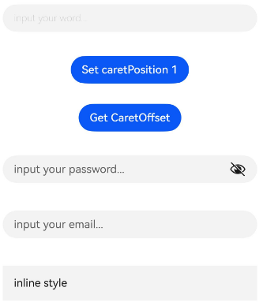

# TextInput

单行文本输入框组件。

## 导入模块

```cangjie
import kit.ArkUI.*
```

## 子组件

无

## 创建组件

### init(?ResourceStr, ?ResourceStr, ?TextInputController)

```cangjie
public init(placeholder!: ?ResourceStr = None, text!: ?ResourceStr = None, controller!: ?TextInputController = None)
```

**功能：** 创建一个包含占位符文本、当前文本内容和控制器的TextInput对象。

**系统能力：** SystemCapability.ArkUI.ArkUI.Full

**起始版本：** 22

**参数：**

|参数名|类型|必填|默认值|说明|
|:---|:---|:---|:---|:---|
|placeholder|?ResourceStr|否|None| **命名参数。** 占位符文本，无输入时显示的文本。|
|text|?ResourceStr|否|None| **命名参数。** TextInput的当前值。|
|controller|?TextInputController|否|None| **命名参数。** TextInput组件的控制器。|

## 通用属性/通用事件

通用属性：全部支持。

通用事件：全部支持。

## 组件属性

### func caretColor(?ResourceColor)

```cangjie
public func caretColor(value: ?ResourceColor): This
```

**功能：** 设置光标的颜色。

**系统能力：** SystemCapability.ArkUI.ArkUI.Full

**起始版本：** 22

**参数：**

|参数名|类型|必填|默认值|说明|
|:---|:---|:---|:---|:---|
|value|?ResourceColor|是|-|光标的颜色。<br>初始值：0xFF007DFF。|

### func customKeyboard(?CustomBuilder, ?Bool)

```cangjie
public func customKeyboard(value: ?CustomBuilder, supportAvoidance!: ?Bool = None): This
```

**功能：** 定义文本输入的自定义键盘。

**系统能力：** SystemCapability.ArkUI.ArkUI.Full

**起始版本：** 22

**参数：**

|参数名|类型|必填|默认值|说明|
|:---|:---|:---|:---|:---|
|value|?CustomBuilder|是|-|设置TextInput的自定义键盘。|
|supportAvoidance|?Bool|否|None| **命名参数。** TextInput的自定义键盘选项。<br>初始值：false。|

### func enableKeyboardOnFocus(?Bool)

```cangjie
public func enableKeyboardOnFocus(value: ?Bool): This
```

**功能：** 设置在获得焦点时是否请求键盘。

**系统能力：** SystemCapability.ArkUI.ArkUI.Full

**起始版本：** 22

**参数：**

|参数名|类型|必填|默认值|说明|
|:---|:---|:---|:---|:---|
|value|?Bool|是|-|设置在获得焦点时是否请求键盘。<br>初始值：true。|

### func enterKeyType(?EnterKeyType)

```cangjie
public func enterKeyType(value: ?EnterKeyType): This
```

**功能：** 设置软键盘输入按钮的类型。

**系统能力：** SystemCapability.ArkUI.ArkUI.Full

**起始版本：** 22

**参数：**

|参数名|类型|必填|默认值|说明|
|:---|:---|:---|:---|:---|
|value|?EnterKeyType|是|-|软键盘输入按钮的类型。<br>初始值：EnterKeyType.Done。|

### func fontFamily(?ResourceStr)

```cangjie
public func fontFamily(value: ?ResourceStr): This
```

**功能：** 设置文本的字体族。

**系统能力：** SystemCapability.ArkUI.ArkUI.Full

**起始版本：** 22

**参数：**

|参数名|类型|必填|默认值|说明|
|:---|:---|:---|:---|:---|
|value|?ResourceStr|是|-|文本的字体族。<br>初始值：HarmonyOS Sans。|

### func fontColor(?ResourceColor)

```cangjie
public func fontColor(value: ?ResourceColor): This
```

**功能：** 设置文本的颜色。

**系统能力：** SystemCapability.ArkUI.ArkUI.Full

**起始版本：** 22

**参数：**

|参数名|类型|必填|默认值|说明|
|:---|:---|:---|:---|:---|
|value|?ResourceColor|是|-|文本的颜色。<br>初始值：0xdbffffff。|

### func fontSize(?Length)

```cangjie
public func fontSize(value: ?Length): This
```

**功能：** 设置文本的字体大小。

**系统能力：** SystemCapability.ArkUI.ArkUI.Full

**起始版本：** 22

**参数：**

|参数名|类型|必填|默认值|说明|
|:---|:---|:---|:---|:---|
|value|?Length|是|-|文本的字体大小。|

### func fontStyle(?FontStyle)

```cangjie
public func fontStyle(value: ?FontStyle): This
```

**功能：** 设置文本的字体样式。

**系统能力：** SystemCapability.ArkUI.ArkUI.Full

**起始版本：** 22

**参数：**

|参数名|类型|必填|默认值|说明|
|:---|:---|:---|:---|:---|
|value|?FontStyle|是|-|文本的字体样式。<br>初始值：FontStyle.Normal。|

### func fontWeight(?FontWeight)

```cangjie
public func fontWeight(value: ?FontWeight): This
```

**功能：** 设置文本的字体粗细。

**系统能力：** SystemCapability.ArkUI.ArkUI.Full

**起始版本：** 22

**参数：**

|参数名|类型|必填|默认值|说明|
|:---|:---|:---|:---|:---|
|value|?FontWeight|是|-|文本的字体粗细。<br>初始值：FontWeight.Normal。|

### func inputFilter(?ResourceStr, ?(String) -> Unit)

```cangjie
public func inputFilter(value: ?ResourceStr, error!: ?(String) -> Unit = None): This
```

**功能：** 设置文本的输入过滤规则。

**系统能力：** SystemCapability.ArkUI.ArkUI.Full

**起始版本：** 22

**参数：**

|参数名|类型|必填|默认值|说明|
|:---|:---|:---|:---|:---|
|value|?ResourceStr|是|-|输入过滤规则。|
|error|?(String) -> Unit|否|None| **命名参数。** 输入错误时的回调函数。|

### func maxLength(?UInt32)

```cangjie
public func maxLength(value: ?UInt32): This
```

**功能：** 设置文本的最大长度。

**系统能力：** SystemCapability.ArkUI.ArkUI.Full

**起始版本：** 22

**参数：**

|参数名|类型|必填|默认值|说明|
|:---|:---|:---|:---|:---|
|value|?UInt32|是|-|文本的最大长度。|

### func maxLines(?Int32)

```cangjie
public func maxLines(value: ?Int32): This
```

**功能：** 定义文本输入的最大行数。

**系统能力：** SystemCapability.ArkUI.ArkUI.Full

**起始版本：** 22

**参数：**

|参数名|类型|必填|默认值|说明|
|:---|:---|:---|:---|:---|
|value|?Int32|是|-|文本输入的最大行数。<br>初始值：3。|

### func placeholderColor(?ResourceColor)

```cangjie
public func placeholderColor(value: ?ResourceColor): This
```

**功能：** 设置占位符文本的颜色。

**系统能力：** SystemCapability.ArkUI.ArkUI.Full

**起始版本：** 22

**参数：**

|参数名|类型|必填|默认值|说明|
|:---|:---|:---|:---|:---|
|value|?ResourceColor|是|-|占位符文本的颜色。|

### func placeholderFont(?Length, ?FontWeight, ?String, ?FontStyle)

```cangjie
public func placeholderFont(size!: ?Length, weight!: ?FontWeight = None, family!: ?String = None,
    style!: ?FontStyle = None): This
```

**功能：** 设置占位符文本的字体属性。

**系统能力：** SystemCapability.ArkUI.ArkUI.Full

**起始版本：** 22

**参数：**

|参数名|类型|必填|默认值|说明|
|:---|:---|:---|:---|:---|
|size|?Length|是|-| **命名参数。** 占位符文本的字体大小。|
|weight|?FontWeight|否|None| **命名参数。** 占位符文本的字体粗细。<br>初始值：FontWeight.W400。|
|family|?String|否|None| **命名参数。** 占位符文本的字体族。<br>初始值：""。|
|style|?FontStyle|否|None| **命名参数。** 占位符文本的字体样式。<br>初始值：FontStyle.Normal。|

### func selectionMenuHidden(?Bool)

```cangjie
public func selectionMenuHidden(value: ?Bool): This
```

**功能：** 控制选择菜单是否弹出。

**系统能力：** SystemCapability.ArkUI.ArkUI.Full

**起始版本：** 22

**参数：**

|参数名|类型|必填|默认值|说明|
|:---|:---|:---|:---|:---|
|value|?Bool|是|-|控制选择菜单是否弹出。<br>初始值：false。|

### func showUnderline(?Bool)

```cangjie
public func showUnderline(value: ?Bool): This
```

**功能：** 定义是否显示文本输入的下划线。

**系统能力：** SystemCapability.ArkUI.ArkUI.Full

**起始版本：** 22

**参数：**

|参数名|类型|必填|默认值|说明|
|:---|:---|:---|:---|:---|
|value|?Bool|是|-|定义是否显示文本输入的下划线。<br>初始值：false。|

### func style(?TextInputStyle)

```cangjie
public func style(value: ?TextInputStyle): This
```

**功能：** 文本输入样式。

**系统能力：** SystemCapability.ArkUI.ArkUI.Full

**起始版本：** 22

**参数：**

|参数名|类型|必填|默认值|说明|
|:---|:---|:---|:---|:---|
|value|?TextInputStyle|是|-|文本输入样式。<br>初始值：TextInputStyle.Default。|

### func textAlign(?TextAlign)

```cangjie
public func textAlign(value: ?TextAlign): This
```

**功能：** 设置文本的水平对齐方式。

**系统能力：** SystemCapability.ArkUI.ArkUI.Full

**起始版本：** 22

**参数：**

|参数名|类型|必填|默认值|说明|
|:---|:---|:---|:---|:---|
|value|?TextAlign|是|-|文本的水平对齐方式。<br>初始值：TextAlign.Start。|

## 组件事件

### func onChange(?(String) -> Unit)

```cangjie
public func onChange(callback: ?(String) -> Unit): This
```

**功能：** 输入框内容发生变化时触发该回调。

**系统能力：** SystemCapability.ArkUI.ArkUI.Full

**起始版本：** 22

**参数：**

|参数名|类型|必填|默认值|说明|
|:---|:---|:---|:---|:---|
|callback|?(String) -> Unit|是|-|输入框内容发生变化时的回调函数。|

### func onCopy(?(String) -> Unit)

```cangjie
public func onCopy(callback: ?(String) -> Unit): This
```

**功能：** 使用剪贴板菜单时触发该回调。

**系统能力：** SystemCapability.ArkUI.ArkUI.Full

**起始版本：** 22

**参数：**

|参数名|类型|必填|默认值|说明|
|:---|:---|:---|:---|:---|
|callback|?(String) -> Unit|是|-|复制操作时的回调函数。|

### func onCut(?(String) -> Unit)

```cangjie
public func onCut(callback: ?(String) -> Unit): This
```

**功能：** 使用剪贴板菜单时触发该回调。

**系统能力：** SystemCapability.ArkUI.ArkUI.Full

**起始版本：** 22

**参数：**

|参数名|类型|必填|默认值|说明|
|:---|:---|:---|:---|:---|
|callback|?(String) -> Unit|是|-|剪切操作时的回调函数。|

### func onEditChange(?(Bool) -> Unit)

```cangjie
public func onEditChange(callback: ?(Bool) -> Unit): This
```

**功能：** 判断文本编辑状态是否发生变化。

**系统能力：** SystemCapability.ArkUI.ArkUI.Full

**起始版本：** 22

**参数：**

|参数名|类型|必填|默认值|说明|
|:---|:---|:---|:---|:---|
|callback|?(Bool) -> Unit|是|-|文本编辑状态变化时的回调函数。|

### func onPaste(?(String) -> Unit)

```cangjie
public func onPaste(callback: ?(String) -> Unit): This
```

**功能：** 使用剪贴板菜单时触发该回调。

**系统能力：** SystemCapability.ArkUI.ArkUI.Full

**起始版本：** 22

**参数：**

|参数名|类型|必填|默认值|说明|
|:---|:---|:---|:---|:---|
|callback|?(String) -> Unit|是|-|粘贴操作时的回调函数。|

### func onSubmit(?(EnterKeyType) -> Unit)

```cangjie
public func onSubmit(callback: ?(EnterKeyType) -> Unit): This
```

**功能：** 提交时触发该回调。

**系统能力：** SystemCapability.ArkUI.ArkUI.Full

**起始版本：** 22

**参数：**

|参数名|类型|必填|默认值|说明|
|:---|:---|:---|:---|:---|
|callback|?(EnterKeyType) -> Unit|是|-|提交时的回调函数。|

## 基础类型定义

### class TextInputController

```cangjie
public class TextInputController {
    public init()
}
```

**功能：** TextInputController是TextInput组件的控制器，可以定义该类型的对象并绑定至TextInput组件，实现对TextInput组件的控制。

**系统能力：** SystemCapability.ArkUI.ArkUI.Full

**起始版本：** 22

#### init()

```cangjie
public init()
```

**功能：** TextInputController的构造函数。

**系统能力：** SystemCapability.ArkUI.ArkUI.Full

**起始版本：** 22

#### func caretPosition(?Int32)

```cangjie
public func caretPosition(value: ?Int32): Unit
```

**功能：** 设置插入光标的位置。

**系统能力：** SystemCapability.ArkUI.ArkUI.Full

**起始版本：** 22

**参数：**

|参数名|类型|必填|默认值|说明|
|:---|:---|:---|:---|:---|
|value|?Int32|是|-|光标位置。|

#### func setTextSelection(?Int32, ?Int32, ?MenuPolicy)

```cangjie
public func setTextSelection(selectionStart: ?Int32, selectionEnd: ?Int32, options!: ?MenuPolicy = None): Unit
```

**功能：** 通过指定文本的起始和结束位置实现文本选择。

**系统能力：** SystemCapability.ArkUI.ArkUI.Full

**起始版本：** 22

**参数：**

|参数名|类型|必填|默认值|说明|
|:---|:---|:---|:---|:---|
|selectionStart|?Int32|是|-|选中文本的起始位置。|
|selectionEnd|?Int32|是|-|选中文本的结束位置。|
|options|?MenuPolicy|否|None| **命名参数。** 文本选择的选项。<br>初始值：MenuPolicy.Default。|

#### func stopEditing()

```cangjie
public func stopEditing(): Unit
```

**功能：** 退出编辑状态。

**系统能力：** SystemCapability.ArkUI.ArkUI.Full

**起始版本：** 22

## 示例代码

<!--run-->

```cangjie
package ohos_app_cangjie_entry
import kit.ArkUI.*
import ohos.hilog.*
import ohos.arkui.state_macro_manage.*

@Entry
@Component
class EntryView {
    @State var text: String = ''
    @State var passwordState: Bool = false
    var controller: TextInputController = TextInputController()

    func build() {
    Column() {
        TextInput(text: this.text, placeholder: 'input your word...', controller: this.controller)
            .placeholderColor(Color.Gray)
            .placeholderFont(size: 14, weight: FontWeight.W100)
            .caretColor(Color.Blue)
            .width(95.percent)
            .height(40)
            .margin(20)
            .fontSize(14)
            .fontColor(Color.Black)
            .inputFilter('[a-z]', error: { info: String =>
              Hilog.error(0, "AppLogCj", "inputFilter error")
            })
            .onChange({ value: String =>
              this.text = value
            })
        Text(this.text)
        Button('Set caretPosition 1')
            .margin(15)
        Button('Get CaretOffset')
            .margin(15)
        // 密码输入框
        TextInput(placeholder: 'input your password...')
            .width(95.percent)
            .height(40)
            .margin(20)
            .maxLength(9)
        // 邮箱地址自动填充类型
        TextInput(placeholder: 'input your email...' )
            .width(95.percent)
            .height(40)
            .margin(20)
            .maxLength(9)
        // 内联风格输入框
        TextInput( text: 'inline style' )
            .width(95.percent)
            .height(50)
            .margin(20)
            .borderRadius(0)
            .style(TextInputStyle.Inline)
        }.
        width(100.percent)
    }
}
```

