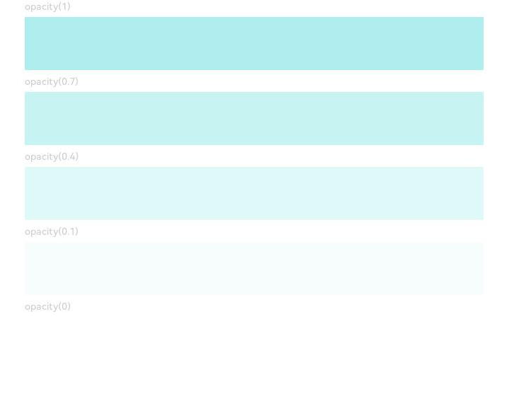

# 透明度设置

设置组件的透明度。

## 导入模块

```cangjie
import kit.ArkUI.*
```

## func opacity(?Float64)

```cangjie
public func opacity(value: ?Float64): T
```

**功能：** 设置组件的透明度。

**系统能力：** SystemCapability.ArkUI.ArkUI.Full

**起始版本：** 22

**参数：**

|参数名|类型|必填|默认值|说明|
|:---|:---|:---|:---|:---|
|value|?Float64|是|-|透明度。取值范围为0到1，0表示完全透明，1表示完全不透明。初始值:  1.0|

**返回值：**

|类型|说明|
|:---|:---|
|T|返回调用此接口的组件实例本身。|


## 示例代码

该示例主要显示通过opacity设置组件的不透明度。

<!-- run -->

```cangjie
package ohos_app_cangjie_entry
import kit.UIKit.*
import ohos.state_macro_manage.*

@Entry
@Component
class EntryView {
    func build() {
        Column(5) {
            Text("opacity(1)")
                .fontSize(9)
                .width(90.percent)
                .fontColor(0xCCCCCC)
            Text("")
                .width(90.percent)
                .height(50)
                .opacity(1)
                .backgroundColor(0xAFEEEE)
            Text("opacity(0.7)")
                .fontSize(9)
                .width(90.percent)
                .fontColor(0xCCCCCC)
            Text("")
                .width(90.percent)
                .height(50)
                .opacity(0.7)
                .backgroundColor(0xAFEEEE)
            Text("opacity(0.4)")
                .fontSize(9)
                .width(90.percent)
                .fontColor(0xCCCCCC)
            Text("")
                .width(90.percent)
                .height(50)
                .opacity(0.4)
                .backgroundColor(0xAFEEEE)
            Text("opacity(0.1)")
                .fontSize(9)
                .width(90.percent)
                .fontColor(0xCCCCCC)
            Text("")
                .width(90.percent)
                .height(50)
                .opacity(0.1)
                .backgroundColor(0xAFEEEE)
            Text("opacity(0)")
                .fontSize(9)
                .width(90.percent)
                .fontColor(0xCCCCCC)
            Text("")
                .width(90.percent)
                .height(50)
                .opacity(0)
                .backgroundColor(0xAFEEEE)
        }
        .width(100.percent)
        .padding(top: 5)
    }
}
```

